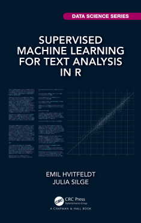

This book explains how to preprocess text data for modeling, train models, and evaluate model performance using tools from the tidyverse and tidymodels ecosystem. Models like these can be used to make predictions for new observations, to understand what natural language features or characteristics contribute to differences in the output, and more. If you are already familiar with the basics of predictive modeling, use the comprehensive, detailed examples in this book to extend your skills to the domain of natural language processing.

This book provides practical guidance and directly applicable knowledge for data scientists and analysts who want to integrate unstructured text data into their modeling pipelines. Learn how to use text data for both regression and classification tasks, and how to apply more straightforward algorithms like regularized regression or support vector machines as well as deep learning approaches. Natural language must be dramatically transformed to be ready for computation, so we explore typical text preprocessing and feature engineering steps like tokenization and word embeddings from the ground up. These steps influence model results in ways we can measure, both in terms of model metrics and other tangible consequences such as how fair or appropriate model results are.

An **HTML version** of this text can be found at [`https://smltar.com/`](https://smltar.com/). 

The data sets and R code are available in the GitHub repository [`https://github.com/EmilHvitfeldt/smltar`](https://github.com/EmilHvitfeldt/smltar). 

The physical copies are sold by [**Amazon**](https://amzn.to/3EwcEOK) and [**CRC Press**](https://www.routledge.com/Supervised-Machine-Learning-for-Text-Analysis-in-R/Hvitfeldt-Silge/p/book/9780367554194). 

