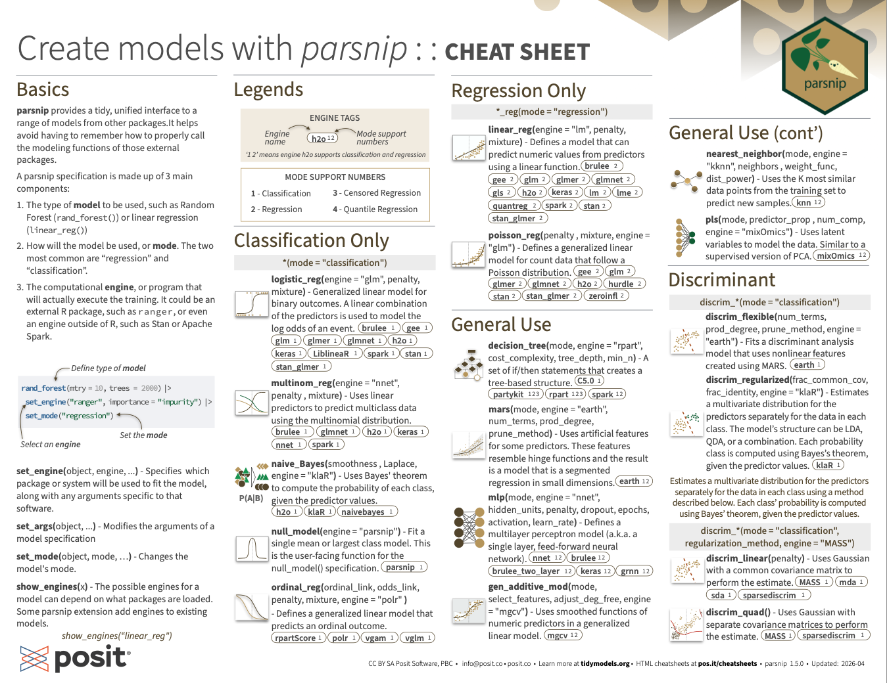
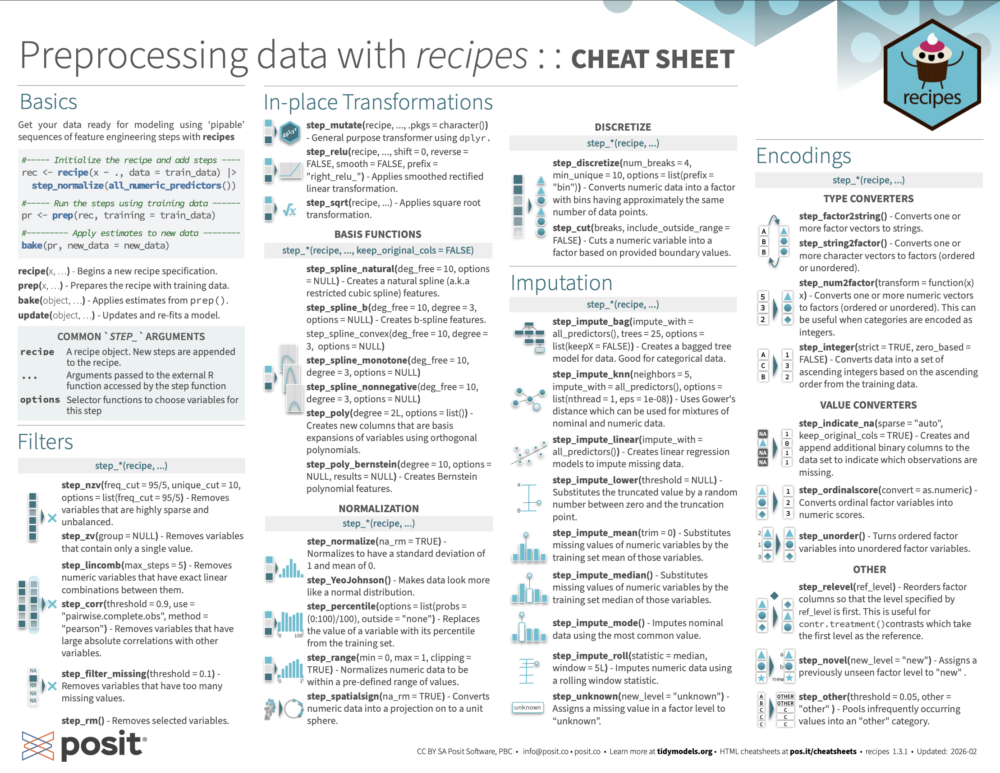

::: {.list .quarto-listing-default}

::: {.quarto-post .image-right}
::: {.thumbnail}
[{.thumbnail-image .card-img fig-alt="Creating Models cheatsheet"}](https://rstudio.github.io/cheatsheets/ml-create-models.pdf){target="_blank"}
[Link to PDF](https://rstudio.github.io/cheatsheets/ml-create-models.pdf){.small .text-muted target="_blank"}
:::
::: {.body}
### [Creating Models](https://rstudio.github.io/cheatsheets/ml-create-models.pdf){target="_blank"} {.no-anchor .listing-title}
::: {.listing-description}
A guide to creating models with parsnip
:::
:::
:::

::: {.quarto-post .image-right}
::: {.thumbnail}
[{.thumbnail-image .card-img fig-alt="Preprocessing Data cheatsheet"}](https://rstudio.github.io/cheatsheets/ml-preprocessing-data.pdf){target="_blank"}
[Link to PDF](https://rstudio.github.io/cheatsheets/ml-preprocessing-data.pdf){.small .text-muted target="_blank"}
:::
::: {.body}
### [Preprocessing Data](https://rstudio.github.io/cheatsheets/ml-preprocessing-data.pdf){target="_blank"} {.no-anchor .listing-title}
::: {.listing-description}
A guide to preprocessing data with recipes
:::
:::
:::

:::
