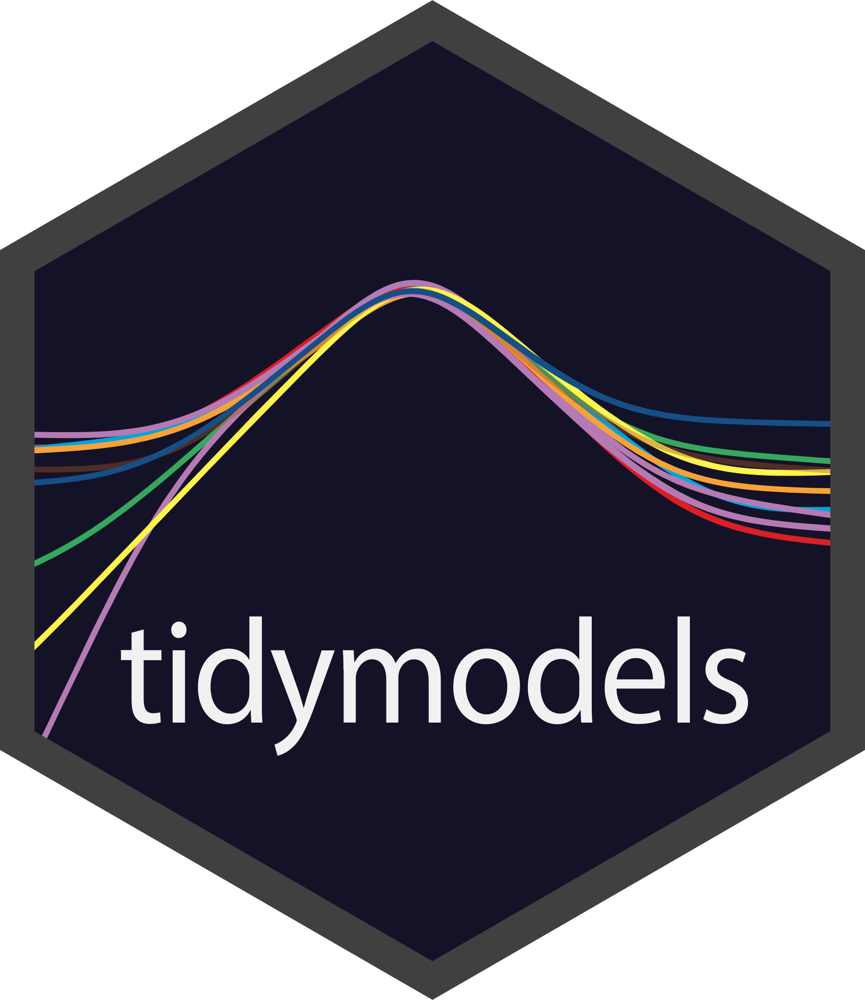
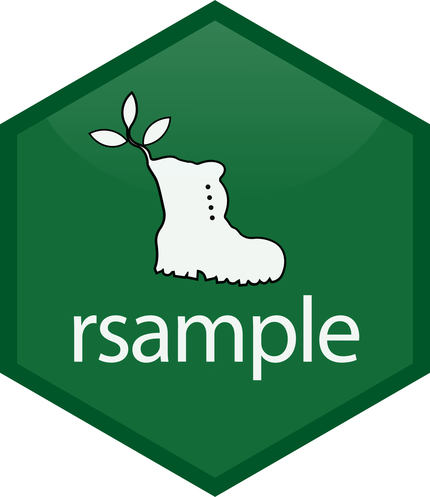
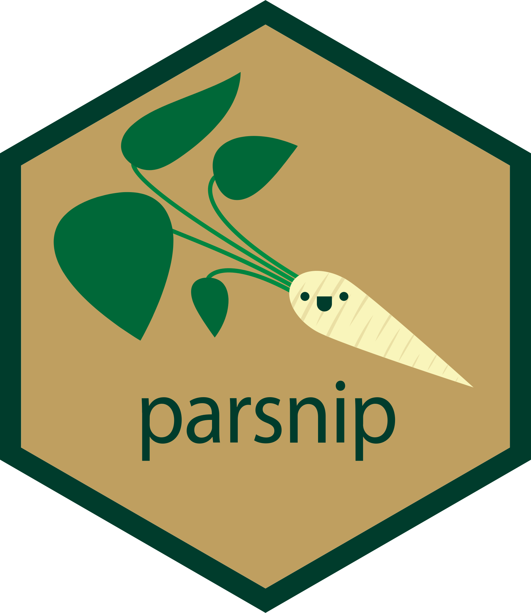
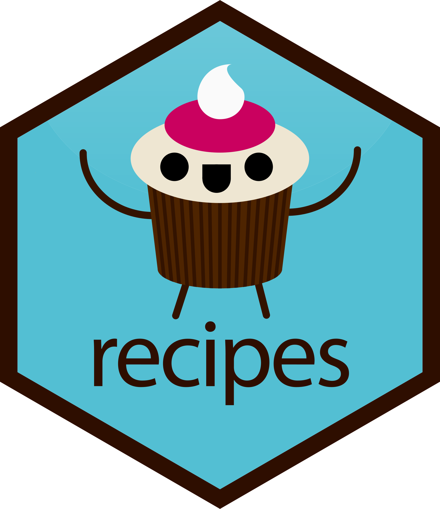
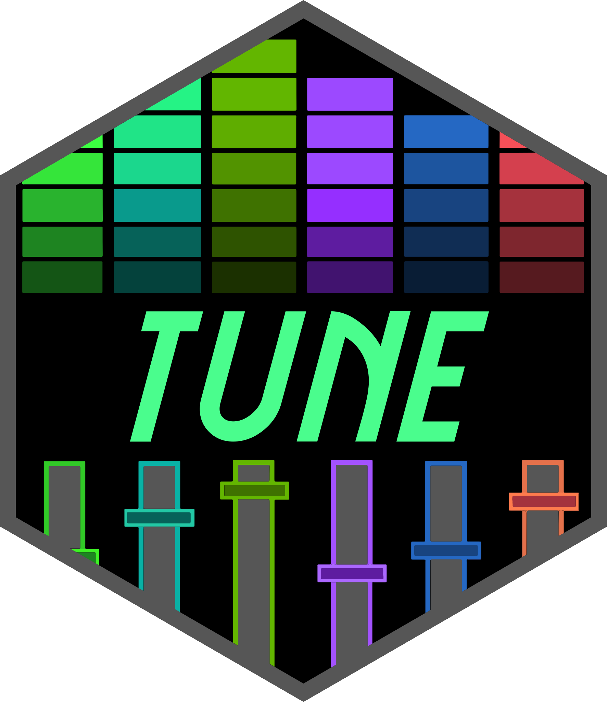
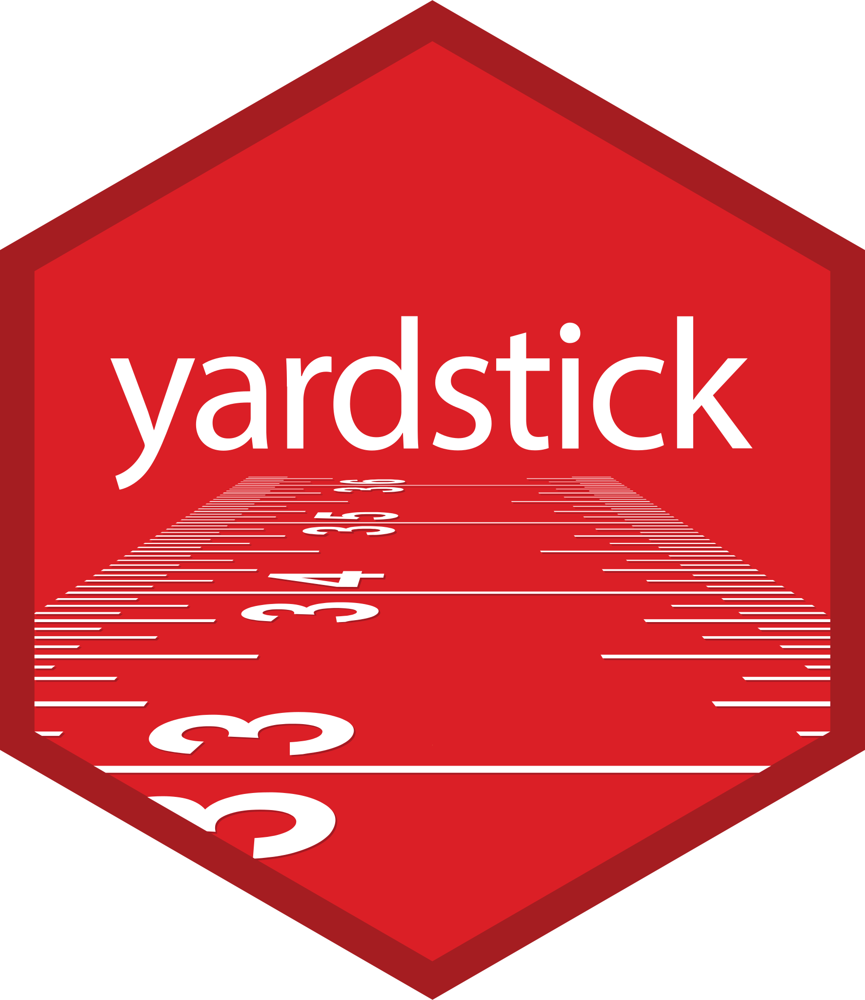
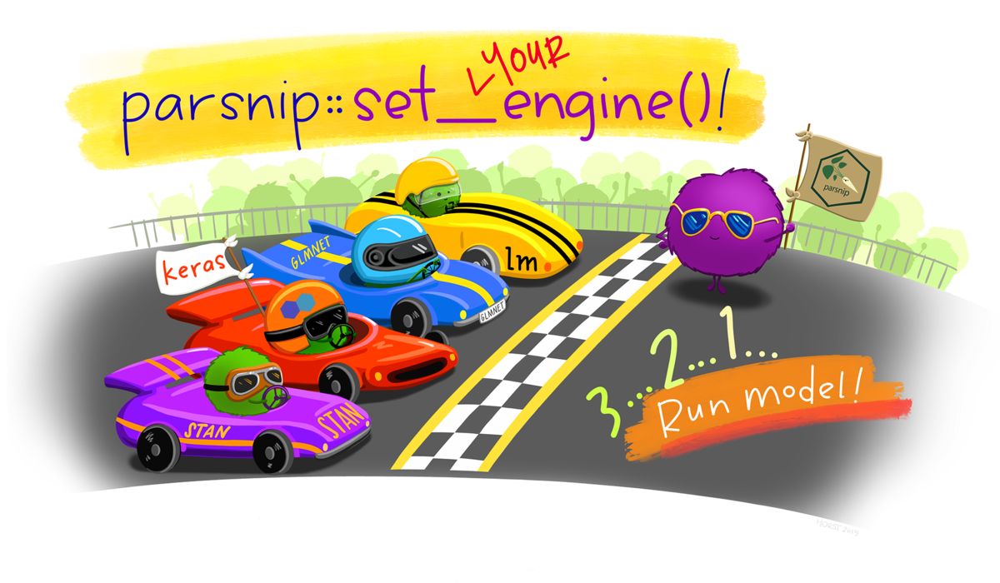

::::: {#FrontPage}

:::: {.band .first}
:::: {.bandContent}

::: {.hexBadges}
<a href="https://tidymodels.tidymodels.org/"></a>
<a href="https://rsample.tidymodels.org/"></a>
<a href="https://parsnip.tidymodels.org/"></a>
<a href="https://recipes.tidymodels.org/"></a>
<a href="https://tune.tidymodels.org/"></a>
<a href="https://yardstick.tidymodels.org/"></a>
:::

::: {.blurb}
[TIDYMODELS]{.tagline}

The tidymodels framework is a collection of packages for modeling and machine learning using [tidyverse](https://www.tidyverse.org/) principles.

Install tidymodels with:

```r
install.packages("tidymodels")
```
:::

::::
::::

:::: {.band .second}
:::: {.bandContent}
::: {.blurb}
[LEARN TIDYMODELS]{.tagline}

Whether you are just starting out today or have years of experience with modeling, tidymodels offers a consistent, flexible framework for your work.

<picture><source srcset="images/cover.webp" type="image/webp"></picture>
:::

::: {.blurb}
<!-- Icons below are inlined SVG (Font Awesome Free 6 Solid) instead of the Quarto fa shortcode, so the page does not load FA's CSS or 154 KB woff2. Sizing/color come from .icon-inline in styles.scss. -->
<div class="event">
  <!-- icon: fa-flag-checkered -->
  <div class="eventTitle"><a href="start/"><svg class="icon-inline" xmlns="http://www.w3.org/2000/svg" viewBox="0 0 448 512" aria-hidden="true"><!--! Font Awesome Free 6.7.2 by @fontawesome - https://fontawesome.com License - https://fontawesome.com/license/free (Icons: CC BY 4.0, Fonts: SIL OFL 1.1, Code: MIT License) Copyright 2024 Fonticons, Inc. --><path d="M32 0C49.7 0 64 14.3 64 32l0 16 69-17.2c38.1-9.5 78.3-5.1 113.5 12.5c46.3 23.2 100.8 23.2 147.1 0l9.6-4.8C423.8 28.1 448 43.1 448 66.1l0 279.7c0 13.3-8.3 25.3-20.8 30l-34.7 13c-46.2 17.3-97.6 14.6-141.7-7.4c-37.9-19-81.3-23.7-122.5-13.4L64 384l0 96c0 17.7-14.3 32-32 32s-32-14.3-32-32l0-80 0-66L0 64 0 32C0 14.3 14.3 0 32 0zM64 187.1l64-13.9 0 65.5L64 252.6 64 318l48.8-12.2c5.1-1.3 10.1-2.4 15.2-3.3l0-63.9 38.9-8.4c8.3-1.8 16.7-2.5 25.1-2.1l0-64c13.6 .4 27.2 2.6 40.4 6.4l23.6 6.9 0 66.7-41.7-12.3c-7.3-2.1-14.8-3.4-22.3-3.8l0 71.4c21.8 1.9 43.3 6.7 64 14.4l0-69.8 22.7 6.7c13.5 4 27.3 6.4 41.3 7.4l0-64.2c-7.8-.8-15.6-2.3-23.2-4.5l-40.8-12 0-62c-13-3.8-25.8-8.8-38.2-15c-8.2-4.1-16.9-7-25.8-8.8l0 72.4c-13-.4-26 .8-38.7 3.6L128 173.2 128 98 64 114l0 73.1zM320 335.7c16.8 1.5 33.9-.7 50-6.8l14-5.2 0-71.7-7.9 1.8c-18.4 4.3-37.3 5.7-56.1 4.5l0 77.4zm64-149.4l0-70.8c-20.9 6.1-42.4 9.1-64 9.1l0 69.4c13.9 1.4 28 .5 41.7-2.6l22.3-5.2z"/></svg>&nbsp;&nbsp;Get Started</a></div>
  <div class="eventDetails">What do you need to know to start using tidymodels? Learn what you need in 5 articles, starting with how to create a model and ending with a beginning-to-end modeling case study.</div>
</div>

<div class="event">
  <!-- icon: fa-lightbulb -->
  <div class="eventTitle"><a href="learn/"><svg class="icon-inline" xmlns="http://www.w3.org/2000/svg" viewBox="0 0 384 512" aria-hidden="true"><!--! Font Awesome Free 6.7.2 by @fontawesome - https://fontawesome.com License - https://fontawesome.com/license/free (Icons: CC BY 4.0, Fonts: SIL OFL 1.1, Code: MIT License) Copyright 2024 Fonticons, Inc. --><path d="M272 384c9.6-31.9 29.5-59.1 49.2-86.2c0 0 0 0 0 0c5.2-7.1 10.4-14.2 15.4-21.4c19.8-28.5 31.4-63 31.4-100.3C368 78.8 289.2 0 192 0S16 78.8 16 176c0 37.3 11.6 71.9 31.4 100.3c5 7.2 10.2 14.3 15.4 21.4c0 0 0 0 0 0c19.8 27.1 39.7 54.4 49.2 86.2l160 0zM192 512c44.2 0 80-35.8 80-80l0-16-160 0 0 16c0 44.2 35.8 80 80 80zM112 176c0 8.8-7.2 16-16 16s-16-7.2-16-16c0-61.9 50.1-112 112-112c8.8 0 16 7.2 16 16s-7.2 16-16 16c-44.2 0-80 35.8-80 80z"/></svg>&nbsp;&nbsp;Learn</a></div>
  <div class="eventDetails">After you are comfortable with the basics, you can learn how to go farther with tidymodels in your modeling and machine learning projects.</div>
</div>

:::
::::
::::

:::: {.band .third}
:::: {.bandContent}

<div class="hideOnMobile"><picture><source srcset="images/parsnip-flagger.webp" type="image/webp"></picture></div>

::: {.blurb}
[STAY UP TO DATE]{.tagline}

Hear about the latest tidymodels news at the [tidyverse blog](https://www.tidyverse.org/tags/tidymodels/).
:::
::::
::::

:::::
