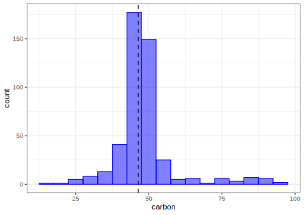

## Introduction

To use code in this article,  you will need to install the following packages: modeldata and tidymodels.

There are many existing recipe steps in packages like recipes, themis, textrecipes, and others. A full list of steps in CRAN packages [can be found here](/find/recipes/). However, you might need to define your own preprocessing operations; this article describes how to do that. If you are looking for good examples of existing steps, we suggest looking at the code for [centering](https://github.com/tidymodels/recipes/blob/master/R/center.R) or [PCA](https://github.com/tidymodels/recipes/blob/master/R/pca.R) to start. 

For check operations (e.g. `check_class()`), the process is very similar. Notes on this are available at the end of this article. 

The general process to follow is to:

1. Define a step constructor function.

2. Create the minimal S3 methods for `prep()`, `bake()`, and `print()`.  

3. Optionally add some extra methods to work with other tidymodels packages, such as `tunable()` and `tidy()`. 

As an example, we will create a step for converting data into percentiles. 

## Creating a new step

Let's create a step that replaces the value of a variable with its percentile from the training set. The example data we'll use is from the modeldata package:

::: {.cell layout-align="center"}

```{.r .cell-code}
library(modeldata)
data(biomass)
str(biomass)
#> 'data.frame':	536 obs. of  8 variables:
#>  $ sample  : chr  "Akhrot Shell" "Alabama Oak Wood Waste" "Alder" "Alfalfa" ...
#>  $ dataset : chr  "Training" "Training" "Training" "Training" ...
#>  $ carbon  : num  49.8 49.5 47.8 45.1 46.8 ...
#>  $ hydrogen: num  5.64 5.7 5.8 4.97 5.4 5.75 5.99 5.7 5.5 5.9 ...
#>  $ oxygen  : num  42.9 41.3 46.2 35.6 40.7 ...
#>  $ nitrogen: num  0.41 0.2 0.11 3.3 1 2.04 2.68 1.7 0.8 1.2 ...
#>  $ sulfur  : num  0 0 0.02 0.16 0.02 0.1 0.2 0.2 0 0.1 ...
#>  $ HHV     : num  20 19.2 18.3 18.2 18.4 ...

biomass_tr <- biomass[biomass$dataset == "Training", ]
biomass_te <- biomass[biomass$dataset == "Testing", ]
```
:::

To illustrate the transformation with the `carbon` variable, note the training set distribution of this variable with a vertical line below for the first value of the test set. 

::: {.cell layout-align="center"}

```{.r .cell-code}
library(ggplot2)
theme_set(theme_bw())
ggplot(biomass_tr, aes(x = carbon)) +
  geom_histogram(binwidth = 5, col = "blue", fill = "blue", alpha = .5) +
  geom_vline(xintercept = biomass_te$carbon[1], lty = 2)
```

::: {.cell-output-display}
{fig-align='center' width=100%}
:::
:::

Based on the training set, 42.1% of the data are less than a value of 46.35. There are some applications where it might be advantageous to represent the predictor values as percentiles rather than their original values. 

Our new step will do this computation for any numeric variables of interest. We will call this new recipe step `step_percentiles()`. The code below is designed for illustration and not speed or best practices. We've left out a lot of error trapping that we would want in a real implementation.  

::: {.callout-note}
The step `step_percentiles()` that will be created on this page, has been implemented in recipes as [step_percentile()](https://recipes.tidymodels.org/reference/step_percentile.html).
:::

### Create the user function

To start, there is a _user-facing_ function. Let's call that `step_percentiles()`. This is just a simple wrapper around a _constructor function_, which defines the rules for any step object that defines a percentile transformation. We'll call this constructor `step_percentiles_new()`. 

The function `step_percentiles()` takes the same arguments as your function and simply adds it to a new recipe. The `...` signifies the variable selectors that can be used.

::: {.cell layout-align="center"}

```{.r .cell-code}
step_percentiles <- function(
 recipe,
 ...,
 role = NA,
 trained = FALSE,
 ref_dist = NULL,
 options = list(probs = (0:100) / 100, names = TRUE),
 skip = FALSE,
 id = rand_id("percentiles")
) {
  add_step(
 recipe,
    step_percentiles_new(
 terms = enquos(...),
 trained = trained,
 role = role,
 ref_dist = ref_dist,
 options = options,
 skip = skip,
 id = id
 )
 )
}
```
:::

You should always keep the first four arguments (`recipe` though `trained`) the same as listed above. Additionally, you should have a `skip` and `id` argument as well, conventionally put as the last arguments. Some notes:

 * The `role` argument is used when you either 1) create new variables and want their role to be pre-set or 2) replace the existing variables with new values. The latter is what we will be doing and using `role = NA` will leave the existing role intact. 
 * `trained` is set by the package when the estimation step has been run. You should default your function definition's argument to `FALSE`. 
 * `skip` is a logical. Whenever a recipe is prepped, each step is trained and then baked. However, there are some steps that should not be applied when a call to `bake()` is used. For example, if a step is applied to the variables with roles of "outcomes", these data would not be available for new samples.
 * `id` is a character string that can be used to identify steps in package code. `rand_id()` will create an ID that has the prefix and a random character sequence. 

We can estimate the percentiles of new data points based on the percentiles from the training set with `approx()`. Our `step_percentiles()` contains a `ref_dist` object to store these percentiles (pre-computed from the training set in `prep()`) for later use in `bake()`.

We will use `stats::quantile()` to compute the grid. However, we might also want to have control over the granularity of this grid, so the `options` argument will be used to define how that calculation is done. We could use the ellipses (aka `...`) so that any options passed to `step_percentiles()` that are not one of its arguments will then be passed to `stats::quantile()`. However, we recommend making a separate list object with the options and use these inside the function because `...` is already used to define the variable selection. 

It is also important to consider if there are any _main arguments_ to the step. For example, for spline-related steps such as `step_ns()`, users typically want to adjust the argument for the degrees of freedom in the spline (e.g. `splines::ns(x, df)`). Rather than letting users add `df` to the `options` argument: 

* Allow the important arguments to be the main arguments to the step function. 

* Follow the tidymodels [conventions for naming arguments](https://tidymodels.github.io/model-implementation-principles/standardized-argument-names.html). Whenever possible, avoid jargon and keep common argument names.  

There are benefits to following these principles (as shown below). 

### Initialize a new object

Now, the constructor function can be created.

The function cascade is: 

```
step_percentiles() calls recipes::add_step()
└─> recipes::add_step() calls step_percentiles_new()
 └─> step_percentiles_new() calls recipes::step()
```

`step()` is a general constructor for recipes that mainly makes sure that the resulting step object is a list with an appropriate S3 class structure. Using `subclass = "percentiles"` will set the class of new objects to `"step_percentiles"`. 

::: {.cell layout-align="center"}

```{.r .cell-code}
step_percentiles_new <-
  function(terms, role, trained, ref_dist, options, skip, id) {
    step(
 subclass = "percentiles",
 terms = terms,
 role = role,
 trained = trained,
 ref_dist = ref_dist,
 options = options,
 skip = skip,
 id = id
 )
 }
```
:::

This constructor function should have no default argument values. Defaults should be set in the user-facing step object. 

### Create the `prep()` method

You will need to create a new `prep()` method for your step's class. To do this, three arguments that the method should have are:

```r
function(x, training, info = NULL, ...)
```

where

 * `x` will be the `step_percentiles` object,
 * `training` will be a _tibble_ that has the training set data, and
 * `info` will also be a tibble that has information on the current set of data available. This information is updated as each step is evaluated by its specific `prep()` method so it may not have the variables from the original data. The columns in this tibble are `variable` (the variable name), `type` (currently either `"numeric"` or `"nominal"`), `role` (defining the variable's role), and `source` (either `"original"` or `"derived"` depending on where it originated).
 * `...` not being used.

The first thing that you might want to do in the `prep()` function is to translate the specification listed in the `terms` argument to column names in the current data. This is done using the `recipes_eval_select()` function. 

::: {.callout-warning}
 The `recipes_eval_select()` function is not one you interact with as a typical recipes user, but it is helpful if you develop your own custom recipe steps. 
:::

::: {.cell layout-align="center"}

```{.r .cell-code}
prep.step_percentiles <- function(x, training, info = NULL, ...) {
 col_names <- recipes_eval_select(x$terms, training, info)
  # TODO finish the rest of the function
}
```
:::

After this function call, it is a good idea to check that the selected columns have the appropriate type (e.g. numeric for this example). See `recipes::check_type()` to do this for basic types. 

::: {.cell layout-align="center"}

```{.r .cell-code}
prep.step_percentiles <- function(x, training, info = NULL, ...) {
 col_names <- recipes_eval_select(x$terms, training, info)
  check_type(training[, col_names], types = c("double", "integer"))
  # TODO finish the rest of the function
}
```
:::

Once we have this then we are ready for the meat of the function. The purpose of the `prep()` method is to calculate and store the information needed to perform the transformations. `step_center()` stores the means of the selected variables, `step_pca()` stores the loadings, and `step_lincomb()` calculates which variables are linear combinations of each other and marks them for removal. Some steps don't need to calculate anything in the `prep()` method, examples include `step_arrange()` and `step_date()`.

For this step, we want to save the approximation grid. For the grid, we will use a helper function that enables us to run `rlang::exec()` to splice in any extra arguments contained in the `options` list to the call to `quantile()`: 

::: {.cell layout-align="center"}

```{.r .cell-code}
get_train_pctl <- function(x, args = NULL) {
 res <- rlang::exec("quantile", x = x, !!!args)
  # Remove duplicate percentile values
 res[!duplicated(res)]
}

# For example:
get_train_pctl(biomass_tr$carbon, list(probs = 0:1))
#>    0%  100% 
#> 14.61 97.18
get_train_pctl(biomass_tr$carbon)
#>     0%    25%    50%    75%   100% 
#> 14.610 44.715 47.100 49.725 97.180
```
:::

Now, the `prep()` method can be created: 

::: {.cell layout-align="center"}

```{.r .cell-code}
prep.step_percentiles <- function(x, training, info = NULL, ...) {
 col_names <- recipes_eval_select(x$terms, training, info)
  check_type(training[, col_names], types = c("double", "integer"))

  # We'll use the names later so make sure they are available
 if (x$options$names == FALSE) {
 rlang::abort("`names` should be set to TRUE")
 }

 if (!any(names(x$options) == "probs")) {
 x$options$probs <- (0:100) / 100
 } else {
 x$options$probs <- sort(unique(x$options$probs))
 }

  # Compute percentile grid
 ref_dist <- list()
 for (col_name in col_names) {
 ref_dist[[col_name]] <- get_train_pctl(training[[col_name]], args = x$options)
 }

  # Use the constructor function to return the updated object.
  # Note that `trained` is now set to TRUE

  step_percentiles_new(
 terms = x$terms,
 trained = TRUE,
 role = x$role,
 ref_dist = ref_dist,
 options = x$options,
 skip = x$skip,
 id = x$id
 )
}
```
:::

::: {.callout-tip}
Due to the way errors are captured and rethrown in recipes, we recommend using a for-loop over `map()` or `lapply()` to go over the selected variables.
:::

We suggest favoring `cli::cli_abort()` and `cli::cli_warn()` over `stop()` and `warning()`. The former can be used for better traceback results.

### Create the `bake()` method

Remember that the `prep()` function does not _apply_ the step to the data; it only estimates any required values such as `ref_dist`. We will need to create a new method for our `step_percentiles()` class. The signature is as follows.

```r
function(object, new_data, ...)
```

Where `object` is the updated step function that has been through the corresponding `prep()` code and `new_data` is a tibble of data to be processed. 

Here is the code to convert the new data to percentiles. The input data (`x` below) comes in as a numeric vector and the output is a vector of approximate percentiles: 

::: {.cell layout-align="center"}

```{.r .cell-code}
pctl_by_approx <- function(x, ref) {
  # In case duplicates were removed, get the percentiles from
  # the names of the reference object
 grid <- as.numeric(gsub("%$", "", names(ref)))
  approx(x = ref, y = grid, xout = x)$y / 100
}
```
:::

We will loop over the variables one by one and apply the transformation. `check_new_data()` is used to make sure that the variables that are affected in this step are present.

::: {.cell layout-align="center"}

```{.r .cell-code}
bake.step_percentiles <- function(object, new_data, ...) {
 col_names <- names(object$ref_dist)
  check_new_data(col_names, object, new_data)

 for (col_name in col_names) {
 new_data[[col_name]] <- pctl_by_approx(
 x = new_data[[col_name]],
 ref = object$ref_dist[[col_name]]
 )
 }

  # new_data will be a tibble when passed to this function. It should also
  # be a tibble on the way out.
 new_data
}
```
:::

::: {.callout-note}
You need to import `recipes::prep()` and `recipes::bake()` to create your own step function in a package. 
:::

### Verify it works

Let's use the example data to make sure that it works: 

::: {.cell layout-align="center"}

```{.r .cell-code}
rec_obj <- recipe(HHV ~ ., data = biomass_tr) %>%
  step_percentiles(ends_with("gen")) %>%
  prep(training = biomass_tr)

biomass_te %>% select(ends_with("gen")) %>% slice(1:2)
#>   hydrogen oxygen nitrogen
#> 1     5.67  47.20     0.30
#> 2     5.50  48.06     2.85
bake(rec_obj, biomass_te %>% slice(1:2), ends_with("gen"))
#> # A tibble: 2 × 3
#>   hydrogen oxygen nitrogen
#>      <dbl>  <dbl>    <dbl>
#> 1     0.45  0.903    0.21 
#> 2     0.38  0.922    0.928

# Checking to get approximate results:
mean(biomass_tr$hydrogen <= biomass_te$hydrogen[1])
#> [1] 0.4517544
mean(biomass_tr$oxygen <= biomass_te$oxygen[1])
#> [1] 0.9013158
```
:::

The plot below shows how the original hydrogen percentiles line up with the estimated values:

::: {.cell layout-align="center"}

```{.r .cell-code}
hydrogen_values <- bake(rec_obj, biomass_te, hydrogen) %>%
  bind_cols(biomass_te %>% select(original = hydrogen))

ggplot(biomass_tr, aes(x = hydrogen)) +
  # Plot the empirical distribution function of the
  # hydrogen training set values as a black line
  stat_ecdf() +
  # Overlay the estimated percentiles for the new data:
  geom_point(
 data = hydrogen_values,
    aes(x = original, y = hydrogen),
 col = "red",
 alpha = .5,
 cex = 2
 ) +
  labs(x = "New Hydrogen Values", y = "Percentile Based on Training Set")
```

::: {.cell-output-display}
{fig-align='center' width=672}
:::
:::

These line up very nicely! 

## Creating a new check

The process here is exactly the same as for steps; the internal functions have a similar naming convention: 

 * `add_check()` instead of `add_step()`.
 * `check()` instead of `step()`, and so on. 
 
It is strongly recommended that:
 
 1. The operations start with `check_` (i.e. `check_range()` and `check_range_new()`)
 1. The check uses `cli::cli_abort(...)` when the conditions are not met
 1. The original data are returned (unaltered) by the check when the conditions are satisfied. 

## Other step methods

There are a few other S3 methods that can be created for your step function. They are not required unless you plan on using your step in the broader tidymodels package set. 

### A `print()` method

If you don't add a print method for `step_percentiles()`, it will still print but it will be printed as a list of (potentially large) objects and look a bit ugly. The recipes package contains a helper function called `print_step()` that should be useful in most cases. We are using it here for the custom print method for `step_percentiles()`. It requires the original terms specification and the column names this specification is evaluated to by `prep()`. For the former, our step object is structured so that the list object `ref_dist` has the names of the selected variables: 

::: {.cell layout-align="center"}

```{.r .cell-code}
print.step_percentiles <-
  function(x, width = max(20, options()$width - 35), ...) {
 title <- "Percentile transformation on "

    print_step(
      # Names after prep:
 tr_obj = names(x$ref_dist),
      # Names before prep (could be selectors)
 untr_obj = x$terms,
      # Has it been prepped?
 trained = x$trained,
      # What does this step do?
 title = title,
      # An estimate of how many characters to print on a line:
 width = width
 )
    invisible(x)
 }

# Results before `prep()`:
recipe(HHV ~ ., data = biomass_tr) %>%
  step_percentiles(ends_with("gen"))
#> 
#> ── Recipe ────────────────────────────────────────────────────────────
#> 
#> ── Inputs
#> Number of variables by role
#> outcome:   1
#> predictor: 7
#> 
#> ── Operations
#> • Percentile transformation on: ends_with("gen")

# Results after `prep()`:
rec_obj
#> 
#> ── Recipe ────────────────────────────────────────────────────────────
#> 
#> ── Inputs
#> Number of variables by role
#> outcome:   1
#> predictor: 7
#> 
#> ── Training information
#> Training data contained 456 data points and no incomplete rows.
#> 
#> ── Operations
#> • Percentile transformation on: hydrogen oxygen, ... | Trained
```
:::

### Methods for declaring required packages

Some recipe steps use functions from other packages. When this is the case, the `step_*()` function should check to see if the package is installed. The function `recipes::recipes_pkg_check()` will do this. For example: 

```
> recipes::recipes_pkg_check("some_package")
1 package is needed for this step and is not installed. (some_package). Start 
a clean R session then run: install.packages("some_package")
```

An S3 method can be used to declare what packages should be loaded when using the step. For a hypothetical step that relies on the `hypothetical` package, this might look like: 

::: {.cell layout-align="center"}

```{.r .cell-code}
required_pkgs.step_hypothetical <- function(x, ...) {
  c("hypothetical", "myrecipespkg")
}
```
:::

In this example, `myrecipespkg` is the package where the step resides (if it is in a package).

The reason to declare what packages should be loaded is parallel processing. When parallel worker processes are created, there is heterogeneity across technologies regarding which packages are loaded. Multicore methods on macOS and Linux load all of the packages that were loaded in the main R process. However, parallel processing using psock clusters has no additional packages loaded. If the home package for a recipe step is not loaded in the worker processes, the `prep()` methods cannot be found and an error occurs. 

If this S3 method is used for your step, you can rely on this for checking the installation: 
 

::: {.cell layout-align="center"}

```{.r .cell-code}
recipes::recipes_pkg_check(required_pkgs.step_hypothetical())
#> 2 packages (hypothetical and myrecipespkg) are needed for this step
#> but are not installed.
#> To install run: `install.packages(c("hypothetical", "myrecipespkg"))`
```
:::

If you'd like an example of this in a package, please take a look at the [embed](https://github.com/tidymodels/embed/) or [themis](https://github.com/tidymodels/themis/) package.

### A `tidy()` method

The `broom::tidy()` method is a means to return information about the step in a usable format. For our step, it would be helpful to know the reference values. 

When the recipe has been prepped, those data are in the list `ref_dist`. A small function can be used to reformat that data into a tibble. It is customary to return the main values as `value`:

::: {.cell layout-align="center"}

```{.r .cell-code}
format_pctl <- function(x) {
 tibble::tibble(
 value = unname(x),
 percentile = as.numeric(gsub("%$", "", names(x)))
 )
}

# For example:
pctl_step_object <- rec_obj$steps[[1]]
pctl_step_object
#> • Percentile transformation on: hydrogen and oxygen, ... | Trained
format_pctl(pctl_step_object$ref_dist[["hydrogen"]])
#> # A tibble: 87 × 2
#>    value percentile
#>    <dbl>      <dbl>
#>  1 0.03           0
#>  2 0.934          1
#>  3 1.60           2
#>  4 2.07           3
#>  5 2.45           4
#>  6 2.74           5
#>  7 3.15           6
#>  8 3.49           7
#>  9 3.71           8
#> 10 3.99           9
#> # ℹ 77 more rows
```
:::

The tidy method could return these values for each selected column. Before `prep()`, missing values can be used as placeholders. 

::: {.cell layout-align="center"}

```{.r .cell-code}
tidy.step_percentiles <- function(x, ...) {
 if (is_trained(x)) {
 if (length(x$ref_dist) == 0) {
      # We need to create consistent output when no variables are selected
 res <- tibble(
 terms = character(),
 value = numeric(),
 percentile = numeric()
 )
 } else {
 res <- map_dfr(x$ref_dist, format_pctl, .id = "term")
 }
 } else {
 term_names <- sel2char(x$terms)
 res <-
      tibble(
 terms = term_names,
 value = rlang::na_dbl,
 percentile = rlang::na_dbl
 )
 }
  # Always return the step id:
 res$id <- x$id
 res
}

tidy(rec_obj, number = 1)
#> # A tibble: 274 × 4
#>    term     value percentile id               
#>    <chr>    <dbl>      <dbl> <chr>            
#>  1 hydrogen 0.03           0 percentiles_Bp5vK
#>  2 hydrogen 0.934          1 percentiles_Bp5vK
#>  3 hydrogen 1.60           2 percentiles_Bp5vK
#>  4 hydrogen 2.07           3 percentiles_Bp5vK
#>  5 hydrogen 2.45           4 percentiles_Bp5vK
#>  6 hydrogen 2.74           5 percentiles_Bp5vK
#>  7 hydrogen 3.15           6 percentiles_Bp5vK
#>  8 hydrogen 3.49           7 percentiles_Bp5vK
#>  9 hydrogen 3.71           8 percentiles_Bp5vK
#> 10 hydrogen 3.99           9 percentiles_Bp5vK
#> # ℹ 264 more rows
```
:::

### Methods for tuning parameters

The tune package can be used to find reasonable values of step arguments by model tuning. There are some S3 methods that are useful to define for your step. The percentile example doesn't really have any tunable parameters, so we will demonstrate using `step_poly()`, which returns a polynomial expansion of selected columns. Its function definition has the following arguments: 

::: {.cell layout-align="center"}

```{.r .cell-code}
args(step_poly)
#> function (recipe, ..., role = "predictor", trained = FALSE, objects = NULL, 
#>     degree = 2L, options = list(), keep_original_cols = FALSE, 
#>     skip = FALSE, id = rand_id("poly")) 
#> NULL
```
:::

The argument `degree` is tunable.

To work with tune it is _helpful_ (but not required) to use an S3 method called `tunable()` to define which arguments should be tuned and how the values of those arguments should be generated. 

`tunable()` takes the step object as its argument and returns a tibble with columns: 

* `name`: The name of the argument. 

* `call_info`: A list that describes how to call a function that returns a dials parameter object. 

* `source`: A character string that indicates where the tuning value comes from (i.e., a model, a recipe etc.). Here, it is just `"recipe"`. 

* `component`: A character string with more information about the source. For recipes, this is just the name of the step (e.g. `"step_poly"`). 

* `component_id`: A character string to indicate where a unique identifier is for the object. For recipes, this is just the `id` value of the step object.  

The main piece of information that requires some detail is `call_info`. This is a list column in the tibble. Each element of the list is a list that describes the package and function that can be used to create a dials parameter object. 

For example, for a nearest-neighbors `neighbors` parameter, this value is just: 

::: {.cell layout-align="center"}

```{.r .cell-code}
info <- list(pkg = "dials", fun = "neighbors")

# FYI: how it is used under-the-hood:
new_param_call <- rlang::call2(.fn = info$fun, .ns = info$pkg)
rlang::eval_tidy(new_param_call)
#> # Nearest Neighbors (quantitative)
#> Range: [1, 10]
```
:::

For `step_poly()`, a dials object is needed that returns an integer that is the number of new columns to create. It turns out that there are a few different types of tuning parameters related to degree: 

```r
> lsf.str("package:dials", pattern = "degree")
degree : function (range = c(1, 3), trans = NULL)  
degree_int : function (range = c(1L, 3L), trans = NULL)  
prod_degree : function (range = c(1L, 2L), trans = NULL)  
spline_degree : function (range = c(3L, 10L), trans = NULL)  
```

Looking at the `range` values, some return doubles, and others return integers. For our problem, `degree_int()` would be a good choice. 

For `step_poly()` the `tunable()` S3 method could be: 

::: {.cell layout-align="center"}

```{.r .cell-code}
tunable.step_poly <- function(x, ...) {
 tibble::tibble(
 name = c("degree"),
 call_info = list(list(pkg = "dials", fun = "degree_int")),
 source = "recipe",
 component = "step_poly",
 component_id = x$id
 )
}
```
:::

## Session information {#session-info}

::: {.cell layout-align="center"}

```
#> ─ Session info ─────────────────────────────────────────────────────
#>  version  R version 4.5.0 (2025-04-11)
#>  language (EN)
#>  date     2025-07-07
#>  pandoc   3.6.3
#>  quarto   1.7.32
#> 
#> ─ Packages ─────────────────────────────────────────────────────────
#>  package      version date (UTC) source
#>  broom        1.0.8   2025-03-28 CRAN (R 4.5.0)
#>  dials        1.4.0   2025-02-13 CRAN (R 4.5.0)
#>  dplyr        1.1.4   2023-11-17 CRAN (R 4.5.0)
#>  ggplot2      3.5.2   2025-04-09 CRAN (R 4.5.0)
#>  infer        1.0.8   2025-04-14 CRAN (R 4.5.0)
#>  modeldata    1.4.0   2024-06-19 CRAN (R 4.5.0)
#>  parsnip      1.3.2   2025-05-28 CRAN (R 4.5.0)
#>  purrr        1.0.4   2025-02-05 CRAN (R 4.5.0)
#>  recipes      1.3.1   2025-05-21 CRAN (R 4.5.0)
#>  rlang        1.1.6   2025-04-11 CRAN (R 4.5.0)
#>  rsample      1.3.0   2025-04-02 CRAN (R 4.5.0)
#>  tibble       3.3.0   2025-06-08 CRAN (R 4.5.0)
#>  tidymodels   1.3.0   2025-02-21 CRAN (R 4.5.0)
#>  tune         1.3.0   2025-02-21 CRAN (R 4.5.0)
#>  workflows    1.2.0   2025-02-19 CRAN (R 4.5.0)
#>  yardstick    1.3.2   2025-01-22 CRAN (R 4.5.0)
#> 
#> ────────────────────────────────────────────────────────────────────
```
:::

