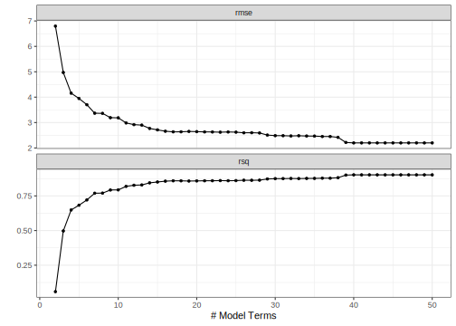
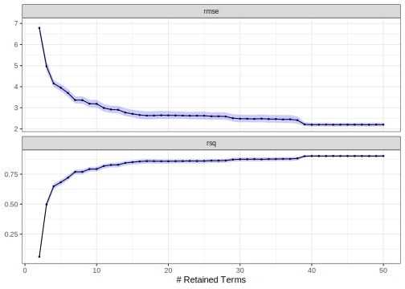

## Introduction 

The tidymodels framework focuses on evaluating models via _empirical validation_: out-of-sample data are used to compute model accuracy/fitness measures. Because of this, data splitting and resampling are essential components of model development. 

If a model uses traditional resampling (such as 10-fold cross-validation), it is easy to get confidence intervals (or Bayesian intervals) of performances. For example, if you are looking at classification accuracy, you can say something like, 

> Our accuracy was estimated to be 91.3% with a 90% confidence interval of (80.1%, 95.9%).

We have replicated performance estimates for these traditional resampling methods (e.g., 10 accuracy estimates from 10-fold cross-validation), so a simple standard error calculation is often a good approach for computing a confidence interval. 

When we have a lot of data, for some definition of “a lot,” we might choose to use a validation set. This single data collection allows us to estimate performance during model development (without touching the test set). However, it results in a single performance estimate, so the traditional approach to computing confidence intervals isn’t feasible.

This article discusses using [the bootstrap](https://en.wikipedia.org/wiki/Bootstrapping_(statistics)) to estimate confidence intervals for performance using tidymodels. To use code in this article,  you will need to install the following packages: earth and tidymodels. We'll use data from the modeldata package to demonstrate. 

## Example Data

We'll use the [delivery time data](https://modeldata.tidymodels.org/reference/deliveries.html) and follow the analysis used in [_Applied Machine Learning for Tabular Data_](https://aml4td.org/chapters/whole-game.html#sec-delivery-times). The outcome is the time for food to be delivered, and the predictors include the day/hour of the order, the distance, and what was included in the order (columns starting with `item_`):

::: {.cell layout-align="center"}

```{.r .cell-code}
library(tidymodels)

str(deliveries)
#> tibble [10,012 × 31] (S3: tbl_df/tbl/data.frame)
#>  $ time_to_delivery: num [1:10012] 16.1 22.9 30.3 33.4 27.2 ...
#>  $ hour            : num [1:10012] 11.9 19.2 18.4 15.8 19.6 ...
#>  $ day             : Factor w/ 7 levels "Mon","Tue","Wed",..: 4 2 5 4 5 6 7 4 5 7 ...
#>  $ distance        : num [1:10012] 3.15 3.69 2.06 5.97 2.52 3.35 2.46 2.21 2.62 2.75 ...
#>  $ item_01         : int [1:10012] 0 0 0 0 0 1 0 0 0 0 ...
#>  $ item_02         : int [1:10012] 0 0 0 0 0 0 0 0 0 2 ...
#>  $ item_03         : int [1:10012] 2 0 0 0 0 0 1 1 0 1 ...
#>  $ item_04         : int [1:10012] 0 0 0 0 1 1 1 0 0 0 ...
#>  $ item_05         : int [1:10012] 0 0 1 0 0 0 0 0 0 0 ...
#>  $ item_06         : int [1:10012] 0 0 0 0 0 0 0 1 0 0 ...
#>  $ item_07         : int [1:10012] 0 0 0 0 1 1 0 0 1 0 ...
#>  $ item_08         : int [1:10012] 0 0 0 0 0 0 0 1 0 0 ...
#>  $ item_09         : int [1:10012] 0 0 0 0 0 1 0 0 0 0 ...
#>  $ item_10         : int [1:10012] 1 0 0 0 0 0 0 0 0 0 ...
#>  $ item_11         : int [1:10012] 1 0 0 0 1 1 0 0 0 0 ...
#>  $ item_12         : int [1:10012] 0 0 0 1 0 0 0 0 0 1 ...
#>  $ item_13         : int [1:10012] 0 0 0 0 0 0 0 0 0 0 ...
#>  $ item_14         : int [1:10012] 0 0 0 0 1 0 0 0 0 0 ...
#>  $ item_15         : int [1:10012] 0 0 0 0 0 0 0 0 1 0 ...
#>  $ item_16         : int [1:10012] 0 0 0 0 0 0 0 0 0 0 ...
#>  $ item_17         : int [1:10012] 0 0 0 0 0 0 0 0 0 1 ...
#>  $ item_18         : int [1:10012] 0 1 0 0 0 0 0 0 0 1 ...
#>  $ item_19         : int [1:10012] 0 0 0 0 0 0 0 0 0 0 ...
#>  $ item_20         : int [1:10012] 0 0 1 0 0 0 0 0 0 0 ...
#>  $ item_21         : int [1:10012] 0 0 0 0 0 0 0 1 0 0 ...
#>  $ item_22         : int [1:10012] 0 0 0 0 0 1 1 0 0 1 ...
#>  $ item_23         : int [1:10012] 0 0 0 0 0 0 0 0 0 0 ...
#>  $ item_24         : int [1:10012] 0 0 1 0 0 1 0 0 0 0 ...
#>  $ item_25         : int [1:10012] 0 0 0 0 0 0 0 0 0 0 ...
#>  $ item_26         : int [1:10012] 0 0 0 0 0 0 0 0 1 0 ...
#>  $ item_27         : int [1:10012] 0 0 0 1 1 0 0 0 0 0 ...
```
:::

Given the amount of data, a validation set was used _in lieu_ of multiple resamples. This means that we can fit models on the training set, evaluate/compare them with the validation set, and reserve the test set for a final performance assessment (after model development). The data splitting code is:

::: {.cell layout-align="center"}

```{.r .cell-code}
set.seed(991)
delivery_split <- initial_validation_split(deliveries, prop = c(0.6, 0.2), 
                                           strata = time_to_delivery)

# Make data frames for each of the three data sets
delivery_train <- training(delivery_split)
delivery_test  <- testing(delivery_split)
delivery_val   <- validation(delivery_split)

# Create an object that bundle training and validation set as a resample object
delivery_rs    <- validation_set(delivery_split)
```
:::

## Tuning a Model

To demonstrate, we'll use a multivariate adaptive regression spline ([MARS](https://scholar.google.com/scholar?hl=en&as_sdt=0%2C7&q=%22multivariate+adaptive+regression+splines%22&btnG=)) model produced by the earth package. The original analysis of these data shows some significant interactions between predictors, so we will specify a model that can estimate them using the argument `prod_degree = 2`. Let's create a model specification that tunes the number of terms to retain: 
 

::: {.cell layout-align="center"}

```{.r .cell-code}
mars_spec <- 
  mars(num_terms = tune(), prod_degree = 2, prune_method = "none") %>% 
  set_mode("regression")
```
:::

Let's use grid search to evaluate a grid of values between 2 and 50. We'll use `tune_grid()` with an option to save the out-of-sample (i.e., validation set) predictions for each candidate model in the grid. By default, for regression models, the function computes the root mean squared error (RMSE) and R<sup>2</sup>:  

::: {.cell layout-align="center"}

```{.r .cell-code}
grid <- tibble(num_terms = 2:50)
ctrl <- control_grid(save_pred = TRUE)

mars_res <- 
  mars_spec %>% 
  tune_grid(
    time_to_delivery ~ .,
    resamples = delivery_rs,
    grid = grid,
    control = ctrl
  )
```
:::

How did the model look?

::: {.cell layout-align="center"}

```{.r .cell-code}
autoplot(mars_res)
```

::: {.cell-output-display}
{fig-align='center' width=672}
:::
:::

After about 20 retained terms, both statistics appear to plateau.  However, we have no sense of the noise around these values. Is a model with 20 terms just as good as a model using 40? In other words, is the slight improvement in RMSE that we see around 39 terms real or within the experimental noise? Forty is a lot of model terms, but that smidgeon of improvement might really be worth it for our application. 

For that, we'll compute confidence intervals. However, there are no analytical formulas for most performance statistics, so we need a more general method for computing them.

## Bootstrap Confidence Intervals

In statistics, the bootstrap is a resampling method that takes a random sample the same size as the original but samples [with replacement](https://en.wikipedia.org/wiki/Sampling_(statistics)#Replacement_of_selected_units). This means that, in the bootstrap sample, some rows of data are represented multiple times and others not at all. 

There is [some theory](https://scholar.google.com/scholar?hl=en&as_sdt=0%2C7&q=%22bootstrap+confidence+intervals%22&btnG=) that shows that if we recompute a statistic a large number of times using the bootstrap, we can understand its sampling distribution and, from that, compute confidence intervals. A good recent reference on this subject by the original inventor of the bootstrap is [_Computer Age Statistical Inference_](https://hastie.su.domains/CASI/) which is available as a free PDF.

For our application, we'll take the validation set predictions for each candidate model in the grid, bootstrap them, and then compute confidence intervals using the percentile method. Note that we are not refitting the model; we will be solely relying on the existing out-of-sample predictions from the validation set. 

There's a tidymodels function called `int_pctl()` for this purpose. It has a method to work with objects produced by the tune package, such as our `mars_res` object. Let's compute 90% confidence intervals using 2,000 bootstrap samples:

::: {.cell layout-align="center"}

```{.r .cell-code}
set.seed(140)
mars_boot <- int_pctl(mars_res, alpha = 0.10)
mars_boot
#> # A tibble: 98 × 7
#>    .metric .estimator .lower .estimate .upper .config               num_terms
#>    <chr>   <chr>       <dbl>     <dbl>  <dbl> <chr>                     <int>
#>  1 rmse    bootstrap  6.57      6.79   7.02   Preprocessor1_Model01         2
#>  2 rsq     bootstrap  0.0462    0.0599 0.0746 Preprocessor1_Model01         2
#>  3 rmse    bootstrap  4.71      4.96   5.22   Preprocessor1_Model02         3
#>  4 rsq     bootstrap  0.468     0.497  0.527  Preprocessor1_Model02         3
#>  5 rmse    bootstrap  3.99      4.15   4.32   Preprocessor1_Model03         4
#>  6 rsq     bootstrap  0.624     0.649  0.674  Preprocessor1_Model03         4
#>  7 rmse    bootstrap  3.78      3.94   4.12   Preprocessor1_Model04         5
#>  8 rsq     bootstrap  0.657     0.683  0.706  Preprocessor1_Model04         5
#>  9 rmse    bootstrap  3.54      3.70   3.88   Preprocessor1_Model05         6
#> 10 rsq     bootstrap  0.699     0.721  0.741  Preprocessor1_Model05         6
#> # ℹ 88 more rows
```
:::

The results have columns for the mean of the sampling distribution (`.estimate`) and the upper and lower confidence bounds (`.upper` and `.lower`, respectively). Let's visualize these results: 

::: {.cell layout-align="center"}

```{.r .cell-code}
mars_boot %>% 
  ggplot(aes(num_terms)) + 
    geom_line(aes(y = .estimate)) + 
    geom_point(aes(y = .estimate), cex = 1 / 2) + 
    geom_ribbon(aes(ymin = .lower, ymax = .upper), alpha = 1 / 5, fill = "blue") +
    facet_wrap(~ .metric, scales = "free_y", ncol = 1) +
    labs(y = NULL, x = "# Retained Terms")
```

::: {.cell-output-display}
{fig-align='center' width=672}
:::
:::

Those are very tight! Maybe there is some credence to using many terms. Let's say that 40 terms seems like a reasonable value for that tuning parameter since the high degree of certainty indicates that the small drop in RMSE is likely to be real. 

## Test Set Intervals

Suppose the MARS model was the best we could do for these data. We would then fit the model (with 40 terms) on the training set then finally evaluate the test set. tidymodels has a function called `last_fit()` that uses our original data splitting object (`delivery_split`) and the model specification. To get the test set predictions, we can use `collect_metrics()`: 

::: {.cell layout-align="center"}

```{.r .cell-code}
mars_final_spec <- 
  mars(num_terms = 40, prod_degree = 2, prune_method = "none") %>% 
  set_mode("regression")

mars_test_res <- 
  mars_final_spec %>% 
  last_fit(time_to_delivery ~ ., split = delivery_split)

collect_metrics(mars_test_res)
#> # A tibble: 2 × 4
#>   .metric .estimator .estimate .config             
#>   <chr>   <chr>          <dbl> <chr>               
#> 1 rmse    standard       2.20  Preprocessor1_Model1
#> 2 rsq     standard       0.892 Preprocessor1_Model1
```
:::

These values are pretty consistent with what the validation set (and its confidence intervals) produced: 

::: {.cell layout-align="center"}

```{.r .cell-code}
mars_boot %>% filter(num_terms == 40)
#> # A tibble: 2 × 7
#>   .metric .estimator .lower .estimate .upper .config               num_terms
#>   <chr>   <chr>       <dbl>     <dbl>  <dbl> <chr>                     <int>
#> 1 rmse    bootstrap   2.11      2.20   2.28  Preprocessor1_Model39        40
#> 2 rsq     bootstrap   0.894     0.902  0.909 Preprocessor1_Model39        40
```
:::

`int_pctl()` also works on objects produced by `last_fit()`: 

::: {.cell layout-align="center"}

```{.r .cell-code}
set.seed(168)
mars_test_boot <- int_pctl(mars_test_res, alpha = 0.10)
mars_test_boot
#> # A tibble: 2 × 6
#>   .metric .estimator .lower .estimate .upper .config             
#>   <chr>   <chr>       <dbl>     <dbl>  <dbl> <chr>               
#> 1 rmse    bootstrap   2.12      2.20   2.28  Preprocessor1_Model1
#> 2 rsq     bootstrap   0.883     0.892  0.900 Preprocessor1_Model1
```
:::

So, to sum up the main idea: If you're not getting multiple estimates of your performance metric from your resample procedure—like when using a validation set—you can still get interval estimates for your metrics. A metric-agnostic approach is to bootstrap your predictions and recalculate your metrics based on those.

## Notes

 - The point estimates produced by `collect_metrics()` and `int_pctl()` may disagree. They are two different statistical estimates of the same quantity. For reasonably sized data sets, they should be pretty close. 
 
 - Parallel processing can be used for bootstrapping (using the [same tools](https://www.tmwr.org/grid-search#parallel-processing) that can be used with the tune package). The documentation for the tune page has some [practical advice on setting those tools up](https://tune.tidymodels.org/articles/extras/optimizations.html#parallel-processing).
 
 
 - `int_pctl()` also works with classification and censored regression models. For the latter, the default is to compute intervals for every metric and every evaluation time. 

 - `int_pctl()` has options to filter which models, metrics, and/or evaluation times are used for analysis. If you investigated many grid points, you don't have to bootstrap them all. 
 
 - Unsurprisingly, bootstrap percentile methods use percentiles. To compute the intervals, you should generate a few thousand bootstrap samples to get stable and accurate estimates of these extreme parts of the sampling distribution. 
 

## Session information {#session-info}

::: {.cell layout-align="center"}

```
#> ─ Session info ─────────────────────────────────────────────────────
#>  setting  value
#>  version  R version 4.4.2 (2024-10-31)
#>  os       macOS Sequoia 15.3.2
#>  system   aarch64, darwin20
#>  ui       X11
#>  language (EN)
#>  collate  en_US.UTF-8
#>  ctype    en_US.UTF-8
#>  tz       America/Los_Angeles
#>  date     2025-03-21
#>  pandoc   3.6.1 @ /usr/local/bin/ (via rmarkdown)
#>  quarto   1.6.42 @ /Applications/quarto/bin/quarto
#> 
#> ─ Packages ─────────────────────────────────────────────────────────
#>  package    * version date (UTC) lib source
#>  broom      * 1.0.7   2024-09-26 [1] CRAN (R 4.4.1)
#>  dials      * 1.4.0   2025-02-13 [1] CRAN (R 4.4.2)
#>  dplyr      * 1.1.4   2023-11-17 [1] CRAN (R 4.4.0)
#>  earth      * 5.3.4   2024-10-05 [1] CRAN (R 4.4.1)
#>  ggplot2    * 3.5.1   2024-04-23 [1] CRAN (R 4.4.0)
#>  infer      * 1.0.7   2024-03-25 [1] CRAN (R 4.4.0)
#>  parsnip    * 1.3.1   2025-03-12 [1] CRAN (R 4.4.1)
#>  purrr      * 1.0.4   2025-02-05 [1] CRAN (R 4.4.1)
#>  recipes    * 1.2.0   2025-03-17 [1] CRAN (R 4.4.1)
#>  rlang        1.1.5   2025-01-17 [1] CRAN (R 4.4.2)
#>  rsample    * 1.2.1   2024-03-25 [1] CRAN (R 4.4.0)
#>  tibble     * 3.2.1   2023-03-20 [1] CRAN (R 4.4.0)
#>  tidymodels * 1.3.0   2025-02-21 [1] CRAN (R 4.4.1)
#>  tune       * 1.3.0   2025-02-21 [1] CRAN (R 4.4.1)
#>  workflows  * 1.2.0   2025-02-19 [1] CRAN (R 4.4.1)
#>  yardstick  * 1.3.2   2025-01-22 [1] CRAN (R 4.4.1)
#> 
#>  [1] /Users/emilhvitfeldt/Library/R/arm64/4.4/library
#>  [2] /Library/Frameworks/R.framework/Versions/4.4-arm64/Resources/library
#>  * ── Packages attached to the search path.
#> 
#> ────────────────────────────────────────────────────────────────────
```
:::
