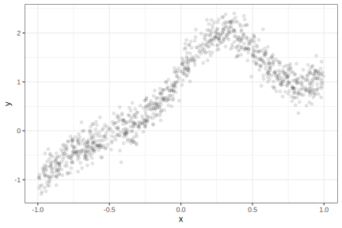
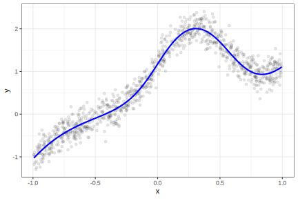
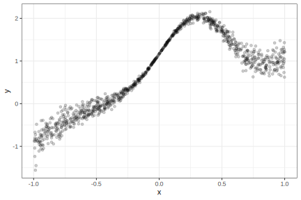

To use code in this article,  you will need to install the following packages: nnet, probably, and tidymodels. The probably package should be version 1.0.2 or greater.

What is [conformal inference](https://en.wikipedia.org/wiki/Conformal_prediction)? It is a collection of statistical methods that are mostly used to construct prediction intervals (or prediction sets) for any type of regression or classification model. The basic idea revolves around some Frequentist theory on how to construct probability statements about whether a new sample could have been from an existing reference distribution.

Since this article is focused on regression problems, we'll motivate the methodology in the context of a numeric outcome. For example, suppose we have collected a set of 1,000 standard normal data points. 


::: {.cell layout-align="center"}

```{.r .cell-code}
library(tidymodels)
tidymodels_prefer()

set.seed(1)
reference_data <- tibble(data = rnorm(1000))

reference_data %>% 
  ggplot(aes(x = data)) +
  geom_line(stat = "density")
```

::: {.cell-output-display}
{fig-align='center' width=70%}
:::
:::


If we had a new observation that we thought might be from the same distribution, how would we say (probabilistically) whether we believe that it belongs to the original distribution? 

If we thought that 1,000 were a sufficient sample size, we might compute some quantiles of these data to define "the mainstream of the data." Let's use the 5th and 95th quantiles to set boundaries that define what we would expect to see most of the time:   


::: {.cell layout-align="center"}

```{.r .cell-code}
quants <- quantile(reference_data$data, probs = c(0.05, 0.95))

reference_data %>% 
  ggplot(aes(x = data)) +
  geom_line(stat = "density") + 
  geom_vline(xintercept = quants, col = "red", lty = 2)
```

::: {.cell-output-display}
{fig-align='center' width=70%}
:::
:::


If we were to get a new sample beyond these boundaries, we would be able to say that we are about 90% sure that the new sample does not conform to the original distribution. This works under the assumption that the data are exchangeable. 

We can apply this relatively simple idea to model predictions. Suppose we have a model created on a numeric outcome. If we make predictions on a data set we can compute the model residuals and create a sort of reference error distribution. If we compute a prediction on a new unknown sample, we could center this reference distribution around its predicted value. For some significance level, we now know the range of sample values that "conform" to the variance seen in the reference distribution. That range can define our prediction interval.

There are a variety of ways to apply this concept (which is unsurprisingly more complex than the above description). The probably package has implemented a few of these.

Let's make a simple example to illustrate the results. We'll simulate a data set with a single predictor along with some unknown samples: 


::: {.cell layout-align="center"}

```{.r .cell-code}
make_data <- function(n, std_dev = 1 / 5) {
  tibble(x = runif(n, min = -1)) %>%
    mutate(
      y = (x^3) + 2 * exp(-6 * (x - 0.3)^2),
      y = y + rnorm(n, sd = std_dev)
    )
}

n <- 1000
set.seed(8383)
train_data <- make_data(n)

train_data %>% 
  ggplot(aes(x, y)) + 
  geom_point(alpha = 1 / 10)
```

::: {.cell-output-display}
{fig-align='center' width=70%}
:::
:::


We'll use these data as a training set and fit a model: 


::: {.cell layout-align="center"}

```{.r .cell-code}
set.seed(484)
nnet_wflow <- 
  workflow(y ~ x, mlp(hidden_units = 4) %>% set_mode("regression"))

nnet_fit <- nnet_wflow %>% fit(train_data)
nnet_pred <- augment(nnet_fit, train_data)

train_data %>% 
  ggplot(aes(x)) + 
  geom_point(aes(y = y), alpha = 1 / 10) +
  geom_line(data = nnet_pred, aes(y = .pred),
            linewidth = 1, col = "blue")
```

::: {.cell-output-display}
{fig-align='center' width=70%}
:::
:::


Let's examine three methods^[A fourth method is implemented for "full conformal prediction." It was developed mainly as a proof of concept. While it is effective, it is _very_ computationally expensive.] to produce prediction intervals: 

## Split Conformal Inference

The most straightforward approach is reserving some data for estimating the residual distribution. We know that simply re-predicting the training set is **a bad idea**; the residuals would be smaller than they should be since the same data are used to create and evaluate the model. 

Let's simulate another data set containing 250 samples and call that the "calibration set". These data can be predicted and the corresponding residuals can be used to define what conforms to the model. We'll also create a large test set to see if we've done a good job. 


::: {.cell layout-align="center"}

```{.r .cell-code}
set.seed(7292)
cal_data  <- make_data(250)
test_data <- make_data(10000)
```
:::


The probably package has a set of functions with the prefix `int_conformal` that can be used to create prediction intervals. One is: 


::: {.cell layout-align="center"}

```{.r .cell-code}
split_int <- int_conformal_split(nnet_fit, cal_data)
split_int
#> Split Conformal inference
#> preprocessor: formula 
#> model: mlp (engine = nnet) 
#> calibration set size: 250 
#> 
#> Use `predict(object, new_data, level)` to compute prediction intervals
```
:::


To get predictions on new data, we use the standard `predict()` method on this object: 


::: {.cell layout-align="center"}

```{.r .cell-code}
# Produce 90% prediction intervals
test_split_res <- 
  predict(split_int, test_data, level = 0.90) %>% 
  bind_cols(test_data)

test_split_res %>% slice(1:5)
#> # A tibble: 5 × 5
#>    .pred .pred_lower .pred_upper       x       y
#>    <dbl>       <dbl>       <dbl>   <dbl>   <dbl>
#> 1  1.30        0.933      1.67    0.621   1.17  
#> 2 -0.298      -0.665      0.0692 -0.658  -0.302 
#> 3  0.133      -0.234      0.501  -0.329   0.0970
#> 4  1.33        0.964      1.70    0.611   1.21  
#> 5  1.24        0.873      1.61    0.0145  1.22
```
:::


The results: 


::: {.cell layout-align="center"}
::: {.cell-output-display}
{fig-align='center' width=70%}
:::
:::


Since we know the outcome values, we can compute the coverage for this particular data set. Since we created a 90% prediction interval, about 90% of the outcomes should be within our bounds. Let's create a function and apply it to these data:


::: {.cell layout-align="center"}

```{.r .cell-code}
coverage <- function(x) {
  x %>% 
    mutate(in_bound = .pred_lower <= y & .pred_upper >= y) %>% 
    summarise(coverage = mean(in_bound) * 100)
}
coverage(test_split_res)
#> # A tibble: 1 × 1
#>   coverage
#>      <dbl>
#> 1     93.0
```
:::


## Using Resampling Results

In a way, the calibration set serves a similar role as a traditional validation set. Since we can't just re-predict our training set, we need to evaluate our model on a separate collection of labeled data. 

However, we also know that resampling methods can serve the same purpose. During resampling, we can compute a set of predictions that were not used to fit the model. For example, in 10-fold cross-validation, there are 10 collections of held-out predictions that do not suffer from the severe bias that occurs when we simple re-predict the training set. 

The CV+ estimator ([Barber _et al._ (2021)](https://scholar.google.com/scholar?hl=en&as_sdt=0%2C5&q=%22Predictive+inference+with+the+jackknife%2B%22&btnG=)) can be used to assemble a reference distribution of residuals. If we use `fit_resamples()` or one of the `tune_*()` functions, we can gather those residuals and use them to create prediction intervals. We'll have to make sure that we save the out-of-sample predictions as well as the resasmpled models.  

The `control_*()` functions can be used for this purpose. We can set `save_pred = TRUE` to save the predicted values. For the resampled models, we can use the tools to [extract the models](https://tidymodels.github.io/tidymodels_dot_org/learn/index.html#category=extracting%20results) via the `extract` argument. We'll use the `I()` function to return the fitted workflows from each resample: 


::: {.cell layout-align="center"}

```{.r .cell-code}
ctrl <- control_resamples(save_pred = TRUE, extract = I)
```
:::


Let's use 10-fold cross-validation to resample the neural network: 


::: {.cell layout-align="center"}

```{.r .cell-code}
set.seed(493)
folds <- vfold_cv(train_data)

nnet_rs <- 
  nnet_wflow %>% 
  fit_resamples(folds, control = ctrl)

collect_metrics(nnet_rs)
#> # A tibble: 2 × 6
#>   .metric .estimator  mean     n std_err .config             
#>   <chr>   <chr>      <dbl> <int>   <dbl> <chr>               
#> 1 rmse    standard   0.201    10 0.00524 Preprocessor1_Model1
#> 2 rsq     standard   0.950    10 0.00447 Preprocessor1_Model1
```
:::


The model has an estimated root mean squared error of 0.201 and an estimated R<sup>2</sup> of 0.95.

We can create another object for computing the intervals:


::: {.cell layout-align="center"}

```{.r .cell-code}
cv_int <- int_conformal_cv(nnet_rs)
cv_int
#> Conformal inference via CV+
#> preprocessor: formula 
#> model: mlp (engine = nnet) 
#> number of models: 10 
#> training set size: 1,000 
#> 
#> Use `predict(object, new_data, level)` to compute prediction intervals

# Produce 90% prediction intervals
test_cv_res <- 
  predict(cv_int, test_data, level = 0.90) %>% 
  bind_cols(test_data)

test_cv_res %>% slice(1:5)
#> # A tibble: 5 × 5
#>   .pred_lower  .pred .pred_upper       x       y
#>         <dbl>  <dbl>       <dbl>   <dbl>   <dbl>
#> 1       0.964  1.29       1.62    0.621   1.17  
#> 2      -0.640 -0.311      0.0177 -0.658  -0.302 
#> 3      -0.184  0.145      0.474  -0.329   0.0970
#> 4       0.992  1.32       1.65    0.611   1.21  
#> 5       0.896  1.23       1.55    0.0145  1.22
```
:::


The results for this method are:


::: {.cell layout-align="center"}
::: {.cell-output-display}
{fig-align='center' width=70%}
:::
:::


At each point, the interval length is 0.66; the previous split conformal interval width was 0.73. This is due to the training set being larger than the calibration set. 

Note that the coverage is a little better since it is near 90%:


::: {.cell layout-align="center"}

```{.r .cell-code}
coverage(test_cv_res)
#> # A tibble: 1 × 1
#>   coverage
#>      <dbl>
#> 1     89.6
```
:::


## Adaptive width intervals

The simulated data that we've been using has a constant error variance. That has worked for the two methods shown since their intervals are always the same width. Real data does not always have constant variation. 

To demonstrate, we can take the previous simulation system and induce a variance that is dynamic over the predictor range:


::: {.cell layout-align="center"}

```{.r .cell-code}
make_variable_data <- function(n, std_dev = 1 / 5) {
  tibble(x = runif(n, min = -1)) %>%
    mutate(
      y = (x^3) + 2 * exp(-6 * (x - 0.3)^2),
      y = y + rnorm(n, sd = std_dev * abs(x))
    )
}

make_variable_data(1000) %>% 
  ggplot(aes(x, y)) + 
  geom_point(alpha = 1 / 5)
```

::: {.cell-output-display}
{fig-align='center' width=70%}
:::
:::


Let's create new data sets and re-fit our model: 


::: {.cell layout-align="center"}

```{.r .cell-code}
set.seed(7292)
train_variable_data <- make_variable_data(n)
cal_variable_data <- make_variable_data(250)
test_variable_data <- make_variable_data(10000)

nnet_variable_fit <- nnet_wflow %>% fit(train_variable_data)
nnet_variable_pred <- augment(nnet_variable_fit, train_variable_data)
```
:::


We can recreate the CV+ interval for this new version of the data:


::: {.cell layout-align="center"}
::: {.cell-output-display}
{fig-align='center' width=70%}
:::
:::


The _average_ coverage is good: 


::: {.cell layout-align="center"}

```{.r .cell-code}
coverage(test_cv_variable_res)
#> # A tibble: 1 × 1
#>   coverage
#>      <dbl>
#> 1     90.3
```
:::


However, there are obvious areas where it is either too wide or too narrow. 

Conformalized quantile regression ([Romano _et al_ (2019)](https://scholar.google.com/scholar?hl=en&as_sdt=0%2C5&q=%22Conformalized+quantile+regression%22)) is a method to produce intervals that can properly scale the intervals based on what was observed in the training data. It fits an initial [quantile regression](https://en.wikipedia.org/wiki/Quantile_regression) model to do so and also required a split data set, such as our calibration data. 

The original work used basic quantile regression models. For tidymodels, we'll use [quantile regression forests](https://scholar.google.com/scholar?hl=en&as_sdt=0%2C5&q=%22Quantile+Regression+Forests%22). The reason being that some models require nonlinear terms, interactions, and other features to model the data adequately. Users would have to have a parallel modeling process for that model. Random forests for quantile regression are very adaptable, low maintenance, and are robust to tuning parameter specification. There are both minor and major downsides, as seen below. 

The function for this, `int_conformal_quantile()`, has a slightly different interface than the previous functions: 

* It requires both the training and calibration sets.
* The confidence level must be set in advance. 

We'll also pass an argument to the `quantregForest()` function that we'll use 2,000 trees to make the forest: 


::: {.cell layout-align="center"}

```{.r .cell-code}
quant_int <-
  int_conformal_quantile(
    nnet_variable_fit, 
    train_data = train_variable_data,
    cal_data = cal_variable_data, 
    level = 0.90,
    ntree = 2000)
quant_int
#> Split Conformal inference via Quantile Regression
#> preprocessor: formula 
#> model: mlp (engine = nnet) 
#> calibration set size: 250 
#> confidence level: 0.9 
#> 
#> Use `predict(object, new_data)` to compute prediction intervals

test_quant_res <- 
  predict(quant_int, test_variable_data) %>% 
  bind_cols(test_variable_data)

test_quant_res %>% slice(1:5)
#> # A tibble: 5 × 5
#>    .pred .pred_lower .pred_upper      x      y
#>    <dbl>       <dbl>       <dbl>  <dbl>  <dbl>
#> 1  0.992       0.574      1.14    0.776  1.10 
#> 2 -0.329      -0.546     -0.0904 -0.686 -0.180
#> 3  0.269       0.161      0.459  -0.274  0.364
#> 4  1.01        0.666      1.13    0.759  1.21 
#> 5  2.00        1.90       2.12    0.367  1.87
```
:::


The results: 


::: {.cell layout-align="center"}
::: {.cell-output-display}
{fig-align='center' width=70%}
:::
:::


Minor downside: The bumpiness of the bound is the consequence of using a tree-based model for the quantiles. 

Despite that, the intervals do adapt their widths to suit the data. The coverage is also close to the target: 


::: {.cell layout-align="center"}

```{.r .cell-code}
coverage(test_quant_res)
#> # A tibble: 1 × 1
#>   coverage
#>      <dbl>
#> 1     92.0
```
:::

### The major downside

When our predictions are extrapolating, the intervals can be very poor. Tree-based models can behave very differently than other models when predicting beyond the training set; they follow a static trend even as the predictor values move towards infinity. 

To illustrate this, we can simulate another point outside of the training set range: 


::: {.cell layout-align="center"}
::: {.cell-output-display}
{fig-align='center' width=70%}
:::
:::


The neural network does fairly well but the quantile regression forest carries the same extract trend forward. In this case, the interval doesn't even include the predicted value (since two different models are used to compute both quantities). 

To protect against this, we suggest using the tools in the [applicable package](https://applicable.tidymodels.org). It can help quantify how much a prediction is outside of the mainstream of the training set.


## Coverage

Speaking of coverage, there's a [GitHub repo](https://github.com/topepo/conformal_sim) where we did simulations for these methods to determine their average coverage. The repository's readme file has a summary. 

## Learning More

If you are interested and would like to learn more, try these resources: 

* [_Introduction To Conformal Prediction With Python_](https://christophmolnar.com/books/conformal-prediction/) by Christoph Molnar
 (highly recommended)
 * [`awesome-conformal-prediction`](https://github.com/valeman/awesome-conformal-prediction) on GitHub. 
* [Ryan Tibshirani's notes](https://www.stat.berkeley.edu/~ryantibs/statlearn-s23/lectures/conformal.pdf) (pdf)
* Angelopoulos, Anastasios N., and Stephen Bates. "[A gentle introduction to conformal prediction and distribution-free uncertainty quantification](https://arxiv.org/abs/2107.07511)." arXiv preprint arXiv:2107.07511 (2021).


## Session information


::: {.cell layout-align="center"}

```
#> ─ Session info ─────────────────────────────────────────────────────
#>  setting  value
#>  version  R version 4.4.0 (2024-04-24)
#>  os       macOS Sonoma 14.4.1
#>  system   aarch64, darwin20
#>  ui       X11
#>  language (EN)
#>  collate  en_US.UTF-8
#>  ctype    en_US.UTF-8
#>  tz       America/Los_Angeles
#>  date     2024-06-26
#>  pandoc   3.1.1 @ /Applications/RStudio.app/Contents/Resources/app/quarto/bin/tools/ (via rmarkdown)
#> 
#> ─ Packages ─────────────────────────────────────────────────────────
#>  package    * version date (UTC) lib source
#>  broom      * 1.0.6   2024-05-17 [1] CRAN (R 4.4.0)
#>  dials      * 1.2.1   2024-02-22 [1] CRAN (R 4.4.0)
#>  dplyr      * 1.1.4   2023-11-17 [1] CRAN (R 4.4.0)
#>  ggplot2    * 3.5.1   2024-04-23 [1] CRAN (R 4.4.0)
#>  infer      * 1.0.7   2024-03-25 [1] CRAN (R 4.4.0)
#>  nnet       * 7.3-19  2023-05-03 [1] CRAN (R 4.4.0)
#>  parsnip    * 1.2.1   2024-03-22 [1] CRAN (R 4.4.0)
#>  probably   * 1.0.3   2024-02-23 [1] CRAN (R 4.4.0)
#>  purrr      * 1.0.2   2023-08-10 [1] CRAN (R 4.4.0)
#>  recipes    * 1.0.10  2024-02-18 [1] CRAN (R 4.4.0)
#>  rlang        1.1.4   2024-06-04 [1] CRAN (R 4.4.0)
#>  rsample    * 1.2.1   2024-03-25 [1] CRAN (R 4.4.0)
#>  tibble     * 3.2.1   2023-03-20 [1] CRAN (R 4.4.0)
#>  tidymodels * 1.2.0   2024-03-25 [1] CRAN (R 4.4.0)
#>  tune       * 1.2.1   2024-04-18 [1] CRAN (R 4.4.0)
#>  workflows  * 1.1.4   2024-02-19 [1] CRAN (R 4.4.0)
#>  yardstick  * 1.3.1   2024-03-21 [1] CRAN (R 4.4.0)
#> 
#>  [1] /Library/Frameworks/R.framework/Versions/4.4-arm64/Resources/library
#> 
#> ────────────────────────────────────────────────────────────────────
```
:::
