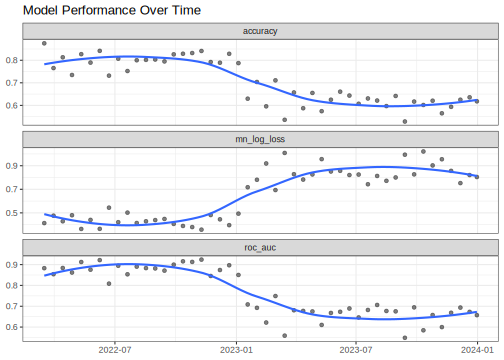

## Introduction

To use code in this article,  you will need to install the following packages: sessioninfo, slider, and tidymodels.

Many modeling workflows end once a model has been evaluated on a test set. After selecting a final model for deployment, it is easy to think the work is finished. In practice, deployment is often the beginning of a new stage in the model lifecycle.

As new data arrives, users may start asking questions such as:

  - Is the model performing as well as it did when it was deployed?
  - Has performance changed over time?
  - Are there signs of drift?
  - Should the model be retrained?

Answering these questions requires more than a single test set evaluation. Instead, we need a way to continuously monitor model performance as new observations become available.

In this article, we will build a simple monitoring workflow that takes timestamped predictions, splits them into regular time intervals with the slider package, computes performance metrics for each interval with purrr, and plots the results over time.

## Simulating incoming observations

To demonstrate this monitoring workflow, we will create a synthetic classification problem. The first part of the data represents observations that were available when the model was developed, while the remaining observations represent new data arriving after deployment. To make the example more realistic, we will introduce a change in the underlying relationship between the predictors and outcome, causing model performance to gradually decline over time.

::: {.cell layout-align="center"}

```{.r .cell-code}
set.seed(123)
n <- 6000
sim_data <- tibble(
  date = sort(sample(
    seq.Date(
      from = as.Date("2022-01-01"),
      by = "day",
      length.out = 730
    ),
    size = n,
    replace = TRUE
  )),
  x1 = rnorm(n),
  x2 = rnorm(n)
) %>%
  mutate(
    drifted = date >= as.Date("2023-01-01"),
    signal = if_else(
      drifted,
      0.5 * x1 - 0.25 * x2,
      2 * x1 - x2
    ),
    probability = plogis(signal),
    outcome = factor(
      if_else(
        runif(n) < probability,
        "yes",
        "no"
      ),
      levels = c("yes", "no")
    )
  ) %>%
  select(
    -drifted,
    -signal,
    -probability
  )

sim_data
#> # A tibble: 6,000 × 4
#>    date            x1      x2 outcome
#>    <date>       <dbl>   <dbl> <fct>  
#>  1 2022-01-01  0.602  -0.727  yes    
#>  2 2022-01-01  0.480   1.31   yes    
#>  3 2022-01-01  0.215  -0.510  yes    
#>  4 2022-01-01 -2.54   -1.34   no     
#>  5 2022-01-01  0.0464  0.191  no     
#>  6 2022-01-01 -0.0509  0.601  no     
#>  7 2022-01-01 -1.81    0.130  no     
#>  8 2022-01-01  0.788   0.0570 no     
#>  9 2022-01-01 -1.48   -0.746  no     
#> 10 2022-01-01 -0.348  -0.733  yes    
#> # ℹ 5,990 more rows
```
:::

We generate several observations per day so that each evaluation window contains enough data for a stable estimate. The relationship between the predictors and outcome weakens partway through the series (on 2023-01-01). A model trained on the earlier, stronger relationship will gradually become less effective afterwards. This behavior resembles one form of concept drift, where the process generating the outcome changes over time.

Notice that we set the factor levels so that `"yes"` is the first level. yardstick treats the first level as the event of interest by default, so ordering the levels here means we won't need to set `event_level` every time we compute a metric.

## Training a model

Suppose that the first 600 observations were available when the model was developed. At this point, we will pretend the model has been deployed. The remaining observations represent future data arriving after deployment.

::: {.cell layout-align="center"}

```{.r .cell-code}
train_data <-
  sim_data %>%
  slice_head(n = 600)

monitor_data <-
  sim_data %>%
  slice(-(1:600))
```
:::

::: {.cell layout-align="center"}

```{.r .cell-code}
# We fit a logistic regression model:
log_fit <-
  logistic_reg() %>%
  fit(
    outcome ~ x1 + x2,
    data = train_data
  )

log_fit
#> parsnip model object
#> 
#> 
#> Call:  stats::glm(formula = outcome ~ x1 + x2, family = stats::binomial, 
#>     data = data)
#> 
#> Coefficients:
#> (Intercept)           x1           x2  
#>     -0.1431      -2.1029       1.0656  
#> 
#> Degrees of Freedom: 599 Total (i.e. Null);  597 Residual
#> Null Deviance:	    830.1 
#> Residual Deviance: 511.6 	AIC: 517.6
```
:::

Since `"glm"` is the default engine for `logistic_reg()`, we don't need to set it explicitly with `set_engine()`.

## Generating predictions

As new observations arrive, the deployed model generates predictions. Each observation now contains: a timestamp, the original predictors, the true outcome, the predicted class, and predicted probabilities. This structure is common in production monitoring systems and forms the basis of our analysis.

We use `augment()` rather than `predict()` so that the predicted class, predicted probabilities, and the original columns are all returned together in a single data frame in a safe way.

::: {.cell layout-align="center"}

```{.r .cell-code}
monitor_data <- log_fit %>%
  augment(new_data = monitor_data)

colnames(monitor_data)
#> [1] ".pred_class" ".pred_yes"   ".pred_no"    "date"        "x1"         
#> [6] "x2"          "outcome"
```
:::

## Why use time windows

Looking at predictions one at a time is usually not very informative. If a model makes a mistake today, that does not necessarily mean anything is wrong. Instead, we generally summarize performance across a larger set of observations. For example, we might check performance every two weeks:

| Window | Dates           |
|--------|-----------------|
| 1      | Jan 1 – Jan 14  |
| 2      | Jan 15 – Jan 28 |
| 3      | Jan 29 – Feb 11 |

Metrics computed within these windows are typically more stable and easier to interpret than metrics based on individual predictions. The next challenge is creating these windows efficiently and applying the same calculations to each one. This is where the slider package becomes useful.

## Splitting the data with slider

The slider package applies a function across a series of windows defined over an index. To check performance every two weeks, we use `slide_period()`, which groups observations into consecutive calendar periods. Here we ask for non-overlapping two-week blocks by sliding over `"week"` periods, two at a time.

We pass `.f = identity` so that slider simply returns the observations in each window, leaving the metric calculations for the next step.

::: {.cell layout-align="center"}

```{.r .cell-code}
windows <- slide_period(
  .x = monitor_data,
  .i = monitor_data$date,
  .period = "week",
  .every = 2,
  .f = identity
)

length(windows)
#> [1] 48
```
:::

::: {.cell layout-align="center"}

```{.r .cell-code}
# inspect one window
windows[[10]] %>% glimpse()
#> Rows: 113
#> Columns: 7
#> $ .pred_class <fct> yes, yes, no, yes, yes, yes, yes, yes, yes, no, yes, yes, …
#> $ .pred_yes   <dbl> 0.88959258, 0.59985201, 0.02340663, 0.67147866, 0.94093421…
#> $ .pred_no    <dbl> 0.11040742, 0.40014799, 0.97659337, 0.32852134, 0.05906579…
#> $ date        <date> 2022-07-07, 2022-07-07, 2022-07-07, 2022-07-07, 2022-07-0…
#> $ x1          <dbl> 1.10213613, -0.84578332, -1.56364555, -0.02407925, 0.58946…
#> $ x2          <dbl> 0.3511203, -1.9147686, 0.5498216, -0.5841380, -1.3002671, …
#> $ outcome     <fct> yes, no, no, yes, yes, yes, yes, no, no, yes, yes, no, yes…
```
:::

Each element of `windows` is a data frame containing the observations from one two-week period. The result is a list where element 1 holds the first window, element 2 the next, and so on. This list is the foundation for our monitoring workflow.

## Understanding `slide_period()`

The `slide_period()` function has several important arguments:

  - `.x` is the object being sliced,
  - `.i` is the index used to define the windows (here, the observation date),
  - `.period` is the calendar unit used to group observations (here, `"week"`),
  - `.every` controls how many periods make up each window. We set `.every = 2` to get two-week blocks,
  - `.f` is the function applied to each window. Using `identity()` returns each window unchanged.

If you wanted *rolling* (overlapping) windows instead of fixed blocks, `slide_index()` with the `.before` argument lets each window reach back a fixed number of days from the current observation.

## Computing metrics with purrr

In practice, monitoring systems rarely track a single metric. Here we track three: accuracy, ROC AUC, and log loss. Rather than calling each metric function separately, we bundle them into a metric set with `metric_set()`. Calling the resulting function stacks the metrics vertically into a single tidy tibble.

::: {.cell layout-align="center"}

```{.r .cell-code}
monitor_metrics <- metric_set(accuracy, roc_auc, mn_log_loss)

compute_window_metrics <- function(dat) {
  monitor_metrics(
    dat,
    truth = outcome,
    estimate = .pred_class,
    .pred_yes
  ) %>%
    mutate(date = max(dat$date), .before = 1)
}
```
:::

We can apply it to a single window:

::: {.cell layout-align="center"}

```{.r .cell-code}
windows[[10]] %>%
  compute_window_metrics()
#> # A tibble: 3 × 4
#>   date       .metric     .estimator .estimate
#>   <date>     <chr>       <chr>          <dbl>
#> 1 2022-07-20 accuracy    binary         0.752
#> 2 2022-07-20 roc_auc     binary         0.853
#> 3 2022-07-20 mn_log_loss binary         0.502
```
:::

The `map()` family of functions from purrr lets us apply the same calculation to every window, and `list_rbind()` stacks the results into one tibble.

::: {.cell layout-align="center"}

```{.r .cell-code}
monitoring_results <-
  windows %>%
  map(compute_window_metrics) %>%
  list_rbind()

monitoring_results %>%
  slice_head(n = 6)
#> # A tibble: 6 × 4
#>   date       .metric     .estimator .estimate
#>   <date>     <chr>       <chr>          <dbl>
#> 1 2022-03-16 accuracy    binary         0.875
#> 2 2022-03-16 roc_auc     binary         0.883
#> 3 2022-03-16 mn_log_loss binary         0.413
#> 4 2022-03-30 accuracy    binary         0.765
#> 5 2022-03-30 roc_auc     binary         0.854
#> 6 2022-03-30 mn_log_loss binary         0.476
```
:::

## Visualizing performance through time

The goal of monitoring is to understand how model performance changes over time. Because all three metrics share the same tidy structure, we can show them together in a single faceted plot.

::: {.cell layout-align="center"}

```{.r .cell-code}
ggplot(
  monitoring_results,
  aes(date, .estimate)
) +
  geom_point(alpha = 0.5) +
  geom_smooth(se = FALSE) +
  facet_wrap(~ .metric, scales = "free_y", ncol = 1) +
  labs(
    title = "Model Performance Over Time",
    x = NULL,
    y = NULL
  )
#> `geom_smooth()` using method = 'loess' and formula = 'y ~ x'
```

::: {.cell-output-display}
{fig-align='center' width=672}
:::
:::

In this example, accuracy and ROC AUC gradually decline while log loss rises as newer observations arrive. Because we intentionally introduced a change in the data-generating process, this pattern is expected. In a real-world setting, a similar decline could indicate concept drift, changing customer behavior, shifts in the target population, or other changes in the environment where the model is being used.

Even with enough observations per window, individual windows still show some variability, so the points bounce around the underlying trend. There is a tradeoff here: smaller windows react more quickly to change but are noisier, while larger windows are more stable but slower to reveal a shift. Adding a smoothed trend line (here with `geom_smooth()`) makes the overall direction easier to read through that window-to-window noise.

Unlike accuracy, log loss focuses on how well the predicted probabilities match the observed outcomes. Rising log loss can be a sign that the model is becoming less confident or less well calibrated, even when accuracy has not changed very much.

## An alternative: `sliding_period()` from rsample

If you already work with tidymodels resampling, rsample provides `sliding_period()`, which expresses the same idea as a resampling scheme. It returns an `rset` of splits rather than a list of data frames, and because it works with the date index directly it handles gaps and non-sequential time values nicely.

::: {.cell layout-align="center"}

```{.r .cell-code}
monitor_rs <-
  monitor_data %>%
  sliding_period(
    index = date,
    period = "week",
    lookback = 1,
    step = 2,
    skip = 1
  )

monitor_rs %>%
  mutate(
    metrics = map(splits, ~ compute_window_metrics(analysis(.x)))
  ) %>%
  select(metrics) %>%
  unnest(metrics) %>%
  slice_head(n = 6)
#> # A tibble: 6 × 4
#>   date       .metric     .estimator .estimate
#>   <date>     <chr>       <chr>          <dbl>
#> 1 2022-03-30 accuracy    binary         0.765
#> 2 2022-03-30 roc_auc     binary         0.854
#> 3 2022-03-30 mn_log_loss binary         0.476
#> 4 2022-04-13 accuracy    binary         0.813
#> 5 2022-04-13 roc_auc     binary         0.884
#> 6 2022-04-13 mn_log_loss binary         0.429
```
:::

Here `lookback = 1` includes the current week plus the previous week (two weeks total) and `step = 2` advances two weeks at a time, giving the same non-overlapping windows as the slider approach above. We also set `skip = 1`, which drops the first resample (`skip` is applied before `step` thins the rest). Use whichever fits your workflow: slider is lightweight and general purpose, while `sliding_period()` slots naturally into a tidymodels resampling pipeline.

## Drift interpretation

Monitoring metrics rarely remain perfectly stable.
Several patterns commonly appear:

| Pattern              | Possible interpretation                                                              |
|----------------------|--------------------------------------------------------------------------------------|
| Stable metrics       | The model continues to perform as expected                                           |
| Gradual decline      | The relationship between predictors and outcomes may be changing (concept drift)     |
| Sudden drop          | A data quality issue, system change, or major population shift                       |
| Increased volatility | Small sample sizes or an unstable process                                            |

Monitoring does not automatically identify the cause of performance degradation. Instead, it provides an early warning signal that further investigation may be needed.

## Conclusion

Model evaluation does not end once a model is deployed. As new data arrives, performance should be monitored regularly to detect drift and identify when retraining may be needed.

In this article, we used:

  - tidymodels to train a model and generate predictions,
  - slider to split timestamped predictions into regular evaluation windows,
  - purrr to compute performance metrics across those windows, and
  - ggplot2 to visualize how performance changes over time.

While our example focused on a single model, the same approach can be extended to monitor many models and metrics in a production environment.

## Session information {#session-info}

::: {.cell layout-align="center"}

```
#> ─ Session info ─────────────────────────────────────────────────────
#>  version  R version 4.6.0 (2026-04-24)
#>  language (EN)
#>  pandoc   3.1.3
#>  quarto   1.9.38
#> 
#> ─ Packages ─────────────────────────────────────────────────────────
#>  package       version date (UTC)
#>  broom         1.0.13  2026-05-14
#>  dials         1.4.4   2026-06-22
#>  dplyr         1.2.1   2026-04-03
#>  ggplot2       4.0.3   2026-04-22
#>  infer         1.1.0   2025-12-18
#>  parsnip       1.6.0   2026-05-14
#>  purrr         1.2.2   2026-04-10
#>  recipes       1.3.3   2026-05-30
#>  rlang         1.2.0   2026-04-06
#>  rsample       1.3.2   2026-01-30
#>  sessioninfo   1.2.4   2026-06-04
#>  slider        0.3.3   2025-11-14
#>  tibble        3.3.1   2026-01-11
#>  tidymodels    1.5.0   2026-04-23
#>  tune          2.1.0   2026-04-17
#>  workflows     1.3.0   2025-08-27
#>  yardstick     1.4.0   2026-04-07
#> 
#> ────────────────────────────────────────────────────────────────────
```
:::

