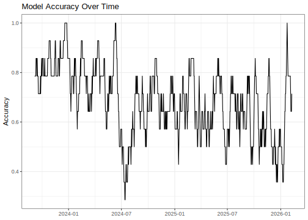
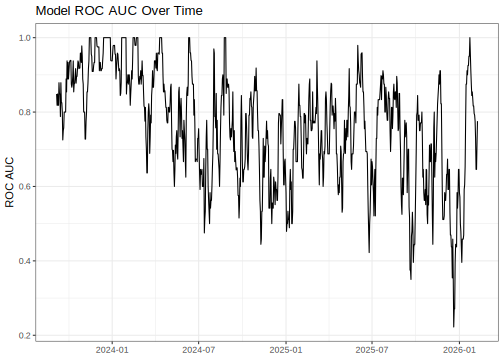
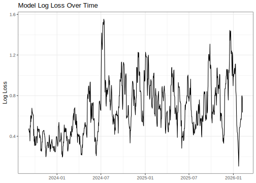
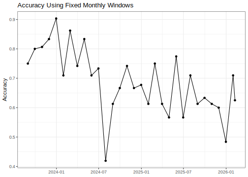

## Introduction

To use code in this article,  you will need to install the following packages: ggplot2, lubridate, purrr, sessioninfo, slider, and tidymodels.

Many modeling workflows end once a model has been evaluated on a test set. After selecting a final model for deployment, it is easy to think the work is finished. In practice, deployment is often the beginning of a new stage in the model lifecycle.

As new data arrives, users may start asking questions such as:

  - Is the model performing as well as it did when it was deployed?
  - Has performance changed over time?
  - Are there signs of drift?
  - Should the model be retrained?

Answering these questions requires more than a single test set evaluation. Instead, we need a way to continuously monitor model performance as new observations become available.

In this article, we will build a simple monitoring workflow to track model performance over time and identify potential signs of drift.

## Simulating incoming observations

To demonstrate this monitoring workflow, we will create a synthetic classification problem. The first part of the data represents observations that were available when the model was developed, while the remaining observations represent new data arriving after deployment. To make the example more realistic, we will introduce a change in the underlying relationship between the predictors and outcome, causing model performance to gradually decline over time.

::: {.cell layout-align="center"}

```{.r .cell-code}
set.seed(123) 
n <- 1500 
sim_data <- tibble(
  date = seq.Date(
    from = as.Date("2022-01-01"),
    by = "day",
    length.out = n
  ),
  x1 = rnorm(n),
  x2 = rnorm(n)
) %>%
  mutate(
    signal = if_else(
      row_number() <= 900,
      2 * x1 - x2,
      0.75 * x1 - 0.25 * x2
    ),
    probability = plogis(signal),
    outcome = factor(
      if_else(
        runif(n) < probability,
        "yes",
        "no"
      )
    )
  ) %>%
  select(
    -signal,
    -probability
  )

sim_data
#> # A tibble: 1,500 × 4
#>    date            x1     x2 outcome
#>    <date>       <dbl>  <dbl> <fct>  
#>  1 2022-01-01 -0.560  -0.821 no     
#>  2 2022-01-02 -0.230  -0.307 yes    
#>  3 2022-01-03  1.56   -0.902 yes    
#>  4 2022-01-04  0.0705  0.627 no     
#>  5 2022-01-05  0.129   1.12  yes    
#>  6 2022-01-06  1.72    2.13  yes    
#>  7 2022-01-07  0.461   0.366 yes    
#>  8 2022-01-08 -1.27   -0.875 no     
#>  9 2022-01-09 -0.687   1.02  no     
#> 10 2022-01-10 -0.446   0.905 yes    
#> # ℹ 1,490 more rows
```
:::

The relationship between the predictors and outcome changes later in the data. A model trained on earlier observations will gradually become less effective. This behavior resembles one form of concept drift, where the process generating the outcome changes over time.

## Training a model

Suppose that the first 600 observations were available when the model was developed. At this point, we will pretend the model has been deployed. The remaining observations represent future data arriving after deployment.

::: {.cell layout-align="center"}

```{.r .cell-code}
train_data <-
  sim_data %>%
  slice_head(n = 600)

monitor_data <-
  sim_data %>%
  slice(-(1:600))
```
:::

::: {.cell layout-align="center"}

```{.r .cell-code}
# We fit a logistic regression model:
log_fit <-
  logistic_reg() %>%
  set_engine("glm") %>%
  fit(
    outcome ~ x1 + x2,
    data = train_data
  )

log_fit
#> parsnip model object
#> 
#> 
#> Call:  stats::glm(formula = outcome ~ x1 + x2, family = stats::binomial, 
#>     data = data)
#> 
#> Coefficients:
#> (Intercept)           x1           x2  
#>     0.04441      2.11480     -0.96107  
#> 
#> Degrees of Freedom: 599 Total (i.e. Null);  597 Residual
#> Null Deviance:	    831.5 
#> Residual Deviance: 511.4 	AIC: 517.4
```
:::

## Generating predictions

As new observations arrive, the deployed model generates predictions. Each observation now contains: a timestamp, the true outcome, the predicted class, predicted probabilities. This structure is common in production monitoring systems and forms the basis of our analysis.

::: {.cell layout-align="center"}

```{.r .cell-code}
monitor_data <- log_fit %>% 
  augment(new_data = monitor_data)

colnames(monitor_data)
#> [1] ".pred_class" ".pred_no"    ".pred_yes"   "date"        "x1"         
#> [6] "x2"          "outcome"
```
:::

## Why use time windows

Looking at predictions one at a time is usually not very informative. If a model makes a mistake today, that does not necessarily mean anything is wrong. Instead, we generally summarize performance across a larger set of observations. For example:

Window | Dates
-------|------------------
1      | Jan 1 - Jan 14
2      | Jan 15 - Jan 28
3      | Jan 29 - Feb 11

Metrics computed within these windows are typically more stable and easier to interpret than metrics based on individual predictions. The next challenge is creating these windows efficiently and applying the same calculations to each one. This is where the slider package becomes useful.

## Creating rolling windows with slider

The basic idea behind slider is straightforward: apply the same function repeatedly across a series of moving windows. In our monitoring workflow, each window represents a rolling 14-day period of observations. We start by creating these windows using the observation date as the time index.

::: {.cell layout-align="center"}

```{.r .cell-code}
windows <- slide_index(
  .x = monitor_data,
  .i = monitor_data$date,
  .before = 13,
  .complete = TRUE,
  .f = identity
) %>%
  compact()
length(windows)
#> [1] 887
```
:::

::: {.cell layout-align="center"}

```{.r .cell-code}
# inspect one window
windows[[50]] %>% glimpse()
#> Rows: 14
#> Columns: 7
#> $ .pred_class <fct> yes, no, no, yes, no, yes, no, yes, yes, yes, no, yes, yes…
#> $ .pred_no    <dbl> 0.09792387, 0.98937309, 0.78571279, 0.29503143, 0.99073120…
#> $ .pred_yes   <dbl> 0.902076130, 0.010626913, 0.214287214, 0.704968565, 0.0092…
#> $ date        <date> 2023-10-12, 2023-10-13, 2023-10-14, 2023-10-15, 2023-10-1…
#> $ x1          <dbl> 0.9899716, -1.9385047, 0.1071904, 0.6087790, -1.4508243, 0…
#> $ x2          <dbl> -0.085849546, 0.497932993, 1.633989657, 0.479451881, 1.714…
#> $ outcome     <fct> no, no, no, no, no, yes, no, yes, yes, yes, no, yes, yes, …
```
:::

Each element of windows is a data frame containing observations from a two-week period. The result is a list where:

  - element 1 contains observations from the first complete window,
  - element 2 contains observations from the next window, and so on.
  
This list will serve as the foundation for our monitoring workflow.

## Understanding `slide_index()`

The `slide_index()` function has several important arguments.
Here:

  - .x specifies the object being sliced,
  - .i specifies the index variable,
  - .before controls the size of the rolling window: We set .before = 13 because slider includes the current observation in each window. As a result, each window contains the current day plus the previous 13 days, for a total of 14 days.
  - .complete = TRUE removes incomplete windows,
  - .f specifies the function applied to each window.
  
Because we use `identity()`, slider returns each window unchanged. This creates a collection of evaluation periods that we can analyze independently.

## Computing metrics with purrr

In practice, monitoring systems rarely track a single metric. Suppose we want both accuracy and ROC AUC.

::: {.cell layout-align="center"}

```{.r .cell-code}
# Alter your compute function to return a tidy data frame including the window's end date
compute_metrics <- function(dat) {

  tibble(
    date = max(dat$date),

    accuracy =
      accuracy_vec(
        dat$outcome,
        dat$.pred_class
      ),

    roc_auc =
      roc_auc_vec(
        dat$outcome,
        dat$.pred_yes,
        event_level = "second"
      ),

    log_loss =
      mn_log_loss_vec(
        dat$outcome,
        dat$.pred_yes,
        event_level = "second"
      )
  )
}
```
:::

Each monitoring window now produces a tibble rather than a single value. The `map()` family of functions from purrr allows us to repeatedly apply the same calculation to every rolling window.

::: {.cell layout-align="center"}

```{.r .cell-code}
windows[[50]] %>% 
  compute_metrics()
#> # A tibble: 1 × 4
#>   date       accuracy roc_auc log_loss
#>   <date>        <dbl>   <dbl>    <dbl>
#> 1 2023-10-25    0.857   0.918    0.382
```
:::

::: {.cell layout-align="center"}

```{.r .cell-code}
# Apply the function across all windows.
# The result is a list of tibbles.

monitoring_results <-
  windows %>%
  map(compute_metrics) %>%
  list_rbind()
monitoring_results %>%
  slice_head(n = 5)
#> # A tibble: 5 × 4
#>   date       accuracy roc_auc log_loss
#>   <date>        <dbl>   <dbl>    <dbl>
#> 1 2023-09-06    0.786   0.848    0.459
#> 2 2023-09-07    0.786   0.818    0.476
#> 3 2023-09-08    0.786   0.848    0.439
#> 4 2023-09-09    0.786   0.818    0.445
#> 5 2023-09-10    0.786   0.818    0.454
```
:::

## Visualizing accuracy through time

::: {.cell layout-align="center"}

```{.r .cell-code}
ggplot(
  monitoring_results,
  aes(date, accuracy)
) +
  geom_line() +
  labs(
    title = "Model Accuracy Over Time",
    x = NULL,
    y = "Accuracy"
  )
```

::: {.cell-output-display}
{fig-align='center' width=672}
:::
:::

The goal of monitoring is to understand how model performance changes over time. In this example, accuracy gradually declines as newer observations arrive. Because we intentionally introduced a change in the data-generating process, this pattern is expected. In a real-world setting, a similar decline could indicate concept drift, changing customer behavior, shifts in the target population, or other changes in the environment where the model is being used.

## Visualizing ROC AUC through time

::: {.cell layout-align="center"}

```{.r .cell-code}
ggplot(
  monitoring_results,
  aes(date, roc_auc)
) +
  geom_line() +
  labs(
    title = "Model ROC AUC Over Time",
    x = NULL,
    y = "ROC AUC"
  )
```

::: {.cell-output-display}
{fig-align='center' width=672}
:::
:::

## Visualizing log-loss through time

Unlike accuracy, log loss focuses on how well the predicted probabilities match the observed outcomes. Rising log loss can be a sign that the model is becoming less confident or less well calibrated, even when accuracy has not changed very much.

::: {.cell layout-align="center"}

```{.r .cell-code}
ggplot(
  monitoring_results,
  aes(date, log_loss)
) +
  geom_line() +
  labs(
    title = "Model Log Loss Over Time",
    x = NULL,
    y = "Log Loss"
  )
```

::: {.cell-output-display}
{fig-align='center' width=672}
:::
:::

## Fixed windows comparisons

::: {.cell layout-align="center"}

```{.r .cell-code}
fixed_results <-
  monitor_data %>%
  mutate(
    interval = floor_date(date, "month")
  ) %>%
  group_by(interval) %>%
  summarise(
    accuracy =
      accuracy_vec(outcome, .pred_class),

    roc_auc =
      roc_auc_vec(
        outcome,
        .pred_yes,
        event_level = "second"
      ),

    date = max(date),
    .groups = "drop"
  )
```
:::

::: {.cell layout-align="center"}

```{.r .cell-code}
ggplot(
  fixed_results,
  aes(date, accuracy)
) +
  geom_line() +
  geom_point() +
  labs(
    title = "Accuracy Using Fixed Monthly Windows",
    x = NULL,
    y = "Accuracy"
  )
```

::: {.cell-output-display}
{fig-align='center' width=672}
:::
:::

Rolling windows tend to produce smoother performance curves because consecutive windows share many of the same observations. Fixed windows, on the other hand, divide the data into non-overlapping time periods and are often easier to summarize in reports or dashboards. Both approaches are widely used in practice, and the best choice depends on the goals of the monitoring system.

For example, 

Rolling window:
| Window | Dates |
|---------|---------|
| 1 | Jan 1 – Jan 14 |
| 2 | Jan 2 – Jan 15 |
| 3 | Jan 3 – Jan 16 |

Fixed window:
| Window | Dates |
|---------|---------|
| 1 | Jan 1 – Jan 14 |
| 2 | Jan 15 – Jan 28 |
| 3 | Jan 29 – Feb 11 |

## Drift interpretation

Monitoring metrics rarely remain perfectly stable.
Several patterns commonly appear:

| Pattern | Possible interpretation |
|----------|----------|
| Stable metrics | The model continues to perform as expected |
| Gradual decline | The relationship between predictors and outcomes may be changing (concept drift) |
| Sudden drop | A data quality issue, system change, or major population shift |
| Increased volatility | Small sample sizes or an unstable process |

Monitoring does not automatically identify the cause of performance degradation. Instead, it provides an early warning signal that further investigation may be needed.

## Conclusion

Model evaluation does not end once a model is deployed. As new data arrives, performance should be monitored regularly to detect drift and identify when retraining may be needed.

In this article, we used:

  - tidymodels to train a model and generate predictions,
  - slider to create rolling evaluation windows,
  - purrr to compute performance metrics across those windows, and
  - ggplot2 to visualize how performance changes over time.

While our example focused on a single model, the same approach can be extended to monitor many models and metrics in a production environment.

## Session information {#session-info}

::: {.cell layout-align="center"}

```
#> ─ Session info ─────────────────────────────────────────────────────
#>  version  R version 4.5.1 (2025-06-13)
#>  language (EN)
#>  pandoc   3.4
#>  quarto   1.6.42
#> 
#> ─ Packages ─────────────────────────────────────────────────────────
#>  package       version date (UTC)
#>  broom         1.0.13  2026-05-14
#>  dials         1.4.3   2026-04-11
#>  dplyr         1.2.1   2026-04-03
#>  ggplot2       4.0.3   2026-04-22
#>  infer         1.1.0   2025-12-18
#>  lubridate     1.9.5   2026-02-04
#>  parsnip       1.6.0   2026-05-14
#>  purrr         1.2.2   2026-04-10
#>  recipes       1.3.2   2026-04-02
#>  rlang         1.2.0   2026-04-06
#>  rsample       1.3.2   2026-01-30
#>  sessioninfo   1.2.3   2025-02-05
#>  slider        0.3.3   2025-11-14
#>  tibble        3.3.1   2026-01-11
#>  tidymodels    1.5.0   2026-04-23
#>  tune          2.1.0   2026-04-17
#>  workflows     1.3.0   2025-08-27
#>  yardstick     1.4.0   2026-04-07
#> 
#> ────────────────────────────────────────────────────────────────────
```
:::
