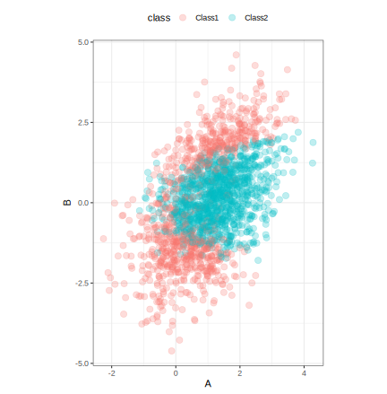
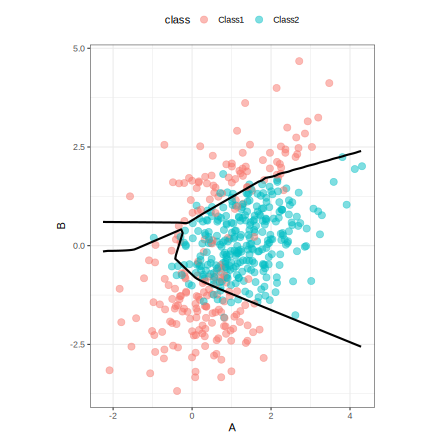

## Introduction

To use code in this article,  you will need to install the following packages: AppliedPredictiveModeling, brulee, and tidymodels. You will also need the python torch library installed (see `?torch::install_torch()`).

We can create classification models with the tidymodels package [parsnip](https://parsnip.tidymodels.org/) to predict categorical quantities or class labels. Here, let's fit a single classification model using a neural network and evaluate using a validation set. While the [tune](https://tune.tidymodels.org/) package has functionality to also do this, the parsnip package is the center of attention in this article so that we can better understand its usage. 

## Fitting a neural network


Let's fit a model to a small, two predictor classification data set. The data are in the modeldata package (part of tidymodels) and have been split into training, validation, and test data sets. In this analysis, the test set is left untouched; this article tries to emulate a good data usage methodology where the test set would only be evaluated once at the end after a variety of models have been considered. 


::: {.cell layout-align="center"}

```{.r .cell-code}
library(AppliedPredictiveModeling)

set.seed(321)
cls_train <- quadBoundaryFunc(2000) %>% select(A = X1, B = X2, class)
cls_val   <- quadBoundaryFunc( 500) %>% select(A = X1, B = X2, class)
cls_test  <- quadBoundaryFunc( 500) %>% select(A = X1, B = X2, class)
```
:::


A plot of the data shows two right-skewed predictors: 


::: {.cell layout-align="center"}

```{.r .cell-code}
ggplot(cls_train, aes(x = A, y = B, col = class)) + 
  geom_point(alpha = 1 / 4, cex = 3) + 
  coord_fixed()
```

::: {.cell-output-display}
{fig-align='center' width=576}
:::
:::


Let's use a single hidden layer neural network to predict the outcome. To do this, we transform the predictor columns to be more symmetric (via the `step_BoxCox()` function) and on a common scale (using `step_normalize()`). We can use [recipes](https://recipes.tidymodels.org/) to do so:


::: {.cell layout-align="center"}

```{.r .cell-code}
biv_rec <- 
  recipe(class ~ ., data = cls_train) %>%
  step_normalize(all_predictors())
```
:::


This recipe is not directly executed; the steps will be estimated when the model is fit. 

We can use the brulee package to fit a model with 10 hidden units and a 10% dropout rate, to regularize the model:


::: {.cell layout-align="center"}

```{.r .cell-code}
nnet_spec <- 
  mlp(epochs = 1000, hidden_units = 10, penalty = 0.01, learn_rate = 0.1) %>% 
  set_engine("brulee", validation = 0) %>% 
  set_mode("classification")

nnet_wflow <- 
  biv_rec %>% 
  workflow(nnet_spec)

set.seed(987)
nnet_fit <- fit(nnet_wflow, cls_train)
#> Warning: Current loss in NaN. Training wil be stopped.
nnet_fit %>% extract_fit_engine()
#> Multilayer perceptron
#> 
#> relu activation
#> 10 hidden units,  52 model parameters
#> 2,000 samples, 2 features, 2 classes 
#> class weights Class1=1, Class2=1 
#> weight decay: 0.01 
#> dropout proportion: 0 
#> batch size: 2000 
#> learn rate: 0.1 
#> training set loss after 8 epochs: 0.372
```
:::


## Model performance

In parsnip, the `predict()` function can be used to characterize performance on the validation set. Since parsnip always produces tibble outputs, these can just be column bound to the original data: 


::: {.cell layout-align="center"}

```{.r .cell-code}
val_results <- 
  cls_val %>%
  bind_cols(
    predict(nnet_fit, new_data = cls_val),
    predict(nnet_fit, new_data = cls_val, type = "prob")
  )
val_results %>% slice(1:5)
#>           A           B  class .pred_class .pred_Class1 .pred_Class2
#> 1 0.7632082 -0.04012164 Class2      Class2   0.06046339   0.93953657
#> 2 0.9823745 -0.16911637 Class2      Class2   0.05948573   0.94051421
#> 3 1.0558147  0.52817699 Class2      Class2   0.08121140   0.91878861
#> 4 1.2424507  1.10902951 Class2      Class2   0.32322136   0.67677867
#> 5 1.5889815  2.71047720 Class1      Class1   0.98467678   0.01532322

val_results %>% roc_auc(truth = class, .pred_Class1)
#> # A tibble: 1 × 3
#>   .metric .estimator .estimate
#>   <chr>   <chr>          <dbl>
#> 1 roc_auc binary         0.958

val_results %>% accuracy(truth = class, .pred_class)
#> # A tibble: 1 × 3
#>   .metric  .estimator .estimate
#>   <chr>    <chr>          <dbl>
#> 1 accuracy binary         0.906

val_results %>% conf_mat(truth = class, .pred_class)
#>           Truth
#> Prediction Class1 Class2
#>     Class1    172     17
#>     Class2     30    281
```
:::


Let's also create a grid to get a visual sense of the class boundary for the test set.


::: {.cell layout-align="center"}

```{.r .cell-code}
a_rng <- range(cls_train$A)
b_rng <- range(cls_train$B)
x_grid <-
  expand.grid(A = seq(a_rng[1], a_rng[2], length.out = 100),
              B = seq(b_rng[1], b_rng[2], length.out = 100))


# Make predictions using the transformed predictors but 
# attach them to the predictors in the original units: 
x_grid <- 
  x_grid %>% 
  bind_cols(predict(nnet_fit, x_grid, type = "prob"))

ggplot(x_grid, aes(x = A, y = B)) + 
  geom_point(data = cls_test, aes(col = class), alpha = 1 / 2, cex = 3) +
  geom_contour(aes(z = .pred_Class1), breaks = .5, col = "black", linewidth = 1) + 
  coord_fixed()
```

::: {.cell-output-display}
{fig-align='center' width=576}
:::
:::


## Session information {#session-info}


::: {.cell layout-align="center"}

```
#> ─ Session info ─────────────────────────────────────────────────────
#>  setting  value
#>  version  R version 4.4.0 (2024-04-24)
#>  os       macOS Sonoma 14.4.1
#>  system   aarch64, darwin20
#>  ui       X11
#>  language (EN)
#>  collate  en_US.UTF-8
#>  ctype    en_US.UTF-8
#>  tz       America/Los_Angeles
#>  date     2024-06-26
#>  pandoc   3.1.1 @ /Applications/RStudio.app/Contents/Resources/app/quarto/bin/tools/ (via rmarkdown)
#> 
#> ─ Packages ─────────────────────────────────────────────────────────
#>  package                   * version date (UTC) lib source
#>  AppliedPredictiveModeling * 1.1-7   2018-05-22 [1] CRAN (R 4.4.0)
#>  broom                     * 1.0.6   2024-05-17 [1] CRAN (R 4.4.0)
#>  brulee                      0.3.0   2024-02-14 [1] CRAN (R 4.4.0)
#>  dials                     * 1.2.1   2024-02-22 [1] CRAN (R 4.4.0)
#>  dplyr                     * 1.1.4   2023-11-17 [1] CRAN (R 4.4.0)
#>  ggplot2                   * 3.5.1   2024-04-23 [1] CRAN (R 4.4.0)
#>  infer                     * 1.0.7   2024-03-25 [1] CRAN (R 4.4.0)
#>  parsnip                   * 1.2.1   2024-03-22 [1] CRAN (R 4.4.0)
#>  purrr                     * 1.0.2   2023-08-10 [1] CRAN (R 4.4.0)
#>  recipes                   * 1.0.10  2024-02-18 [1] CRAN (R 4.4.0)
#>  rlang                       1.1.4   2024-06-04 [1] CRAN (R 4.4.0)
#>  rsample                   * 1.2.1   2024-03-25 [1] CRAN (R 4.4.0)
#>  tibble                    * 3.2.1   2023-03-20 [1] CRAN (R 4.4.0)
#>  tidymodels                * 1.2.0   2024-03-25 [1] CRAN (R 4.4.0)
#>  tune                      * 1.2.1   2024-04-18 [1] CRAN (R 4.4.0)
#>  workflows                 * 1.1.4   2024-02-19 [1] CRAN (R 4.4.0)
#>  yardstick                 * 1.3.1   2024-03-21 [1] CRAN (R 4.4.0)
#> 
#>  [1] /Library/Frameworks/R.framework/Versions/4.4-arm64/Resources/library
#> 
#> ────────────────────────────────────────────────────────────────────
```
:::
