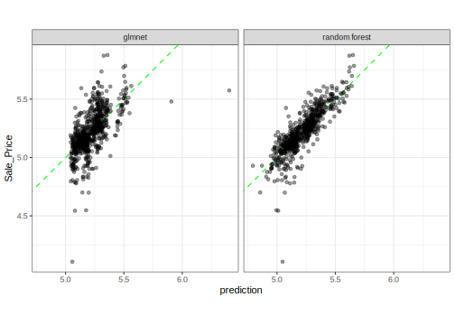

## Introduction

To use code in this article,  you will need to install the following packages: glmnet, randomForest, ranger, and tidymodels.

We can create regression models with the tidymodels package [parsnip](https://parsnip.tidymodels.org/) to predict continuous or numeric quantities. Here, let's first fit a random forest model, which does _not_ require all numeric input (see discussion [here](https://bookdown.org/max/FES/categorical-trees.html)) and discuss how to use `fit()` and `fit_xy()`, as well as _data descriptors_. 

Second, let's fit a regularized linear regression model to demonstrate how to move between different types of models using parsnip. 

## The Ames housing data

We'll use the Ames housing data set to demonstrate how to create regression models using parsnip. First, set up the data set and create a simple training/test set split:


::: {.cell layout-align="center" hash='cache/ames-split_18b5bf0134171b332b56ced5fc3b1911'}

```{.r .cell-code}
library(tidymodels)

data(ames)

set.seed(4595)
data_split <- initial_split(ames, strata = "Sale_Price", prop = 0.75)

ames_train <- training(data_split)
ames_test  <- testing(data_split)
```
:::


The use of the test set here is _only for illustration_; normally in a data analysis these data would be saved to the very end after many models have been evaluated. 

## Random forest

We'll start by fitting a random forest model to a small set of parameters. Let's create a model with the predictors `Longitude`, `Latitude`, `Lot_Area`, `Neighborhood`, and `Year_Sold`. A simple random forest model can be specified via:


::: {.cell layout-align="center" hash='cache/rf-basic_02332292464935db3e80ae3984b88bfe'}

```{.r .cell-code}
rf_defaults <- rand_forest(mode = "regression")
rf_defaults
#> Random Forest Model Specification (regression)
#> 
#> Computational engine: ranger
```
:::


The model will be fit with the ranger package by default. Since we didn't add any extra arguments to `fit`, _many_ of the arguments will be set to their defaults from the function  `ranger::ranger()`. The help pages for the model function describe the default parameters and you can also use the `translate()` function to check out such details. 

The parsnip package provides two different interfaces to fit a model: 

- the formula interface (`fit()`), and
- the non-formula interface (`fit_xy()`).

Let's start with the non-formula interface:


::: {.cell layout-align="center" hash='cache/rf-basic-xy_b14276d12ae7cf9ce85ecf44ee6a9bb4'}

```{.r .cell-code}
preds <- c("Longitude", "Latitude", "Lot_Area", "Neighborhood", "Year_Sold")

rf_xy_fit <- 
  rf_defaults %>%
  set_engine("ranger") %>%
  fit_xy(
    x = ames_train[, preds],
    y = log10(ames_train$Sale_Price)
  )

rf_xy_fit
#> parsnip model object
#> 
#> Ranger result
#> 
#> Call:
#>  ranger::ranger(x = maybe_data_frame(x), y = y, num.threads = 1,      verbose = FALSE, seed = sample.int(10^5, 1)) 
#> 
#> Type:                             Regression 
#> Number of trees:                  500 
#> Sample size:                      2197 
#> Number of independent variables:  5 
#> Mtry:                             2 
#> Target node size:                 5 
#> Variable importance mode:         none 
#> Splitrule:                        variance 
#> OOB prediction error (MSE):       0.008500188 
#> R squared (OOB):                  0.7239116
```
:::


The non-formula interface doesn't do anything to the predictors before passing them to the underlying model function. This particular model does _not_ require indicator variables (sometimes called "dummy variables") to be created prior to fitting the model. Note that the output shows "Number of independent variables:  5".

For regression models, we can use the basic `predict()` method, which returns a tibble with a column named `.pred`:


::: {.cell layout-align="center" hash='cache/rf-basic-xy-pred_6e4354a6451e46bc8faa718908d9a912'}

```{.r .cell-code}
test_results <- 
  ames_test %>%
  select(Sale_Price) %>%
  mutate(Sale_Price = log10(Sale_Price)) %>%
  bind_cols(
    predict(rf_xy_fit, new_data = ames_test[, preds])
  )
test_results %>% slice(1:5)
#> # A tibble: 5 × 2
#>   Sale_Price .pred
#>        <dbl> <dbl>
#> 1       5.39  5.25
#> 2       5.28  5.29
#> 3       5.23  5.26
#> 4       5.21  5.30
#> 5       5.60  5.51

# summarize performance
test_results %>% metrics(truth = Sale_Price, estimate = .pred) 
#> # A tibble: 3 × 3
#>   .metric .estimator .estimate
#>   <chr>   <chr>          <dbl>
#> 1 rmse    standard      0.0945
#> 2 rsq     standard      0.733 
#> 3 mae     standard      0.0629
```
:::


Note that: 

 * If the model required indicator variables, we would have to create them manually prior to using `fit()` (perhaps using the recipes package).
 * We had to manually log the outcome prior to modeling. 

Now, for illustration, let's use the formula method using some new parameter values:


::: {.cell layout-align="center" hash='cache/rf-basic-form_1e1aadae8c7bde9360f11e8062781218'}

```{.r .cell-code}
rand_forest(mode = "regression", mtry = 3, trees = 1000) %>%
  set_engine("ranger") %>%
  fit(
    log10(Sale_Price) ~ Longitude + Latitude + Lot_Area + Neighborhood + Year_Sold,
    data = ames_train
  )
#> parsnip model object
#> 
#> Ranger result
#> 
#> Call:
#>  ranger::ranger(x = maybe_data_frame(x), y = y, mtry = min_cols(~3,      x), num.trees = ~1000, num.threads = 1, verbose = FALSE,      seed = sample.int(10^5, 1)) 
#> 
#> Type:                             Regression 
#> Number of trees:                  1000 
#> Sample size:                      2197 
#> Number of independent variables:  5 
#> Mtry:                             3 
#> Target node size:                 5 
#> Variable importance mode:         none 
#> Splitrule:                        variance 
#> OOB prediction error (MSE):       0.008402569 
#> R squared (OOB):                  0.7270823
```
:::

 
Suppose that we would like to use the randomForest package instead of ranger. To do so, the only part of the syntax that needs to change is the `set_engine()` argument:


::: {.cell layout-align="center" hash='cache/rf-rf_7f5cc80f129451dce218438d3e2b5856'}

```{.r .cell-code}
rand_forest(mode = "regression", mtry = 3, trees = 1000) %>%
  set_engine("randomForest") %>%
  fit(
    log10(Sale_Price) ~ Longitude + Latitude + Lot_Area + Neighborhood + Year_Sold,
    data = ames_train
  )
#> parsnip model object
#> 
#> 
#> Call:
#>  randomForest(x = maybe_data_frame(x), y = y, ntree = ~1000, mtry = min_cols(~3,      x)) 
#>                Type of random forest: regression
#>                      Number of trees: 1000
#> No. of variables tried at each split: 3
#> 
#>           Mean of squared residuals: 0.008472074
#>                     % Var explained: 72.47
```
:::


Look at the formula code that was printed out; one function uses the argument name `ntree` and the other uses `num.trees`. The parsnip models don't require you to know the specific names of the main arguments. 

Now suppose that we want to modify the value of `mtry` based on the number of predictors in the data. Usually, a good default value is `floor(sqrt(num_predictors))` but a pure bagging model requires an `mtry` value equal to the total number of parameters. There may be cases where you may not know how many predictors are going to be present when the model will be fit (perhaps due to the generation of indicator variables or a variable filter) so this might be difficult to know exactly ahead of time when you write your code. 

When the model it being fit by parsnip, [_data descriptors_](https://parsnip.tidymodels.org/reference/descriptors.html) are made available. These attempt to let you know what you will have available when the model is fit. When a model object is created (say using `rand_forest()`), the values of the arguments that you give it are _immediately evaluated_ unless you delay them. To delay the evaluation of any argument, you can used `rlang::expr()` to make an expression. 

Two relevant data descriptors for our example model are:

 * `.preds()`: the number of predictor _variables_ in the data set that are associated with the predictors **prior to dummy variable creation**.
 * `.cols()`: the number of predictor _columns_ after dummy variables (or other encodings) are created.

Since ranger won't create indicator values, `.preds()` would be appropriate for `mtry` for a bagging model. 

For example, let's use an expression with the `.preds()` descriptor to fit a bagging model: 


::: {.cell layout-align="center" hash='cache/bagged_2b76f70b641acbdb2616b84443585217'}

```{.r .cell-code}
rand_forest(mode = "regression", mtry = .preds(), trees = 1000) %>%
  set_engine("ranger") %>%
  fit(
    log10(Sale_Price) ~ Longitude + Latitude + Lot_Area + Neighborhood + Year_Sold,
    data = ames_train
  )
#> parsnip model object
#> 
#> Ranger result
#> 
#> Call:
#>  ranger::ranger(x = maybe_data_frame(x), y = y, mtry = min_cols(~.preds(),      x), num.trees = ~1000, num.threads = 1, verbose = FALSE,      seed = sample.int(10^5, 1)) 
#> 
#> Type:                             Regression 
#> Number of trees:                  1000 
#> Sample size:                      2197 
#> Number of independent variables:  5 
#> Mtry:                             5 
#> Target node size:                 5 
#> Variable importance mode:         none 
#> Splitrule:                        variance 
#> OOB prediction error (MSE):       0.00867085 
#> R squared (OOB):                  0.7183685
```
:::


## Regularized regression

A linear model might work for this data set as well. We can use the `linear_reg()` parsnip model. There are two engines that can perform regularization/penalization, the glmnet and sparklyr packages. Let's use the former here. The glmnet package only implements a non-formula method, but parsnip will allow either one to be used. 

When regularization is used, the predictors should first be centered and scaled before being passed to the model. The formula method won't do that automatically so we will need to do this ourselves. We'll use the [recipes](https://recipes.tidymodels.org/) package for these steps. 


::: {.cell layout-align="center" hash='cache/glmn-form_a0ca81e5cfdf6601081373c7b271e499'}

```{.r .cell-code}
norm_recipe <- 
  recipe(
    Sale_Price ~ Longitude + Latitude + Lot_Area + Neighborhood + Year_Sold, 
    data = ames_train
  ) %>%
  step_other(Neighborhood) %>% 
  step_dummy(all_nominal()) %>%
  step_center(all_predictors()) %>%
  step_scale(all_predictors()) %>%
  step_log(Sale_Price, base = 10) %>% 
  # estimate the means and standard deviations
  prep(training = ames_train, retain = TRUE)

# Now let's fit the model using the processed version of the data

glmn_fit <- 
  linear_reg(penalty = 0.001, mixture = 0.5) %>% 
  set_engine("glmnet") %>%
  fit(Sale_Price ~ ., data = bake(norm_recipe, new_data = NULL))
glmn_fit
#> parsnip model object
#> 
#> 
#> Call:  glmnet::glmnet(x = maybe_matrix(x), y = y, family = "gaussian",      alpha = ~0.5) 
#> 
#>    Df  %Dev   Lambda
#> 1   0  0.00 0.138300
#> 2   1  1.96 0.126000
#> 3   1  3.72 0.114800
#> 4   1  5.28 0.104600
#> 5   2  7.07 0.095320
#> 6   3  9.64 0.086850
#> 7   4 12.58 0.079140
#> 8   5 15.45 0.072110
#> 9   5 17.93 0.065700
#> 10  7 20.81 0.059860
#> 11  7 23.51 0.054550
#> 12  7 25.82 0.049700
#> 13  8 28.20 0.045290
#> 14  8 30.31 0.041260
#> 15  8 32.12 0.037600
#> 16  8 33.66 0.034260
#> 17  8 34.97 0.031210
#> 18  8 36.08 0.028440
#> 19  8 37.02 0.025910
#> 20  9 37.90 0.023610
#> 21  9 38.65 0.021510
#> 22  9 39.29 0.019600
#> 23  9 39.83 0.017860
#> 24  9 40.28 0.016270
#> 25 10 40.68 0.014830
#> 26 11 41.06 0.013510
#> 27 11 41.38 0.012310
#> 28 11 41.65 0.011220
#> 29 11 41.88 0.010220
#> 30 12 42.09 0.009313
#> 31 12 42.27 0.008486
#> 32 12 42.43 0.007732
#> 33 12 42.56 0.007045
#> 34 12 42.66 0.006419
#> 35 12 42.75 0.005849
#> 36 12 42.83 0.005329
#> 37 12 42.90 0.004856
#> 38 12 42.95 0.004424
#> 39 12 42.99 0.004031
#> 40 12 43.03 0.003673
#> 41 12 43.06 0.003347
#> 42 12 43.09 0.003050
#> 43 12 43.11 0.002779
#> 44 12 43.13 0.002532
#> 45 12 43.15 0.002307
#> 46 12 43.16 0.002102
#> 47 12 43.17 0.001915
#> 48 12 43.18 0.001745
#> 49 12 43.19 0.001590
#> 50 12 43.19 0.001449
#> 51 12 43.20 0.001320
#> 52 12 43.20 0.001203
#> 53 12 43.21 0.001096
#> 54 12 43.21 0.000999
#> 55 12 43.21 0.000910
#> 56 12 43.21 0.000829
#> 57 12 43.22 0.000755
#> 58 12 43.22 0.000688
#> 59 12 43.22 0.000627
#> 60 12 43.22 0.000571
#> 61 12 43.22 0.000521
#> 62 12 43.22 0.000474
#> 63 12 43.22 0.000432
#> 64 12 43.22 0.000394
#> 65 12 43.22 0.000359
```
:::


If `penalty` were not specified, all of the `lambda` values would be computed. 

To get the predictions for this specific value of `lambda` (aka `penalty`):


::: {.cell layout-align="center" hash='cache/glmn-pred_673611c19e448251aeb977fec5788162'}

```{.r .cell-code}
# First, get the processed version of the test set predictors:
test_normalized <- bake(norm_recipe, new_data = ames_test, all_predictors())

test_results <- 
  test_results %>%
  rename(`random forest` = .pred) %>%
  bind_cols(
    predict(glmn_fit, new_data = test_normalized) %>%
      rename(glmnet = .pred)
  )
test_results
#> # A tibble: 733 × 3
#>    Sale_Price `random forest` glmnet
#>         <dbl>           <dbl>  <dbl>
#>  1       5.39            5.25   5.16
#>  2       5.28            5.29   5.27
#>  3       5.23            5.26   5.24
#>  4       5.21            5.30   5.24
#>  5       5.60            5.51   5.24
#>  6       5.32            5.29   5.26
#>  7       5.17            5.14   5.18
#>  8       5.06            5.13   5.17
#>  9       4.98            5.01   5.18
#> 10       5.11            5.14   5.19
#> # ℹ 723 more rows

test_results %>% metrics(truth = Sale_Price, estimate = glmnet) 
#> # A tibble: 3 × 3
#>   .metric .estimator .estimate
#>   <chr>   <chr>          <dbl>
#> 1 rmse    standard      0.142 
#> 2 rsq     standard      0.391 
#> 3 mae     standard      0.0979

test_results %>% 
  gather(model, prediction, -Sale_Price) %>% 
  ggplot(aes(x = prediction, y = Sale_Price)) + 
  geom_abline(col = "green", lty = 2) + 
  geom_point(alpha = .4) + 
  facet_wrap(~model) + 
  coord_fixed()
```

::: {.cell-output-display}
{fig-align='center' width=672}
:::
:::


This final plot compares the performance of the random forest and regularized regression models.

## Session information {#session-info}


::: {.cell layout-align="center" hash='cache/si_43a75b68dcc94565ba13180d7ad26a69'}

```
#> ─ Session info ─────────────────────────────────────────────────────
#>  setting  value
#>  version  R version 4.3.0 (2023-04-21)
#>  os       macOS Ventura 13.4
#>  system   aarch64, darwin20
#>  ui       X11
#>  language (EN)
#>  collate  en_US.UTF-8
#>  ctype    en_US.UTF-8
#>  tz       America/Los_Angeles
#>  date     2023-07-02
#>  pandoc   3.1.1 @ /Applications/RStudio.app/Contents/Resources/app/quarto/bin/tools/ (via rmarkdown)
#> 
#> ─ Packages ─────────────────────────────────────────────────────────
#>  package      * version date (UTC) lib source
#>  broom        * 1.0.4   2023-03-11 [1] CRAN (R 4.3.0)
#>  dials        * 1.2.0   2023-04-03 [1] CRAN (R 4.3.0)
#>  dplyr        * 1.1.2   2023-04-20 [1] CRAN (R 4.3.0)
#>  ggplot2      * 3.4.2   2023-04-03 [1] CRAN (R 4.3.0)
#>  glmnet       * 4.1-7   2023-03-23 [1] CRAN (R 4.3.0)
#>  infer        * 1.0.4   2022-12-02 [1] CRAN (R 4.3.0)
#>  parsnip      * 1.1.0   2023-04-12 [1] CRAN (R 4.3.0)
#>  purrr        * 1.0.1   2023-01-10 [1] CRAN (R 4.3.0)
#>  randomForest * 4.7-1.1 2022-05-23 [1] CRAN (R 4.3.0)
#>  ranger       * 0.15.1  2023-04-03 [1] CRAN (R 4.3.0)
#>  recipes      * 1.0.6   2023-04-25 [1] CRAN (R 4.3.0)
#>  rlang          1.1.1   2023-04-28 [1] CRAN (R 4.3.0)
#>  rsample      * 1.1.1   2022-12-07 [1] CRAN (R 4.3.0)
#>  tibble       * 3.2.1   2023-03-20 [1] CRAN (R 4.3.0)
#>  tidymodels   * 1.1.0   2023-05-01 [1] CRAN (R 4.3.0)
#>  tune         * 1.1.1   2023-04-11 [1] CRAN (R 4.3.0)
#>  workflows    * 1.1.3   2023-02-22 [1] CRAN (R 4.3.0)
#>  yardstick    * 1.2.0   2023-04-21 [1] CRAN (R 4.3.0)
#> 
#>  [1] /Users/emilhvitfeldt/Library/R/arm64/4.3/library
#>  [2] /Library/Frameworks/R.framework/Versions/4.3-arm64/Resources/library
#> 
#> ────────────────────────────────────────────────────────────────────
```
:::
