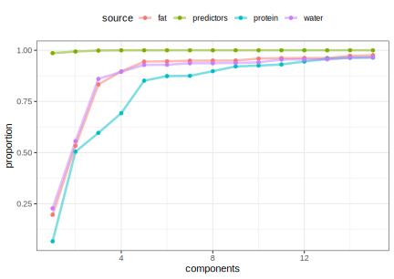

## Introduction

To use code in this article,  you will need to install the following packages: modeldata, pls, and tidymodels.

"Multivariate analysis" usually refers to multiple _outcomes_ being modeled, analyzed, and/or predicted. There are multivariate versions of many common statistical tools. For example, suppose there was a data set with columns `y1` and `y2` representing two outcomes to be predicted. The `lm()` function would look something like:

::: {.cell layout-align="center"}

```{.r .cell-code}
lm(cbind(y1, y2) ~ ., data = dat)
```
:::

This `cbind()` call is pretty awkward and is a consequence of how the traditional formula infrastructure works. The recipes package is a lot easier to work with! This article demonstrates how to model multiple outcomes.   

The data that we'll use has three outcomes. From `?modeldata::meats`:

> "These data are recorded on a Tecator Infratec Food and Feed Analyzer working in the wavelength range 850 - 1050 nm by the Near Infrared Transmission (NIT) principle. Each sample contains finely chopped pure meat with different moisture, fat and protein contents.

> "For each meat sample the data consists of a 100 channel spectrum of absorbances and the contents of moisture (water), fat and protein. The absorbance is `-log10` of the transmittance measured by the spectrometer. The three contents, measured in percent, are determined by analytic chemistry."

The goal is to predict the proportion of the three substances using the chemistry test. There can often be a high degree of between-variable correlations in predictors, and that is certainly the case here. 

To start, let's take the two data matrices (called `endpoints` and `absorp`) and bind them together in a data frame:

::: {.cell layout-align="center"}

```{.r .cell-code}
library(modeldata)
data(meats)
```
:::

The three _outcomes_ have fairly high correlations also. 

## Preprocessing the data

If the outcomes can be predicted using a linear model, partial least squares (PLS) is an ideal method. PLS models the data as a function of a set of unobserved _latent_ variables that are derived in a manner similar to principal component analysis (PCA). 

PLS, unlike PCA, also incorporates the outcome data when creating the PLS components. Like PCA, it tries to maximize the variance of the predictors that are explained by the components but it also tries to simultaneously maximize the correlation between those components and the outcomes. In this way, PLS _chases_ variation of the predictors and outcomes. 

Since we are working with variances and covariances, we need to standardize the data. The recipe will center and scale all of the variables. 

Many base R functions that deal with multivariate outcomes using a formula require the use of `cbind()` on the left-hand side of the formula to work with the traditional formula methods. In tidymodels, recipes do not; the outcomes can be symbolically "added" together on the left-hand side:

::: {.cell layout-align="center"}

```{.r .cell-code}
norm_rec <- 
  recipe(water + fat + protein ~ ., data = meats) %>%
  step_normalize(everything()) 
```
:::

Before we can finalize the PLS model, the number of PLS components to retain must be determined. This can be done using performance metrics such as the root mean squared error. However, we can also calculate the proportion of variance explained by the components for the _predictors and each of the outcomes_. This allows an informed choice to be made based on the level of evidence that the situation requires. 

Since the data set isn't large, let's use resampling to measure these proportions. With ten repeats of 10-fold cross-validation, we build the PLS model on 90% of the data and evaluate on the heldout 10%. For each of the 100 models, we extract and save the proportions. 

The folds can be created using the [rsample](https://rsample.tidymodels.org/) package and the recipe can be estimated for each resample using the [`prepper()`](https://rsample.tidymodels.org/reference/prepper.html) function: 

::: {.cell layout-align="center"}

```{.r .cell-code}
set.seed(57343)
folds <- vfold_cv(meats, repeats = 10)

folds <- 
  folds %>%
  mutate(recipes = map(splits, prepper, recipe = norm_rec))
```
:::

## Partial least squares

The complicated parts for moving forward are:

1. Formatting the predictors and outcomes into the format that the pls package requires, and
2. Estimating the proportions. 

For the first part, the standardized outcomes and predictors need to be formatted into two separate matrices. Since we used `retain = TRUE` when prepping the recipes, we can `bake()` with `new_data = NULl` to get the processed data back out. To save the data as a matrix, the option `composition = "matrix"` will avoid saving the data as tibbles and use the required format. 

The pls package expects a simple formula to specify the model, but each side of the formula should _represent a matrix_. In other words, we need a data set with two columns where each column is a matrix. The secret to doing this is to "protect" the two matrices using `I()` when adding them to the data frame.

The calculation for the proportion of variance explained is straightforward for the predictors; the function `pls::explvar()` will compute that. For the outcomes, the process is more complicated. A ready-made function to compute these is not obvious but there is some code inside of the summary function to do the computation (see below). 

The function `get_var_explained()` shown here will do all these computations and return a data frame with columns `components`, `source` (for the predictors, water, etc), and the `proportion` of variance that is explained by the components. 

::: {.cell layout-align="center"}

```{.r .cell-code}
library(pls)

get_var_explained <- function(recipe, ...) {
  
  # Extract the predictors and outcomes into their own matrices
  y_mat <- bake(recipe, new_data = NULL, composition = "matrix", all_outcomes())
  x_mat <- bake(recipe, new_data = NULL, composition = "matrix", all_predictors())
  
  # The pls package prefers the data in a data frame where the outcome
  # and predictors are in _matrices_. To make sure this is formatted
  # properly, use the `I()` function to inhibit `data.frame()` from making
  # all the individual columns. `pls_format` should have two columns.
  pls_format <- data.frame(
    endpoints = I(y_mat),
    measurements = I(x_mat)
  )
  # Fit the model
  mod <- plsr(endpoints ~ measurements, data = pls_format)
  
  # Get the proportion of the predictor variance that is explained
  # by the model for different number of components. 
  xve <- explvar(mod)/100 

  # To do the same for the outcome, it is more complex. This code 
  # was extracted from pls:::summary.mvr. 
  explained <- 
    drop(pls::R2(mod, estimate = "train", intercept = FALSE)$val) %>% 
    # transpose so that components are in rows
    t() %>% 
    as_tibble() %>%
    # Add the predictor proportions
    mutate(predictors = cumsum(xve) %>% as.vector(),
           components = seq_along(xve)) %>%
    # Put into a tidy format that is tall
    pivot_longer(
      cols = c(-components),
      names_to = "source",
      values_to = "proportion"
    )
}
```
:::

We compute this data frame for each resample and save the results in the different columns. 

::: {.cell layout-align="center"}

```{.r .cell-code}
folds <- 
  folds %>%
  mutate(var = map(recipes, get_var_explained),
         var = unname(var))
```
:::

To extract and aggregate these data, simple row binding can be used to stack the data vertically. Most of the action happens in the first 15 components so let's filter the data and compute the _average_ proportion.

::: {.cell layout-align="center"}

```{.r .cell-code}
variance_data <- 
  bind_rows(folds[["var"]]) %>%
  filter(components <= 15) %>%
  group_by(components, source) %>%
  summarize(proportion = mean(proportion))
#> `summarise()` has regrouped the output.
#> ℹ Summaries were computed grouped by components and source.
#> ℹ Output is grouped by components.
#> ℹ Use `summarise(.groups = "drop_last")` to silence this message.
#> ℹ Use `summarise(.by = c(components, source))` for per-operation
#>   grouping (`?dplyr::dplyr_by`) instead.
```
:::

The plot below shows that, if the protein measurement is important, you might require 10 or so components to achieve a good representation of that outcome. Note that the predictor variance is captured extremely well using a single component. This is due to the high degree of correlation in those data. 

::: {.cell layout-align="center"}

```{.r .cell-code}
ggplot(variance_data, aes(x = components, y = proportion, col = source)) + 
  geom_line(alpha = 0.5, linewidth = 1.2) + 
  geom_point() 
```

::: {.cell-output-display}
{fig-align='center' width=100%}
:::
:::

## Session information {#session-info}

::: {.cell layout-align="center"}

```
#> ─ Session info ─────────────────────────────────────────────────────
#>  version  R version 4.5.2 (2025-10-31)
#>  language (EN)
#>  date     2026-04-22
#>  pandoc   3.8.3
#>  quarto   1.9.35
#> 
#> ─ Packages ─────────────────────────────────────────────────────────
#>  package      version date (UTC) source
#>  broom        1.0.12  2026-01-27 CRAN (R 4.5.2)
#>  dials        1.4.3   2026-04-11 CRAN (R 4.5.2)
#>  dplyr        1.2.1   2026-04-03 CRAN (R 4.5.2)
#>  ggplot2      4.0.2   2026-02-03 CRAN (R 4.5.2)
#>  infer        1.1.0   2025-12-18 CRAN (R 4.5.2)
#>  modeldata    1.5.1   2025-08-22 CRAN (R 4.5.0)
#>  parsnip      1.5.0   2026-04-09 CRAN (R 4.5.2)
#>  pls          2.9-0   2026-02-21 CRAN (R 4.5.2)
#>  purrr        1.2.2   2026-04-10 CRAN (R 4.5.2)
#>  recipes      1.3.2   2026-04-02 CRAN (R 4.5.2)
#>  rlang        1.2.0   2026-04-06 CRAN (R 4.5.2)
#>  rsample      1.3.2   2026-01-30 CRAN (R 4.5.2)
#>  tibble       3.3.1   2026-01-11 CRAN (R 4.5.2)
#>  tidymodels   1.4.1   2025-09-08 CRAN (R 4.5.0)
#>  tune         2.1.0   2026-04-17 CRAN (R 4.5.2)
#>  workflows    1.3.0   2025-08-27 CRAN (R 4.5.0)
#>  yardstick    1.4.0   2026-04-07 CRAN (R 4.5.2)
#> 
#> ────────────────────────────────────────────────────────────────────
```
:::

 
