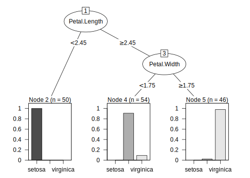
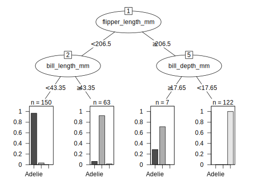
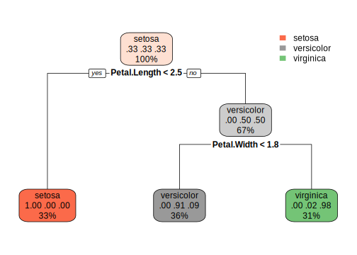
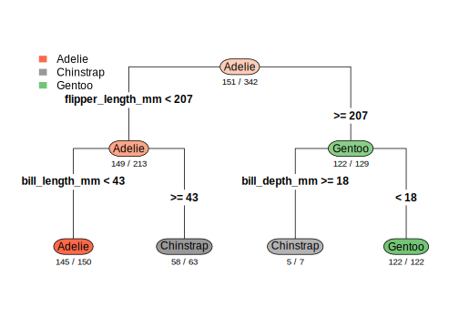
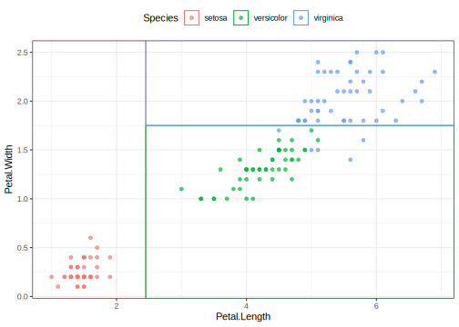
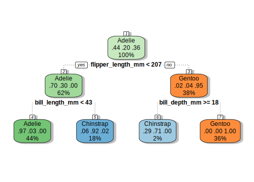
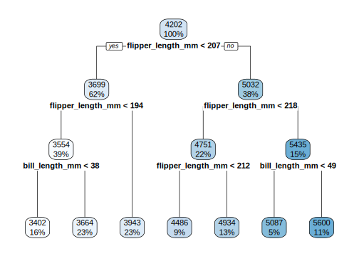

## Introduction
To use code in this article,  you will need to install the following packages: ggplot2, parttree, partykit, rattle, rpart, rpart.plot, sessioninfo, and tidymodels.

Decision trees are widely used because they are easy to interpret and can capture nonlinear relationships between predictors and outcomes. Once a tree model has been fit, visualization becomes an important step for understanding splits, predictions, and decision boundaries.

R has several different tools for plotting trees. Some produce simple base R graphics, while others focus on cleaner layouts or integration with ggplot2. This article walks through a few common approaches and highlights the strengths of each one.

Let's compare and discuss several common methods for visualizing decision trees in R:

  - [`plot.rpart()`](#base-r-visualization-with-plotrpart)
  - [`plot.party()`](#visualization-with-plotparty)
  - [`rpart.plot()`](#visualization-with-rpartplot)
  - [`geom_parttree()`](#visualization-with-geomparttree)
  - [`fancyRpartPlot()`](#visualization-with-fancyrpartplot)
  
We will fit a simple classification tree using the penguins data set from modeldata and compare visualization results.

## Fit a decision tree
We first fit a classification tree using rpart through tidymodels.

::: {.cell layout-align="center"}

```{.r .cell-code}
data(penguins)

penguins <- penguins |>
  select(species, bill_length_mm, bill_depth_mm,
         flipper_length_mm, body_mass_g) |>
  na.omit()

tree_fit <-
  decision_tree(cost_complexity = 0.01) |>
  set_engine("rpart") |>
  set_mode("classification") |>
  fit(species ~ ., data = penguins)

tree_fit
#> parsnip model object
#> 
#> n= 342 
#> 
#> node), split, n, loss, yval, (yprob)
#>       * denotes terminal node
#> 
#> 1) root 342 191 Adelie (0.441520468 0.198830409 0.359649123)  
#>   2) flipper_length_mm< 206.5 213  64 Adelie (0.699530516 0.295774648 0.004694836)  
#>     4) bill_length_mm< 43.35 150   5 Adelie (0.966666667 0.033333333 0.000000000) *
#>     5) bill_length_mm>=43.35 63   5 Chinstrap (0.063492063 0.920634921 0.015873016) *
#>   3) flipper_length_mm>=206.5 129   7 Gentoo (0.015503876 0.038759690 0.945736434)  
#>     6) bill_depth_mm>=17.65 7   2 Chinstrap (0.285714286 0.714285714 0.000000000) *
#>     7) bill_depth_mm< 17.65 122   0 Gentoo (0.000000000 0.000000000 1.000000000) *
```
:::

Several visualization packages work directly with the underlying rpart object, so we extract it here.

::: {.cell layout-align="center"}

```{.r .cell-code}
tree_obj <- extract_fit_engine(tree_fit)
```
:::

## Base R visualization with `plot.rpart()`
The default plotting functions in rpart provide a quick way to inspect the structure of a tree.

::: {.cell layout-align="center"}

```{.r .cell-code}
par(mar = c(2, 2, 2, 2))

plot(tree_obj, uniform = TRUE, margin = 0.1)
text(tree_obj, use.n = TRUE, cex = 0.8)
```

::: {.cell-output-display}
{fig-align='center' width=100%}
:::
:::

This approach is simple and lightweight, making it useful for quick exploration. However, the default styling is fairly minimal and can be hard to customize for presentations or publication-quality graphics.

## Visualization with `plot.party()`
The partykit package provides cleaner default tree visualizations and more flexible formatting options.

::: {.cell layout-align="center"}

```{.r .cell-code}
party_obj <- as.party(tree_obj)

plot(party_obj)
```

::: {.cell-output-display}
{fig-align='center' width=672}
:::
:::

Compared to the base rpart plot, the layout is often easier to read and the node labels are displayed more clearly. This makes partykit a good option when readability is important.

partykit automatically includes more information inside the terminal nodes. For example, each terminal node shows the predicted class along with the distribution of observations within that node.

The appearance of the plot can also be adjusted with additional plotting arguments.

::: {.cell layout-align="center"}

```{.r .cell-code}
plot(
  party_obj,
  ip_args = list(abbreviate = FALSE),
  tp_args = list(id = FALSE),
  ep_args = list(justmin = 15)
)
```

::: {.cell-output-display}
{fig-align='center' width=672}
:::
:::

In this example:

- `abbreviate = FALSE` prevents split labels from being shortened
- `id = FALSE` removes terminal node numbers for a cleaner display
- `ep_args = list(justmin = 15)` adds vertical spacing to split labels, easier to read when the split conditions are long.

These changes are subtle for this example, but they can become more useful when working with larger trees that contain longer labels or many terminal nodes.

## Visualization with `rpart.plot()`
The rpart.plot package is designed specifically for decision tree visualization and includes several built-in styling improvements.

::: {.cell layout-align="center"}

```{.r .cell-code}
rpart.plot(
  tree_obj,
  roundint = FALSE
)
```

::: {.cell-output-display}
{fig-align='center' width=672}
:::
:::

The appearance can also be customized with additional arguments.

::: {.cell layout-align="center"}

```{.r .cell-code}
rpart.plot(
  tree_obj,
  type = 4,
  extra = 2,
  under = TRUE,
  faclen = 0,
  roundint = FALSE
)
```

::: {.cell-output-display}
{fig-align='center' width=672}
:::
:::

This example shows a few ways to adjust the appearance of the tree.

- `type = 4` changes where the split labels are placed. Instead of being directly on the branches, the split conditions are displayed above them.
- `extra = 2` adds the predicted class label to each terminal node.
- `under = TRUE` places some of the node information underneath the node box rather than squeezing everything inside it.
- `faclen = 0` keeps class names from being shortened, so labels like `"versicolor"` remain fully visible.
- `roundint = FALSE` suppresses warnings that can appear when plotting tidymodels-based trees with `rpart.plot()`.

These options mostly affect how the tree is displayed and labeled. Different settings may be more useful depending on the complexity of the tree.

## Visualization with `geom_parttree()`
The parttree package focuses on visualizing decision boundaries rather than the tree structure itself. It integrates naturally with ggplot2.

::: {.cell layout-align="center"}

```{.r .cell-code}
penguins_parttree <-
  decision_tree(cost_complexity = 0.01) |>
  set_engine("rpart") |>
  set_mode("classification") |>
  fit(
    species ~ bill_length_mm + bill_depth_mm,
    data = penguins
  )

parttree_obj <- extract_fit_engine(penguins_parttree)

penguins |>
  ggplot(aes(bill_length_mm, bill_depth_mm, color = species)) +
  geom_point(alpha = 0.7) +
  geom_parttree(data = parttree_obj)
```

::: {.cell-output-display}
{fig-align='center' width=672}
:::
:::

In this plot, the background partitions represent the decision regions created by the tree model. Each region corresponds to the predicted class for observations that fall within that section of the predictor space.

Unlike the previous methods, this approach emphasizes how the model separates observations rather than the exact tree splits. This can make it easier to understand the overall behavior of the model, especially for low-dimensional data.

One limitation is that partition plots become harder to interpret as the number of predictors increases, since only a small number of variables can be displayed at once.

Because `geom_parttree()` only works with one or two predictors at a time, we fit a smaller tree for this example.

## Visualization with `fancyRpartPlot()`
The `fancyRpartPlot()` function from the rattle package creates a more stylized version of a decision tree, which looks pretty similar to the output from `rpart.plot`.

::: {.cell layout-align="center"}

```{.r .cell-code}
fancyRpartPlot(
  tree_obj,
  sub = ""
)
```

::: {.cell-output-display}
{fig-align='center' width=672}
:::
:::

The tree is read from top to bottom:

- The top node is called the **root node** and contains all observations in the data set.

- Each split asks a question about one predictor variable. For example, the first split asks whether `flipper_length_mm < 207`.

- Observations that satisfy the condition follow the left branch labeled `"yes"`, while observations that do not satisfy the condition follow the right branch labeled `"no"`.

- The nodes at the bottom of the tree are called **terminal nodes** or **leaf nodes**. These contain the final predicted class.

In each node:

- The large text at the top shows the predicted species
- The numbers below represent the class probabilities for `Adelie`, `Chinstrap`, and `Gentoo`
- The percentage at the bottom shows the proportion of observations that fall into that node

For example, the leftmost terminal node predicts `Adelie` with probability `0.97`, meaning most observations in that node belong to the `Adelie` species.

Compared to the default rpart plots, this style is much more visually distinct and easier to follow at a glance. The use of color also makes the predicted classes easier to identify. 

One limitation is that the styling can become crowded for larger trees with many nodes or long labels. However, for smaller and medium-sized trees, the additional formatting can improve readability.

## Regression tree example
Although this article has focused on classification trees, many visualization methods also support regression trees. In regression trees, terminal nodes display predicted numeric values instead of class labels or class probabilities. Below is an example using `rpart.plot()` to visualize a regression tree.

::: {.cell layout-align="center"}

```{.r .cell-code}
reg_fit <-
  decision_tree(cost_complexity = 0.01) |>
  set_engine("rpart") |>
  set_mode("regression") |>
  fit(body_mass_g ~ bill_length_mm + flipper_length_mm,
      data = penguins)

reg_tree <- extract_fit_engine(reg_fit)

rpart.plot(
  reg_tree,
  roundint = FALSE
)
```

::: {.cell-output-display}
{fig-align='center' width=672}
:::
:::

In this regression tree, the numbers inside the nodes represent the predicted body mass in grams. For example, the top node predicts an average body mass of about `4202` grams across all penguins.

The first split separates penguins based on whether `flipper_length_mm < 207`. Penguins with shorter flippers move to the left side of the tree and tend to have lower predicted body mass values, while penguins with longer flippers move to the right side and tend to have higher predicted body mass values.

The percentages below each node show the proportion of observations in that node. The terminal nodes at the bottom contain the final predicted body mass values.

## Comparing visualization methods
Each visualization approach emphasizes different aspects of the model.

| Function | Package | Strength | Regression Trees |
|---|---|---|---|
| `plot.rpart()` | rpart | Fast and simple, useful for a quick check | Yes |
| `plot.party()` | partykit | Cleaner layouts and improved readability | Yes |
| `rpart.plot()` | rpart.plot | Readable and detailed tree summaries | Yes |
| `geom_parttree()` | parttree | Decision boundary visualization for predictor space partitions | Limited |
| `fancyRpartPlot()` | rattle | More visually distinct and presentation-friendly tree diagrams | Yes |

## Session information {#session-info}

::: {.cell layout-align="center"}

```
#> ─ Session info ─────────────────────────────────────────────────────
#>  version  R version 4.5.1 (2025-06-13)
#>  language (EN)
#>  pandoc   3.4
#>  quarto   1.6.42
#> 
#> ─ Packages ─────────────────────────────────────────────────────────
#>  package       version date (UTC)
#>  broom         1.0.13  2026-05-14
#>  dials         1.4.3   2026-04-11
#>  dplyr         1.2.1   2026-04-03
#>  ggplot2       4.0.3   2026-04-22
#>  infer         1.1.0   2025-12-18
#>  parsnip       1.6.0   2026-05-14
#>  parttree      0.1.3   2026-03-31
#>  partykit      1.2-27  2026-03-13
#>  purrr         1.2.2   2026-04-10
#>  rattle        5.6.2   2026-02-08
#>  recipes       1.3.2   2026-04-02
#>  rlang         1.2.0   2026-04-06
#>  rpart         4.1.27  2026-03-27
#>  rpart.plot    3.1.4   2026-01-08
#>  rsample       1.3.2   2026-01-30
#>  sessioninfo   1.2.3   2025-02-05
#>  tibble        3.3.1   2026-01-11
#>  tidymodels    1.5.0   2026-04-23
#>  tune          2.1.0   2026-04-17
#>  workflows     1.3.0   2025-08-27
#>  yardstick     1.4.0   2026-04-07
#> 
#> ────────────────────────────────────────────────────────────────────
```
:::
