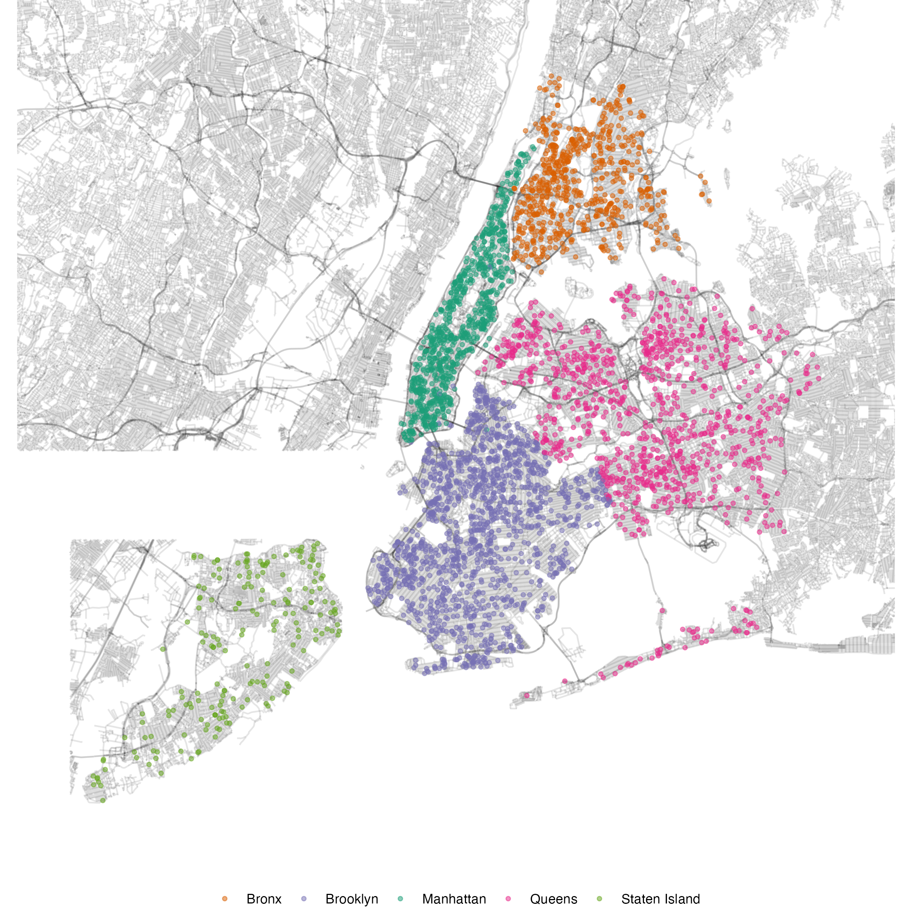

## Introduction

To use code in this article,  you will need to install the following packages: censored and tidymodels.

Survival analysis is a field of statistics and machine learning for analyzing the time to an event. While it has its roots in medical research, the event of interest can be anything from customer churn to machine failure. Methods from survival analysis take into account that some observations may not yet have experienced the event of interest and are thus censored. 

Here we want to predict the time it takes for a complaint to be dispositioned by the Department of Buildings in New York City. We are going to walk through a complete analysis from beginning to end, showing how to analyze time-to-event data.

Let's start with loading the censored package, the parnsip extension for survival analysis models.


::: {.cell layout-align="center"}

```{.r .cell-code}
library(censored)
#> Loading required package: survival
```
:::


## The buildings complaints data

The city of New York publishes data on the [complaints](https://data.cityofnewyork.us/Housing-Development/DOB-Complaints-Received/eabe-havv/about_data) received by the Department of Buildings. The data includes information on the type of complaint, the date it was entered in their records, the date it was dispositioned, and the location of the building the complaint was about. We are using a subset of the data, available in the modeldatatoo package.


::: {.cell layout-align="center"}

```{.r .cell-code}
data(building_complaints, package = "modeldatatoo")
glimpse(building_complaints)
#> Rows: 4,235
#> Columns: 11
#> $ days_to_disposition <dbl> 72, 1, 41, 45, 16, 62, 56, 11, 35, 38, 39, 106, 1,…
#> $ status              <chr> "ACTIVE", "ACTIVE", "ACTIVE", "ACTIVE", "ACTIVE", …
#> $ year_entered        <fct> 2023, 2023, 2023, 2023, 2023, 2023, 2023, 2023, 20…
#> $ latitude            <dbl> 40.66173, 40.57668, 40.73242, 40.68245, 40.63156, …
#> $ longitude           <dbl> -73.98297, -74.00453, -73.87630, -73.79367, -73.99…
#> $ borough             <fct> Brooklyn, Brooklyn, Queens, Queens, Brooklyn, Quee…
#> $ special_district    <fct> None, None, None, None, None, None, None, None, No…
#> $ unit                <fct> Q-L, Q-L, SPOPS, Q-L, BKLYN, Q-L, Q-L, SPOPS, Q-L,…
#> $ community_board     <fct> 307, 313, 404, 412, 312, 406, 306, 306, 409, 404, …
#> $ complaint_category  <fct> 45, 45, 49, 45, 31, 45, 45, 49, 45, 45, 45, 4A, 31…
#> $ complaint_priority  <fct> B, B, C, B, C, B, B, C, B, B, B, B, C, C, B, B, B,…
```
:::


Before we dive into survival analysis, let's get a impression of how the complaints are distributed across the city. We have complaints in all five boroughs, albeit with a somewhat lower density of complaints in Staten Island.


::: {.cell layout-align="center"}
::: {.cell-output-display}
{fig-align='center' fig-alt='A scatter plot of building complaint locations superimposed on a street map. Complaints are raised in all five boroughs.' width=100%}
:::
:::


In the dataset, we can see the `days_to_disposition` as well as the `status` of the complaint. For a complaint with status `"ACTIVE"`, the time to disposition is censored, meaning we do know that is has taken at least that long, but not how long it will have taken eventually. 

The standard form for time-to-event data are `Surv` objects which capture the time as well as the event status. As with all transformations of the response, it is advisable to do this before heading into the model fitting process with tidymodels.


::: {.cell layout-align="center"}

```{.r .cell-code}
building_complaints <- building_complaints %>% 
  mutate(
    disposition_surv = Surv(days_to_disposition, status == "CLOSED"), 
    .keep = "unused"
  )
```
:::


## Data splitting and resampling

For our resampling strategy, let's use a 3-way split into training, validation, and test set.


::: {.cell layout-align="center"}

```{.r .cell-code}
set.seed(403)
complaints_split <- initial_validation_split(building_complaints)
```
:::


First, let's pull out the training data and have a brief look at the response.


::: {.cell layout-align="center"}

```{.r .cell-code}
complaints_train <- training(complaints_split)

survfit(disposition_surv ~ 1, data = complaints_train) %>% plot()
```

::: {.cell-output-display}
{fig-align='center' fig-alt='A Kaplan-Meier curve dropping rapidly initially, then reaching about 10% survival rate at around 100 days, and finally trailing off until about 400 days.' width=672}
:::
:::


We can see that the majority of complaints is dispositioned relatively quickly, but some complaints are still active after 100 days.

## A first model

The censored package includes parametric, semi-parametric, and tree-based models for this type of analysis. To start, we are fitting a parametric survival model with the default of assuming a Weibull distribution on the time to disposition. We'll explore the more flexible models once we have a sense of how well this more restrictive model performs on this dataset.


::: {.cell layout-align="center"}

```{.r .cell-code}
spec_survreg <- survival_reg() %>% 
  set_engine("survival") %>% 
  set_mode("censored regression")
```
:::


We have several missing values in `complaint_priority` that we are turning into a separate category, `"unknown"`. We are also combining the less common categories for `community_board` and `unit` into an `"other"` category to reduce the number of levels in the predictors. The complaint category often does not tell us much more than the unit, with several complaint categories being handled by a specific unit only. This can lead to the model being unable to estimate some of the coefficients. Since our goal here is only to get a rough idea of how well the model performs, we are removing the complaint category for now.


::: {.cell layout-align="center"}

```{.r .cell-code}
rec_other <- recipe(disposition_surv ~ ., data = complaints_train) %>% 
  step_unknown(complaint_priority) %>% 
  step_rm(complaint_category) %>% 
  step_novel(community_board, unit) %>%
  step_other(community_board, unit, threshold = 0.02)
```
:::


We combine the recipe and the model into a workflow. This allows us to easily resample the model because all preprocessing steps are applied to the training set and the validation set for us.


::: {.cell layout-align="center"}

```{.r .cell-code}
wflow_survreg <- workflow() %>% 
  add_recipe(rec_other) %>% 
  add_model(spec_survreg)
```
:::


Let's access the resampling set from the initial split and fit the model. We are calculating several different performance metrics here: the Brier score, its integrated version, the area under the ROC curve, and the concordance index. Note that all of these are used in a version tailored to survival analysis. The concordance index uses the predicted event time to measure the model's ability to rank the observations correctly. The Brier score and the ROC curve use the predicted probability of survival at a given time point. We are evaluating these metrics every 30 days up to 300 days, as provided in the `eval_time` argument. The Brier score is a measure of the accuracy of the predicted probabilities while the ROC curve is a measure of the model's ability to discriminate between events and non-events at the given time point. Because these metrics are defined "at a given time point" they are also referred to as dynamic metrics. 

::: {.callout-tip}
For more information see the [Dynamic Performance Metrics for Event Time Data](../survival-metrics/) article.
:::


::: {.cell layout-align="center"}

```{.r .cell-code}
complaints_rset <- validation_set(complaints_split)

set.seed(1)
res_survreg <- fit_resamples(
  wflow_survreg,
  complaints_rset,
  metrics = metric_set(brier_survival_integrated, brier_survival, roc_auc_survival,
                       concordance_survival),
  eval_time = seq(0, 300, 30), 
  control = control_resamples(save_workflow = TRUE, save_pred = TRUE)
)
```
:::


So how do predictions from censored regression models look like?


::: {.cell layout-align="center"}

```{.r .cell-code}
preds <- collect_predictions(res_survreg)
preds
#> # A tibble: 847 × 6
#>    .pred             .pred_time id          .row disposition_surv .config       
#>    <list>                 <dbl> <chr>      <int>           <Surv> <chr>         
#>  1 <tibble [11 × 3]>       93.3 validation  2542              35+ Preprocessor1…
#>  2 <tibble [11 × 3]>       16.6 validation  2543             129+ Preprocessor1…
#>  3 <tibble [11 × 3]>       30.1 validation  2544               4+ Preprocessor1…
#>  4 <tibble [11 × 3]>       33.8 validation  2545               5+ Preprocessor1…
#>  5 <tibble [11 × 3]>       22.7 validation  2546               1+ Preprocessor1…
#>  6 <tibble [11 × 3]>       55.6 validation  2547              76+ Preprocessor1…
#>  7 <tibble [11 × 3]>       69.6 validation  2548              51+ Preprocessor1…
#>  8 <tibble [11 × 3]>       95.2 validation  2549              44+ Preprocessor1…
#>  9 <tibble [11 × 3]>       50.0 validation  2550              15+ Preprocessor1…
#> 10 <tibble [11 × 3]>       30.1 validation  2551              61+ Preprocessor1…
#> # ℹ 837 more rows
```
:::


The predicted survival time is in the `.pred_time` column and the predicted survival probabilities are in the `.pred` list column. 


::: {.cell layout-align="center"}

```{.r .cell-code}
preds$.pred[[6]]
#> # A tibble: 11 × 3
#>    .eval_time .pred_survival .weight_censored
#>         <dbl>          <dbl>            <dbl>
#>  1          0         1                  1   
#>  2         30         0.541              1.04
#>  3         60         0.345              1.18
#>  4         90         0.231             NA   
#>  5        120         0.159             NA   
#>  6        150         0.111             NA   
#>  7        180         0.0790            NA   
#>  8        210         0.0568            NA   
#>  9        240         0.0413            NA   
#> 10        270         0.0302            NA   
#> 11        300         0.0223            NA
```
:::


For each observation, `.pred` contains a tibble with the evaluation time `.eval_time` and the corresponding survival probability `.pred_survival`. The column `.weight_censored` contains the weights used in the calculation of the dynamic performance metrics. 

::: {.callout-tip}
For details on the weights see the [Accounting for Censoring in Performance Metrics for Event Time Data](../survival-metrics-details/) article.
:::

Of the metrics we calculated with these predictions, let's take a look at the AUC ROC first.


::: {.cell layout-align="center"}

```{.r .cell-code}
collect_metrics(res_survreg) %>% 
  filter(.metric == "roc_auc_survival")
#> # A tibble: 11 × 7
#>    .metric          .estimator .eval_time  mean     n std_err .config           
#>    <chr>            <chr>           <dbl> <dbl> <int>   <dbl> <chr>             
#>  1 roc_auc_survival standard            0 0.5       1      NA Preprocessor1_Mod…
#>  2 roc_auc_survival standard           30 0.823     1      NA Preprocessor1_Mod…
#>  3 roc_auc_survival standard           60 0.781     1      NA Preprocessor1_Mod…
#>  4 roc_auc_survival standard           90 0.766     1      NA Preprocessor1_Mod…
#>  5 roc_auc_survival standard          120 0.715     1      NA Preprocessor1_Mod…
#>  6 roc_auc_survival standard          150 0.736     1      NA Preprocessor1_Mod…
#>  7 roc_auc_survival standard          180 0.748     1      NA Preprocessor1_Mod…
#>  8 roc_auc_survival standard          210 0.814     1      NA Preprocessor1_Mod…
#>  9 roc_auc_survival standard          240 0.838     1      NA Preprocessor1_Mod…
#> 10 roc_auc_survival standard          270 0.803     1      NA Preprocessor1_Mod…
#> 11 roc_auc_survival standard          300 0.789     1      NA Preprocessor1_Mod…
```
:::


We can discriminate between events and non-events reasonably well, especially in the first 30 and 60 days. How about the probabilities that the categorization into event and non-event is based on? 


::: {.cell layout-align="center"}

```{.r .cell-code}
collect_metrics(res_survreg) %>% 
  filter(.metric %in% c("brier_survival_integrated", "brier_survival"))
#> # A tibble: 12 × 7
#>    .metric                   .estimator .eval_time    mean     n std_err .config
#>    <chr>                     <chr>           <dbl>   <dbl> <int>   <dbl> <chr>  
#>  1 brier_survival            standard            0 0           1      NA Prepro…
#>  2 brier_survival            standard           30 0.163       1      NA Prepro…
#>  3 brier_survival            standard           60 0.122       1      NA Prepro…
#>  4 brier_survival            standard           90 0.0722      1      NA Prepro…
#>  5 brier_survival            standard          120 0.0485      1      NA Prepro…
#>  6 brier_survival            standard          150 0.0292      1      NA Prepro…
#>  7 brier_survival            standard          180 0.0253      1      NA Prepro…
#>  8 brier_survival            standard          210 0.0213      1      NA Prepro…
#>  9 brier_survival            standard          240 0.0132      1      NA Prepro…
#> 10 brier_survival            standard          270 0.0107      1      NA Prepro…
#> 11 brier_survival            standard          300 0.00561     1      NA Prepro…
#> 12 brier_survival_integrated standard           NA 0.0508      1      NA Prepro…
```
:::


The accuracy of the predicted probabilities is generally good, albeit lowest for evaluation times of 30 and 60 days. The integrated Brier score is a measure of the overall accuracy of the predicted probabilities. 

Which metric to optimise for depends on whether separation or calibration is more important in the modeling problem at hand. We'll go with calibration here. Since we don't have a particular evaluation time that we want to predict well at, we are going to use the integrated Brier score as our main performance metric.

## Try out more models

Lumping factor levels together based on frequencies can lead to a loss of information so let's also try some different approaches. We can let a random forest model group the factor levels via the tree splits. Alternatively, we can turn the factors into dummy variables and use a regularized model to select relevant factor levels.

First, we are creating the recipes for these two approaches.


::: {.cell layout-align="center"}

```{.r .cell-code}
rec_unknown <- recipe(disposition_surv ~ ., data = complaints_train) %>% 
  step_unknown(complaint_priority) 

rec_dummies <- rec_unknown %>% 
  step_novel(all_nominal_predictors()) %>%
  step_dummy(all_nominal_predictors()) %>% 
  step_zv(all_predictors()) %>% 
  step_normalize(all_numeric_predictors())
```
:::


Next, we are creating the model specifications and tagging several hyperparameters for tuning. 
For the random forest, we are using the `"aorsf"` engine for accelerated oblique random survival forests. An oblique tree can split on linear combinations of the predictors, i.e., it provides more flexibility in the splits than a tree which splits on a single predictor.
For the regularized model, we are using the `"glmnet"` engine for a semi-parametric Cox proportional hazards model.


::: {.cell layout-align="center"}

```{.r .cell-code}
spec_oblique <- rand_forest(mtry = tune(), min_n = tune()) %>% 
  set_engine("aorsf") %>% 
  set_mode("censored regression")

wflow_oblique <- workflow() %>% 
  add_recipe(rec_unknown) %>% 
  add_model(spec_oblique)

spec_coxnet <- proportional_hazards(penalty = tune()) %>% 
  set_engine("glmnet") %>% 
  set_mode("censored regression")

wflow_coxnet <- workflow() %>% 
  add_recipe(rec_dummies) %>% 
  add_model(spec_coxnet)
```
:::


We can tune workflows with any of the `tune_*()` functions such as `tune_grid()` for grid search or `tune_bayes()` for Bayesian optimization. Here we are using grid search for simplicity.


::: {.cell layout-align="center"}

```{.r .cell-code}
set.seed(1)
res_oblique <- tune_grid(
  wflow_oblique,
  complaints_rset,
  grid = 10,
  metrics = metric_set(brier_survival_integrated, brier_survival, roc_auc_survival, concordance_survival),
  eval_time = seq(0, 300, 30), 
  control = control_grid(save_workflow = TRUE)
)
#> i Creating pre-processing data to finalize unknown parameter: mtry

set.seed(1)
res_coxnet <- tune_grid(
  wflow_coxnet,
  complaints_rset,
  grid = 10,
  metrics = metric_set(brier_survival_integrated, brier_survival, roc_auc_survival, concordance_survival),
  eval_time = seq(0, 300, 30), 
  control = control_grid(save_workflow = TRUE)
)
```
:::


So do any of these models perform better than the parametric survival model?


::: {.cell layout-align="center"}

```{.r .cell-code}
show_best(res_oblique, metric = "brier_survival_integrated", n = 5)
#> # A tibble: 5 × 9
#>    mtry min_n .metric         .estimator .eval_time   mean     n std_err .config
#>   <int> <int> <chr>           <chr>           <dbl>  <dbl> <int>   <dbl> <chr>  
#> 1     8    16 brier_survival… standard           NA 0.0462     1      NA Prepro…
#> 2     4     6 brier_survival… standard           NA 0.0463     1      NA Prepro…
#> 3     6    23 brier_survival… standard           NA 0.0465     1      NA Prepro…
#> 4     7    26 brier_survival… standard           NA 0.0465     1      NA Prepro…
#> 5     9    38 brier_survival… standard           NA 0.0466     1      NA Prepro…

show_best(res_coxnet, metric = "brier_survival_integrated", n = 5)
#> # A tibble: 5 × 8
#>         penalty .metric       .estimator .eval_time   mean     n std_err .config
#>           <dbl> <chr>         <chr>           <dbl>  <dbl> <int>   <dbl> <chr>  
#> 1 0.00750       brier_surviv… standard           NA 0.0482     1      NA Prepro…
#> 2 0.000000262   brier_surviv… standard           NA 0.0487     1      NA Prepro…
#> 3 0.0000000591  brier_surviv… standard           NA 0.0487     1      NA Prepro…
#> 4 0.00000000200 brier_surviv… standard           NA 0.0487     1      NA Prepro…
#> 5 0.0000588     brier_surviv… standard           NA 0.0487     1      NA Prepro…
```
:::

::: {.cell layout-align="center"}

:::


The best regularized Cox model performs a little better than the parametric survival model, with an integrated Brier score of 0.0482 compared to 0.0508 for the parametric model. The random forest performs yet a little better with an integrated Brier score of 0.0462.

## The final model

We chose the random forest model as the final model. So let's finalize the workflow by replacing the `tune()` placeholders with the best hyperparameters.


::: {.cell layout-align="center"}

```{.r .cell-code}
param_best <- select_best(res_oblique, metric = "brier_survival_integrated")

wflow_oblique_best <- finalize_workflow(
  wflow_oblique,
  param_best
)
```
:::


We can now fit the final model on the training data and evaluate it on the test data.


::: {.cell layout-align="center"}

```{.r .cell-code}
set.seed(2)
fit_oblique <- last_fit(
  wflow_oblique_best, 
  complaints_split,
  metrics = metric_set(brier_survival_integrated, brier_survival, roc_auc_survival, concordance_survival),
  eval_time = seq(0, 300, 30)
)

collect_metrics(fit_oblique) %>% 
  filter(.metric == "brier_survival_integrated")
#> # A tibble: 1 × 5
#>   .metric                   .estimator .estimate .eval_time .config             
#>   <chr>                     <chr>          <dbl>      <dbl> <chr>               
#> 1 brier_survival_integrated standard      0.0412         NA Preprocessor1_Model1
```
:::


We can extract the fitted workflow to either predict directly on new data or deploy the model.


::: {.cell layout-align="center"}

```{.r .cell-code}
complaints_model <- extract_workflow(fit_oblique)

complaints_5 <- testing(complaints_split) %>% slice(1:5)

predict(complaints_model, new_data = complaints_5, type = "time")
#> # A tibble: 5 × 1
#>   .pred_time
#>        <dbl>
#> 1       70.4
#> 2       37.2
#> 3       81.5
#> 4       66.6
#> 5       32.5
```
:::


For more information on survival analysis with tidymodels see the [`survival analysis` tag](https://www.tidymodels.org/learn/index.html#category=survival%20analysis).

## Session information {#session-info}


::: {.cell layout-align="center"}

```
#> ─ Session info ─────────────────────────────────────────────────────
#>  setting  value
#>  version  R version 4.3.2 (2023-10-31)
#>  os       macOS Sonoma 14.3.1
#>  system   aarch64, darwin20
#>  ui       X11
#>  language (EN)
#>  collate  en_US.UTF-8
#>  ctype    en_US.UTF-8
#>  tz       Europe/London
#>  date     2024-03-27
#>  pandoc   3.1.12.3 @ /opt/homebrew/bin/ (via rmarkdown)
#> 
#> ─ Packages ─────────────────────────────────────────────────────────
#>  package    * version date (UTC) lib source
#>  broom      * 1.0.5   2023-06-09 [1] CRAN (R 4.3.0)
#>  censored   * 0.3.0   2024-01-31 [1] CRAN (R 4.3.1)
#>  dials      * 1.2.1   2024-02-22 [1] CRAN (R 4.3.1)
#>  dplyr      * 1.1.4   2023-11-17 [1] CRAN (R 4.3.1)
#>  ggplot2    * 3.5.0   2024-02-23 [1] CRAN (R 4.3.1)
#>  infer      * 1.0.6   2024-01-31 [1] CRAN (R 4.3.1)
#>  parsnip    * 1.2.1   2024-03-22 [1] CRAN (R 4.3.1)
#>  purrr      * 1.0.2   2023-08-10 [1] CRAN (R 4.3.0)
#>  recipes    * 1.0.10  2024-02-18 [1] CRAN (R 4.3.1)
#>  rlang        1.1.3   2024-01-10 [1] CRAN (R 4.3.1)
#>  rsample    * 1.2.1   2024-03-25 [1] CRAN (R 4.3.2)
#>  tibble     * 3.2.1   2023-03-20 [1] CRAN (R 4.3.0)
#>  tidymodels * 1.1.1   2023-08-24 [1] CRAN (R 4.3.1)
#>  tune       * 1.2.0   2024-03-20 [1] CRAN (R 4.3.1)
#>  workflows  * 1.1.4   2024-02-19 [1] CRAN (R 4.3.1)
#>  yardstick  * 1.3.1   2024-03-21 [1] CRAN (R 4.3.1)
#> 
#>  [1] /Users/hannah/Library/R/arm64/4.3/library
#>  [2] /Library/Frameworks/R.framework/Versions/4.3-arm64/Resources/library
#> 
#> ────────────────────────────────────────────────────────────────────
```
:::
