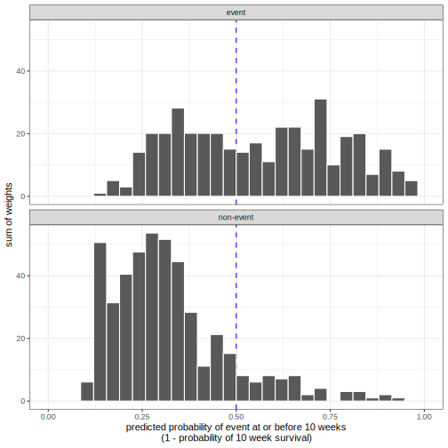
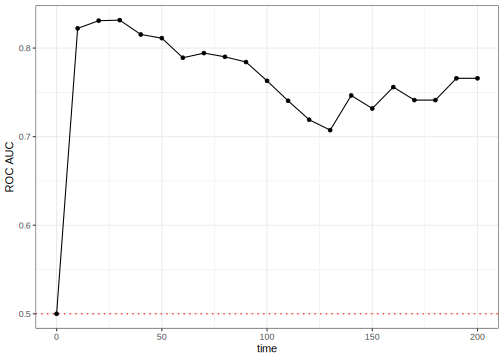

## Introduction

To use code in this article,  you will need to install the following packages: censored, modeldatatoo, and tidymodels. 

One trend in modern survival analysis is to compute time-dependent measures of performance. These are primarily driven by an increased focus on predictions for the probability of survival at a given time (as opposed to the predictions of event times or linear predictors). Since these are conditional on the evaluation time, we call them dynamic performance metrics. 

Many dynamic metrics are similar to those used for binary classification models. The basic idea is that, for a given time $t$ for model evaluation, we try to encode the observed event time data into a binary "has there been an event at time $t$?" version. We can also convert the predicted survival probabilities into predicted events/non-events based on a threshold (default is 0.50). The survival versions of these metrics need binary versions of observed truth and predictions as well as a way to account for censoring.

Censoring plays into the details of the conversion and is additionally captured in the form of weights. For details on these aspects, see the [Accounting for Censoring in Performance Metrics for Event Time Data](../survival-metrics-details) article.

To start, let's define the various types of times that will be mentioned:

- Observed time: time recorded in the data
- Event time: observed times for actual events
- Evaluation time: the time, specified by the analyst, that the model is evaluated. 

## Example data

As an example, we'll use the building complaints data from the [case study](../survival-case-study). We'll also load the censored package so that we can fit a model to these time-to-event data:

::: {.cell layout-align="center"}

```{.r .cell-code}
library(tidymodels)
library(censored)
#> Loading required package: survival
#> 
#> Attaching package: 'survival'
#> The following object is masked from 'package:future':
#> 
#>     cluster

building_complaints <- modeldatatoo::data_building_complaints()

building_complaints <- building_complaints %>% 
  mutate(
    disposition_surv = Surv(days_to_disposition, status == "CLOSED"), 
    .keep = "unused"
  )

set.seed(403)
complaints_split <- initial_validation_split(building_complaints)
complaints_train <- training(complaints_split)
complaints_val <- validation(complaints_split)
```
:::

We'll need a model to illustrate the code and concepts. Let's fit a basic Weibull model to the training set. We'll do a little bit of work on some of the predictors that have many possible levels using a recipe:

::: {.cell layout-align="center"}

```{.r .cell-code}
survreg_spec <- survival_reg() %>% 
  set_engine("survival") %>% 
  set_mode("censored regression")

other_rec <- recipe(disposition_surv ~ ., data = complaints_train) %>% 
  step_unknown(complaint_priority) %>% 
  step_rm(complaint_category) %>% 
  step_novel(community_board, unit) %>%
  step_other(community_board, unit, threshold = 0.02)

survreg_wflow <- workflow() %>% 
  add_recipe(other_rec) %>% 
  add_model(survreg_spec)

complaints_fit <- fit(survreg_wflow, data = complaints_train)
```
:::

Using this model, we'll make predictions of different types. 

## Survival Probability Prediction

This censored regression model can make static predictions via the predicted event time using `predict(object, type = "time")`. It can also create dynamic predictions regarding the probability of survival for each data point at specific times. The syntax for this is 

```r
predict(object, new_data, type = "survival", eval_time = numeric())
```

where `eval_time` is a vector of time points at which we want the corresponding survivor function estimates. Alternatively, we can use the `augment()` function to get both types of prediction and automatically attach them to the data. 

We’ll use a finer grid than the [case study](../survival-case-study) with a maximum evaluation time of 200 days for this analysis. 

::: {.cell layout-align="center"}

```{.r .cell-code}
time_points <- seq(0, 200, by = 10)

val_pred <- augment(complaints_fit, complaints_val, eval_time = time_points)
val_pred
#> # A tibble: 847 × 12
#>    .pred    .pred_time year_entered latitude longitude borough  special_district
#>    <list>        <dbl> <fct>           <dbl>     <dbl> <fct>    <fct>           
#>  1 <tibble>       96.6 2023             40.7     -73.8 Queens   None            
#>  2 <tibble>       18.7 2023             40.8     -74.0 Manhatt… None            
#>  3 <tibble>       29.5 2023             40.6     -74.0 Brooklyn None            
#>  4 <tibble>       29.8 2023             40.7     -73.8 Queens   None            
#>  5 <tibble>       24.8 2023             40.7     -74.0 Manhatt… None            
#>  6 <tibble>       58.4 2023             40.6     -74.0 Brooklyn None            
#>  7 <tibble>       71.3 2023             40.7     -73.9 Brooklyn None            
#>  8 <tibble>      102.  2023             40.7     -73.7 Queens   None            
#>  9 <tibble>       47.1 2023             40.7     -74.0 Brooklyn None            
#> 10 <tibble>       28.5 2023             40.6     -74.0 Brooklyn None            
#> # ℹ 837 more rows
#> # ℹ 5 more variables: unit <fct>, community_board <fct>,
#> #   complaint_category <fct>, complaint_priority <fct>, disposition_surv <Surv>
```
:::

The observed data are in the `disposition_surv` column. The predicted survival probabilities are in the `.pred` column. This is a list column with a data frame for each observation, containing the predictions at the 21 evaluation time points in the (nested) column `.pred_survival`. 

::: {.cell layout-align="center"}

```{.r .cell-code}
val_pred$.pred[[1]]
#> # A tibble: 21 × 5
#>    .eval_time .pred_survival .weight_time .pred_censored .weight_censored
#>         <dbl>          <dbl>        <dbl>          <dbl>            <dbl>
#>  1          0          1              0            1                 1   
#>  2         10          0.847         10.0          0.988             1.01
#>  3         20          0.750         20.0          0.976             1.02
#>  4         30          0.673         30.0          0.963             1.04
#>  5         40          0.608         NA           NA                NA   
#>  6         50          0.552         NA           NA                NA   
#>  7         60          0.504         NA           NA                NA   
#>  8         70          0.461         NA           NA                NA   
#>  9         80          0.423         NA           NA                NA   
#> 10         90          0.388         NA           NA                NA   
#> # ℹ 11 more rows
```
:::

The yardstick package currently has two dynamic metrics. Each is described below.

## Brier Score

The Brier score is a metric that can be used with both classification and event-time models. In classification models, we compute the squared error between the observed outcome (encoded as 0/1) and the corresponding predicted probability for the class. 

A little math: suppose that the value $y_{ik}$ is a 0/1 indicator for whether the observed outcome $i$ corresponds to class $k$, and $\hat{p}_{ik}$ is the estimated class probability. The classification score is then:

$$
Brier_{class} = \frac{1}{N}\sum_{i=1}^N\sum_{k=1}^C (y_{ik} - \hat{p}_{ik})^2
$$

For survival models, we transform the event time data into a binary version $y_{it}$: is there an event at evaluation time $t$^[Again, see the [Accounting for Censoring in Performance Metrics for Event Time Data](../survival-metrics-details) article for more on this.]. The survival function estimate $\hat{p}_{it}$ is the probability corresponding to non-events at time $t$. For example, if there has not been an event at the current evaluation time, our best model should estimate the survival probability near one. For observations that are events, the probability estimate is just one minus the survivor estimate. To account for censoring, we also weight each observation with $w_{it}$. The [time-dependent Brier score](https://scholar.google.com/scholar?hl=en&as_sdt=0%2C7&q=%22Assessment+and+Comparison+of+Prognostic+Classification+Schemes+for+Survival+Data.%22&btnG=) is: 

$$
Brier_{surv}(t) = \frac{1}{W_t}\sum_{i=1}^N w_{it}\left[\underbrace{I(y_{it} = 0)(y_{it} - \hat{p}_{it})^2}_\text{non-events} +  \underbrace{I(y_{it} = 1)(y_{it} - (1 - \hat{p}_{it}))^2}_\text{events}\right]
$$

where $W_t$ is the sum of the weights at time $t$.

For this score, a perfect model has a score of zero, while an uninformative model would have a score of around 1/4. 

How do we compute this using the yardstick package? The function [`brier_survival()`](https://yardstick.tidymodels.org/reference/brier_survival.html) follows the same convention as the other metric functions. The main arguments are:

- `data`: the data frame with the predictions (structured as the output produced by `augment()`, as shown above).
- `truth`: the name of the column with the `Surv` object.
- `...`: the name of the column with the dynamic predictions. Within tidymodels, this column is always called `.pred`. In other words, `.pred` should be passed without an argument name. 

Since the evaluation times and the case weights are within the `.pred` column, there is no need to specify these. Here are the results of our validation set: 

::: {.cell layout-align="center"}

```{.r .cell-code}
brier_scores <-
  val_pred %>% 
  brier_survival(truth = disposition_surv, .pred)
brier_scores
#> # A tibble: 21 × 4
#>    .metric        .estimator .eval_time .estimate
#>    <chr>          <chr>           <dbl>     <dbl>
#>  1 brier_survival standard            0    0     
#>  2 brier_survival standard           10    0.177 
#>  3 brier_survival standard           20    0.168 
#>  4 brier_survival standard           30    0.160 
#>  5 brier_survival standard           40    0.156 
#>  6 brier_survival standard           50    0.138 
#>  7 brier_survival standard           60    0.121 
#>  8 brier_survival standard           70    0.0954
#>  9 brier_survival standard           80    0.0808
#> 10 brier_survival standard           90    0.0697
#> # ℹ 11 more rows
```
:::

Over time:

::: {.cell layout-align="center"}

```{.r .cell-code}
brier_scores %>% 
  ggplot(aes(.eval_time, .estimate)) + 
  geom_hline(yintercept = 1 / 4, col = "red", lty = 3) +
  geom_line() +
  geom_point() + 
  labs(x = "time", y = "Brier score")
```

::: {.cell-output-display}
{fig-align='center' width=672}
:::
:::

This shows the worst predictions (relatively speaking) occur at 10 days with a corresponding Brier score of 0.177. Performance gets steadily better over (evaluation) time. 

Instead of thinking in 21 dimensions, there is also an _integrated_ Brier score. This required evaluation times as inputs but instead of returning each result, it takes the area under the above curve. The syntax is the same, but the result has a single row: 

::: {.cell layout-align="center"}

```{.r .cell-code}
val_pred %>% brier_survival_integrated(truth = disposition_surv, .pred)
#> # A tibble: 1 × 3
#>   .metric                   .estimator .estimate
#>   <chr>                     <chr>          <dbl>
#> 1 brier_survival_integrated standard      0.0772
```
:::

Again, smaller values are better. 

We'll look at the data behind this performance metric in more detail in a bit. 

## Receiver Operating Characteristic (ROC) Curves

When we not only turn the event time data into a binary representation but also the predicted probabilities, we are in well-chartered classification metrics territory. Sensitivity and specificity are common quantities to compute; we do so here in their weighted version to account for censoring:

- Sensitivity: How well do we predict the events? This is analogous to the true positive rate.
- Specificity: How well do we predict the non-events? One minus specificity is the false positive rate. 

These depend on the threshold used to turn predicted probabilities into predicted events/non-events. Let's look at the distribution of the survival probabilities for our example data at an evaluation time of 10 days. The distributions are separated by the observed class and weighted by the censoring weights. Details of both aspects are the same as the Brier score and can be found in the [Accounting for Censoring in Performance Metrics for Event Time Data](../survival-metrics-details) article.

::: {.cell layout-align="center"}
::: {.cell-output-display}
{fig-align='center' width=70%}
:::
:::

More probability values are to the left of the 50% cutoff for the true non-events. The true events tend to have larger probabilities but are not nearly as clearly distributed to the right of the cutoff as the non-events are to the left of the cutoff. Using this cutoff, the sensitivity would be 56.9% and the specificity would be 88.2%. There are other possible cutoffs for the survival probabilities. Maybe one of these would have better statistics. 

ROC curves were designed as a general method that, given a collection of continuous predictions, determines an effective threshold such that values above the threshold indicate a specific event. For our purposes, the ROC curve will compute the sensitivity and specificity for _all possible_ probability thresholds. It then plots the true positive rate versus the false positive rate. Generally, we use the area under the ROC curve to quantify it with a single number. Values near one indicate a perfect model, while values near 1/2 occur with non-informative models. 

[Blanche _et al_ (2013)](https://scholar.google.com/scholar?hl=en&as_sdt=0%2C7&q=%22Review+and+comparison+of+ROC+curve+estimators+for+a+time-dependent+outcome+with+marker-dependent+censoring%22&btnG=) gives a good overview of ROC curves for survival analysis and their Section 4.3 is most relevant here. 

For our example at evaluation time $t = 10.00$, the ROC curve is: 

::: {.cell layout-align="center"}
::: {.cell-output-display}
{fig-align='center' width=672}
:::
:::

The area under this curve is 0.822. 

Since this is a dynamic metric, we compute the AUC for each evaluation time. The syntax is very similar to the Brier code shown above: 

::: {.cell layout-align="center"}

```{.r .cell-code}
roc_scores <-
  val_pred %>% 
  roc_auc_survival(truth = disposition_surv, .pred)
roc_scores
#> # A tibble: 21 × 4
#>    .metric          .estimator .eval_time .estimate
#>    <chr>            <chr>           <dbl>     <dbl>
#>  1 roc_auc_survival standard            0     0.5  
#>  2 roc_auc_survival standard           10     0.822
#>  3 roc_auc_survival standard           20     0.831
#>  4 roc_auc_survival standard           30     0.831
#>  5 roc_auc_survival standard           40     0.815
#>  6 roc_auc_survival standard           50     0.811
#>  7 roc_auc_survival standard           60     0.789
#>  8 roc_auc_survival standard           70     0.794
#>  9 roc_auc_survival standard           80     0.790
#> 10 roc_auc_survival standard           90     0.784
#> # ℹ 11 more rows
```
:::

Over time:

::: {.cell layout-align="center"}

```{.r .cell-code}
roc_scores %>% 
  ggplot(aes(.eval_time, .estimate)) + 
  geom_hline(yintercept = 1 / 2, col = "red", lty = 3) +
  geom_line() +
  geom_point() + 
  labs(x = "time", y = "ROC AUC")
```

::: {.cell-output-display}
{fig-align='center' width=672}
:::
:::

In this case, performance is best at earlier time points (unlike the Brier score), degrades a bit, and then increases again. Despite this, performance is fairly good across all non-zero evaluation times. 

## Disagreement between metrics

While it may not be surprising that each metric's results vary over time, it may seem odd that _when_ the model does best also differs between metrics. 

The issue is that the ROC measures class separation, and the Brier score focuses more on accurate and well-calibrated predictions. These are not the same thing. As we'll see shortly, it can be easy to separate data between qualitative prediction (event or no event) even when the corresponding probability predictions are very inaccurate. 

::: {.cell layout-align="center"}

:::

Below is a contrived (but common) case with two classes. The probability distributions between the true classes are shown on the left. Note that the curves show separation between the event and non-event groups. As expected, the area under the ROC curve is very high (0.997).

The problem is that the predicted probabilities are not realistic. They are too close to the commonly used cutoff of 0.5. Across all of the data, the probabilities only range from 0.37 to 0.62. We expect these to be much closer to zero and one, respectively.

::: {.cell layout-align="center"}
::: {.cell-output-display}
{fig-align='center' width=672}
:::
:::

The figure on the right shows a _calibration plot_ for the same data (see [this article](https://www.tidymodels.org/learn/models/calibration/) for more information). The points would fall along the diagonal line if the probabilities were accurate. Since the Brier score partly measures calibration, it has a correspondingly poor value of 0.203. 

For the NY building complaint data, let’s look at evaluation times of 10 and 100 days. First, we can examine the distribution of the probability predictions at both time points: 

::: {.cell layout-align="center"}
::: {.cell-output-display}
{fig-align='center' width=672}
:::
:::

The range of probabilities at 10 days is almost the entire range, and there is moderate separation between the two. However, at 100 days, the smallest probability prediction is 0.49. 

The calibration plots are below with the size of the points being proportional to the sum of the weights:

::: {.cell layout-align="center"}
::: {.cell-output-display}
{fig-align='center' width=672}
:::
:::

On the left, the plot shows a few deviations away from the diagonal. The right panel shows that the majority of the data (about 74%) are in the first two bins near the upper right-hand side. These points are along the diagonal, indicating good calibration. As we move away from these points, the model becomes less calibrated. Overall though, the Brier statistic is small since most of the data (i.e., weights) are along the diagonal. 

What about the ROC curves produced by these data? They are: 

::: {.cell layout-align="center"}
::: {.cell-output-display}
{fig-align='center' width=672}
:::
:::

It may be difficult to tell from the histograms above, but the groups are separated enough at 100 days to produce an area under the ROC curve of 0.76. That's not bad; the metric is seeing separation despite the lack of accuracy. 

This demonstrates that there are situations where the metrics have discordant results. The context of the project should determine whether the separation of classes or accuracy is more important.

## Tuning these metrics

Many of the event time models available in tidymodels have tuning parameters. The `tune_*()` functions and `fit_resamples()` have an `eval_time` argument to pass the evaluation times. The statistics are computed for these time points using out-of-sample data. 

In some cases, such as [iterative search](https://www.tmwr.org/iterative-search.html) or [racing methods](https://www.tmwr.org/grid-search.html#racing), the functions need a single value to optimize. If a dynamic metric is chosen to guide the optimization, _the first evaluation time given by the user_ will be used. 

For example, if a model for these data was being optimized, and we wanted a time of 10 days to guide the search, we would need to use that value of 10.00 as the first element `time_points`, the vector given to the `eval_time` argument in our example above.

## Summary

tidymodels has two time-dependent metrics for characterizing the performance of event-time models:

* The Brier score measures the distance between the observed class result and the predicted probabilities. 
* ROC curves try to measure the separation between the two classes based on the survival probabilities. 

## Session information {#session-info}

::: {.cell layout-align="center"}

```
#> ─ Session info ─────────────────────────────────────────────────────
#>  version  R version 4.4.2 (2024-10-31)
#>  language (EN)
#>  date     2025-03-24
#>  pandoc   3.6.1
#>  quarto   1.6.42
#> 
#> ─ Packages ─────────────────────────────────────────────────────────
#>  package        version date (UTC) lib source
#>  broom          1.0.7   2024-09-26 [1] CRAN (R 4.4.1)
#>  censored       0.3.3   2025-02-14 [1] CRAN (R 4.4.1)
#>  dials          1.4.0   2025-02-13 [1] CRAN (R 4.4.2)
#>  dplyr          1.1.4   2023-11-17 [1] CRAN (R 4.4.0)
#>  ggplot2        3.5.1   2024-04-23 [1] CRAN (R 4.4.0)
#>  infer          1.0.7   2024-03-25 [1] CRAN (R 4.4.0)
#>  modeldatatoo   0.3.0   2024-03-29 [1] CRAN (R 4.4.0)
#>  parsnip        1.3.1   2025-03-12 [1] CRAN (R 4.4.1)
#>  purrr          1.0.4   2025-02-05 [1] CRAN (R 4.4.1)
#>  recipes        1.2.0   2025-03-17 [1] CRAN (R 4.4.1)
#>  rlang          1.1.5   2025-01-17 [1] CRAN (R 4.4.2)
#>  rsample        1.2.1   2024-03-25 [1] CRAN (R 4.4.0)
#>  tibble         3.2.1   2023-03-20 [1] CRAN (R 4.4.0)
#>  tidymodels     1.3.0   2025-02-21 [1] CRAN (R 4.4.1)
#>  tune           1.3.0   2025-02-21 [1] CRAN (R 4.4.1)
#>  workflows      1.2.0   2025-02-19 [1] CRAN (R 4.4.1)
#>  yardstick      1.3.2   2025-01-22 [1] CRAN (R 4.4.1)
#> 
#> ────────────────────────────────────────────────────────────────────
```
:::
