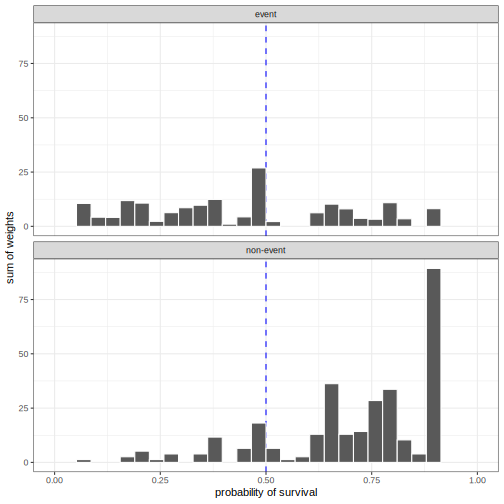
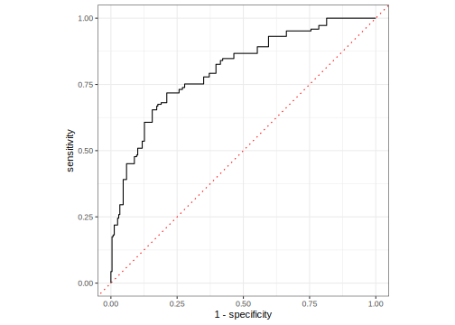

## Introduction

To use code in this article,  you will need to install the following packages: censored, prodlim, and tidymodels. You'll need the development versions of censored and parsnip. To install these, use

```r
#install.packages("pak")

pak::pak(c("tidymodels/censored", "tidymodels/parsnip"))
```

One trend in modern survival analysis is to compute time-dependent measures of performance. These are primarily driven by an increased focus on predictions for the probability of survival at a given time (as opposed to the predictions of event times or linear predictors). Since these are conditional on the time of evaluation, we call them dynamic performance metrics. 

Many dynamic metrics are similar to those used for binary classification models. The basic idea is that, for a given time $t$ for model evaluation, we try to encode the observed event time data into a binary "has there been an event at time $t$?" version. We can also convert the predicted survival probabilities into predicted events/non-events based on a threshold (default is 0.50). The survival versions of these metrics need those binary versions of observed truth and predictions as well as a way to account for censoring.

Censoring plays into the details of the conversion and is additionally captured in the form of weights. For details on both these aspects, see the [Accounting for Censoring in Performance Metrics for Event Time Data](../survival-metrics-details) article.

To start, let's define the various types of times that will be mentioned:

- Observed time: time recorded in the data
- Event time: observed times for actual events
- Evaluation time: the time, specified by the analyst, that the model is evaluated. 

## Example data

As an example, we'll simulate some data with the prodlim package, using the methods of [Bender _et al_ (2005)](https://scholar.google.com/scholar?hl=en&as_sdt=0%2C7&q=%22Generating+survival+times+to+simulate+Cox+proportional+hazards+models.%22&btnG=). A training and a validation set are simulated. We'll also load the censored package so that we can fit a model to these time-to-event data:


::: {.cell layout-align="center" hash='cache/data_42b48883e7903f8958700bf3f39525ee'}

```{.r .cell-code}
library(tidymodels)
library(censored)
#> Loading required package: survival
library(prodlim)

set.seed(5882)
sim_dat <- SimSurv(2000) %>%
  mutate(event_time = Surv(time, event)) %>%
  select(event_time, X1, X2)

set.seed(2)
split   <- initial_split(sim_dat)
sim_tr  <- training(split)
sim_val <- testing(split)

## Resampling object
sim_rs <- vfold_cv(sim_tr)
```
:::


We'll need a model to illustrate the code and concepts. Let's fit a bagged survival tree model to the training set:


::: {.cell layout-align="center" hash='cache/bag-tree-fit_aacc16c94e976eb09a5315d41fef916f'}

```{.r .cell-code}
set.seed(17)
bag_tree_fit <- 
  bag_tree() %>% 
  set_mode("censored regression") %>% 
  set_engine("rpart") %>% 
  fit(event_time ~ ., data = sim_tr)
bag_tree_fit
#> parsnip model object
#> 
#> 
#> Bagging survival trees with 25 bootstrap replications 
#> 
#> Call: bagging.data.frame(formula = event_time ~ ., data = data)
```
:::


Using this model, we'll make predictions of different types. 

## Survival Probability Prediction

This censored regression model can make static predictions via the predicted event time using `predict(object, type = "time")`. It can also create dynamic predictions regarding the probability of survival for each data point at specific times. The syntax for this is 

```r
predict(object, new_data, type = "survival", eval_time = numeric())
```

where `eval_time` is a vector of time points at which we want the corresponding survivor function estimates. Alternatively, we can use the `augment()` function to get both types of prediction and automatically attach them to the data. 

The largest event time in the training set is 21.083 so we will use a set of evaluation times between zero and 21. 


::: {.cell layout-align="center" hash='cache/val-pred_7dd8d8645b17d7f4f00e9eac86ba3128'}

```{.r .cell-code}
time_points <- seq(0, 21, by = 0.25)

val_pred <- augment(bag_tree_fit, sim_val, eval_time = time_points)
val_pred
#> # A tibble: 500 × 5
#>    .pred             .pred_time event_time    X1      X2
#>    <list>                 <dbl>     <Surv> <dbl>   <dbl>
#>  1 <tibble [85 × 5]>       6.66  4.831957      1 -0.630 
#>  2 <tibble [85 × 5]>       6.66  6.110031      1 -0.606 
#>  3 <tibble [85 × 5]>       7.47  6.597774+     1 -1.03  
#>  4 <tibble [85 × 5]>       3.29  2.717484      1  0.811 
#>  5 <tibble [85 × 5]>       5.10  4.727042+     1 -0.376 
#>  6 <tibble [85 × 5]>       4.99  8.699061      0  1.18  
#>  7 <tibble [85 × 5]>       7.23 10.818670      1 -0.851 
#>  8 <tibble [85 × 5]>       6.46  6.886378      0  0.493 
#>  9 <tibble [85 × 5]>       4.75  2.451893+     1  0.0207
#> 10 <tibble [85 × 5]>      13.4   8.231911+     0 -1.52  
#> # ℹ 490 more rows
```
:::


The observed data are in the `event_time` column. The predicted survival probabilities are in the `.pred` column. This is a list column with a data frame for each observation, containing the predictions at the 85 evaluation time points in the (nested) column `.pred_survival`. 


::: {.cell layout-align="center" hash='cache/val-pred-dynamic_c386171d6bfc889b48602c2e15fc50c0'}

```{.r .cell-code}
val_pred$.pred[[1]]
#> # A tibble: 85 × 5
#>    .eval_time .pred_survival .weight_time .pred_censored .weight_censored
#>         <dbl>          <dbl>        <dbl>          <dbl>            <dbl>
#>  1       0             1            0              1                 1   
#>  2       0.25          1            0.250          0.999             1.00
#>  3       0.5           0.999        0.500          0.996             1.00
#>  4       0.75          0.992        0.750          0.993             1.01
#>  5       1             0.988        1.00           0.991             1.01
#>  6       1.25          0.980        1.25           0.987             1.01
#>  7       1.5           0.972        1.50           0.981             1.02
#>  8       1.75          0.959        1.75           0.971             1.03
#>  9       2             0.938        2.00           0.966             1.04
#> 10       2.25          0.925        2.25           0.959             1.04
#> # ℹ 75 more rows
```
:::


The yardstick package currently has two dynamic metrics. Each is described below.

## Brier Score

The Brier score is a metric that can be used with both classification and event-time models. For classification models, it computes the squared error between the observed outcome (encoded as 0/1) and the corresponding predicted probability for the class. 

A little math: suppose that the value $y_{ik}$ is a 0/1 indicator for whether the observed outcome $i$ corresponds to class $k$, and $\hat{p}_{ik}$ is the estimated class probability. The classification score is then:

$$
Brier_{class} = \frac{1}{N}\sum_{i=1}^N\sum_{k=1}^C (y_{ik} - \hat{p}_{ik})^2
$$

For survival models, we transform the event time data into a binary version $y_{it}$: is there an event at evaluation time $t$^[Again, see the [Accounting for Censoring in Performance Metrics for Event Time Data](../survival-metrics-details) article for more on this.]. The survival function estimate $\hat{p}_{it}$ is the probability that corresponds to non-events at time $t$. For example, if there has not been an event at the current evaluation time, our best model should estimate the survival probability to be near one. For observations that are events, the probability estimate is just one minus the survivor estimate. To account for censoring, we also weight each observation with $w_{it}$. The [time-dependent Brier score](https://scholar.google.com/scholar?hl=en&as_sdt=0%2C7&q=%22Assessment+and+Comparison+of+Prognostic+Classification+Schemes+for+Survival+Data.%22&btnG=) is: 

$$
Brier_{surv}(t) = \frac{1}{N}\sum_{i=1}^N w_{it}\left[\underbrace{I(y_{it} = 0)(y_{it} - \hat{p}_{it})^2}_\text{non-events} +  \underbrace{I(y_{it} = 1)(y_{it} - (1 - \hat{p}_{it}))^2}_\text{events}\right]
$$

For this score, a perfect model has a score of zero, while an uninformative model would have a score of around 1/4. 

How do we compute this using the yardstick package? The function [`brier_survival()`](https://yardstick.tidymodels.org/reference/brier_survival.html) follows the same convention as the other metric functions. The main arguments are:

- `data`: the data frame with the predictions (structured as the output produced by `augment()`, as shown above).
- `truth`: the name of the column with the `Surv` object.
- `...`: the name of the column with the dynamic predictions. Within tidymodels, this column is always called `.pred`. In other words, `.pred` should be passed without an argument name. 

Since the evaluation times and the case weights are within the `.pred` column, there is no need to specify these. Here are the results of our validation set: 


::: {.cell layout-align="center" hash='cache/val-pred-brier_cc3492ab0108dabc8c2c8c4ba1fbd542'}

```{.r .cell-code}
brier_scores <-
  val_pred %>% 
  brier_survival(truth = event_time, .pred)
brier_scores
#> # A tibble: 85 × 4
#>    .metric        .estimator .eval_time .estimate
#>    <chr>          <chr>           <dbl>     <dbl>
#>  1 brier_survival standard         0      0      
#>  2 brier_survival standard         0.25   0      
#>  3 brier_survival standard         0.5    0.00202
#>  4 brier_survival standard         0.75   0.00796
#>  5 brier_survival standard         1      0.0266 
#>  6 brier_survival standard         1.25   0.0402 
#>  7 brier_survival standard         1.5    0.0563 
#>  8 brier_survival standard         1.75   0.0785 
#>  9 brier_survival standard         2      0.0895 
#> 10 brier_survival standard         2.25   0.0951 
#> # ℹ 75 more rows
```
:::


Over time:


::: {.cell layout-align="center" hash='cache/brier-scores_13db6b16e82feb40db50c941da37199b'}

```{.r .cell-code}
brier_scores %>% 
  ggplot(aes(.eval_time, .estimate)) + 
  geom_hline(yintercept = 1 / 4, col = "red", lty = 3) +
  geom_line() +
  geom_point() + 
  labs(x = "time", y = "Brier score")
```

::: {.cell-output-display}
{fig-align='center' width=672}
:::
:::


There is also an _integrated_ Brier score. This required evaluation times as inputs but instead of returning each result, it takes the area under the plot shown above. The syntax is the same but the result has a single row: 


::: {.cell layout-align="center" hash='cache/val-pred-brier-int_a3cc43e2b5d8b2a3edda42d4eed6eb62'}

```{.r .cell-code}
val_pred %>% brier_survival_integrated(truth = event_time, .pred)
#> # A tibble: 1 × 3
#>   .metric                   .estimator .estimate
#>   <chr>                     <chr>          <dbl>
#> 1 brier_survival_integrated standard       0.113
```
:::


Again, smaller values are better. 

## Receiver Operating Characteristic (ROC) Curves

When we not only turn the event time data into a binary representation but also the predicted probabilities, we are in well-chartered classification metrics territory. Sensitivity and specificity are common quantities to compute, we do so here in their weighted version to account for censoring:

- Sensitivity: How well do we predict the events? This is analogous to the true positive rate.
- Specificity: How well do we predict the non-events? One minus specificity is the false positive rate. 

These depend on the threshold used to turn predicted probabilities into predicted events/non-events. Let's take a look at the distribution of the survival probabilities for our example data at an evaluation time of 5.00. The distributions are separated by the observed class and weighted by the censoring weights. Details of both aspects are the same as for the Brier score and can be found in the [Accounting for Censoring in Performance Metrics for Event Time Data](../survival-metrics-details) article.


::: {.cell layout-align="center" hash='cache/surv-hist-05_7d278716c6b14edbfcc22ee2eb5df16f'}
::: {.cell-output-display}
{fig-align='center' width=70%}
:::
:::


More probability values are to the right of the 50% cutoff for the true non-events. Conversely, true events tend to have smaller probabilities. Using this cutoff, the sensitivity would be 66.8% and the specificity would be 82.3%. There are other possible cutoffs for the survival probabilities. Maybe one of these would have better statistics. 

ROC curves were designed as a general method that, given a collection of continuous predictions, determines an effective threshold such that values above the threshold indicate a specific event. For our purposes, the ROC curve will compute the sensitivity and specificity for _all possible_ probability thresholds. It then plots the true positive rate versus the false positive rate. Generally, we use the area under the ROC curve to quantify it with a single number. Values near one indicate a perfect model, while values near 1/2 occur with non-informative models. 

[Blanche _et al_ (2013)](https://scholar.google.com/scholar?hl=en&as_sdt=0%2C7&q=%22Review+and+comparison+of+ROC+curve+estimators+for+a+time-dependent+outcome+with+marker-dependent+censoring%22&btnG=) gives a good overview of ROC curves for survival analysis and their Section 4.3 is most relevant here. 

For our example at evaluation time $t = 5.00$, the ROC curve is: 


::: {.cell layout-align="center" hash='cache/roc-5_51cf7b7d58c785ec0b33ff7855854742'}
::: {.cell-output-display}
{fig-align='center' width=672}
:::
:::


The area under this curve is 0.807. 

Since this is a dynamic metric, we compute the AUC for each evaluation time. The syntax is very similar to the Brier code shown above: 


::: {.cell layout-align="center" hash='cache/val-pred-roc_aac3021d4364dbc86df2aa1486eb62bb'}

```{.r .cell-code}
roc_scores <-
  val_pred %>% 
  roc_auc_survival(truth = event_time, .pred)
roc_scores
#> # A tibble: 85 × 4
#>    .metric          .estimator .eval_time .estimate
#>    <chr>            <chr>           <dbl>     <dbl>
#>  1 roc_auc_survival standard         0        0.5  
#>  2 roc_auc_survival standard         0.25     0.5  
#>  3 roc_auc_survival standard         0.5      0.869
#>  4 roc_auc_survival standard         0.75     0.852
#>  5 roc_auc_survival standard         1        0.734
#>  6 roc_auc_survival standard         1.25     0.768
#>  7 roc_auc_survival standard         1.5      0.792
#>  8 roc_auc_survival standard         1.75     0.777
#>  9 roc_auc_survival standard         2        0.771
#> 10 roc_auc_survival standard         2.25     0.778
#> # ℹ 75 more rows
```
:::


Over time:


::: {.cell layout-align="center" hash='cache/roc-scores_66155d0cc449a9b6c3e124bbda82c073'}

```{.r .cell-code}
roc_scores %>% 
  ggplot(aes(.eval_time, .estimate)) + 
  geom_hline(yintercept = 1 / 2, col = "red", lty = 3) +
  geom_line() +
  geom_point() + 
  labs(x = "time", y = "ROC AUC")
```

::: {.cell-output-display}
{fig-align='center' width=672}
:::
:::


The initial variation is due to so few events at the early stages of analysis. 

The ROC measures the separation between classes and the Brier score focuses more on accurate and well-calibrated predictions. It should not be surprising that each metric's results over time differ. 

## Tuning these metrics

Many of the event time models available in tidymodels have tuning parameters. The `tune_*()` functions and `fit_resamples()` have an `eval_time` argument used to pass the evaluation times. The statistics are computed for these time points using out-of-sample data. 

In some cases, such as [iterative search](https://www.tmwr.org/iterative-search.html) or [racing methods](https://www.tmwr.org/grid-search.html#racing), the functions need a single value to optimize. If a dynamic metric is used to guide the optimization, _the first evaluation time given by the user_ will be used. 

For example, if a model for these data was being optimized, and we wanted a time of 5.00 to guide the process, we would need to use that value of 5.00 as the first element `time_points`, the vector given to the `eval_time` argument in our example above.


## Summary

tidymodels has two time-dependent metrics for characterizing the performance of event-time models:

* The Brier score measures the distance between the observed class result and the predicted probabilities. 
* ROC curves try to measure the separation between the two classes based on the survival probabilities. 


## Session information {#session-info}


::: {.cell layout-align="center" hash='cache/si_5db2644d2f49a924bcfd72b2c3cad09a'}

```
#> ─ Session info ─────────────────────────────────────────────────────
#>  setting  value
#>  version  R version 4.3.1 (2023-06-16)
#>  os       macOS Ventura 13.5.2
#>  system   aarch64, darwin20
#>  ui       X11
#>  language (EN)
#>  collate  en_US.UTF-8
#>  ctype    en_US.UTF-8
#>  tz       America/Los_Angeles
#>  date     2023-09-25
#>  pandoc   3.1.1 @ /Applications/RStudio.app/Contents/Resources/app/quarto/bin/tools/ (via rmarkdown)
#> 
#> ─ Packages ─────────────────────────────────────────────────────────
#>  package    * version    date (UTC) lib source
#>  broom      * 1.0.5      2023-06-09 [1] CRAN (R 4.3.0)
#>  censored   * 0.2.0      2023-04-13 [1] CRAN (R 4.3.0)
#>  dials      * 1.2.0      2023-04-03 [1] CRAN (R 4.3.0)
#>  dplyr      * 1.1.3      2023-09-03 [1] CRAN (R 4.3.0)
#>  ggplot2    * 3.4.3      2023-08-14 [1] CRAN (R 4.3.0)
#>  infer      * 1.0.5      2023-09-06 [1] CRAN (R 4.3.0)
#>  parsnip    * 1.1.1      2023-08-17 [1] CRAN (R 4.3.0)
#>  prodlim    * 2023.08.28 2023-08-28 [1] CRAN (R 4.3.0)
#>  purrr      * 1.0.2      2023-08-10 [1] CRAN (R 4.3.0)
#>  recipes    * 1.0.8      2023-08-25 [1] CRAN (R 4.3.0)
#>  rlang        1.1.1      2023-04-28 [1] CRAN (R 4.3.0)
#>  rsample    * 1.2.0      2023-08-23 [1] CRAN (R 4.3.0)
#>  tibble     * 3.2.1      2023-03-20 [1] CRAN (R 4.3.0)
#>  tidymodels * 1.1.1      2023-08-24 [1] CRAN (R 4.3.0)
#>  tune       * 1.1.2      2023-08-23 [1] CRAN (R 4.3.0)
#>  workflows  * 1.1.3      2023-02-22 [1] CRAN (R 4.3.0)
#>  yardstick  * 1.2.0      2023-04-21 [1] CRAN (R 4.3.0)
#> 
#>  [1] /Users/emilhvitfeldt/Library/R/arm64/4.3/library
#>  [2] /Library/Frameworks/R.framework/Versions/4.3-arm64/Resources/library
#> 
#> ────────────────────────────────────────────────────────────────────
```
:::
