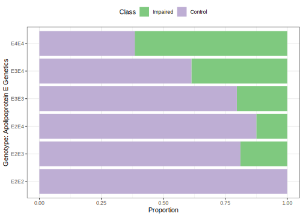
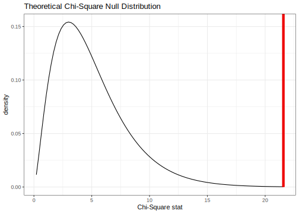
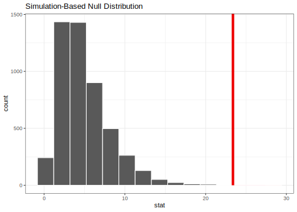

## Introduction

This article only requires that you have the tidymodels package installed.

In this vignette, we'll walk through conducting a $\chi^2$ (chi-squared) test of independence and a chi-squared goodness of fit test using infer. We'll start out with a chi-squared test of independence, which can be used to test the association between two categorical variables. Then, we'll move on to a chi-squared goodness of fit test, which tests how well the distribution of one categorical variable can be approximated by some theoretical distribution.

Throughout this vignette, we'll make use of the `ad_data` data set (available in the modeldata package, which is part of tidymodels). This data set is related to cognitive impairment in 333 patients from [Craig-Schapiro _et al_ (2011)](https://www.ncbi.nlm.nih.gov/pmc/articles/PMC3079734/). See `?ad_data` for more information on the variables included and their source. One of the main research questions in these data were how a person's genetics related to the Apolipoprotein E gene affect their cognitive skills. The data shows: 

::: {.cell layout-align="center"}

```{.r .cell-code}
library(tidymodels) # Includes the infer package
set.seed(1234)

data(ad_data, package = "modeldata")
ad_data %>%
  select(Genotype, Class)
#> # A tibble: 333 × 2
#>    Genotype Class   
#>    <fct>    <fct>   
#>  1 E3E3     Control 
#>  2 E3E4     Control 
#>  3 E3E4     Control 
#>  4 E3E4     Control 
#>  5 E3E3     Control 
#>  6 E4E4     Impaired
#>  7 E2E3     Control 
#>  8 E2E3     Control 
#>  9 E3E3     Control 
#> 10 E2E3     Impaired
#> # ℹ 323 more rows
```
:::

The three main genetic variants are called E2, E3, and E4. The values in `Genotype` represent the genetic makeup of patients based on what they inherited from their parents (i.e, a value of "E2E4" means E2 from one parent and E4 from the other). 

## Test of independence

To carry out a chi-squared test of independence, we'll examine the association between their cognitive ability (impaired and healthy) and the genetic makeup. This is what the relationship looks like in the sample data:

::: {.cell layout-align="center"}
::: {.cell-output-display}
{fig-align='center' width=672}
:::
:::

If there were no relationship, we would expect to see the purple bars reaching to the same length, regardless of cognitive ability. Are the differences we see here, though, just due to random noise?

First, to calculate the observed statistic, we can use `specify()` and `calculate()`.

::: {.cell layout-align="center"}

```{.r .cell-code}
# calculate the observed statistic
observed_indep_statistic <- ad_data %>%
  specify(Genotype ~ Class) %>%
  calculate(stat = "Chisq")
```
:::

The observed $\chi^2$ statistic is 21.5774809. Now, we want to compare this statistic to a null distribution, generated under the assumption that these variables are not actually related, to get a sense of how likely it would be for us to see this observed statistic if there were actually no association between cognitive ability and genetics.

We can `generate()` the null distribution in one of two ways: using randomization or theory-based methods. The randomization approach permutes the response and explanatory variables, so that each person's genetics is matched up with a random cognitive rating from the sample in order to break up any association between the two.

::: {.cell layout-align="center"}

```{.r .cell-code}
# generate the null distribution using randomization
null_distribution_simulated <- ad_data %>%
  specify(Genotype ~ Class) %>%
  hypothesize(null = "independence") %>%
  generate(reps = 5000, type = "permute") %>%
  calculate(stat = "Chisq")
```
:::

Note that, in the line `specify(Genotype ~ Class)` above, we could use the equivalent syntax `specify(response = Genotype, explanatory = Class)`. The same goes in the code below, which generates the null distribution using theory-based methods instead of randomization.

::: {.cell layout-align="center"}

```{.r .cell-code}
# generate the null distribution by theoretical approximation
null_distribution_theoretical <- ad_data %>%
  specify(Genotype ~ Class) %>%
  hypothesize(null = "independence") %>%
  # note that we skip the generation step here!
  calculate(stat = "Chisq")
```
:::

To get a sense for what these distributions look like, and where our observed statistic falls, we can use `visualize()`:

::: {.cell layout-align="center"}

```{.r .cell-code}
# visualize the null distribution and test statistic!
null_distribution_simulated %>%
  visualize() + 
  shade_p_value(observed_indep_statistic,
                direction = "greater")
```

::: {.cell-output-display}
{fig-align='center' width=672}
:::
:::

We could also visualize the observed statistic against the theoretical null distribution. Note that we skip the `generate()` and `calculate()` steps when using the theoretical approach, and that we now need to provide `method = "theoretical"` to `visualize()`.

::: {.cell layout-align="center"}

```{.r .cell-code}
# visualize the theoretical null distribution and test statistic!
ad_data %>%
  specify(Genotype ~ Class) %>%
  hypothesize(null = "independence") %>%
  visualize(method = "theoretical") + 
  shade_p_value(observed_indep_statistic,
                direction = "greater")
```

::: {.cell-output-display}
{fig-align='center' width=672}
:::
:::

To visualize both the randomization-based and theoretical null distributions to get a sense of how the two relate, we can pipe the randomization-based null distribution into `visualize()`, and further provide `method = "both"`.

::: {.cell layout-align="center"}

```{.r .cell-code}
# visualize both null distributions and the test statistic!
null_distribution_simulated %>%
  visualize(method = "both") + 
  shade_p_value(observed_indep_statistic,
                direction = "greater")
```

::: {.cell-output-display}
{fig-align='center' width=672}
:::
:::

Either way, it looks like our observed test statistic would be fairly unlikely if there were actually no association between cognition and genotype. More exactly, we can calculate the p-value:

::: {.cell layout-align="center"}

```{.r .cell-code}
# calculate the p value from the observed statistic and null distribution
p_value_independence <- null_distribution_simulated %>%
  get_p_value(obs_stat = observed_indep_statistic,
              direction = "greater")

p_value_independence
#> # A tibble: 1 × 1
#>   p_value
#>     <dbl>
#> 1  0.0006
```
:::

Thus, if there were really no relationship between cognition and genotype, the probability that we would see a statistic as or more extreme than 21.5774809 is approximately 6\times 10^{-4}.

Note that, equivalently to the steps shown above, the package supplies a wrapper function, `chisq_test`, to carry out Chi-Squared tests of independence on tidy data. The syntax goes like this:

::: {.cell layout-align="center"}

```{.r .cell-code}
chisq_test(ad_data, Genotype ~ Class)
#> # A tibble: 1 × 3
#>   statistic chisq_df  p_value
#>       <dbl>    <int>    <dbl>
#> 1      21.6        5 0.000630
```
:::

## Goodness of fit

Now, moving on to a chi-squared goodness of fit test, we'll take a look at just the genotype data. Many papers have investigated the relationship of Apolipoprotein E to diseases. For example, [Song _et al_ (2004)](https://annals.org/aim/article-abstract/717641/meta-analysis-apolipoprotein-e-genotypes-risk-coronary-heart-disease) conducted a meta-analysis of numerous studies that looked at this gene and heart disease. In their paper, they describe the frequency of the different genotypes across many samples. For the cognition study, it might be interesting to see if our sample of genotypes was consistent with this literature (treating the rates, for this analysis, as known). 

The rates of the meta-analysis and our observed data are: 
 

::: {.cell layout-align="center"}

```{.r .cell-code}
# Song, Y., Stampfer, M. J., & Liu, S. (2004). Meta-Analysis: Apolipoprotein E 
# Genotypes and Risk for Coronary Heart Disease. Annals of Internal Medicine, 
# 141(2), 137.
meta_rates <- c("E2E2" = 0.71, "E2E3" = 11.4, "E2E4" = 2.32,
                "E3E3" = 61.0, "E3E4" = 22.6, "E4E4" = 2.22)
meta_rates <- meta_rates/sum(meta_rates) # these add up to slightly > 100%

obs_rates <- table(ad_data$Genotype)/nrow(ad_data)
round(cbind(obs_rates, meta_rates) * 100, 2)
#>      obs_rates meta_rates
#> E2E2      0.60       0.71
#> E2E3     11.11      11.37
#> E2E4      2.40       2.31
#> E3E3     50.15      60.85
#> E3E4     31.83      22.54
#> E4E4      3.90       2.21
```
:::

Suppose our null hypothesis is that `Genotype` follows the same frequency distribution as the meta-analysis. Lets now test whether this difference in distributions is statistically significant.

First, to carry out this hypothesis test, we would calculate our observed statistic.

::: {.cell layout-align="center"}

```{.r .cell-code}
# calculating the null distribution
observed_gof_statistic <- ad_data %>%
  specify(response = Genotype) %>%
  hypothesize(null = "point", p = meta_rates) %>%
  calculate(stat = "Chisq")
```
:::

The observed statistic is 23.3838483. Now, generating a null distribution, by just dropping in a call to `generate()`:

::: {.cell layout-align="center"}

```{.r .cell-code}
# generating a null distribution
null_distribution_gof <- ad_data %>%
  specify(response = Genotype) %>%
  hypothesize(null = "point", p = meta_rates) %>%
  generate(reps = 5000, type = "simulate") %>%
  calculate(stat = "Chisq")
```
:::

Again, to get a sense for what these distributions look like, and where our observed statistic falls, we can use `visualize()`:

::: {.cell layout-align="center"}

```{.r .cell-code}
# visualize the null distribution and test statistic!
null_distribution_gof %>%
  visualize() + 
  shade_p_value(observed_gof_statistic,
                direction = "greater")
```

::: {.cell-output-display}
{fig-align='center' width=672}
:::
:::

This statistic seems like it would be unlikely if our rates were the same as the rates from the meta-analysis! How unlikely, though? Calculating the p-value:

::: {.cell layout-align="center"}

```{.r .cell-code}
# calculate the p-value
p_value_gof <- null_distribution_gof %>%
  get_p_value(observed_gof_statistic,
              direction = "greater")

p_value_gof
#> # A tibble: 1 × 1
#>   p_value
#>     <dbl>
#> 1   0.001
```
:::

Thus, if each genotype occurred at the same rate as the Song paper, the probability that we would see a distribution like the one we did is approximately 0.001.

Again, equivalently to the steps shown above, the package supplies a wrapper function, `chisq_test`, to carry out chi-squared goodness of fit tests on tidy data. The syntax goes like this:

::: {.cell layout-align="center"}

```{.r .cell-code}
chisq_test(ad_data, response = Genotype, p = meta_rates)
#> # A tibble: 1 × 3
#>   statistic chisq_df  p_value
#>       <dbl>    <dbl>    <dbl>
#> 1      23.4        5 0.000285
```
:::

## Session information {#session-info}

::: {.cell layout-align="center"}

```
#> ─ Session info ─────────────────────────────────────────────────────
#>  version  R version 4.5.1 (2025-06-13)
#>  language (EN)
#>  date     2025-10-07
#>  pandoc   3.6.3
#>  quarto   1.8.25
#> 
#> ─ Packages ─────────────────────────────────────────────────────────
#>  package      version    date (UTC) source
#>  broom        1.0.9      2025-07-28 CRAN (R 4.5.0)
#>  dials        1.4.2      2025-09-04 CRAN (R 4.5.0)
#>  dplyr        1.1.4      2023-11-17 CRAN (R 4.5.0)
#>  ggplot2      4.0.0      2025-09-11 CRAN (R 4.5.0)
#>  infer        1.0.9      2025-06-26 CRAN (R 4.5.0)
#>  parsnip      1.3.3      2025-08-31 CRAN (R 4.5.0)
#>  purrr        1.1.0      2025-07-10 CRAN (R 4.5.0)
#>  recipes      1.3.1      2025-05-21 CRAN (R 4.5.0)
#>  rlang        1.1.6      2025-04-11 CRAN (R 4.5.0)
#>  rsample      1.3.1      2025-07-29 CRAN (R 4.5.0)
#>  tibble       3.3.0      2025-06-08 CRAN (R 4.5.0)
#>  tidymodels   1.4.1      2025-09-08 CRAN (R 4.5.0)
#>  tune         2.0.0.9000 2025-10-07 local
#>  workflows    1.3.0      2025-08-27 CRAN (R 4.5.0)
#>  yardstick    1.3.2      2025-01-22 CRAN (R 4.5.0)
#> 
#> ────────────────────────────────────────────────────────────────────
```
:::

 
