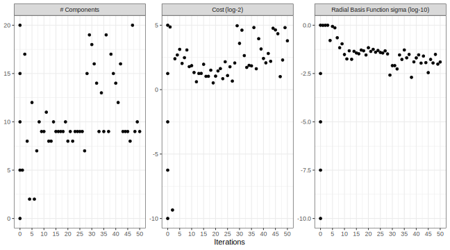

## Introduction

To use code in this article,  you will need to install the following packages: kernlab, modeldata, themis, and tidymodels.

Many of the examples for model tuning focus on [grid search](/learn/work/tune-svm/). For that method, all the candidate tuning parameter combinations are defined prior to evaluation. Alternatively, _iterative search_ can be used to analyze the existing tuning parameter results and then _predict_ which tuning parameters to try next. 

There are a variety of methods for iterative search and the focus in this article is on _Bayesian optimization_. For more information on this method, these resources might be helpful:

* [_Practical bayesian optimization of machine learning algorithms_](https://scholar.google.com/scholar?hl=en&as_sdt=0%2C7&q=Practical+Bayesian+Optimization+of+Machine+Learning+Algorithms&btnG=) (2012). J Snoek, H Larochelle, and RP Adams. Advances in neural information.  

* [_A Tutorial on Bayesian Optimization for Machine Learning_](https://www.cs.toronto.edu/~rgrosse/courses/csc411_f18/tutorials/tut8_adams_slides.pdf) (2018). R Adams.

 * [_Gaussian Processes for Machine Learning_](http://www.gaussianprocess.org/gpml/) (2006). C E Rasmussen and C Williams.

* [Other articles!](https://scholar.google.com/scholar?hl=en&as_sdt=0%2C7&q="Bayesian+Optimization"&btnG=)


## Cell segmenting revisited

To demonstrate this approach to tuning models, let's return to the cell segmentation data from the [Getting Started](/start/resampling/) article on resampling: 


::: {.cell layout-align="center" hash='cache/import-data_1529c5bf7506d469f00dc2d2a642ee81'}

```{.r .cell-code}
library(tidymodels)
library(modeldata)

# Load data
data(cells)

set.seed(2369)
tr_te_split <- initial_split(cells %>% select(-case), prop = 3/4)
cell_train <- training(tr_te_split)
cell_test  <- testing(tr_te_split)

set.seed(1697)
folds <- vfold_cv(cell_train, v = 10)
```
:::


## The tuning scheme

Since the predictors are highly correlated, we can used a recipe to convert the original predictors to principal component scores. There is also slight class imbalance in these data; about 64% of the data are poorly segmented. To mitigate this, the data will be down-sampled at the end of the pre-processing so that the number of poorly and well segmented cells occur with equal frequency. We can use a recipe for all this pre-processing, but the number of principal components will need to be _tuned_ so that we have enough (but not too many) representations of the data. 


::: {.cell layout-align="center" hash='cache/recipe_3a94713e4733aa81f01793825603ac74'}

```{.r .cell-code}
library(themis)

cell_pre_proc <-
  recipe(class ~ ., data = cell_train) %>%
  step_YeoJohnson(all_predictors()) %>%
  step_normalize(all_predictors()) %>%
  step_pca(all_predictors(), num_comp = tune()) %>%
  step_downsample(class)
```
:::


In this analysis, we will use a support vector machine to model the data. Let's use a radial basis function (RBF) kernel and tune its main parameter ($\sigma$). Additionally, the main SVM parameter, the cost value, also needs optimization. 


::: {.cell layout-align="center" hash='cache/model_e6bfaeec3b8139f5ab952957740a6b58'}

```{.r .cell-code}
svm_mod <-
  svm_rbf(mode = "classification", cost = tune(), rbf_sigma = tune()) %>%
  set_engine("kernlab")
```
:::


These two objects (the recipe and model) will be combined into a single object via the `workflow()` function from the [workflows](https://workflows.tidymodels.org/) package; this object will be used in the optimization process. 


::: {.cell layout-align="center" hash='cache/workflow_0cafc1c93aa4b6c10cf118dc7ac36998'}

```{.r .cell-code}
svm_wflow <-
  workflow() %>%
  add_model(svm_mod) %>%
  add_recipe(cell_pre_proc)
```
:::


From this object, we can derive information about what parameters are slated to be tuned. A parameter set is derived by: 


::: {.cell layout-align="center" hash='cache/pset_cf3c71a071bdd3ded2e951c057eb4e7e'}

```{.r .cell-code}
svm_set <- extract_parameter_set_dials(svm_wflow)
svm_set
#> Collection of 3 parameters for tuning
#> 
#>  identifier      type    object
#>        cost      cost nparam[+]
#>   rbf_sigma rbf_sigma nparam[+]
#>    num_comp  num_comp nparam[+]
```
:::


The default range for the number of PCA components is rather small for this data set. A member of the parameter set can be modified using the `update()` function. Let's constrain the search to one to twenty components by updating the `num_comp` parameter. Additionally, the lower bound of this parameter is set to zero which specifies that the original predictor set should also be evaluated (i.e., with no PCA step at all): 


::: {.cell layout-align="center" hash='cache/update_464c1742f1417462a8f562edbf371c2b'}

```{.r .cell-code}
svm_set <- 
  svm_set %>% 
  update(num_comp = num_comp(c(0L, 20L)))
```
:::


## Sequential tuning 

Bayesian optimization is a sequential method that uses a model to predict new candidate parameters for assessment. When scoring potential parameter value, the mean and variance of performance are predicted. The strategy used to define how these two statistical quantities are used is defined by an _acquisition function_. 

For example, one approach for scoring new candidates is to use a confidence bound. Suppose accuracy is being optimized. For a metric that we want to maximize, a lower confidence bound can be used. The multiplier on the standard error (denoted as $\kappa$) is a value that can be used to make trade-offs between **exploration** and **exploitation**. 

 * **Exploration** means that the search will consider candidates in untested space.

 * **Exploitation** focuses in areas where the previous best results occurred. 

The variance predicted by the Bayesian model is mostly spatial variation; the value will be large for candidate values that are not close to values that have already been evaluated. If the standard error multiplier is high, the search process will be more likely to avoid areas without candidate values in the vicinity. 

We'll use another acquisition function, _expected improvement_, that determines which candidates are likely to be helpful relative to the current best results. This is the default acquisition function. More information on these functions can be found in the [package vignette for acquisition functions](https://tune.tidymodels.org/articles/acquisition_functions.html). 


::: {.cell layout-align="center"}

```{.r .cell-code}
set.seed(12)
search_res <-
  svm_wflow %>% 
  tune_bayes(
    resamples = folds,
    # To use non-default parameter ranges
    param_info = svm_set,
    # Generate five at semi-random to start
    initial = 5,
    iter = 50,
    # How to measure performance?
    metrics = metric_set(roc_auc),
    control = control_bayes(no_improve = 30, verbose = TRUE)
  )
#> 
#> ❯  Generating a set of 5 initial parameter results
#> ✓ Initialization complete
#> 
#> 
#> ── Iteration 1 ───────────────────────────────────────────────────────
#> 
#> i Current best:		roc_auc=0.8794 (@iter 0)
#> i Gaussian process model
#> ✓ Gaussian process model
#> i Generating 5000 candidates
#> i Predicted candidates
#> i cost=29.2, rbf_sigma=0.707, num_comp=17
#> i Estimating performance
#> ✓ Estimating performance
#> ⓧ Newest results:	roc_auc=0.7883 (+/-0.0111)
#> 
#> ── Iteration 2 ───────────────────────────────────────────────────────
#> 
#> i Current best:		roc_auc=0.8794 (@iter 0)
#> i Gaussian process model
#> ✓ Gaussian process model
#> i Generating 5000 candidates
#> i Predicted candidates
#> i cost=30.4, rbf_sigma=0.0087, num_comp=13
#> i Estimating performance
#> ✓ Estimating performance
#> ♥ Newest results:	roc_auc=0.8954 (+/-0.0101)
#> 
#> ── Iteration 3 ───────────────────────────────────────────────────────
#> 
#> i Current best:		roc_auc=0.8954 (@iter 2)
#> i Gaussian process model
#> ✓ Gaussian process model
#> i Generating 5000 candidates
#> i Predicted candidates
#> i cost=0.0374, rbf_sigma=0.00425, num_comp=11
#> i Estimating performance
#> ✓ Estimating performance
#> ⓧ Newest results:	roc_auc=0.8749 (+/-0.0123)
#> 
#> ── Iteration 4 ───────────────────────────────────────────────────────
#> 
#> i Current best:		roc_auc=0.8954 (@iter 2)
#> i Gaussian process model
#> ✓ Gaussian process model
#> i Generating 5000 candidates
#> i Predicted candidates
#> i cost=28.8, rbf_sigma=0.00386, num_comp=4
#> i Estimating performance
#> ✓ Estimating performance
#> ⓧ Newest results:	roc_auc=0.8738 (+/-0.012)
#> 
#> ── Iteration 5 ───────────────────────────────────────────────────────
#> 
#> i Current best:		roc_auc=0.8954 (@iter 2)
#> i Gaussian process model
#> ✓ Gaussian process model
#> i Generating 5000 candidates
#> i Predicted candidates
#> i cost=21.5, rbf_sigma=0.0738, num_comp=11
#> i Estimating performance
#> ✓ Estimating performance
#> ⓧ Newest results:	roc_auc=0.8523 (+/-0.0115)
#> 
#> ── Iteration 6 ───────────────────────────────────────────────────────
#> 
#> i Current best:		roc_auc=0.8954 (@iter 2)
#> i Gaussian process model
#> ✓ Gaussian process model
#> i Generating 5000 candidates
#> i Predicted candidates
#> i cost=24.1, rbf_sigma=0.0111, num_comp=18
#> i Estimating performance
#> ✓ Estimating performance
#> ⓧ Newest results:	roc_auc=0.8829 (+/-0.0101)
#> 
#> ── Iteration 7 ───────────────────────────────────────────────────────
#> 
#> i Current best:		roc_auc=0.8954 (@iter 2)
#> i Gaussian process model
#> ✓ Gaussian process model
#> i Generating 5000 candidates
#> i Predicted candidates
#> i cost=1.48, rbf_sigma=0.00629, num_comp=13
#> i Estimating performance
#> ✓ Estimating performance
#> ⓧ Newest results:	roc_auc=0.8801 (+/-0.0118)
#> 
#> ── Iteration 8 ───────────────────────────────────────────────────────
#> 
#> i Current best:		roc_auc=0.8954 (@iter 2)
#> i Gaussian process model
#> ✓ Gaussian process model
#> i Generating 5000 candidates
#> i Predicted candidates
#> i cost=25.3, rbf_sigma=0.011, num_comp=11
#> i Estimating performance
#> ✓ Estimating performance
#> ♥ Newest results:	roc_auc=0.8985 (+/-0.0102)
#> 
#> ── Iteration 9 ───────────────────────────────────────────────────────
#> 
#> i Current best:		roc_auc=0.8985 (@iter 8)
#> i Gaussian process model
#> ✓ Gaussian process model
#> i Generating 5000 candidates
#> i Predicted candidates
#> i cost=14.8, rbf_sigma=0.628, num_comp=0
#> i Estimating performance
#> ✓ Estimating performance
#> ⓧ Newest results:	roc_auc=0.7852 (+/-0.0173)
#> 
#> ── Iteration 10 ──────────────────────────────────────────────────────
#> 
#> i Current best:		roc_auc=0.8985 (@iter 8)
#> i Gaussian process model
#> ✓ Gaussian process model
#> i Generating 5000 candidates
#> i Predicted candidates
#> i cost=30.1, rbf_sigma=0.0102, num_comp=10
#> i Estimating performance
#> ✓ Estimating performance
#> ♥ Newest results:	roc_auc=0.899 (+/-0.00955)
#> 
#> ── Iteration 11 ──────────────────────────────────────────────────────
#> 
#> i Current best:		roc_auc=0.899 (@iter 10)
#> i Gaussian process model
#> ✓ Gaussian process model
#> i Generating 5000 candidates
#> i Predicted candidates
#> i cost=25.1, rbf_sigma=0.0111, num_comp=9
#> i Estimating performance
#> ✓ Estimating performance
#> ♥ Newest results:	roc_auc=0.8994 (+/-0.00996)
#> 
#> ── Iteration 12 ──────────────────────────────────────────────────────
#> 
#> i Current best:		roc_auc=0.8994 (@iter 11)
#> i Gaussian process model
#> ✓ Gaussian process model
#> i Generating 5000 candidates
#> i Predicted candidates
#> i cost=28.3, rbf_sigma=0.0118, num_comp=10
#> i Estimating performance
#> ✓ Estimating performance
#> ⓧ Newest results:	roc_auc=0.8989 (+/-0.00928)
#> 
#> ── Iteration 13 ──────────────────────────────────────────────────────
#> 
#> i Current best:		roc_auc=0.8994 (@iter 11)
#> i Gaussian process model
#> ✓ Gaussian process model
#> i Generating 5000 candidates
#> i Predicted candidates
#> i cost=28.5, rbf_sigma=0.0026, num_comp=19
#> i Estimating performance
#> ✓ Estimating performance
#> ⓧ Newest results:	roc_auc=0.8879 (+/-0.00951)
#> 
#> ── Iteration 14 ──────────────────────────────────────────────────────
#> 
#> i Current best:		roc_auc=0.8994 (@iter 11)
#> i Gaussian process model
#> ✓ Gaussian process model
#> i Generating 5000 candidates
#> i Predicted candidates
#> i cost=30.4, rbf_sigma=0.00245, num_comp=9
#> i Estimating performance
#> ✓ Estimating performance
#> ⓧ Newest results:	roc_auc=0.886 (+/-0.0111)
#> 
#> ── Iteration 15 ──────────────────────────────────────────────────────
#> 
#> i Current best:		roc_auc=0.8994 (@iter 11)
#> i Gaussian process model
#> ✓ Gaussian process model
#> i Generating 5000 candidates
#> i Predicted candidates
#> i cost=31.5, rbf_sigma=0.0179, num_comp=9
#> i Estimating performance
#> ✓ Estimating performance
#> ⓧ Newest results:	roc_auc=0.8964 (+/-0.00967)
#> 
#> ── Iteration 16 ──────────────────────────────────────────────────────
#> 
#> i Current best:		roc_auc=0.8994 (@iter 11)
#> i Gaussian process model
#> ✓ Gaussian process model
#> i Generating 5000 candidates
#> i Predicted candidates
#> i cost=31.1, rbf_sigma=0.00933, num_comp=10
#> i Estimating performance
#> ✓ Estimating performance
#> ⓧ Newest results:	roc_auc=0.8994 (+/-0.00968)
#> 
#> ── Iteration 17 ──────────────────────────────────────────────────────
#> 
#> i Current best:		roc_auc=0.8994 (@iter 11)
#> i Gaussian process model
#> ✓ Gaussian process model
#> i Generating 5000 candidates
#> i Predicted candidates
#> i cost=27.3, rbf_sigma=0.00829, num_comp=9
#> i Estimating performance
#> ✓ Estimating performance
#> ♥ Newest results:	roc_auc=0.8995 (+/-0.00996)
#> 
#> ── Iteration 18 ──────────────────────────────────────────────────────
#> 
#> i Current best:		roc_auc=0.8995 (@iter 17)
#> i Gaussian process model
#> ✓ Gaussian process model
#> i Generating 5000 candidates
#> i Predicted candidates
#> i cost=31.7, rbf_sigma=0.00363, num_comp=12
#> i Estimating performance
#> ✓ Estimating performance
#> ⓧ Newest results:	roc_auc=0.8909 (+/-0.00973)
#> 
#> ── Iteration 19 ──────────────────────────────────────────────────────
#> 
#> i Current best:		roc_auc=0.8995 (@iter 17)
#> i Gaussian process model
#> ✓ Gaussian process model
#> i Generating 5000 candidates
#> i Predicted candidates
#> i cost=29.6, rbf_sigma=0.0119, num_comp=8
#> i Estimating performance
#> ✓ Estimating performance
#> ⓧ Newest results:	roc_auc=0.8964 (+/-0.0104)
#> 
#> ── Iteration 20 ──────────────────────────────────────────────────────
#> 
#> i Current best:		roc_auc=0.8995 (@iter 17)
#> i Gaussian process model
#> ✓ Gaussian process model
#> i Generating 5000 candidates
#> i Predicted candidates
#> i cost=23.6, rbf_sigma=0.0121, num_comp=0
#> i Estimating performance
#> ✓ Estimating performance
#> ⓧ Newest results:	roc_auc=0.8636 (+/-0.0122)
#> 
#> ── Iteration 21 ──────────────────────────────────────────────────────
#> 
#> i Current best:		roc_auc=0.8995 (@iter 17)
#> i Gaussian process model
#> ✓ Gaussian process model
#> i Generating 5000 candidates
#> i Predicted candidates
#> i cost=27.6, rbf_sigma=0.00824, num_comp=10
#> i Estimating performance
#> ✓ Estimating performance
#> ⓧ Newest results:	roc_auc=0.8993 (+/-0.00961)
#> 
#> ── Iteration 22 ──────────────────────────────────────────────────────
#> 
#> i Current best:		roc_auc=0.8995 (@iter 17)
#> i Gaussian process model
#> ✓ Gaussian process model
#> i Generating 5000 candidates
#> i Predicted candidates
#> i cost=27.6, rbf_sigma=0.00901, num_comp=9
#> i Estimating performance
#> ✓ Estimating performance
#> ⓧ Newest results:	roc_auc=0.8993 (+/-0.01)
#> 
#> ── Iteration 23 ──────────────────────────────────────────────────────
#> 
#> i Current best:		roc_auc=0.8995 (@iter 17)
#> i Gaussian process model
#> ✓ Gaussian process model
#> i Generating 5000 candidates
#> i Predicted candidates
#> i cost=24.1, rbf_sigma=0.0133, num_comp=10
#> i Estimating performance
#> ✓ Estimating performance
#> ⓧ Newest results:	roc_auc=0.8988 (+/-0.00935)
#> 
#> ── Iteration 24 ──────────────────────────────────────────────────────
#> 
#> i Current best:		roc_auc=0.8995 (@iter 17)
#> i Gaussian process model
#> ✓ Gaussian process model
#> i Generating 5000 candidates
#> i Predicted candidates
#> i cost=18.8, rbf_sigma=0.00058, num_comp=20
#> i Estimating performance
#> ✓ Estimating performance
#> ⓧ Newest results:	roc_auc=0.8784 (+/-0.0112)
#> 
#> ── Iteration 25 ──────────────────────────────────────────────────────
#> 
#> i Current best:		roc_auc=0.8995 (@iter 17)
#> i Gaussian process model
#> ✓ Gaussian process model
#> i Generating 5000 candidates
#> i Predicted candidates
#> i cost=29.3, rbf_sigma=0.00958, num_comp=10
#> i Estimating performance
#> ✓ Estimating performance
#> ⓧ Newest results:	roc_auc=0.8994 (+/-0.00959)
#> 
#> ── Iteration 26 ──────────────────────────────────────────────────────
#> 
#> i Current best:		roc_auc=0.8995 (@iter 17)
#> i Gaussian process model
#> ✓ Gaussian process model
#> i Generating 5000 candidates
#> i Predicted candidates
#> i cost=30.6, rbf_sigma=0.00841, num_comp=10
#> i Estimating performance
#> ✓ Estimating performance
#> ⓧ Newest results:	roc_auc=0.8993 (+/-0.00949)
#> 
#> ── Iteration 27 ──────────────────────────────────────────────────────
#> 
#> i Current best:		roc_auc=0.8995 (@iter 17)
#> i Gaussian process model
#> ✓ Gaussian process model
#> i Generating 5000 candidates
#> i Predicted candidates
#> i cost=0.00169, rbf_sigma=0.0201, num_comp=10
#> i Estimating performance
#> ✓ Estimating performance
#> ⓧ Newest results:	roc_auc=0.8794 (+/-0.0119)
#> 
#> ── Iteration 28 ──────────────────────────────────────────────────────
#> 
#> i Current best:		roc_auc=0.8995 (@iter 17)
#> i Gaussian process model
#> ✓ Gaussian process model
#> i Generating 5000 candidates
#> i Predicted candidates
#> i cost=0.0012, rbf_sigma=0.000867, num_comp=20
#> i Estimating performance
#> ✓ Estimating performance
#> ⓧ Newest results:	roc_auc=0.3452 (+/-0.116)
#> 
#> ── Iteration 29 ──────────────────────────────────────────────────────
#> 
#> i Current best:		roc_auc=0.8995 (@iter 17)
#> i Gaussian process model
#> ✓ Gaussian process model
#> i Generating 5000 candidates
#> i Predicted candidates
#> i cost=0.00128, rbf_sigma=0.0138, num_comp=4
#> i Estimating performance
#> ✓ Estimating performance
#> ⓧ Newest results:	roc_auc=0.8671 (+/-0.0132)
#> 
#> ── Iteration 30 ──────────────────────────────────────────────────────
#> 
#> i Current best:		roc_auc=0.8995 (@iter 17)
#> i Gaussian process model
#> ✓ Gaussian process model
#> i Generating 5000 candidates
#> i Predicted candidates
#> i cost=0.0319, rbf_sigma=0.0279, num_comp=9
#> i Estimating performance
#> ✓ Estimating performance
#> ⓧ Newest results:	roc_auc=0.8805 (+/-0.0121)
#> 
#> ── Iteration 31 ──────────────────────────────────────────────────────
#> 
#> i Current best:		roc_auc=0.8995 (@iter 17)
#> i Gaussian process model
#> ✓ Gaussian process model
#> i Generating 5000 candidates
#> i Predicted candidates
#> i cost=0.0011, rbf_sigma=0.00787, num_comp=8
#> i Estimating performance
#> ✓ Estimating performance
#> ⓧ Newest results:	roc_auc=0.8762 (+/-0.0121)
#> 
#> ── Iteration 32 ──────────────────────────────────────────────────────
#> 
#> i Current best:		roc_auc=0.8995 (@iter 17)
#> i Gaussian process model
#> ✓ Gaussian process model
#> i Generating 5000 candidates
#> i Predicted candidates
#> i cost=7.06, rbf_sigma=0.00645, num_comp=10
#> i Estimating performance
#> ✓ Estimating performance
#> ⓧ Newest results:	roc_auc=0.89 (+/-0.0102)
#> 
#> ── Iteration 33 ──────────────────────────────────────────────────────
#> 
#> i Current best:		roc_auc=0.8995 (@iter 17)
#> i Gaussian process model
#> ✓ Gaussian process model
#> i Generating 5000 candidates
#> i Predicted candidates
#> i cost=0.000998, rbf_sigma=0.305, num_comp=7
#> i Estimating performance
#> ✓ Estimating performance
#> ⓧ Newest results:	roc_auc=0.8757 (+/-0.0126)
#> 
#> ── Iteration 34 ──────────────────────────────────────────────────────
#> 
#> i Current best:		roc_auc=0.8995 (@iter 17)
#> i Gaussian process model
#> ✓ Gaussian process model
#> i Generating 5000 candidates
#> i Predicted candidates
#> i cost=0.00615, rbf_sigma=0.0134, num_comp=8
#> i Estimating performance
#> ✓ Estimating performance
#> ⓧ Newest results:	roc_auc=0.877 (+/-0.0122)
#> 
#> ── Iteration 35 ──────────────────────────────────────────────────────
#> 
#> i Current best:		roc_auc=0.8995 (@iter 17)
#> i Gaussian process model
#> ✓ Gaussian process model
#> i Generating 5000 candidates
#> i Predicted candidates
#> i cost=0.208, rbf_sigma=0.00946, num_comp=10
#> i Estimating performance
#> ✓ Estimating performance
#> ⓧ Newest results:	roc_auc=0.8793 (+/-0.0122)
#> 
#> ── Iteration 36 ──────────────────────────────────────────────────────
#> 
#> i Current best:		roc_auc=0.8995 (@iter 17)
#> i Gaussian process model
#> ✓ Gaussian process model
#> i Generating 5000 candidates
#> i Predicted candidates
#> i cost=31.6, rbf_sigma=0.00481, num_comp=15
#> i Estimating performance
#> ✓ Estimating performance
#> ⓧ Newest results:	roc_auc=0.8961 (+/-0.00885)
#> 
#> ── Iteration 37 ──────────────────────────────────────────────────────
#> 
#> i Current best:		roc_auc=0.8995 (@iter 17)
#> i Gaussian process model
#> ✓ Gaussian process model
#> i Generating 5000 candidates
#> i Predicted candidates
#> i cost=0.00108, rbf_sigma=0.653, num_comp=11
#> i Estimating performance
#> ✓ Estimating performance
#> ⓧ Newest results:	roc_auc=0.3649 (+/-0.106)
#> 
#> ── Iteration 38 ──────────────────────────────────────────────────────
#> 
#> i Current best:		roc_auc=0.8995 (@iter 17)
#> i Gaussian process model
#> ✓ Gaussian process model
#> i Generating 5000 candidates
#> i Predicted candidates
#> i cost=0.00156, rbf_sigma=0.13, num_comp=5
#> i Estimating performance
#> ✓ Estimating performance
#> ⓧ Newest results:	roc_auc=0.8816 (+/-0.0121)
#> 
#> ── Iteration 39 ──────────────────────────────────────────────────────
#> 
#> i Current best:		roc_auc=0.8995 (@iter 17)
#> i Gaussian process model
#> ✓ Gaussian process model
#> i Generating 5000 candidates
#> i Predicted candidates
#> i cost=7.03, rbf_sigma=0.235, num_comp=16
#> i Estimating performance
#> ✓ Estimating performance
#> ⓧ Newest results:	roc_auc=0.8572 (+/-0.0117)
#> 
#> ── Iteration 40 ──────────────────────────────────────────────────────
#> 
#> i Current best:		roc_auc=0.8995 (@iter 17)
#> i Gaussian process model
#> ✓ Gaussian process model
#> i Generating 5000 candidates
#> i Predicted candidates
#> i cost=0.00466, rbf_sigma=0.211, num_comp=1
#> i Estimating performance
#> ✓ Estimating performance
#> ⓧ Newest results:	roc_auc=0.7714 (+/-0.0105)
#> 
#> ── Iteration 41 ──────────────────────────────────────────────────────
#> 
#> i Current best:		roc_auc=0.8995 (@iter 17)
#> i Gaussian process model
#> ✓ Gaussian process model
#> i Generating 5000 candidates
#> i Predicted candidates
#> i cost=0.0357, rbf_sigma=0.00126, num_comp=1
#> i Estimating performance
#> ✓ Estimating performance
#> ⓧ Newest results:	roc_auc=0.7725 (+/-0.0106)
#> 
#> ── Iteration 42 ──────────────────────────────────────────────────────
#> 
#> i Current best:		roc_auc=0.8995 (@iter 17)
#> i Gaussian process model
#> ✓ Gaussian process model
#> i Generating 5000 candidates
#> i Predicted candidates
#> i cost=23.1, rbf_sigma=0.0332, num_comp=16
#> i Estimating performance
#> ✓ Estimating performance
#> ⓧ Newest results:	roc_auc=0.8612 (+/-0.0137)
#> 
#> ── Iteration 43 ──────────────────────────────────────────────────────
#> 
#> i Current best:		roc_auc=0.8995 (@iter 17)
#> i Gaussian process model
#> ✓ Gaussian process model
#> i Generating 5000 candidates
#> i Predicted candidates
#> i cost=3.56, rbf_sigma=0.0294, num_comp=3
#> i Estimating performance
#> ✓ Estimating performance
#> ⓧ Newest results:	roc_auc=0.8724 (+/-0.0126)
#> 
#> ── Iteration 44 ──────────────────────────────────────────────────────
#> 
#> i Current best:		roc_auc=0.8995 (@iter 17)
#> i Gaussian process model
#> ✓ Gaussian process model
#> i Generating 5000 candidates
#> i Predicted candidates
#> i cost=0.00168, rbf_sigma=0.0337, num_comp=7
#> i Estimating performance
#> ✓ Estimating performance
#> ⓧ Newest results:	roc_auc=0.8791 (+/-0.0123)
#> 
#> ── Iteration 45 ──────────────────────────────────────────────────────
#> 
#> i Current best:		roc_auc=0.8995 (@iter 17)
#> i Gaussian process model
#> ✓ Gaussian process model
#> i Generating 5000 candidates
#> i Predicted candidates
#> i cost=0.00128, rbf_sigma=0.00258, num_comp=10
#> i Estimating performance
#> ✓ Estimating performance
#> ⓧ Newest results:	roc_auc=0.3444 (+/-0.114)
#> 
#> ── Iteration 46 ──────────────────────────────────────────────────────
#> 
#> i Current best:		roc_auc=0.8995 (@iter 17)
#> i Gaussian process model
#> ✓ Gaussian process model
#> i Generating 5000 candidates
#> i Predicted candidates
#> i cost=0.506, rbf_sigma=0.000548, num_comp=4
#> i Estimating performance
#> ✓ Estimating performance
#> ⓧ Newest results:	roc_auc=0.8653 (+/-0.0131)
#> 
#> ── Iteration 47 ──────────────────────────────────────────────────────
#> 
#> i Current best:		roc_auc=0.8995 (@iter 17)
#> i Gaussian process model
#> ✓ Gaussian process model
#> i Generating 5000 candidates
#> i Predicted candidates
#> i cost=0.00142, rbf_sigma=0.204, num_comp=18
#> i Estimating performance
#> ✓ Estimating performance
#> ⓧ Newest results:	roc_auc=0.3586 (+/-0.113)
#> ! No improvement for 30 iterations; returning current results.
```
:::


The resulting tibble is a stacked set of rows of the rsample object with an additional column for the iteration number:


::: {.cell layout-align="center" hash='cache/show-iters_0c5a1059c1edff5eeab971a512ddaf07'}

```{.r .cell-code}
search_res
#> # Tuning results
#> # 10-fold cross-validation 
#> # A tibble: 480 × 5
#>    splits             id     .metrics         .notes           .iter
#>    <list>             <chr>  <list>           <list>           <int>
#>  1 <split [1362/152]> Fold01 <tibble [5 × 7]> <tibble [0 × 3]>     0
#>  2 <split [1362/152]> Fold02 <tibble [5 × 7]> <tibble [0 × 3]>     0
#>  3 <split [1362/152]> Fold03 <tibble [5 × 7]> <tibble [0 × 3]>     0
#>  4 <split [1362/152]> Fold04 <tibble [5 × 7]> <tibble [0 × 3]>     0
#>  5 <split [1363/151]> Fold05 <tibble [5 × 7]> <tibble [0 × 3]>     0
#>  6 <split [1363/151]> Fold06 <tibble [5 × 7]> <tibble [0 × 3]>     0
#>  7 <split [1363/151]> Fold07 <tibble [5 × 7]> <tibble [0 × 3]>     0
#>  8 <split [1363/151]> Fold08 <tibble [5 × 7]> <tibble [0 × 3]>     0
#>  9 <split [1363/151]> Fold09 <tibble [5 × 7]> <tibble [0 × 3]>     0
#> 10 <split [1363/151]> Fold10 <tibble [5 × 7]> <tibble [0 × 3]>     0
#> # ℹ 470 more rows
```
:::


As with grid search, we can summarize the results over resamples:


::: {.cell layout-align="center" hash='cache/summarize-iters_5b523c02b6e0d62bf64ada84f224e2b3'}

```{.r .cell-code}
estimates <- 
  collect_metrics(search_res) %>% 
  arrange(.iter)

estimates
#> # A tibble: 52 × 10
#>        cost    rbf_sigma num_comp .metric .estimator  mean     n std_err .config
#>       <dbl>        <dbl>    <int> <chr>   <chr>      <dbl> <int>   <dbl> <chr>  
#>  1  0.00383      2.72e-6       17 roc_auc binary     0.348    10  0.114  Prepro…
#>  2  0.250        1.55e-2        7 roc_auc binary     0.879    10  0.0122 Prepro…
#>  3  0.0372       1.02e-9        3 roc_auc binary     0.242    10  0.0574 Prepro…
#>  4  1.28         8.13e-8        8 roc_auc binary     0.344    10  0.114  Prepro…
#>  5 10.3          1.37e-3       14 roc_auc binary     0.877    10  0.0117 Prepro…
#>  6 29.2          7.07e-1       17 roc_auc binary     0.788    10  0.0111 Iter1  
#>  7 30.4          8.70e-3       13 roc_auc binary     0.895    10  0.0101 Iter2  
#>  8  0.0374       4.25e-3       11 roc_auc binary     0.875    10  0.0123 Iter3  
#>  9 28.8          3.86e-3        4 roc_auc binary     0.874    10  0.0120 Iter4  
#> 10 21.5          7.38e-2       11 roc_auc binary     0.852    10  0.0115 Iter5  
#> # ℹ 42 more rows
#> # ℹ 1 more variable: .iter <int>
```
:::


The best performance of the initial set of candidate values was `AUC = 0.8793995 `. The best results were achieved at iteration 17 with a corresponding AUC value of 0.8995344. The five best results are:


::: {.cell layout-align="center" hash='cache/best_62f09d71954a0558c204598af5a9d34e'}

```{.r .cell-code}
show_best(search_res, metric = "roc_auc")
#> # A tibble: 5 × 10
#>    cost rbf_sigma num_comp .metric .estimator  mean     n std_err .config .iter
#>   <dbl>     <dbl>    <int> <chr>   <chr>      <dbl> <int>   <dbl> <chr>   <int>
#> 1  27.3   0.00829        9 roc_auc binary     0.900    10 0.00996 Iter17     17
#> 2  29.3   0.00958       10 roc_auc binary     0.899    10 0.00959 Iter25     25
#> 3  25.1   0.0111         9 roc_auc binary     0.899    10 0.00996 Iter11     11
#> 4  31.1   0.00933       10 roc_auc binary     0.899    10 0.00968 Iter16     16
#> 5  27.6   0.00901        9 roc_auc binary     0.899    10 0.0100  Iter22     22
```
:::


A plot of the search iterations can be created via:


::: {.cell layout-align="center" hash='cache/bo-plot_ef6a7ea30999c593a6bb4de937b7cea5'}

```{.r .cell-code}
autoplot(search_res, type = "performance")
```

::: {.cell-output-display}
{fig-align='center' width=672}
:::
:::


There are many parameter combinations have roughly equivalent results. 

How did the parameters change over iterations? 


::: {.cell layout-align="center" hash='cache/bo-param-plot_6ae91e4892a836db44633e6bfd845f00'}

```{.r .cell-code}
autoplot(search_res, type = "parameters") + 
  labs(x = "Iterations", y = NULL)
```

::: {.cell-output-display}
{fig-align='center' width=864}
:::
:::


## Session information {#session-info}


::: {.cell layout-align="center" hash='cache/si_43a75b68dcc94565ba13180d7ad26a69'}

```
#> ─ Session info ─────────────────────────────────────────────────────
#>  setting  value
#>  version  R version 4.3.0 (2023-04-21)
#>  os       macOS Ventura 13.4
#>  system   aarch64, darwin20
#>  ui       X11
#>  language (EN)
#>  collate  en_US.UTF-8
#>  ctype    en_US.UTF-8
#>  tz       America/Los_Angeles
#>  date     2023-07-02
#>  pandoc   3.1.1 @ /Applications/RStudio.app/Contents/Resources/app/quarto/bin/tools/ (via rmarkdown)
#> 
#> ─ Packages ─────────────────────────────────────────────────────────
#>  package    * version date (UTC) lib source
#>  broom      * 1.0.4   2023-03-11 [1] CRAN (R 4.3.0)
#>  dials      * 1.2.0   2023-04-03 [1] CRAN (R 4.3.0)
#>  dplyr      * 1.1.2   2023-04-20 [1] CRAN (R 4.3.0)
#>  ggplot2    * 3.4.2   2023-04-03 [1] CRAN (R 4.3.0)
#>  infer      * 1.0.4   2022-12-02 [1] CRAN (R 4.3.0)
#>  kernlab    * 0.9-32  2023-01-31 [1] CRAN (R 4.3.0)
#>  modeldata  * 1.1.0   2023-01-25 [1] CRAN (R 4.3.0)
#>  parsnip    * 1.1.0   2023-04-12 [1] CRAN (R 4.3.0)
#>  purrr      * 1.0.1   2023-01-10 [1] CRAN (R 4.3.0)
#>  recipes    * 1.0.6   2023-04-25 [1] CRAN (R 4.3.0)
#>  rlang      * 1.1.1   2023-04-28 [1] CRAN (R 4.3.0)
#>  rsample    * 1.1.1   2022-12-07 [1] CRAN (R 4.3.0)
#>  themis     * 1.0.1   2023-04-14 [1] CRAN (R 4.3.0)
#>  tibble     * 3.2.1   2023-03-20 [1] CRAN (R 4.3.0)
#>  tidymodels * 1.1.0   2023-05-01 [1] CRAN (R 4.3.0)
#>  tune       * 1.1.1   2023-04-11 [1] CRAN (R 4.3.0)
#>  workflows  * 1.1.3   2023-02-22 [1] CRAN (R 4.3.0)
#>  yardstick  * 1.2.0   2023-04-21 [1] CRAN (R 4.3.0)
#> 
#>  [1] /Users/emilhvitfeldt/Library/R/arm64/4.3/library
#>  [2] /Library/Frameworks/R.framework/Versions/4.3-arm64/Resources/library
#> 
#> ────────────────────────────────────────────────────────────────────
```
:::
