While preprocessing is the transformation of the predictors prior to a model fit, post-processing is the transformation of the predictions after the model fit. This could be as straightforward as limiting predictions to a certain range of values to as complicated as transforming them based on a separate calibration model. 

A calibration model is used to model the relationship between the predictions based on the primary model and the true outcomes. An additional model means an additional chance to accidentially overfit. So when working with calibration, this is crucial: we cannot use the same data to fit our calibration model as we use to assess the combination of primary and calibration model. Using the same data to fit the primary model and the calibration model means the predictions used to fit the calibration model are re-predictions of the same observations used to fit the primary model. Hence they are closer to the true values than predictions on new data would be and the calibration model doesn't have accurate information to estimate the right trends (so that they then can be removed).

rsample provides a collection of functions to make resamples for empirical validation of prediction models. So far, the assumption was that the prediction model is the only model that needs fitting, i.e., a resample consists of an analysis set and an assessment set.

If we include calibration into our workflow (bundeling preprocessing, (primary) model, and post-processing), we want an analysis set, a calibration set, and an assessment set. 

Here we describe how we create these sets automatically when you resample or tune a workflow with calibration. Note that you currently cannot create manual calibration splits and supply them to the functions in tune, like `fit_resamples()` or `tune_grid()`. If you want to do this, leave us a [feature request](https://github.com/tidymodels/rsample/issues/new?template=feature_request.md).

## General principles

First principle: we leave the assessment set purely for performance assessment and rather treat the analysis set as "the data to fit" - except now we split it to fit two different models instead of just one. Or in other words, we take the data for the calibration set from the analysis set, not from the assessment set. 

If you compare a model with calibration to one without, and you use the same resamples, you are also using the same assessment sets.

"Taking data from the analysis set" means splitting up the analysis set to end up with ... an analysis set and a calibration set. Now we have two sets called analysis set, that's confusing. If we need to distinguish them, we'll refer to them as "outer" and "inner" analysis set for "before" and "after" the split for a calibration set.

::: {.cell layout-align="center"}
::: {.cell-output-display}
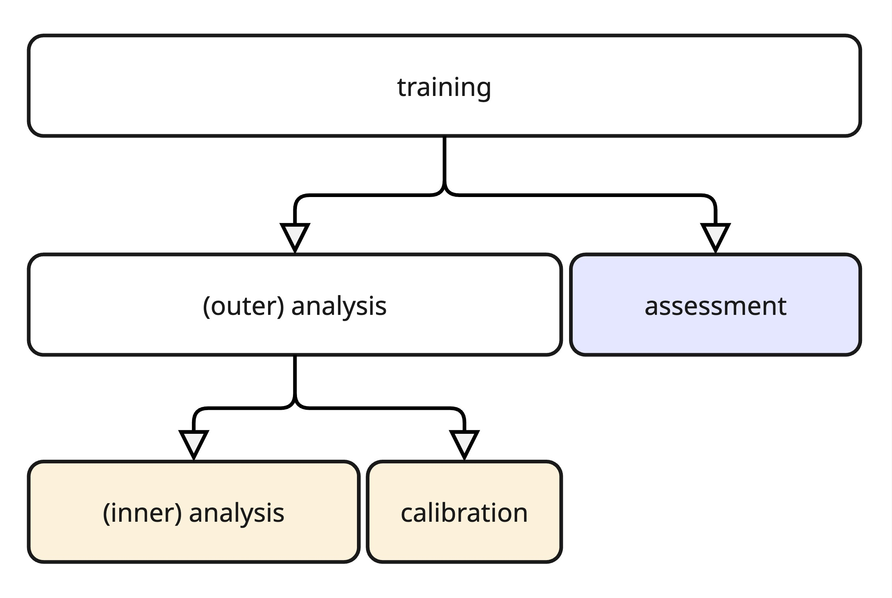{fig-align='center' height=350}
:::
:::

It is important to note that including calibration requires more data than fitting a workflow without calibration. For small datasets, you might run into situations where fitting either model (primary model or calibration model) is not particularly stable - or you might not even be able to construct a calibration set properly.

Second principle: we try to mimick the data splitting process used to create the (outer) analysis set and the assessment set.

And lastly, the third principle: if we cannot make a calibration split, we fall back onto an empty calibration set rather than erroring.

Let's look at v-fold cross-validation as an example.

### Example: v-fold cross-validation

For v-fold cross-validation, we split the data into `v` folds and create `v` resamples by always using one of the folds as the assessment set while combining the other folds into the analysis set. 

Since we want to have a calibration split similar in spirit, we are splitting the (outer) analysis set into (inner) analysis set and calibration set with the same proportion of observations going into the analysis set: 1 - 1/v.

This tidymodels-internal split of the (outer) analysis set that happens automatically during resampling is implemented in `internal_calibration_split()`. This function has methods for various types of resamples. They are exported to be used by tune but not intended to be user-facing. We are showing them here for illustration purposes.

::: {.cell layout-align="center"}

```{.r .cell-code}
set.seed(11)
r_set <- vfold_cv(warpbreaks, v = 5)
r_split <- get_rsplit(r_set, 1)
r_split
#> <Analysis/Assess/Total>
#> <43/11/54>

# proportion of observations allocated for fitting the model in the outer split
nrow(analysis(r_split)) / nrow(warpbreaks)
#> [1] 0.7962963

split_cal <- internal_calibration_split(r_split, .get_split_args(r_set))
split_cal
#> <Analysis/Calibration/Total>
#> <34/9/43>

# similar proportion of observations allocated for fitting the model in the inner split
nrow(analysis(split_cal)) / nrow(analysis(r_split))
#> [1] 0.7906977
```
:::

For most types of resamples, these principles are straightforward to apply. However, for resamples of ordered observations (like time series data) and bootstrap samples, we need to consider additional aspects.

## Splits for ordered observations

rsample's functions for creating resamples of ordered observations are the `sliding_*()` family: `sliding_window()`, `sliding_index()`, and `sliding_period()`.

- `sliding_window()` operates on the ordered rows, allowing us to specify how far to look back to create an analysis set, how far to look ahead to create an assessment set and then sliding that across the data to create a set of resamples.
- `sliding_index()` works in much the same way, with the key difference being that what we are sliding over aren't the rows directly but rather an index. This is useful when dealing with irregular series of data: while the number of rows which fall into a window can vary, the window length is the same across all resamples.
- `sliding_period()` takes the idea of the `sliding_index()` function one step further and aggregates the index into periods before sliding across. This is useful for aggregating, e.g., daily data into months and then defining the analysis and assessment set in terms of months rather than the daily index directly.

### Row-based splitting

Let's start with the row-based splitting done by `sliding_window()`. We'll use a very small example dataset. This will make it easier to illustrate how the different subsets of the data are created but note that it is too small for real-world purposes. Let's use a data frame with 11 rows and say we want to use 5 for the analysis set, 3 for the assessment set, and leave a gap of 2 in between those two sets. We can make two such resamples from our data frame.

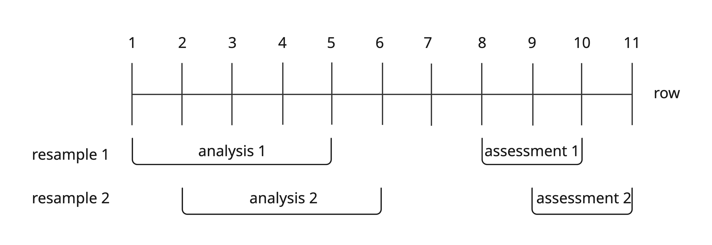

Or, in code:

::: {.cell layout-align="center"}

```{.r .cell-code}
df <- data.frame(x = 1:11)
r_set <- sliding_window(df, lookback = 4, assess_start = 3, assess_stop = 5)
r_set
#> # Sliding window resampling 
#> # A tibble: 2 × 2
#>   splits        id    
#>   <list>        <chr> 
#> 1 <split [5/3]> Slice1
#> 2 <split [5/3]> Slice2
```
:::

Let's take that first resample and split it into an (inner) analysis set and a calibration set. 

::: {.cell layout-align="center"}

```{.r .cell-code}
r_split <- get_rsplit(r_set, 1)
analysis(r_split)
#>   x
#> 1 1
#> 2 2
#> 3 3
#> 4 4
#> 5 5
```
:::

To mimick the split into (outer) analysis and assessment set, we'll calculate the proportion of the analysis set and apply it to the observations available for fitting both the primary model and the calibration model, creating our (inner) analysis set. Since the remaining observations could be for the calibration model or a gap, we also calculate the proportion of the assessment set and use it to construct the calibration set. 

::: {.cell layout-align="center"}

```{.r .cell-code}
lookback <- 4
assess_start <- 3
assess_stop <- 5

# absolute sizes in the  outer split
length_window <- lookback + 1 + assess_stop
length_analysis_outer <- lookback + 1
length_assess <- assess_stop - assess_start + 1

# relative sizes
prop_analysis <- length_analysis_outer / length_window
prop_assess <- length_assess / length_window

# absolute sizes in the inner split
length_analysis_inner <- ceiling(prop_analysis * length_analysis_outer)
length_calibration <- ceiling(prop_assess * length_analysis_outer)

c(length_analysis_inner, length_calibration)
#> [1] 3 2
```
:::

Calculating the length of the calibration set rather than the gap, together with rounding up when translating proportions to new lengths within the outer analysis set means that we prioritize allocating observations to the (inner) analysis and calibration set over allocating them to the gap. In this example here, this means that we are not leaving a gap between the analysis set and the calibration set.

However, rounding up for both (inner) analysis and calibration set when we don't have a gap could mean we end up allocating more observations than we actually have. So in that case, we try to take from the calibration set if possible and thus prioritzing fitting the prediction model over the calibration model.

::: {.cell layout-align="center"}

```{.r .cell-code}
if (length_analysis_inner + length_calibration > length_analysis_outer) {
  if (length_calibration > 1) {
    length_calibration <- length_calibration - 1
  } else {
    length_analysis_inner <- length_analysis_inner - 1
  }
}
```
:::

Keep in mind though that this example dataset is pathalogically small for illustration purposes. Of these details, the prioritization of analysis and calibration set over any gap in between them is most likely to be relevant. But even this should not be massively influential for amounts of data typically required for calibration.

Note that we cannot create a calibration split if `lookback = 0`, as this means that we only have a single row to work with.

From the `length_*`s, we can calculate the new `lookback`, `assess_start`, and `assess_stop` to be applied to the outer analysis set.

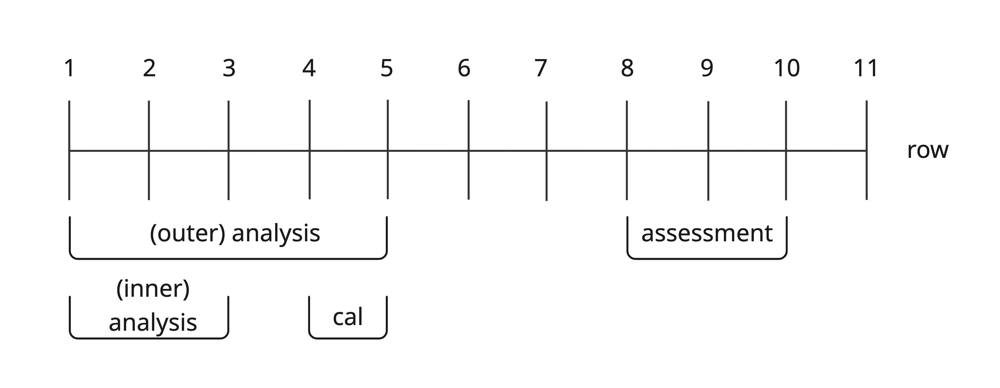

::: {.cell layout-align="center"}

```{.r .cell-code}
split_cal <- internal_calibration_split(r_split, .get_split_args(r_set))
split_cal
#> <Analysis/Calibration/Total>
#> <3/2/5>
analysis(split_cal)
#>   x
#> 1 1
#> 2 2
#> 3 3
calibration(split_cal)
#>   x
#> 1 4
#> 2 5
```
:::

This is the basic idea for how we split sliding resamples. 

Apart from the arguments to define the look forwards and backwards, `sliding_window()` has a few more options: `step`, `skip`, and `complete`. The options `step` and `skip` apply on the level of resamples, so we are not applying them to the (inner) split.  With `complete = FALSE`, `sliding_window()` allows you to create incomplete analysis sets (but not assessment sets).

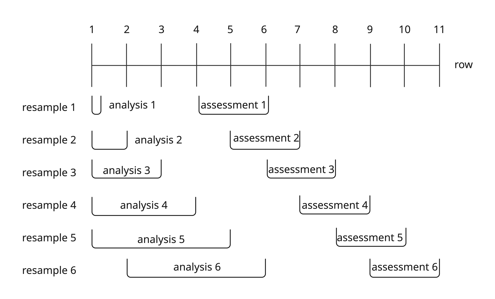

Or, in code:

::: {.cell layout-align="center"}

```{.r .cell-code}
df <- data.frame(x = 1:11)
r_set <- sliding_window(
  df,
  lookback = 4,
  assess_start = 3,
  assess_stop = 5,
  complete = FALSE
)
r_set
#> # Sliding window resampling 
#> # A tibble: 6 × 2
#>   splits        id    
#>   <list>        <chr> 
#> 1 <split [1/3]> Slice1
#> 2 <split [2/3]> Slice2
#> 3 <split [3/3]> Slice3
#> 4 <split [4/3]> Slice4
#> 5 <split [5/3]> Slice5
#> 6 <split [5/3]> Slice6
```
:::

When creating the calibration split, we apply the `complete` option to the (now inner) analysis set and ensure that the calibration set is complete. In this example, it means that, until we have at least three rows (two for the complete calibration set, and at least one for the analysis set), we can't do a calibration split according to the rules laid out above. This is the case for the second resample, where we only have two rows to work with in the outer analysis set. Instead of erroring here, we fall back to not using calibration at all and return the (outer) analysis set as the (inner) analsysis set, along with an empty calibration set.

::: {.cell layout-align="center"}

```{.r .cell-code}
r_split <- get_rsplit(r_set, 2)
split_cal <- internal_calibration_split(r_split, .get_split_args(r_set))
#> Warning: Cannot create calibration split; creating an empty calibration set.

split_cal
#> <Analysis/Calibration/Total>
#> <2/0/2>
```
:::

A calibration split on the third resample, which contains three rows, succeeds with the required two rows in the calibration set and the remaining one in the incomplete analysis set.

::: {.cell layout-align="center"}

```{.r .cell-code}
r_split <- get_rsplit(r_set, 3)
split_cal <- internal_calibration_split(r_split, .get_split_args(r_set))
split_cal
#> <Analysis/Calibration/Total>
#> <1/2/3>
```
:::

If we can fit a complete (inner) analysis set in the available rows, we do so, even if incomplete sets are allowed.

::: {.cell layout-align="center"}

```{.r .cell-code}
r_split <- get_rsplit(r_set, 5)
split_cal <- internal_calibration_split(r_split, .get_split_args(r_set))
split_cal
#> <Analysis/Calibration/Total>
#> <3/2/5>
```
:::

### Index-based splitting

When working with irregular series, it can be helpful to define resamples based on sliding over an index, rather than the rows directly. That index often is a form of time but it does not have to be. Let's take our previous data frame and use `x` as the index, with a small modification. The index doesn't go straight from 1 to 11 but rather is missing an observation at the index value of 2. We use the same  `lookback`, `assess_start`, and `assess_stop`. The difference is that now these define the resamples on the _index_ rather than the _rows_ directly.

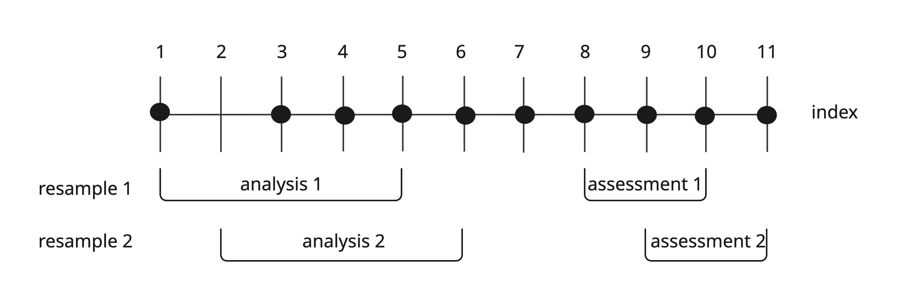

We still get two resamples, however, the analysis set contains only 4 rows because only those fall into the window defined by the index.

::: {.cell layout-align="center"}

```{.r .cell-code}
df <- data.frame(x = c(1, 3:11))
r_set <- sliding_index(
  df,
  index = x,
  lookback = 4,
  assess_start = 3,
  assess_stop = 5
)
r_set
#> # Sliding index resampling 
#> # A tibble: 2 × 2
#>   splits        id    
#>   <list>        <chr> 
#> 1 <split [4/3]> Slice1
#> 2 <split [4/3]> Slice2
```
:::

For the first resample, all works well. We just skip over the missing row, both when constructing the split into analysis and assessment set and the split into analysis and calibration set.

::: {.cell layout-align="center"}

```{.r .cell-code}
r_split <- get_rsplit(r_set, 1)
analysis(r_split)
#>   x
#> 1 1
#> 2 3
#> 3 4
#> 4 5

split_cal <- internal_calibration_split(r_split, .get_split_args(r_set))
split_cal
#> <Analysis/Calibration/Total>
#> <2/2/4>
analysis(split_cal)
#>   x
#> 1 1
#> 2 3
calibration(split_cal)
#>   x
#> 1 4
#> 2 5
```
:::

#### When we can't make a calibration split

Abstracting away from observed rows to an index does pose two challenges for us though.

For the second resample, the theoretical window for the (outer) analysis set is 2-6. Because it fits within the boundaries of the observed rows (which is 1 to 11), we construct this set, even though we don't observe anything at an index of 2. 

Based on `lookback`, `assess_start`, and `assess_stop`, we calculate the same allocation for the (inner) analysis set and the calibration set as in the previous example, when working on the rows directly with `sliding_window()`: three for the inner analysis set and two for the calibration set. However, the dataset we want to split only covers the range [3, 6].

::: {.cell layout-align="center"}

```{.r .cell-code}
r_split <- get_rsplit(r_set, 2)
analysis(r_split)
#>   x
#> 1 3
#> 2 4
#> 3 5
#> 4 6
```
:::

The sliding splits slide over _the data_, meaning they slide over observed values of the index and they slide only within the boundaries of the observed index values. So here, we can only slide within [3, 6] and thus cannot fit an inner analysis set of three and a calibration set of two into it. As established earlier, we fall back onto an empty calibration set in such a situation.

::: {.cell layout-align="center"}

```{.r .cell-code}
internal_calibration_split(r_split, .get_split_args(r_set))
#> Warning: Cannot create calibration split; creating an empty calibration set.
#> <Analysis/Calibration/Total>
#> <4/0/4>
```
:::

So while we do not observe the lower boundary of our theoretical [2, 6] window from the (outer) analysis set, we always observed the upper boundary. That is because "sliding over the observed instances" also means that we will skip over potential splits if we do not observe the value relative to which a split is defined.

In our example so far, we've been able to generate two resamples on an index running from 1 to 11. The first resample is defined relative to an index of 5, the second one on 6. If there is no observed index of 6, the windows can't be defined and there is no corresponding split and resample.

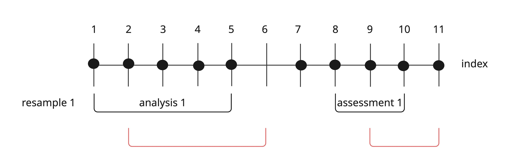

Or, in code:

::: {.cell layout-align="center"}

```{.r .cell-code}
# no index 6
df <- data.frame(x = c(1:5, 7:11))
r_set <- sliding_index(
  df,
  index = x,
  lookback = 4,
  assess_start = 3,
  assess_stop = 5
)
r_set
#> # Sliding index resampling 
#> # A tibble: 1 × 2
#>   splits        id    
#>   <list>        <chr> 
#> 1 <split [5/3]> Slice1
```
:::

The one resample we get is relative to an index value of 5, the last observation in the analysis set.

::: {.cell layout-align="center"}

```{.r .cell-code}
r_split <- get_rsplit(r_set, 1)
analysis(r_split)
#>   x
#> 1 1
#> 2 2
#> 3 3
#> 4 4
#> 5 5
```
:::

This principle of sliding across _observations_ makes it impossible to construct a calibration split if we happen to define it relative to an index value that we do not observe. Let's modify our example so that now we don't observe anything at index 3.

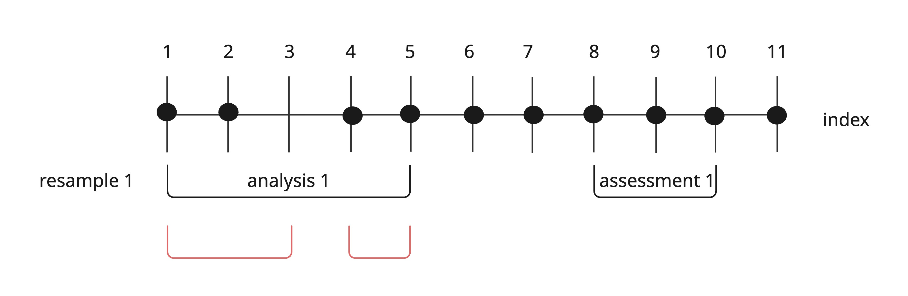

This is the index value relative to which we can define an inner analysis set of 3 and a calibration set of 2. Thus we cannot actually make that split and fall back on an empty calibration set.

::: {.cell layout-align="center"}

```{.r .cell-code}
# missing 3 is the anchor for the inner split of the first resample
df <- data.frame(x = c(1:2, 4:11))
r_set <- sliding_index(
  df,
  index = x,
  lookback = 4,
  assess_start = 3,
  assess_stop = 5
)
r_split <- get_rsplit(r_set, 1)

internal_calibration_split(r_split, .get_split_args(r_set))
#> Warning: Cannot create calibration split; creating an empty calibration set.
#> <Analysis/Calibration/Total>
#> <4/0/4>
```
:::

Sliding over the observed index values means that we cannot make a calibration split in two situations:

- We don't observe the index value at the lower boundary of the (outer) analysis set.
- We don't observe the index value relative to which the calibration split would be defined.

In these situations, we fall back onto an empty calibration set rather than erroring.

We expect this to not be relevant in practice too often, as chances of this happening are lower with more observations and we assume you are only attempting calibration with sufficiently large datasets.

### Period-based splitting

For the third sliding function in the family, we first aggregate the index to periods and then slide across those, e.g., aggregate daily data to monthly periods. 

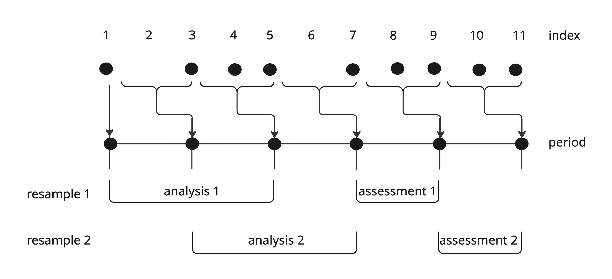

The principle of how to contruct a calibration split on the (outer) analysis set remains the same. The challenges of abstracting away from the rows, as illustrated for sliding over observed instances of an index also remain. Here, we slide over observed periods. We observe a period, if we observe an index within that period. 

For `lookback = 0`, we remain unable to make a calibration split. However, it is possible to choose a smaller period when defining the resamples, e.g., using weeks instead of months when aggregating daily data. In that case, the calibration split is also defined in terms of weeks, rather than months, and thus failing to split a single month.

Now that we've looked at the principles at play here on very small datasets, let's look at a dataset with a sufficient amount of observations to consider using calibration. The `Chicago` dataset has daily ridership numbers for over 15 years. Here we are constructing resamples which use 2 weeks worth of data for the assessment set, and roughly 15 years (52*15 weeks) for the analysis set. That's enough to use some of those observations for a calibration set!

::: {.cell layout-align="center"}

```{.r .cell-code}
data(Chicago, package = "modeldata")

chicago_split <- initial_time_split(Chicago, prop = 1 - (14 / nrow(Chicago)))
chicago_train <- training(chicago_split)

chicago_r_set <- sliding_period(
  chicago_train,
  index = "date",
  period = "week",
  lookback = 52 * 15,
  assess_stop = 2,
  step = 2
)
chicago_r_set
#> # Sliding period resampling 
#> # A tibble: 16 × 2
#>    splits            id     
#>    <list>            <chr>  
#>  1 <split [5463/14]> Slice01
#>  2 <split [5467/14]> Slice02
#>  3 <split [5467/14]> Slice03
#>  4 <split [5467/14]> Slice04
#>  5 <split [5467/14]> Slice05
#>  6 <split [5467/14]> Slice06
#>  7 <split [5467/14]> Slice07
#>  8 <split [5467/14]> Slice08
#>  9 <split [5467/14]> Slice09
#> 10 <split [5467/14]> Slice10
#> 11 <split [5467/14]> Slice11
#> 12 <split [5467/14]> Slice12
#> 13 <split [5467/14]> Slice13
#> 14 <split [5467/14]> Slice14
#> 15 <split [5467/14]> Slice15
#> 16 <split [5467/11]> Slice16
```
:::

Taking the first resample, we can see the two weeks for the assessment set.

::: {.cell layout-align="center"}

```{.r .cell-code}
chicago_r_split <- get_rsplit(chicago_r_set, 1)
chicago_assess <- assessment(chicago_r_split)
range(chicago_assess$date)
#> [1] "2016-01-07" "2016-01-20"
```
:::

The calibration set consists of one week from the (outer) analysis set. 

::: {.cell layout-align="center"}

```{.r .cell-code}
split_cal <- internal_calibration_split(
  chicago_r_split,
  .get_split_args(chicago_r_set)
)
chicago_cal <- calibration(split_cal)
range(chicago_cal$date)
#> [1] "2015-12-31" "2016-01-06"
```
:::

## Splits for bootstrap samples

For bootstrap samples, our goal of avoiding overfitting means we need to refine our approach to making calibration splits a little further. 

If our (outer) analysis set is a bootstrap sample of the training data, it likely contains several replications of an observation. In the illustration below, the first row of the original data is sampled twice into the (outer) analysis set, the second row three times, and the fourth row also twice.

::: {.cell layout-align="center"}
::: {.cell-output-display}
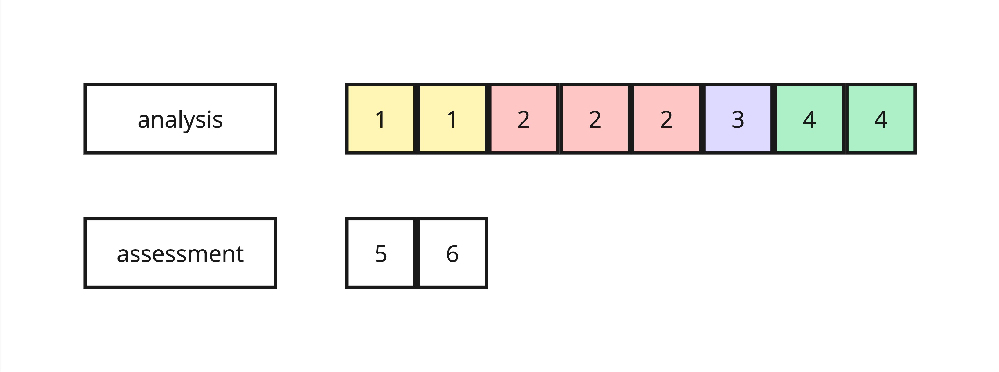{fig-align='center' width=700}
:::
:::

We don't want those duplicates to be split up into the inner analysis and the calibration set. Simply creating another bootstrap resample from the (outer) analysis set makes it possible for this to happen. 

In the example illustration below, the third row of the (outer) analysis set is labeled `2-1`, as it is the first intance of row 2 from the original data. The other two instances of this row in the (outer) analysis set are labeled `2-2` and `2-3`. In the example, the `2-1` row gets sampled into the (inner) analysis set twice, while `2-2` and `2-3` are not sampled and thus end up in the calibration set. This means that row 2 from the original data is now in both the (inner) analysis set and the calibration set.

::: {.cell layout-align="center"}
::: {.cell-output-display}
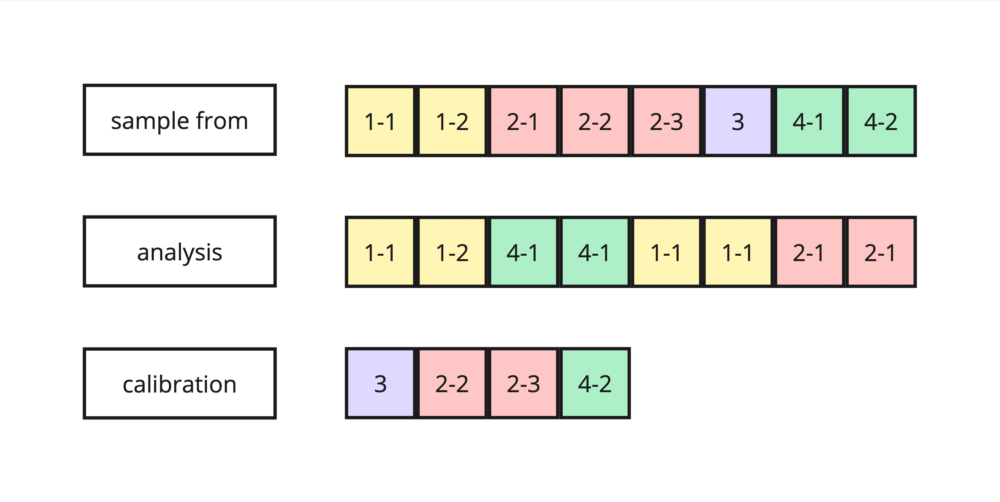{fig-align='center' width=700}
:::
:::

To avoid this, we could do a grouped resampling with the row ID as the group. Then all replications of a row would end up in the same set, either (inner) analysis or calibration. However, this would mean that rows in the calibration set are potentially not unique, unlike the typical bootstrap OOB sample.

::: {.cell layout-align="center"}
::: {.cell-output-display}
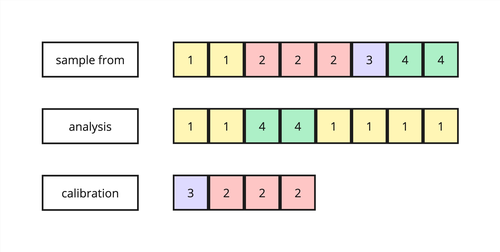{fig-align='center' width=700}
:::
:::

To prevent both these potential issues, we create the calibration split by sampling the (inner) analysis set, with replacement, from the pool of unique rows in the (outer) analysis set. The calibration set then consists of the rows in the (outer) analysis set that were not sampled into the (inner) analysis set, like for a typicall OOB sample.

::: {.cell layout-align="center"}
::: {.cell-output-display}
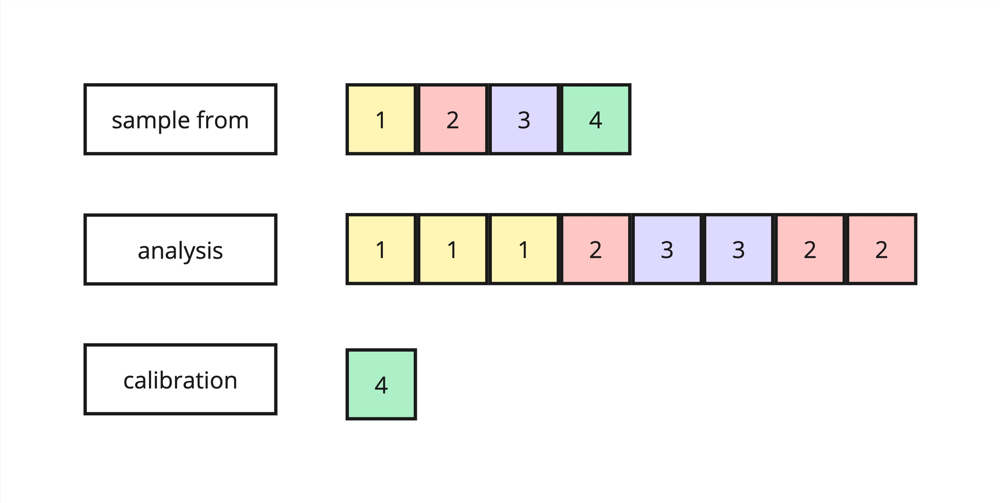{fig-align='center' width=700}
:::
:::

## Summary

When using calibration, we typically need generous amounts of data because we need separate data for each of these tasks: fit the primary model, fit the calibration model, and assess performance. 
When tuning or resampling a workflow with calibration, tidymodels will automatically turn classic resamples (consisting of an analysis and an assessment set) into resamples which include a calibration set in addition to the analysis and assessment set. This is done according to the following principles: 

- The assessment set remains untouched, while the analysis set is split into an (inner) analysis set and a calibration set. 
- The inner calibration split mimicks the outer split (into analysis and assesment set) as closely as possible.
- If we can't make a calibration split based on these basic principles, we skip the calibration.

For sliding splits of ordered data, applying those principles is a bit more complex than for other types of splits as the outer split into analysis and assessment is already a bit more complex. We've laid out the details of this here for reference.
For bootstrap splits, we don't directly split the (outer) analysis set but rather sample the (inner) analysis set from the unique rows in the (outer) analysis set to avoid data leakage between (inner) analysis and calibration set.

If you need to make manual calibration splits, please leave us a [feature request](https://github.com/tidymodels/rsample/issues/new?template=feature_request.md).
