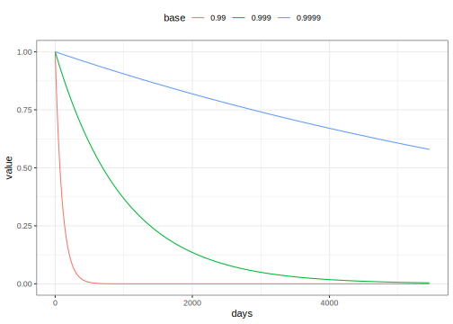

## Introduction

To use code in this article,  you will need to install the following packages: tidymodels.

This article demonstrates how to create and use importance weights in a predictive model. Using importance weights is a way to have our model care more about some observations than others.

## Example Data

To demonstrate we will use the Chicago data from the modeldata package.


::: {.cell layout-align="center" hash='cache/unnamed-chunk-3_b073b9c0d2d38aeb4a5224075d7fd41e'}

```{.r .cell-code}
library(tidymodels)
data(Chicago)

Chicago <- Chicago %>%
  select(ridership, date, one_of(stations))
```
:::


From `?Chicago`

> These data are from Kuhn and Johnson (2020) and contain an abbreviated training set for modeling the number of people (in thousands) who enter the Clark and Lake L station.

> The date column corresponds to the current date. The columns with station names (Austin through California) are a sample of the columns used in the original analysis (for filesize reasons). These are 14 day lag variables (i.e. date - 14 days). There are columns related to weather and sports team schedules.

For simplicity, we have limited our view to the date and station variables.

## Creating weights

This data set contains daily information from 2001-01-22 to 2016-08-28. We will pretend that it is January 1st, 2016 and we want to predict the ridership for the remainder of 2016 using the date and station variables as predictors. Without any weighting, all the previous observations would have the same influence on the model. This may not be ideal since some observations appear a long time ago and not be as representative of the future as more recent observations. 

We could just use recent observations to fit the model, ensuring that the training data stays as close to the testing data as possible. While a tempting idea, it would throw out a lot of informative data. Instead let us assign a weight to each observation, related to how long ago the observation was taken. This way we are not completely throwing away any observation; we are only giving less weight to data farther in the past. 

We need to decide on a way to calculate the case weights. The main thing constraint is that the weight cannot be negative, and it would be nice if today was weighted as 1. So we need a function that is 1 when `x = 0` and decreasing otherwise. There are many kinds of functions like that, and we will be using this exponential decay function

$$ weight = base ^ x $$

where `base` is some constant and `x` is the number of days. To make sure that we select a reasonable `base`, we need to do some manual testing, starting with looking at how old the oldest observation is.


::: {.cell layout-align="center" hash='cache/unnamed-chunk-4_ef4371c9549adc79f61c9d1327fb804a'}

```{.r .cell-code}
difftime("2016-01-01", min(Chicago$date))
#> Time difference of 5457.333 days
```
:::


Using this information we can visualize the weight curve, to see if we like the value of `base`.


::: {.cell layout-align="center" hash='cache/unnamed-chunk-5_c74cef63496f3567b4bd4942bad4892a'}

```{.r .cell-code}
tibble_days <- tibble(days = 0:5457)

tibble_days %>%
  ggplot(aes(days)) +
  geom_function(fun = ~ 0.99 ^ .x)
```

::: {.cell-output-display}
{fig-align='center' width=672}
:::
:::


setting `base` to 0.99 appears to be down weighted too much. Any observation more than a year old would have no influence.

Let us try a few more values to find 


::: {.cell layout-align="center" hash='cache/unnamed-chunk-6_958a7138f25afbfc3161fbf834e13d95'}

```{.r .cell-code}
map_dfr(
  c(0.99, 0.999, 0.9999),
  ~ tibble_days %>% mutate(base = factor(.x), value = .x ^ days)
) %>%
  ggplot(aes(days, value, group = base, color = base)) +
  geom_line()
```

::: {.cell-output-display}
{fig-align='center' width=672}
:::
:::


From this, we could pick something around 0.999 since it gives a better balance. Let's create a small function to help us encode this weight. 


::: {.cell layout-align="center" hash='cache/unnamed-chunk-7_6ab55e103a49d631a5cc38beedc580f3'}

```{.r .cell-code}
weights_from_dates <- function(x, ref) {
  if_else(
    condition = x >= ref,
    true = 1,     # <- Notice that I'm setting any future weight to 1.
    false = 0.999 ^ as.numeric(difftime(ref, x, units = "days"))
  )
}
```
:::


We then modify `Chicago` to add a weight column, explicitly making it an importance weight with `importance_weight()`.


::: {.cell layout-align="center" hash='cache/unnamed-chunk-8_a5652b9e9e09ac4c66ed19872be89eb8'}

```{.r .cell-code}
Chicago <- Chicago %>%
  mutate(weight = weights_from_dates(date, "2016-01-01"),
         weight = importance_weights(weight))
```
:::


This approach to creating importance weights from dates is not limited to cases where we have daily observations. You are free to create similar weights if you have gaps or repeated observations within the same day. Likewise, you don't need to use days as the unit. Seconds, weeks, or years could be used as well.

## Modeling

We start by splitting up our data into a training and testing set based on the day `"2016-01-01"`. We added weights to the data set before splitting it so each set has weights.


::: {.cell layout-align="center" hash='cache/unnamed-chunk-9_8135e3246a09512d38ee24dcde4681f7'}

```{.r .cell-code}
Chicago_train <- Chicago %>% filter(date < "2016-01-01")
Chicago_test <- Chicago %>% filter(date >= "2016-01-01")
```
:::


Next, we are going to create a recipe. The weights won't have any influence on the preprocessing since none of these operations are supervised and we are using importance weights.


::: {.cell layout-align="center" hash='cache/unnamed-chunk-10_ef84fffe914d6e05e47d4c33949c56e6'}

```{.r .cell-code}
base_recipe <-
  recipe(ridership ~ ., data = Chicago_train) %>%
  # Create date features
  step_date(date) %>%
  step_holiday(date, keep_original_cols = FALSE) %>%
  # Remove any columns with a single unique value
  step_zv(all_predictors()) %>%
  # Normalize all the numerical features
  step_normalize(all_numeric_predictors()) %>%
  # Perform PCA to reduce the correlation bet the stations
  step_pca(all_numeric_predictors(), threshold = 0.95)
```
:::


Next we need to build the rest of the workflow. We use a linear regression specification


::: {.cell layout-align="center" hash='cache/unnamed-chunk-11_97612c19efbb436b81e1a8d88fa0c208'}

```{.r .cell-code}
lm_spec <-
  linear_reg() %>%
  set_engine("lm")
```
:::


and we add these together in the workflow. To activate the case weights, we use the `add_case_weights()` function to specify the name of the case weights being used.


::: {.cell layout-align="center" hash='cache/unnamed-chunk-12_896852baf2e4899bc3ea08d055cab4d2'}

```{.r .cell-code}
lm_wflow <-
  workflow() %>% 
  add_case_weights(weight) %>%
  add_recipe(base_recipe) %>%
  add_model(lm_spec)

lm_wflow
#> ══ Workflow ══════════════════════════════════════════════════════════
#> Preprocessor: Recipe
#> Model: linear_reg()
#> 
#> ── Preprocessor ──────────────────────────────────────────────────────
#> 5 Recipe Steps
#> 
#> • step_date()
#> • step_holiday()
#> • step_zv()
#> • step_normalize()
#> • step_pca()
#> 
#> ── Case Weights ──────────────────────────────────────────────────────
#> weight
#> 
#> ── Model ─────────────────────────────────────────────────────────────
#> Linear Regression Model Specification (regression)
#> 
#> Computational engine: lm
```
:::


With all that done we can fit the workflow with the usual syntax: 


::: {.cell layout-align="center" hash='cache/unnamed-chunk-13_c322328206c4095202be5989a8810759'}

```{.r .cell-code}
lm_fit <- fit(lm_wflow, data = Chicago_train)
lm_fit
#> ══ Workflow [trained] ════════════════════════════════════════════════
#> Preprocessor: Recipe
#> Model: linear_reg()
#> 
#> ── Preprocessor ──────────────────────────────────────────────────────
#> 5 Recipe Steps
#> 
#> • step_date()
#> • step_holiday()
#> • step_zv()
#> • step_normalize()
#> • step_pca()
#> 
#> ── Case Weights ──────────────────────────────────────────────────────
#> weight
#> 
#> ── Model ─────────────────────────────────────────────────────────────
#> 
#> Call:
#> stats::lm(formula = ..y ~ ., data = data, weights = weights)
#> 
#> Coefficients:
#>   (Intercept)    date_dowMon    date_dowTue    date_dowWed    date_dowThu  
#>      1.762599      13.307654      14.689027      14.620178      14.382313  
#>   date_dowFri    date_dowSat  date_monthFeb  date_monthMar  date_monthApr  
#>     13.695433       1.228233       0.364342       1.348229       1.409897  
#> date_monthMay  date_monthJun  date_monthJul  date_monthAug  date_monthSep  
#>      1.188189       2.598296       2.219721       2.406998       1.932061  
#> date_monthOct  date_monthNov  date_monthDec            PC1            PC2  
#>      2.655552       0.909007      -0.004751       0.073014      -1.591021  
#>           PC3            PC4            PC5  
#>     -0.608386      -0.205305       0.696010
```
:::


## Session information {#session-info}


::: {.cell layout-align="center" hash='cache/si_43a75b68dcc94565ba13180d7ad26a69'}

```
#> ─ Session info ─────────────────────────────────────────────────────
#>  setting  value
#>  version  R version 4.3.0 (2023-04-21)
#>  os       macOS Ventura 13.4
#>  system   aarch64, darwin20
#>  ui       X11
#>  language (EN)
#>  collate  en_US.UTF-8
#>  ctype    en_US.UTF-8
#>  tz       America/Los_Angeles
#>  date     2023-07-02
#>  pandoc   3.1.1 @ /Applications/RStudio.app/Contents/Resources/app/quarto/bin/tools/ (via rmarkdown)
#> 
#> ─ Packages ─────────────────────────────────────────────────────────
#>  package    * version date (UTC) lib source
#>  broom      * 1.0.4   2023-03-11 [1] CRAN (R 4.3.0)
#>  dials      * 1.2.0   2023-04-03 [1] CRAN (R 4.3.0)
#>  dplyr      * 1.1.2   2023-04-20 [1] CRAN (R 4.3.0)
#>  ggplot2    * 3.4.2   2023-04-03 [1] CRAN (R 4.3.0)
#>  infer      * 1.0.4   2022-12-02 [1] CRAN (R 4.3.0)
#>  parsnip    * 1.1.0   2023-04-12 [1] CRAN (R 4.3.0)
#>  purrr      * 1.0.1   2023-01-10 [1] CRAN (R 4.3.0)
#>  recipes    * 1.0.6   2023-04-25 [1] CRAN (R 4.3.0)
#>  rlang        1.1.1   2023-04-28 [1] CRAN (R 4.3.0)
#>  rsample    * 1.1.1   2022-12-07 [1] CRAN (R 4.3.0)
#>  tibble     * 3.2.1   2023-03-20 [1] CRAN (R 4.3.0)
#>  tidymodels * 1.1.0   2023-05-01 [1] CRAN (R 4.3.0)
#>  tune       * 1.1.1   2023-04-11 [1] CRAN (R 4.3.0)
#>  workflows  * 1.1.3   2023-02-22 [1] CRAN (R 4.3.0)
#>  yardstick  * 1.2.0   2023-04-21 [1] CRAN (R 4.3.0)
#> 
#>  [1] /Users/emilhvitfeldt/Library/R/arm64/4.3/library
#>  [2] /Library/Frameworks/R.framework/Versions/4.3-arm64/Resources/library
#> 
#> ────────────────────────────────────────────────────────────────────
```
:::
