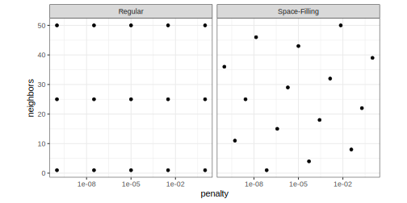

## Introduction

To use code in this article,  you will need to install the following packages: tidymodels.

This article demonstrates ....

Consider it an expanded version of Section 13.5 of [_Tidy Models with R_](https://www.tmwr.org/grid-search#efficient-grids). 


## The Overall Grid Tuning Procedure {#sec-overview}

tidymodels has three phases of creating a model pipeline: 

 - preprocessors: computations that prepare data for the model
 - supervised model: the actual model fit
 - postprocessing: adjustments to model predictions 

Each of these stages can have tuning parameters. Some examples:

- We might add a spline basis expansion to a predictor to enable to have a nonlinear trend in the model. We take one predictor and create multiple columns that are based on the original column. As we add new spline columns, the model can be more complex. We don't know how many columns to add so we try different values and see which maximizes performance. 

- If many predictors are correlated with one another, we could determine which predictors (and how many) can be removed to reduce multicollinearity. One approach is the have a threshold for the maximum allowable pairwise correlations and have an algorithm remove the smallest set of predictors to satisfy the constraint. The threshold would need to be tuned. 

- Most models have tuning parameters. Boosted trees have many but two of the main parameters are the learning rate and the number of trees in the ensemble. Both usually require tuning. 

- For binary classification models, especially those with a class imbalance, it is possible that the default 50% probability threshold that is used to define what is "an event" does not satisfy the user's needs. For example, when screening blood bank samples, we want a model to err on the side of throwing out disease-free donations as long as we minimize the number of bad blood samples that truly are diseased. In other words, we might want to tune the probability threshold to achieve a high specificity metric. 

Once we know what the tuning parameters are and which phases of the pipeline they are from, we can create a grid of values to evaluate. Since a pipeline can have multiple tuning parameters, a _candidate_ is defined to be a single set of actual parameter values that could be tested. A set of multiple tuning parameter candidate values is a grid. 

For grid search, we evaluate each candidate in the grid by training the entire pipeline, predicting a set of data, and computing performance metrics that estimate the candidate’s efficacy. Once this is finished, we can pick the candidate set that shows the best value. 

This page outlines the general process and describes different constraints and approaches to efficiently evaluating a grid of candidate values. Unexpectedly, the tools that we use to increase efficiency often result in more and more complex routines to compute performance for the grid. 

We’ll break down some of the complications and exploitations that are relevant for model tuning (via grid search). We’ll also start with very simple use-cases and steadily increase the complexity of the task as well as the complexity of the solutions. 

## How Does Training Occur in the Pipeline?

We should describe how different models would accomplish the three stages of a model pipeline. 

On one hand, there are deep neural networks. These are highly nonlinear models whose model structure is defined as a sequence of layers. The architecture of the network is defined by different types of layers that are intended to do different things. The mantra of deep learning is to add layers to the network that can accomplish all of the tasks discussed above. There is little to no delineation regarding what is a pre- or post-processor; it is all part of the model and all parameters are estimated simultaneously. We will call this type of model a “simultaneous estimation” since it all happens at the same time. 

On the other hand is nearly every other type of model. In most cases, preprocessing tasks are separate estimation procedures that are executed independently of the model fit. There are cases such as principal component regression that conducts PCA signal extraction before passing the results to a routine that executes ordinary least squares. However, there are still two separate estimation tasks that are carried out in sequence, not simultaneously. We’ll call this type of training “stagewise estimation” since there are multiple, distinct training steps that occur in sequence. 

Our focus is 100% on stagewise estimation. 

## Stage-Wise Modeling and Conditional Execution {#sec-stagewise-exe}

One important part of processing a grid of candidate values is to avoid repeating any computations wherever possible. This leads to the idea of conditional execution. Let’s think of an example. 

Suppose our pipeline consists of one preprocess and the model fit (i.e., no postprocessing). Let’s choose a fairly expensive preprocessing technique: UMAP feature extraction. UMAP has a variety of tuning parameters and one is the number of nearest neighbors to use when creating a network of nearby training set samples. Suppose that we will consider values ranging from 1 to 30. 

For our model, we’ll choose a random forest model. This also has tuning parameters and we’ll choose to optimize “m-try”; the number of predictors to randomly select each time a split is created in any decision tree. 

For illustration, let’s use a grid of points with six candidates: 


::: {.cell layout-align="center"}

```{.r .cell-code}
library(tidymodels)
umap_rf_param <- parameters(neighbors(c(1, 30)), mtry(c(1, 100)))
umap_rf_grid <- grid_regular(umap_rf_param, levels = c(2, 3))
umap_rf_grid %>% arrange(neighbors, mtry)
#> # A tibble: 6 × 2
#>   neighbors  mtry
#>       <int> <int>
#> 1         1     1
#> 2         1    50
#> 3         1   100
#> 4        30     1
#> 5        30    50
#> 6        30   100
```
:::


To evaluate these candidates, we could just loop through each row, train a pipeline with that row’s candidate values, predictor a holdout set, and then compute a performance statistic. What does “train a pipeline” mean though? For the first candidate, it means 

- Carry out the UMAP estimation process on the training set using a single nearest neighbor. 
- Apply UMAP to the training set and save the transformed data. 
- Estimate a random forest model with $m_{try} = 1$ using the transformed training set. 

The first and third steps are two separate estimations.

The remaining tasks are to

- Apply UMAP to the holdout data. 
- Predict the holdout data with the fitted random forest model. 
- Compute the performance statistic of interest (e.g., $R^2$, accuracy, RMSE, etc.)

For the second candidate, the process is exactly the same _except_ that the random forest model uses $m_{try} = 50$ instead of $m_{try} = 1$. 

We _have_ to compute a new random forest model since it is a different model. However, the UMAP step is identical to the previous candidate’s preprocessor since it has the same values. Since UMAP is expensive, we end up spending a lot of time doing something that we have already done. 

This would not be the case if there were no connection between the preprocessing tuning parameters and the model parameters, for example, this grid would not have repeated computations: 


::: {.cell layout-align="center"}

```
#> # A tibble: 6 × 2
#>   neighbors  mtry
#>       <dbl> <int>
#> 1         5     1
#> 2        10     1
#> 3        15    50
#> 4        20    50
#> 5        25   100
#> 6        30   100
```
:::


In this case, the UMAP step would be different for each candidate so there is no computational redundancy to eliminate. 

Once solution to avoiding redundant computations would be to cache the UMAP computations so that they could be reused later. 

A better solution is _conditional execution_. In this case, we determine the unique set of candidate values associated with the preprocessor and loop over these. Within each loop, we we train and predict the random forest model across its candidate values. Here's a listing of this algorithm: 

:::: {.columns}

::: {.column width="10%"}

:::

::: {.column width="80%"}


```pseudocode
#| html-line-number: true
#| html-line-number-punc: ":"

\begin{algorithm}
\begin{algorithmic}
\State $\mathfrak{D}^{fit}$: training set
\State $\mathfrak{D}^{pred}$: holdout set
\For{$k \in \{1, 30\}$}
  \State Using $k$ neighbors, train UMAP on $\mathfrak{D}^{fit}$
  \State Apply UMAP to $\mathfrak{D}^{fit}$, creating $\widehat{\mathfrak{D}}^{fit}_k$
  \State Apply UMAP to $\mathfrak{D}^{pred}$, creating $\widehat{\mathfrak{D}}^{pred}_k$  
  \For{$m \in \{1, 50, 100\}$}
    \State Train a random forest model with $m_{try} = m$ on $\mathfrak{D}^{fit}_k$ to produce $\widehat{f}_{km}$
    \State Predict $\widehat{\mathfrak{D}}^{pred}_k$ with  $\widehat{f}_{k,m}$
    \State Compute performance statistic $\widehat{Q}_{k,m}$. 
  \EndFor
\EndFor
\State Determine the $k$ and $m$ values corresponding to the best value of $\widehat{Q}_{k,m}$.
\end{algorithmic}
\end{algorithm}
```

:::

::: {.column width="10%"}

:::

::::


In this way, we evaluated six candidates via two UMAP models and six random forest models. We avoid four redundant and expensive UMAP fits.

We can organize this data using a nested structure:


::: {.cell layout-align="center"}

```{.r .cell-code}
umap_rf_schedule <- 
  umap_rf_grid %>% 
  group_nest(neighbors, .key = "second_stage")

# The training loop to iterate over:
umap_rf_schedule
#> # A tibble: 2 × 2
#>   neighbors       second_stage
#>       <int> <list<tibble[,1]>>
#> 1         1            [3 × 1]
#> 2        30            [3 × 1]

# Within that loop, iterative over these:
umap_rf_schedule$second_stage[[1]]
#> # A tibble: 3 × 1
#>    mtry
#>   <int>
#> 1     1
#> 2    50
#> 3   100
```
:::


In general, conditional execution is a good idea. Even when the second grid is used, there is no computational loss incurred by conditional execution. This is also true if the preprocessing technique is inexpensive. We will see one issue with conditional execution that comes up in @sec-grid-types as well as in @sec-in-parallel when we can run the computations in parallel. 

## Sidebar: Types of Grids  {#sec-grid-types}

Since the type of grid mattered for this example, let’s go on a quick “side quest” to talk about the two major types of grids. 

When we think about parameter grids, there are two types: regular and irregular. A regular grid is one where we create a univariate sequence of values for each tuning parameter and then create all possible combinations. Irregular grids can be made in many different ways but cannot be combinatorial in nature. Examples are random grids (i.e., simulating random values across parameter ranges), latin hypercube designs, and others. The best irregular grids are _space-filling designs_; they attempt to cover the entire parameter space and try to distribute the points so that none are overly similar to the others.  

Here’s an example of a regular grid and a space-filling design where each has 15 candidate points: 


::: {.cell layout-align="center"}
::: {.cell-output-display}
{#fig-two-grids fig-align='center' width=95%}
:::
:::


Space-filling designs are, on average, the best approach for parameter tuning. They need far fewer grid points to cover the parameter space than regular grids. 

The choice of grid types is relevant here because it affects the tactics used to efficiently process the grid. Consider the two grids above. Our conditional execution approach works well for the regular grid; for each value of the number of neighbors, there is a nice vector of values for the other parameter. Conversely, for the space-filling design, there is only a single corresponding penalty value for each unique number of neighbors. No conditional execution is possible. 

## There's Something We Didn't Tell You  {#sec-add-in-resampling}

One important aspect of grid search that we have obfuscated in the algorithm is shown in the previous section. Line 10 says “Compute performance statistic $\widehat{Q}_{k,n,t}$” which left a lot out.  

In that same algorithm, we had two data sets: a training set ($\mathfrak{D}^{fit}$) and a holdout set ($\mathfrak{D}^{pred}$) of data points that were not included in the training set. We said “holdout” instead of “test set” for generality. 

When tuning models, a single holdout set (a.k.a. a validation set) or multiple holdout sets are used (via resampling). For example, with 10-fold cross-validation, there is _another_ loop over the number resamples. 


:::: {.columns}

::: {.column width="10%"}

:::

::: {.column width="80%"}


```pseudocode
#| html-line-number: true
#| html-line-number-punc: ":"

\begin{algorithm}
\begin{algorithmic}
\For{$b = 1, \ldots, B$}
  \State Split the data into $\mathfrak{D}^{fit}_b$ and $\mathfrak{D}^{pred}_b$
  \For{$k \in \{1, 30\}$}
    \State Using $k$ neighbors, train UMAP on $\mathfrak{D}^{fit}_b$
    \State Apply UMAP to $\mathfrak{D}^{fit}_b$, creating $\widehat{\mathfrak{D}}^{fit}_{b,k}$
    \State Apply UMAP to $\mathfrak{D}^{pred}_b$, creating $\widehat{\mathfrak{D}}^{pred}_{b,k}$  
    \For{$m \in \{1, 50, 100\}$}
      \State Train a random forest model with $m_{try} = m$ on $\mathfrak{D}^{fit}_{b,k}$ to produce $\widehat{f}_{b,k,m}$
     \State Predict $\widehat{\mathfrak{D}}^{pred}_{b,k}$ with  $\widehat{f}_{b,k,m}$
      \State Compute performance statistic $\widehat{Q}_{b,k,m}$. 
   \EndFor
  \EndFor
\EndFor  
\State Compute the average performance metric $\widehat{Q}_{k,m} = 1/B\sum \widehat{Q}_{b,k,m}$
\State Determine the $k$ and $m$ values corresponding to the best value of $\widehat{Q}_{k,m}$.
\end{algorithmic}
\end{algorithm}
```

:::

::: {.column width="10%"}

:::

::::


## Sidebar: Parallel Processing  {#sec-in-parallel}

Another tool to increase computational efficiency is parallel processing. We have multiple computational cores on our computers that can perform calculations simultaneously. If we have $B$ resamples and $s$ candidates in our grid, there are $B \times s$ model fits to evaluate and none of them depend on the others^[That’s true but only _kind of true_; we’ll elaborate in @sec-submodels below.]. We can split up these operations into chunks and send these chunks to different computer cores. 

This is discussed at leangth in Section 13.5.2 of [_Tidy Models with R_](https://www.tmwr.org/grid-search#parallel-processing). Here are the highlights: 
 
- You can almost always reduce the time to process a grid using parallelism. 
- How the tasks are chunked can matter a lot. For example: 
	- If you have a lot of data and I/O is expensive, you might want to chunk the data so that all the computations use the same data. For example, for resampling, you might send all tasks for $\mathfrak{D}^{fit}_b$ and $\mathfrak{D}^{pred}_b$ are on the same computer core. 
- If your preprocessing (if any) is very fast, you may want to flatten the loops so that the computational tasks loop over each of the $B \times s$ resample/candidate combinations. This means that the preprocessing will be recalculated several times but, if they are cheap, this might be the fasted approach. 


## What are Submodels? {#sec-submodels}

“Submodels” is a situation where a model can make predictions for different tuning parameter values _without_ retraining. Two examples: 

- _Boosting_ ensembles take the same model and, using different case weights, create a sequential set of fits. For example, a tree ensemble created with 100 boosting iterations will contain 100 trees, each depending on the previous fits. For many implementations, you can fit the largest ensemble size (100 in this example) and, for free, make predictions on sizes 1 through 99. 
- Some regularized models, such as glmnet, have a penalization parameter that attenuates the magnitude of the regression coefficients (think weight decay in neural networks). We often tune over this parameter. For glmnet, the model simultaneously creates a _path_ of possible penalty values. With a single model fit, you can predict on _any_ penalty values. 

Not all models contain parameters that can use the “submodel trick.” For example, the random forest model from @sec-stagewise-exe is also an ensemble of trees. However, those trees are not created in a sequence; they are all independent of one another. 

However, when our model has submodel parameters, there can be a massive efficient gain with grid search. 

## How Can we Exploit Submodels?  {#sec-submodel-processing}

Let's use boosting as an example. We'll repeat our UMAP preprocessor and tune over: 

 - The number of boosted trees in an ensemble with values 1 through 100. 
 - The minimum number of data points required to keep splitting the tree (aka `min_n`) for values of 1, 20, and 40. 

With the same UMAP grid, let’s use is $2 \times 100 \times 3 = 600$ grid points.


::: {.cell layout-align="center"}

```{.r .cell-code}
umap_boost_param <- parameters(neighbors(c(1, 30)), min_n(c(1, 40)), trees(c(1, 100)))
umap_boost_grid <- grid_regular(umap_boost_param, levels = c(2, 3, 100))
umap_boost_grid
#> # A tibble: 600 × 3
#>    neighbors min_n trees
#>        <int> <int> <int>
#>  1         1     1     1
#>  2        30     1     1
#>  3         1    20     1
#>  4        30    20     1
#>  5         1    40     1
#>  6        30    40     1
#>  7         1     1     2
#>  8        30     1     2
#>  9         1    20     2
#> 10        30    20     2
#> # ℹ 590 more rows
```
:::


There are six unique combinations of the number of neighbors and `min_n`, so we can evaluate only six models using these parameters: 


::: {.cell layout-align="center"}

```{.r .cell-code}
models_to_fit <- 
  umap_boost_grid %>% 
  summarize(trees = max(trees), .by = c(neighbors, min_n))
models_to_fit
#> # A tibble: 6 × 3
#>   neighbors min_n trees
#>       <int> <int> <int>
#> 1         1     1   100
#> 2        30     1   100
#> 3         1    20   100
#> 4        30    20   100
#> 5         1    40   100
#> 6        30    40   100
```
:::


With submodels, our algorithm has yet another nested loop in Lines 9-11:

:::: {.columns}

::: {.column width="10%"}

:::

::: {.column width="80%"}


```pseudocode
#| html-line-number: true
#| html-line-number-punc: ":"

\begin{algorithm}
\begin{algorithmic}
\For{$b = 1, \ldots, B$}
  \State Split the data into $\mathfrak{D}^{fit}_b$ and $\mathfrak{D}^{pred}_b$
  \For{$k \in \{1, 30\}$}
    \State Using $k$ neighbors, train UMAP on $\mathfrak{D}^{fit}_b$
    \State Apply UMAP to $\mathfrak{D}^{fit}_b$, creating $\widehat{\mathfrak{D}}^{fit}_{b,k}$
    \State Apply UMAP to $\mathfrak{D}^{pred}_b$, creating $\widehat{\mathfrak{D}}^{pred}_{b,k}$  
    \For{$n \in \{1, 20, 40\}$}
      \State Train a boosting model with $n_{min}= n$ and 100 trees on $\mathfrak{D}^{fit}_{b,k}$ to produce $\widehat{f}_{b,k,n,100}$
      \For{$t \in \{1, 2, \ldots, 100\}$}
        \State Predict $\widehat{\mathfrak{D}}^{pred}_{b,k}$ with  $\widehat{f}_{b,k,n,100}$ using at $t$ trees
        \State Compute performance statistic $\widehat{Q}_{b,k,n,t}$. 
      \EndFor
    \EndFor
  \EndFor
\EndFor
\State Compute the average performance metric $\widehat{Q}_{k,n,t} = 1/B\sum \widehat{Q}_{b,k,n,t}$
\State Determine the $k$, $n$, and $t$ values corresponding to the best value of $\widehat{Q}_{k,n,t}$.
\end{algorithmic}
\end{algorithm}
```

:::

::: {.column width="10%"}

:::

::::

This added complexity has huge benefits in efficiency since our loop for the number of trees ($t$) is for _predicting_ and not for _training_.


::: {.cell layout-align="center"}

```{.r .cell-code}
submodel_schedule <- 
  umap_boost_grid %>% 
  # First collapse the submodel parameters
  group_nest(neighbors, min_n, .key = "predict_stage") %>% 
  # Now find the number of trees to fit
  full_join(
    umap_boost_grid %>% 
      summarize(trees = max(trees), .by = c(neighbors, min_n)),
    by = c("neighbors", "min_n")
  ) %>% 
  relocate(trees, .after = min_n) %>% 
  # Now collapse over the preprocessor for conditional execution
  group_nest(neighbors, .key = "second_stage")

submodel_schedule
#> # A tibble: 2 × 2
#>   neighbors       second_stage
#>       <int> <list<tibble[,3]>>
#> 1         1            [3 × 3]
#> 2        30            [3 × 3]
```
:::


Let's look at one iteration of the loop. For the model with a single neighbor, what is the first boosted tree that we fit? 


::: {.cell layout-align="center"}

```{.r .cell-code}
submodel_schedule$second_stage[[1]]
#> # A tibble: 3 × 3
#>   min_n trees      predict_stage
#>   <int> <int> <list<tibble[,1]>>
#> 1     1   100          [100 × 1]
#> 2    20   100          [100 × 1]
#> 3    40   100          [100 × 1]
```
:::


For the first of these, with `min_n` equal to 1 and 100 trees, what is the set of tree sizes that we should predict? 


::: {.cell layout-align="center"}

```{.r .cell-code}
submodel_schedule$second_stage[[1]]$predict_stage[[1]]
#> # A tibble: 100 × 1
#>    trees
#>    <int>
#>  1     1
#>  2     2
#>  3     3
#>  4     4
#>  5     5
#>  6     6
#>  7     7
#>  8     8
#>  9     9
#> 10    10
#> # ℹ 90 more rows
```
:::


## Adding Postprocessors {#sec-postprocessors}

Postprocessors are tools that adjust the predicted values produced by models. For example, for a regression model, you might want to limit the range of the predicted values to specific values. Also, we've already mentioned how we might want to adjust probability thresholds for classification models in @sec-overview. 

We can treat the probability threshold as a tuning parameter to enable the model to make the most appropriate tradeoff between false negatives and false positives.

One important point about this example is that no estimation step occurs. We are simply choosing a different threshold for the probability and resetting the hard class predictions. Some postprocessing methods, specifically calibration methods, need some other data set to estimate other model parameters that will then be used to adjust the original model's predictions. 


Let's further torture our UMAP/boosted tree pipeline to add an additional `threshold` parameter for the probability. Let's say that we want to evaluate thresholds of 0.5, 0.6, ..., to 1.0. Unsurprisingly, this adds an additional loop inside our submodel-prediction loop (Lines 11-13 below): 

:::: {.columns}

::: {.column width="10%"}

:::

::: {.column width="80%"}


```pseudocode
#| html-line-number: true
#| html-line-number-punc: ":"

\begin{algorithm}
\begin{algorithmic}
\For{$b = 1, \ldots, B$}
  \State Split the data into $\mathfrak{D}^{fit}_b$ and $\mathfrak{D}^{pred}_b$
  \For{$k \in \{1, 30\}$}
    \State Using $k$ neighbors, train UMAP on $\mathfrak{D}^{fit}_b$
    \State Apply UMAP to $\mathfrak{D}^{fit}_b$, creating $\widehat{\mathfrak{D}}^{fit}_{b,k}$
    \State Apply UMAP to $\mathfrak{D}^{pred}_b$, creating $\widehat{\mathfrak{D}}^{pred}_{b,k}$  
    \For{$n \in \{1, 20, 40\}$}
      \State Train a boosting model with $n_{min}= n$ and 100 trees on $\mathfrak{D}^{fit}_{b,k}$ to produce $\widehat{f}_{b,k,n,100}$
      \For{$t \in \{1, 2, \ldots, 100\}$}
        \State Predict $\widehat{\mathfrak{D}}^{pred}_{b,k}$ with  $\widehat{f}_{b,k,n,100}$ using at $t$ trees
        \For{$\pi \in \{0.5, 0.6, \ldots, 1.0\}$}
          \State Recompute hard class predictions with threshold $\pi$.
          \State Compute performance statistic $\widehat{Q}_{b,k,n,t,\pi}$. 
        \EndFor
      \EndFor
    \EndFor
  \EndFor
\EndFor
\State Compute the average performance metric $\widehat{Q}_{k,n,t,\pi} = 1/B\sum \widehat{Q}_{b,k,n,t,\pi}$
\State Determine the $k$, $n$, $t$, and $\pi$ values corresponding to the best value of $\widehat{Q}_{k,n,t,\pi}$.
\end{algorithmic}
\end{algorithm}
```

:::

::: {.column width="10%"}

:::

::::

Organizing the grid data to programmatically evaluate the models, we'll add another level of nesting. 


::: {.cell layout-align="center"}

```{.r .cell-code}
umap_boost_post_grid <-
  crossing(umap_boost_grid, threshold = (5:10)/10)

post_proc_schedule <-
  umap_boost_post_grid %>%
  # First collapse the submodel parameters
  group_nest(neighbors, min_n, .key = "predict_stage") %>%
  # Second, collapse into postprocessing loop
  mutate(
    predict_stage = map(predict_stage,
                        ~ .x %>% group_nest(trees, .key = "post_stage"))
  ) %>%
  # Now find the number of trees to fit
  full_join(
    # This is in min_grid:
    umap_boost_grid %>%
      summarize(trees = max(trees), .by = c(neighbors, min_n)),
    by = c("neighbors", "min_n")
  ) %>%
  relocate(trees, .after = min_n) %>% 
  # Now collapse over the preprocessor for conditional execution
  group_nest(neighbors, .key = "second_stage")
```
:::


To start, the loop for postprocessing is defined here: 


::: {.cell layout-align="center"}

```{.r .cell-code}
post_proc_schedule
#> # A tibble: 2 × 2
#>   neighbors       second_stage
#>       <int> <list<tibble[,3]>>
#> 1         1            [3 × 3]
#> 2        30            [3 × 3]
```
:::


Within the first iteration of that loop, we can see the non-submodel parameter(s) to iterate over (where $t=100$):


::: {.cell layout-align="center"}

```{.r .cell-code}
post_proc_schedule$second_stage[[1]]
#> # A tibble: 3 × 3
#>   min_n trees predict_stage     
#>   <int> <int> <list>            
#> 1     1   100 <tibble [100 × 2]>
#> 2    20   100 <tibble [100 × 2]>
#> 3    40   100 <tibble [100 × 2]>
```
:::


Once we fit the first combination of parameters for the boosted tree, we start predicting the sequence of submodels...


::: {.cell layout-align="center"}

```{.r .cell-code}
post_proc_schedule$second_stage[[1]]$predict_stage[[1]]
#> # A tibble: 100 × 2
#>    trees         post_stage
#>    <int> <list<tibble[,1]>>
#>  1     1            [6 × 1]
#>  2     2            [6 × 1]
#>  3     3            [6 × 1]
#>  4     4            [6 × 1]
#>  5     5            [6 × 1]
#>  6     6            [6 × 1]
#>  7     7            [6 × 1]
#>  8     8            [6 × 1]
#>  9     9            [6 × 1]
#> 10    10            [6 × 1]
#> # ℹ 90 more rows
```
:::


but for each of these, we have a sequence of postprocessing adjustments to make: 


::: {.cell layout-align="center"}

```{.r .cell-code}
post_proc_schedule$second_stage[[1]]$predict_stage[[1]]$post_stage[[1]]
#> # A tibble: 6 × 1
#>   threshold
#>       <dbl>
#> 1       0.5
#> 2       0.6
#> 3       0.7
#> 4       0.8
#> 5       0.9
#> 6       1
```
:::


Looking at the _five nested loops_, it would be reasonable to question whether this approach is, in fact, efficient. First, keep in mind that we are evaluating 3,600 tuning parameter candidates while only training 6 models. Second, the most expensive steps in this process are those that training preprocessors and models (Lines 4 and 8 above). The other loops are making predictions or adjustments and these are already efficient (and are easily vectorized).

