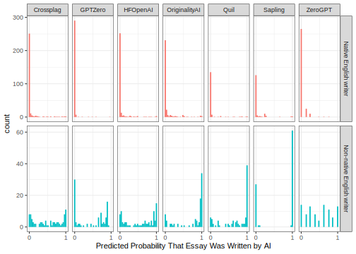

------------------------------------------------------------------------

The popularity and capability of large language models like [Generative Pre-trained Transformer 4](https://openai.com/research/gpt-4) (GPT-4), which generate human-like text based on simple prompts, has rapidly increased in recent years. The releases of more powerful next-generation models are often accompanied by the development of GPT *detectors*, which are machine learning models intended to estimate the probability that inputted text was generated by a GPT.

In 2023, a group of researchers collected a corpus of essays, some of which were written by real humans and others that were generated using various language models. Notably, some of the essays from real humans were written by people who did not write in English natively, while others were written by people who did.

::: callout-note
What does it mean to be a "native writer" of a language? Keep an eye out for this idea later on.
:::

The researchers passed each essay to a number of marketed GPT detectors, recording the predicted probabilities that each essay was written by a human or GPT model. Juxtaposing detector predictions for papers written by native and non-native English writers, @liang2023 argued in their paper [*GPT detectors are biased against non-native English writers*](https://doi.org/10.1016/j.patter.2023.100779) that GPT detectors disproportionately classify real writing from non-native English writers as AI-generated. Some news media channels that cite the study use it as evidence that GPT detector models behave unfairly. The statements 

1. GPT detectors are biased against non-native English writers, 
2. GPT detectors disproportionately classify real writing from non-native English writers as AI-generated, and 
3. GPT detector models behave unfairly

are only equivalent, though, given a shared set of social values surrounding what *fairness* means.

Perhaps the core question that machine learning fairness as a research field has tried to address is exactly what a machine learning model acting fairly entails. As a recent primer notes, "\[t\]he rapid growth of this new field has led to wildly inconsistent motivations, terminology, and notation, presenting a serious challenge for cataloging and comparing definitions" [@mitchell2021]. Fairness is a social construct, and means different things to different people; the operationalization of fairness as a quantitative metric is not at all trivial. The aim of evaluating a machine learning system's fairness is thus to state clearly one's definition of fairness, critique what that definition means in the problem context, and assess fairness under the chosen definition rigorously. The tidymodels packages in R provide a suite of functionality to support this kind of analysis, and we'll use the data from Liang et al. as an example to demonstrate a fairness-oriented analysis of model performance.

After loading needed packages, we'll conduct an exploratory analysis of the study's data. Once we have a sense for the distributions of relevant variables, we'll explore the different ways that we could try to measure fairness in this problem context. We will see that different ways of measuring fairness encode social values held by different stakeholders.

# Getting set up

Loading the tidymodels meta-package will load all of the functionality we need:

::: {.cell layout-align="center"}

```{.r .cell-code}
library(tidymodels)
```
:::

A tidied version of the study's data is available in the detectors R package. Loading the package and taking a look at the data:

::: {.cell layout-align="center"}

```{.r .cell-code}
library(detectors)

str(detectors)
#> tibble [6,185 × 9] (S3: tbl_df/tbl/data.frame)
#>  $ kind       : Factor w/ 2 levels "AI","Human": 2 2 2 1 1 2 1 1 2 2 ...
#>  $ .pred_AI   : num [1:6185] 0.999994 0.828145 0.000214 0 0.001784 ...
#>  $ .pred_class: Factor w/ 2 levels "AI","Human": 1 1 2 2 2 2 1 2 2 1 ...
#>  $ detector   : chr [1:6185] "Sapling" "Crossplag" "Crossplag" "ZeroGPT" ...
#>  $ native     : chr [1:6185] "No" "No" "Yes" NA ...
#>  $ name       : chr [1:6185] "Real TOEFL" "Real TOEFL" "Real College Essays" "Fake CS224N - GPT3" ...
#>  $ model      : chr [1:6185] "Human" "Human" "Human" "GPT3" ...
#>  $ document_id: num [1:6185] 497 278 294 671 717 855 533 484 781 460 ...
#>  $ prompt     : chr [1:6185] NA NA NA "Plain" ...
```
:::

Each row in this data corresponds to an essay (`document_id`) passed to a given GPT detector. For each row, we have the predicted probability `.pred_AI` from the `detector` giving whether the essay was written by AI. Notably, for the essays written by humans, we also have whether the author was a `native` English writer.

# Exploratory Analysis

This analysis will focus on the `kind`, `.pred_AI`, `.pred_class`, and `native` variables.

Initially, we can tabulate the observed and predicted classes:

::: {.cell layout-align="center"}

```{.r .cell-code}
detectors %>%
  count(kind, .pred_class)
#> # A tibble: 4 × 3
#>   kind  .pred_class     n
#>   <fct> <fct>       <int>
#> 1 AI    AI           1158
#> 2 AI    Human        2559
#> 3 Human AI            449
#> 4 Human Human        2019
```
:::

A perfect detector would predict that all essays written by AI were written by AI, the converse for humans, and zeroes elsewhere. Perhaps these models would perform better with [calibration](https://probably.tidymodels.org/articles/where-to-use.html), but as-is, they have a long way to go. For example, of the 3717 essays written by AI in this data, 2559 were predicted to be written by humans. Of the 2468 essays written by humans in this data, 449 were predicted to be written by AI.

Adding `native` into the tabulation:

::: {.cell layout-align="center"}

```{.r .cell-code}
detectors %>% 
  count(native, kind, .pred_class)
#> # A tibble: 6 × 4
#>   native kind  .pred_class     n
#>   <chr>  <fct> <fct>       <int>
#> 1 No     Human AI            390
#> 2 No     Human Human         247
#> 3 Yes    Human AI             59
#> 4 Yes    Human Human        1772
#> 5 <NA>   AI    AI           1158
#> 6 <NA>   AI    Human        2559
```
:::

Note that, for essays written by AI (`kind == "AI"`), the `native` variable isn't well-defined. Those entries thus match the numbers from the above table.

For essays written by `Human`s, a plot perhaps better demonstrates the disparity:

::: {.cell layout-align="center"}

```{.r .cell-code}
detectors %>% 
  filter(!is.na(native)) %>%
  ggplot(aes(x = native, fill = .pred_class)) +
  geom_bar() +
  labs(x = "Native English Writer", fill = "Predicted Class")
```

::: {.cell-output-display}
{fig-align='center' width=672}
:::
:::

Most of the essays written by non-native English writers are incorrectly classified as written by AI, while nearly all of the essays written by native English writers are correctly classified as written by humans. The same effect can be seen in the underlying probability distributions:

::: {.cell layout-align="center"}

```{.r .cell-code}
detectors %>%
  filter(!is.na(native)) %>%
  mutate(native = case_when(native == "Yes" ~ "Native English writer",
                            native == "No" ~ "Non-native English writer")) %>%
  ggplot(aes(.pred_AI, fill = native)) +
  geom_histogram(bins = 30, show.legend = FALSE) +
  facet_wrap(vars(native), scales = "free_y", nrow = 2) +
  labs(x = "Predicted Probability That Essay Was Written by AI")
```

::: {.cell-output-display}
{fig-align='center' width=672}
:::
:::

Again, note that *all of the plotted essays were written by humans*. An effective detector would thus predict a probability near zero for all of these observations. In this plot, we see that the evidence in our initial table showing these detectors weren't performing well didn't tell the whole story. They perform *quite* well for native English writers, actually. For non-native English writers, though, they perform terribly.

The above plots aggregate observations across several `detectors`, though. Do some GPT detectors classify essays written by non-native English writers just as well as those from native English writers? We can recreate the above plot to examine this question by faceting across `detectors`.

::: {.cell layout-align="center"}

```{.r .cell-code}
detectors %>%
  filter(!is.na(native)) %>%
  mutate(native = case_when(native == "Yes" ~ "Native English writer",
                            native == "No" ~ "Non-native English writer")) %>%
  ggplot(aes(.pred_AI, fill = native)) +
  geom_histogram(bins = 30) +
  facet_grid(vars(native), vars(detector), scales = "free_y") +
  labs(x = "Predicted Probability That Essay Was Written by AI") +
  scale_x_continuous(breaks = c(0, 1)) +
  theme(legend.position = "none")
```

::: {.cell-output-display}
{fig-align='center' width=672}
:::
:::

Each column in this plot reflects roughly the same story as the plot that aggregates across detectors; the detectors work *very* well at correctly classifying real writing from native English writers, yet classify writing from non-native English writers incorrectly at least as often as they do so correctly.

::: callout-note
## Question for reflection
Explore the source data further. Where are the essays written by native English writers collected from? How about non-native? What does our usage of "native writer" mean in this context, then?
:::

# Fairness assessment

The [1.3.0 release of yardstick](https://yardstick.tidymodels.org/news/index.html#yardstick-130) introduced a suite of functionality for fairness-oriented analysis of machine learning models. The release includes a tool to make fairness metrics, `new_groupwise_metric()`, as well as three outputs of that tool giving canonical fairness metrics: `equal_opportunity()`, `equalized_odds()`, and `demographic_parity()`. To better understand how to use metrics to quantify model fairness, we'll consider what a fairness assessment of this model would look like from the perspective of three different stakeholders.

## Effective detection, group-blind

Imagine, first, the position that the most fair detection model is one that reliably differentiates between essays written by humans or generated by GPTs, regardless of the problem context. From this perspective, the most fair model is the model that detects GPT-generated essays most effectively; it is unfair to pass on an essay written by a GPT as one's own work. When analyzing this data, a stakeholder with this perspective would ignore the `native` variable in their analysis.

-   A **detector author** may take on such a perspective, since their model may be applied in a diverse set of unknown contexts.

-   A **student** who submits an essay of their own writing may feel it is unfair to have their work compared to work generated by GPTs.

-   An **instructor** of a course tasked with evaluating essays may feel it is unfair to such students to compare those students' work to GPT-generated essays. Additionally, this instructor may teach a course to only native English writers or only non-native English writers.

In this case, we calculate a chosen performance metric for each detector, across all of the data, and then consider the most performant detectors:

::: {.cell layout-align="center"}

```{.r .cell-code}
detectors %>%
  group_by(detector) %>%
  roc_auc(truth = kind, .pred_AI) %>%
  arrange(desc(.estimate)) %>%
  head(3)
#> # A tibble: 3 × 4
#>   detector      .metric .estimator .estimate
#>   <chr>         <chr>   <chr>          <dbl>
#> 1 GPTZero       roc_auc binary         0.750
#> 2 OriginalityAI roc_auc binary         0.682
#> 3 HFOpenAI      roc_auc binary         0.614
```
:::

::: callout-tip
To learn more about how the yardstick package handles groups in data, see the ["Grouping behavior in yardstick" vignette](https://yardstick.tidymodels.org/articles/grouping.html).
:::

From this perspective, the models with the highest `roc_auc()` estimates are the most fair.

The fairness assessment for this stakeholder doesn't need any of the functionality newly introduced in yardstick 1.3.0. An analysis that reconciles the role of the `native` variable in these models' predictions will, though.

## Fair prediction on human-written essays

Now, consider that our only priority was to correctly classify human-written text as human-written and incorrectly classify human-written text as generated by AI at the same rate for both native English writers and non-native English writers, ignoring predictions from essays generated by AI.

-   Another **student** whose work is evaluated by a detector model may take on such a perspective. This student could be a native English writer who does not want other students to be subjected to undue harm or a non-native English writer concerned with their own writing being incorrectly classified as GPT-generated.

-   Another **instructor** of a course may feel it is unfair to disproportionately classify writing from students who are non-native English writers as GPT-generated, regardless of how effectively the model detects GPT-generated essays.

The `equal_opportunity()` metric enables us to quantify the extent of this interpretation of unfairness. Equal opportunity is satisfied when a model's predictions have the same true positive and false negative rates across protected groups; a model predicts more fairly if it's equally likely to predict a positive outcome for each group.

In this example, a GPT detector satisfies equal opportunity when the detector correctly classifies human-written text as human-written and incorrectly classifies human-written text as generated by AI at the same rate for both native English writers and non-native English writers.

::: callout-note
This definition does not consider the predictions based on essays generated by AI.
:::

To calculate equal opportunity with yardstick, we use `equal_opportunity()` to create a metric function:

::: {.cell layout-align="center"}

```{.r .cell-code}
equal_opportunity_by_native <- equal_opportunity(by = native)

equal_opportunity_by_native
#> A class metric | direction: minimize, group-wise on: native
```
:::

The function `equal_opportunity_by_native()` is a yardstick metric function like any other, except it knows to temporarily group by and summarize across a data-column called `native`. Applying it:

::: {.cell layout-align="center"}

```{.r .cell-code}
detectors %>%
  filter(kind == "Human") %>%
  group_by(detector) %>%
  equal_opportunity_by_native(
    truth = kind, 
    estimate = .pred_class, 
    event_level = "second"
  ) %>%
  arrange(.estimate) %>%
  head(3)
#> # A tibble: 3 × 5
#>   detector  .metric           .by    .estimator .estimate
#>   <chr>     <chr>             <chr>  <chr>          <dbl>
#> 1 Crossplag equal_opportunity native binary         0.464
#> 2 ZeroGPT   equal_opportunity native binary         0.477
#> 3 GPTZero   equal_opportunity native binary         0.510
```
:::

The detectors with estimates closest to zero are most fair, by this definition of fairness.

::: callout-important
Why do we need to specify `event_level = "second"`? See the "Relevant level" section in [yardstick's documentation](https://yardstick.tidymodels.org/reference/sens.html#relevant-level) to learn more.
:::

Given this set of moral values, our analysis would offer a different set of recommendations for which detector to use.

## Balancing two notions of fairness

Instead of either of the options we have considered so far, imagine that we both feel that it is unfair for GPT-generated work to go undetected *and* believe that it's unfair for a GPT detector to disproportionately classify human-written work from non-native English writers as GPT-generated.

-   Another **instructor** of a course may feel it is unfair to disproportionately classify human-written work from non-native English writers as GPT-generated, but still values detection of GPT-generated content.

In this case, we could *first* ensure that a model detects GPT-generated work with some threshold of performance, and then choose the model among that set that predicts most fairly on human-written essays. This reflects the belief that it is more unfair to fail to detect GPT-generated work than it is to disproportionately classify human-written work from non-native English writers as GPT-generated, as it is possible that the model that most proportionately classifies human-written work from native and non-native English writers as GPT-generated is not among the recommended models.

::: {.cell layout-align="center"}

```{.r .cell-code}
performant_detectors <- 
  detectors %>%
  group_by(detector) %>%
  roc_auc(truth = kind, .pred_AI) %>%
  arrange(desc(.estimate)) %>%
  head(3)

detectors %>%
  filter(kind == "Human", detector %in% performant_detectors$detector) %>%
  group_by(detector) %>%
  equal_opportunity_by_native(
    truth = kind, 
    estimate = .pred_class, 
    event_level = "second"
  ) %>%
  arrange(.estimate)
#> # A tibble: 3 × 5
#>   detector      .metric           .by    .estimator .estimate
#>   <chr>         <chr>             <chr>  <chr>          <dbl>
#> 1 GPTZero       equal_opportunity native binary         0.510
#> 2 HFOpenAI      equal_opportunity native binary         0.549
#> 3 OriginalityAI equal_opportunity native binary         0.709
```
:::

We could also reverse the process, reflecting the belief that it is more unfair to disproportionately classify human-written work from non-native English writers as GPT-generated than it is to pass on output from GPTs as one's own work. We first set a threshold based on `equal_opportunity()`, then choose the most performant model by `roc_auc()`:

::: {.cell layout-align="center"}

```{.r .cell-code}
equal_opportunity_detectors <- 
  detectors %>%
  filter(kind == "Human") %>%
  group_by(detector) %>%
  equal_opportunity_by_native(
    truth = kind, 
    estimate = .pred_class, 
    event_level = "second"
  ) %>%
  arrange(.estimate) %>%
  head(3)

detectors %>%
  filter(detector %in% equal_opportunity_detectors$detector) %>%
  group_by(detector) %>%
  roc_auc(truth = kind, .pred_AI) %>%
  arrange(desc(.estimate))
#> # A tibble: 3 × 4
#>   detector  .metric .estimator .estimate
#>   <chr>     <chr>   <chr>          <dbl>
#> 1 GPTZero   roc_auc binary         0.750
#> 2 Crossplag roc_auc binary         0.613
#> 3 ZeroGPT   roc_auc binary         0.603
```
:::

In this example, changing the prioritization of the criteria results in a different set of recommended models.

# Choosing a detector

In the preceding section, we saw that the recommended detector we identify depends on our moral values. That is, the mathematical notion of fairness appropriate for a given analysis follows from the problem context. In this way, no statistical model is objectively more fair than another; our assessment of fairness depends on our personally held ideas of fairness.

As for the problem of GPT detection, while each stakeholder might find that some models are more fair than others, even the most fair models recommended in each approach are quite unfair. For instance, from the first stakeholder's perspective, even though it's the most performant model available, GPTZero's `roc_auc()` of 0.75 leaves much to be desired; a stakeholder ought to consider the potential harms resulting from the substantial number of errors made by this model when applied in context.

This analysis only considered one fairness metric, `equal_opportunity()`. We could have attempted to apply either of the other two fairness metrics included in yardstick 1.3.0, `equalized_odds()` and `demographic_parity()`, or a custom fairness metric. Are those two other metrics well-defined for this problem? Which stakeholders' interests are best represented by those metrics? Would they result in yet another set of discordant recommendations?

We also did not consider how the outputs of a chosen model be used. If a student's work is classified as written by a GPT model, what happens then? Would a misclassification be more harmful for one type of student than another? Could an instructor trust model output more readily for one type of student than another? Answers to these questions are a necessary component of a complete fairness analysis and, just like the choice of metric, depend heavily on the problem context.

In all, we've seen that applied fairness analysis is as much a social problem as it is a technical one. While we absolutely ought to strive to minimize harm in development and deployment of machine learning models, the fact that fairness is a moral concept, rather than a mathematical one, means that algorithmic unfairness cannot be automated away.

# References

::: {#refs}
:::

## Session information {#session-info}

::: {.cell layout-align="center"}

```
#> ─ Session info ─────────────────────────────────────────────────────
#>  version  R version 4.5.1 (2025-06-13)
#>  language (EN)
#>  date     2025-10-21
#>  pandoc   3.6.3
#>  quarto   1.8.25
#> 
#> ─ Packages ─────────────────────────────────────────────────────────
#>  package      version date (UTC) source
#>  broom        1.0.9   2025-07-28 CRAN (R 4.5.0)
#>  detectors    0.1.0   2023-10-26 CRAN (R 4.5.0)
#>  dials        1.4.2   2025-09-04 CRAN (R 4.5.0)
#>  dplyr        1.1.4   2023-11-17 CRAN (R 4.5.0)
#>  ggplot2      4.0.0   2025-09-11 CRAN (R 4.5.0)
#>  infer        1.0.9   2025-06-26 CRAN (R 4.5.0)
#>  parsnip      1.3.3   2025-08-31 CRAN (R 4.5.0)
#>  purrr        1.1.0   2025-07-10 CRAN (R 4.5.0)
#>  recipes      1.3.1   2025-05-21 CRAN (R 4.5.0)
#>  rlang        1.1.6   2025-04-11 CRAN (R 4.5.0)
#>  rsample      1.3.1   2025-07-29 CRAN (R 4.5.0)
#>  tibble       3.3.0   2025-06-08 CRAN (R 4.5.0)
#>  tidymodels   1.4.1   2025-09-08 CRAN (R 4.5.0)
#>  tune         2.0.1   2025-10-17 CRAN (R 4.5.0)
#>  workflows    1.3.0   2025-08-27 CRAN (R 4.5.0)
#>  yardstick    1.3.2   2025-01-22 CRAN (R 4.5.0)
#> 
#> ────────────────────────────────────────────────────────────────────
```
:::

 
