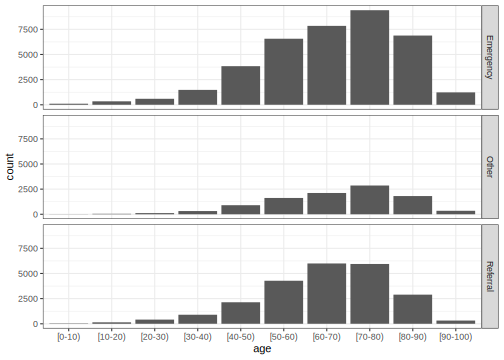

------------------------------------------------------------------------


In 2019, @obermeyer2019 published an analysis of predictions from a machine learning model that health care providers use to allocate resources. The model's outputs are used to recommend a patient for _high-risk care management_ programs:

> These programs seek to improve the care of patients with complex health needs by providing additional resources, including greater attention from trained providers, to help ensure that care is well coordinated. Most health systems use these programs as the cornerstone of population health management efforts, and they are widely considered effective at improving outcomes and satisfaction while reducing costs. [...] Because the programs are themselves expensive---with costs going toward teams of dedicated nurses, extra primary care appointment slots, and other scarce resources---**health systems rely extensively on algorithms to identify patients who will benefit the most.**

They argue in their analysis that the model in question exhibits substantial racial bias, where "Black patients assigned the same level of risk by the algorithm are sicker than White patients." In practice, this resulted in the reduction of "the number of Black patients identified for extra care by more than half."

This article will demonstrate a fairness-oriented workflow for training a machine learning model to identify high-risk patients. Throughout the model development process, we'll consider the social impacts that different modeling decisions may have when such a model is deployed in context.

## Setup

The data we'll use in this analysis is a publicly available database containing information on 71,515 hospital stays from diabetes patients. The data comes from a study by @strack2014, where the authors model the effectiveness of a particular lab test in predicting readmission. A version of that data is available in the [readmission R package](https://simonpcouch.github.io/readmission/):


::: {.cell layout-align="center"}

```{.r .cell-code}
library(readmission)

readmission
#> # A tibble: 71,515 × 12
#>    readmitted race   sex   age   admission_source blood_glucose insurer duration
#>    <fct>      <fct>  <fct> <fct> <fct>            <fct>         <fct>      <dbl>
#>  1 Yes        Afric… Male  [60-… Referral         <NA>          <NA>           7
#>  2 No         Cauca… Fema… [50-… Emergency        Normal        Private        4
#>  3 Yes        Cauca… Fema… [70-… Referral         <NA>          Medica…        5
#>  4 No         Cauca… Fema… [80-… Referral         <NA>          Private        5
#>  5 No         Cauca… Fema… [70-… Referral         <NA>          <NA>           4
#>  6 No         Cauca… Male  [50-… Emergency        Very High     <NA>           2
#>  7 Yes        Afric… Fema… [70-… Referral         <NA>          Private        3
#>  8 No         Cauca… Fema… [20-… Emergency        <NA>          <NA>           1
#>  9 No         Cauca… Male  [60-… Other            <NA>          <NA>          12
#> 10 No         Cauca… Fema… [80-… Referral         <NA>          Medica…        1
#> # ℹ 71,505 more rows
#> # ℹ 4 more variables: n_previous_visits <dbl>, n_diagnoses <dbl>,
#> #   n_procedures <dbl>, n_medications <dbl>
```
:::


The first variable in this data, `readmitted`, gives whether the patient was readmitted within 30 days of discharge. We'll use this variable as a proxy for "unmet need for additional care," in that readmission within one month indicates that the patient may have benefited from additional attention during their hospital stay; if a machine learning model consistently identifies lesser need (via prediction of non-readmission) in one subgroup than another, the subgroup allocated lesser need will go without care they'd benefit from. We'd like to train a model that is both fair with regard to how it treats `race` groups and is as performant as possible. The tidymodels framework provides the tools needed to identify such disparities.

Loading needed packages:


::: {.cell layout-align="center"}

```{.r .cell-code}
library(tidymodels)
library(baguette)
library(desirability2)
library(GGally)
```
:::


## Exploratory Analysis

Let's start off our analysis with some explanatory summarization and plotting. First, taking a look at our outcome variable:


::: {.cell layout-align="center"}

```{.r .cell-code}
readmission %>%
  count(readmitted)
#> # A tibble: 2 × 2
#>   readmitted     n
#>   <fct>      <int>
#> 1 Yes         6293
#> 2 No         65222
```
:::


8.8% of patients were readmitted within 30 days after being discharged from the hospital. This is an example of a modeling problem with a _class imbalance_, where one value of the outcome variable is much more common than another. Now, taking a look at the counts of those in each protected class:


::: {.cell layout-align="center"}

```{.r .cell-code}
readmission %>%
  count(race)
#> # A tibble: 6 × 2
#>   race                 n
#>   <fct>            <int>
#> 1 African American 12887
#> 2 Asian              497
#> 3 Caucasian        53491
#> 4 Hispanic          1517
#> 5 Other             1177
#> 6 Unknown           1946
```
:::


::: callout-note
We'll refer to the `race` groups in this data by their actual value (e.g. `"Caucasian"` rather than Caucasian) so as to not take for granted the choices that the dataset authors made in choosing these categorizations. Racial categorizations are not stable across time and place---as you read on, consider how a change in the categories used in data collection might affect this analysis [@omi1994].
:::

A vast majority of patients are labeled `"Caucasian"` (74.8%) or `"African American"` (18%). The counts for the remaining racial categorizations are quite a bit smaller, and when we split the data up into resamples, those counts will reduce even further. As a result, the variability associated with the estimates `"Asian"`, `"Hispanic"`, `"Other"`, and `"Unknown"` will be larger than those for `"African American"` and `"Causasian"`. As an example:


::: {.cell layout-align="center"}

```{.r .cell-code}
readmission %>%
  # randomly split into groups
  mutate(., group = sample(1:10, nrow(.), replace = TRUE)) %>%
  group_by(race, group) %>%
  # compute proportion readmitted by race + random `group`ing
  summarize(prop = mean(readmitted == "Yes"), n = n()) %>%
  # compute variation in the proportion by race.
  # note that, by default, the output from above is grouped by race only.
  summarize(mean = mean(prop), sd = sd(prop), n = sum(n))
#> # A tibble: 6 × 4
#>   race               mean      sd     n
#>   <fct>             <dbl>   <dbl> <int>
#> 1 African American 0.0849 0.00713 12887
#> 2 Asian            0.0825 0.0295    497
#> 3 Caucasian        0.0900 0.00369 53491
#> 4 Hispanic         0.0805 0.0285   1517
#> 5 Other            0.0680 0.0265   1177
#> 6 Unknown          0.0720 0.0178   1946
```
:::


The standard deviations `sd` are much larger for groups with a smaller number of observations `n`, even if the average proportions `mean` are similar. This variation will affect our analysis downstream in that fairness metrics measure variation across groups; the noise associated with proportions calculated for `race` groups with fewer values may overwhelm the signal associated with actual disparities in care for those groups.

We have several options when considering how to address this:

* **Remove rows arising from infrequent classes.** In this example, this would mean removing all rows with `race` values other than `"Caucasian"` or `"African American"`. This is the approach taken by other public analyses of these data, including the original study that this data arose from. An analysis resulting from this approach would ignore any disparities in care for `race` groups other than `"Caucasian"` or `"African American"`.
* **Construct custom fairness metrics that address the increased variability associated with smaller counts.** We could scale the variability of the estimates for each `race` group before calculating fairness metrics.
* **Bin the values for infrequent classes.** This would entail collapsing values of `race` other than `"Caucasian"` and `"African American"` into one factor level. This approach is somewhat of a hybrid of the two approaches above; we lose some granularity in information regarding care for `race` groups other than `"Caucasian"` and `"African American"`, but reduce the variability associated with the estimates for those groups in the process.

For this analysis, we'll go with the last option.

::: callout-note
While we won't construct custom fairness metrics in this example, you can do so using the `new_groupwise_metric()` function in yardstick.
:::

Recoding that data column:


::: {.cell layout-align="center"}

```{.r .cell-code}
readmission_collapsed <-
  readmission %>%
  mutate(
    race = case_when(
      !(race %in% c("Caucasian", "African American")) ~ "Other",
      .default = race
    ),
    race = factor(race)
  )

readmission_collapsed %>%
  count(race)
#> # A tibble: 3 × 2
#>   race                 n
#>   <fct>            <int>
#> 1 African American 12887
#> 2 Caucasian        53491
#> 3 Other             5137
```
:::


Plotting distributions of remaining predictors:


::: {.cell layout-align="center"}

```{.r .cell-code}
readmission_collapsed %>%
  ggplot(aes(x = age)) +
  geom_bar() +
  facet_grid(rows = vars(admission_source))
```

::: {.cell-output-display}
{fig-align='center' width=672}
:::
:::


Most patients in this data are in their 60s and 70s. Emergencies account for most admissions in this data, though many others are from referrals or other sources.


::: {.cell layout-align="center"}

```{.r .cell-code}
readmission_collapsed %>%
  ggplot(aes(x = insurer)) +
  geom_bar()
```

::: {.cell-output-display}
{fig-align='center' width=672}
:::
:::


While payment information on most patients is missing, most patients in this data are covered under Medicare.

::: callout-tip
The payment method is one way in which societal unfairness may be reflected in the source data besides the variables on protected groups themselves. Medicaid coverage is only available to people below a certain income, and many self-pay patients do not have medical insurance because they cannot afford it. Relatedly, poverty rates differ drastically among racial groups in the U.S.
:::


::: {.cell layout-align="center"}

```{.r .cell-code}
readmission_collapsed %>%
  pivot_longer(starts_with("n_")) %>%
  ggplot(aes(x = value)) +
  geom_histogram() +
  facet_wrap(vars(name), scales = "free_x")
```

::: {.cell-output-display}
{fig-align='center' width=672}
:::
:::


For many patients, this was their first inpatient visit to this hospital system. During their stay, many patients receive 10-20 medications and experience several procedures.

With a sense for the distributions of variables in this dataset, we can move on to splitting data up for modeling.

## Resampling Data

First, splitting data into training and testing:


::: {.cell layout-align="center"}

```{.r .cell-code}
set.seed(1)
readmission_splits <- initial_split(readmission_collapsed, strata = readmitted)
readmission_train  <- training(readmission_splits)
readmission_test   <- testing(readmission_splits)
```
:::


:::callout-note
We've set `strata = readmitted` here to stratify our sample by the outcome variable in order to address the class imbalance. To learn more about class imbalances and stratification, see the ["Common Methods for Splitting Data"](https://www.tmwr.org/splitting#splitting-methods) chapter of [_Tidy Modeling with R_](https://www.tmwr.org/) [@kuhn2022].
:::

We'll set the 17,879-row `readmission_test` test set to the side for the remainder of the analysis until we compute a final estimate of our performance on the chosen model. Splitting the 53,636 rows of the training data into 10 resamples:


::: {.cell layout-align="center"}

```{.r .cell-code}
readmission_folds <- vfold_cv(readmission_train, strata = readmitted)

readmission_folds
#> #  10-fold cross-validation using stratification 
#> # A tibble: 10 × 2
#>    splits               id    
#>    <list>               <chr> 
#>  1 <split [48272/5364]> Fold01
#>  2 <split [48272/5364]> Fold02
#>  3 <split [48272/5364]> Fold03
#>  4 <split [48272/5364]> Fold04
#>  5 <split [48272/5364]> Fold05
#>  6 <split [48272/5364]> Fold06
#>  7 <split [48273/5363]> Fold07
#>  8 <split [48273/5363]> Fold08
#>  9 <split [48273/5363]> Fold09
#> 10 <split [48273/5363]> Fold10
```
:::


Each split contains an analysis and assessment set: one for model fitting and the other for evaluation. Averaging performance estimates across resamples will give us a sense for how well the model performs on data it hasn't yet seen.

## Training and Evaluating Models

We'll define a diverse set of models and pre-processing strategies and then evaluate them against our resamples.

### Model Workflows

We'll first define a basic recipe that first sets a factor level for missing values and then centers and scales numeric data:


::: {.cell layout-align="center"}

```{.r .cell-code}
recipe_basic <-
  recipe(readmitted ~ ., data = readmission) %>%
  step_unknown(all_nominal_predictors()) %>%
  step_YeoJohnson(all_numeric_predictors()) %>%
  step_normalize(all_numeric_predictors()) %>%
  step_dummy(all_nominal_predictors())
```
:::


The other preprocessor that we'll try encodes the age as a numeric variable rather than the bins as in the source data:


::: {.cell layout-align="center"}

```{.r .cell-code}
# e.g. "[10-20]" -> 15
age_bin_to_midpoint <- function(age_bin) {
  # ensure factors are treated as their label
  age <- as.character(age_bin) 
  # take the second character, e.g. "[10-20]" -> "1"
  age <- substr(age, 2, 2)
  # convert to numeric, e.g. "1" -> 1
  age <- as.numeric(age)
  # scale to bin's midpoint, e.g. 1 -> 10 + 5 -> 15
  age * 10 + 5
}

recipe_age <-
  recipe(readmitted ~ ., data = readmission) %>%
  step_mutate(age_num = age_bin_to_midpoint(age)) %>%
  step_rm(age) %>%
  step_unknown(all_nominal_predictors()) %>%
  step_YeoJohnson(all_numeric_predictors()) %>%
  step_normalize(all_numeric_predictors()) %>%
  step_dummy(all_nominal_predictors())
```
:::


Both of these preprocessors will be combined with one of three models. Logistic regressions, XGBoost, and bagged neural networks make a diverse set of assumptions about the underlying data generating process. Defining model specifications for each:


::: {.cell layout-align="center"}

```{.r .cell-code}
spec_lr <- 
  logistic_reg("classification")

spec_bt <-
  boost_tree("classification", mtry = tune(), learn_rate = tune(), trees = 500)

spec_nn <-
  bag_mlp("classification", hidden_units = tune(), penalty = tune())
```
:::


We now combine each unique combination of recipe and preprocessor in a workflow set:


::: {.cell layout-align="center"}

```{.r .cell-code}
wflow_set <- 
  workflow_set(
    preproc = list(basic = recipe_basic, age = recipe_age),
    models = list(lr = spec_lr, bt = spec_bt, nn = spec_nn)
  )

wflow_set
#> # A workflow set/tibble: 6 × 4
#>   wflow_id info             option    result    
#>   <chr>    <list>           <list>    <list>    
#> 1 basic_lr <tibble [1 × 4]> <opts[0]> <list [0]>
#> 2 basic_bt <tibble [1 × 4]> <opts[0]> <list [0]>
#> 3 basic_nn <tibble [1 × 4]> <opts[0]> <list [0]>
#> 4 age_lr   <tibble [1 × 4]> <opts[0]> <list [0]>
#> 5 age_bt   <tibble [1 × 4]> <opts[0]> <list [0]>
#> 6 age_nn   <tibble [1 × 4]> <opts[0]> <list [0]>
```
:::


Each workflow in the workflow set is now ready to be evaluated. We now need to decide how to best evaluate these modeling workflows, though.

### Metrics

The metrics with which we choose to evaluate our models are the core of our fairness analysis. In addition to the default metrics for classification in tune, `accuracy()` and `roc_auc()`, we'll compute a set of fairness metrics: `equal_opportunity()`, `equalized_odds()`, and `demographic_parity()`.

* `equal_opportunity()`: Equal opportunity is satisfied when a model's predictions have the same true positive and false negative rates across protected groups. In this example, a model satisfies equal opportunity if it correctly predicts readmission and incorrectly predicts non-readmission at the same rate across `race` groups. In this case, the metric represents the interests of the patient; a patient would like to be just as likely to receive additional care resources as another if they are of equal need, and no more likely to go without unneeded care than another. Since this metric does not consider false positives, it notably does not penalize disparately providing additional care resources to a patient who may not need them.

* `equalized_odds()`: Equalized odds is satisfied when a model's predictions have the same false positive, true positive, false negative, and true negative rates across protected groups. This definition is a special case of the one above, where there's additionally a constraint placed on the false positive and true negative rates. In this example, a model satisfies equalized odds if it correctly predicts both readmission and non-readmission _and_ incorrectly predicts readmission and non-readmission at the same rate across `race` groups.  Similar to equal opportunity, the stakeholders for the metric in this case can be generally understood to be those who are subject to the model's predictions, except that this metric also aims to prevent disparately 1) providing additional care resources to those who may not need them and 2) identifying patients who do _not_ need additional care resources correctly.

* `demographic_parity()`: Demographic parity is satisfied when a model's predictions have the same predicted positive rate across groups. In this example, a model satisfies demographic parity if it predicts readmission at the same rate across `race` groups. Note that this metric does not depend on the true outcome value, `readmitted`. The interests of a stakeholder who would like to see additional care resources provisioned at the same rate across `race` groups, even if the actual need for those resources differs among groups, are represented by this metric. As demographic parity is broadly accepted as part of a legal definition of machine learning fairness, hospital systems might consider this metric to protect themselves legally [@ecfr].

For each of the above metrics, values closer to zero indicate that a model is more fair.

The above three metrics are defined specifically with fairness in mind. By another view of fairness, though, `accuracy()` and `roc_auc()` are _also_ fairness metrics. Some stakeholders may believe that the most performant model regardless of group membership---i.e. the model that predicts readmission most accurately across groups---is the most fair model. 

To evaluate each of these metrics against the specified workflows, we create a metric set like so:


::: {.cell layout-align="center"}

```{.r .cell-code}
m_set <-
  metric_set(
    accuracy,
    roc_auc,
    equal_opportunity(race),
    equalized_odds(race),
    demographic_parity(race)
  )

m_set
#> A metric set, consisting of:
#> - `accuracy()`, a class metric                 | direction: maximize
#> - `roc_auc()`, a probability metric            | direction: maximize
#> - `equal_opportunity(race)()`, a class metric  | direction: minimize,
#> group-wise on: race
#> - `equalized_odds(race)()`, a class metric     | direction: minimize,
#> group-wise on: race
#> - `demographic_parity(race)()`, a class metric | direction: minimize,
#> group-wise on: race
```
:::


::: callout-note
The first two inputs, `accuracy()` and `roc_auc()`, are standard [yardstick](https://yardstick.tidymodels.org) metrics. The latter three are also yardstick metrics like any other, though are created using the [_metric factories_](https://yardstick.tidymodels.org/reference/new_groupwise_metric.html) `equal_opportunity()`, `equalized_odds()`, and `demographic_parity()`. When passed a data-column, metric factories output yardstick metrics. 
:::

### Evaluation

We can now evaluate the workflows we've defined against resamples using our metric set. The `workflow_map()` function will call `tune_grid()` on each workflow:


::: {.cell layout-align="center"}

```{.r .cell-code}
set.seed(1)
wflow_set_fit <- 
  workflow_map(
    wflow_set, 
    verbose = TRUE, 
    seed = 1, 
    metrics = m_set,
    resamples = readmission_folds
  )
```
:::


A fitted workflow set looks just like the unfitted workflow set we saw previously, except that information on the tuning process is now stored in the `option` and `result` variables for each modeling workflow:


::: {.cell layout-align="center"}

```{.r .cell-code}
wflow_set_fit
#> # A workflow set/tibble: 6 × 4
#>   wflow_id info             option    result   
#>   <chr>    <list>           <list>    <list>   
#> 1 basic_lr <tibble [1 × 4]> <opts[2]> <rsmp[+]>
#> 2 basic_bt <tibble [1 × 4]> <opts[2]> <tune[+]>
#> 3 basic_nn <tibble [1 × 4]> <opts[2]> <tune[+]>
#> 4 age_lr   <tibble [1 × 4]> <opts[2]> <rsmp[+]>
#> 5 age_bt   <tibble [1 × 4]> <opts[2]> <tune[+]>
#> 6 age_nn   <tibble [1 × 4]> <opts[2]> <tune[+]>
```
:::


## Model Selection

Now that we've evaluated a number of models with a variety of metrics, we can explore the results to determine our optimal model. Beginning with a quick exploratory plot of the distributions of our metrics:


::: {.cell layout-align="center"}

```{.r .cell-code}
wflow_set_fit %>%
  collect_metrics() %>%
  pivot_wider(
    id_cols = c(wflow_id, .config), 
    names_from = .metric, 
    values_from = mean
  ) %>%
  select(-c(wflow_id, .config)) %>%
  ggpairs() +
  theme(axis.text.x = element_text(angle = 45, vjust = .8, hjust = .9))
```

::: {.cell-output-display}
{fig-align='center' width=80%}
:::
:::


The fairness metrics `demographic_parity()`, `equal_opportunity()`, and `equalized_odds()` all take values very close to zero for many models. Also, the metric values are highly correlated with each other, including correlations between fairness metrics and the more general-purpose performance metrics. That is, the most performant models also seem to be among the most fair.

More concretely, we can rank the model configurations to examine only the most performant models:


::: {.cell layout-align="center"}

```{.r .cell-code}
rank_results(wflow_set_fit, rank_metric = "roc_auc") %>%
  filter(.metric == "roc_auc")
#> # A tibble: 42 × 9
#>    wflow_id .config         .metric  mean std_err     n preprocessor model  rank
#>    <chr>    <chr>           <chr>   <dbl>   <dbl> <int> <chr>        <chr> <int>
#>  1 age_bt   Preprocessor1_… roc_auc 0.605 0.00424    10 recipe       boos…     1
#>  2 basic_bt Preprocessor1_… roc_auc 0.605 0.00423    10 recipe       boos…     2
#>  3 age_bt   Preprocessor1_… roc_auc 0.604 0.00378    10 recipe       boos…     3
#>  4 age_bt   Preprocessor1_… roc_auc 0.603 0.00421    10 recipe       boos…     4
#>  5 basic_bt Preprocessor1_… roc_auc 0.603 0.00410    10 recipe       boos…     5
#>  6 basic_bt Preprocessor1_… roc_auc 0.603 0.00436    10 recipe       boos…     6
#>  7 age_bt   Preprocessor1_… roc_auc 0.602 0.00372    10 recipe       boos…     7
#>  8 basic_nn Preprocessor1_… roc_auc 0.602 0.00403    10 recipe       bag_…     8
#>  9 age_nn   Preprocessor1_… roc_auc 0.600 0.00431    10 recipe       bag_…     9
#> 10 age_nn   Preprocessor1_… roc_auc 0.600 0.00412    10 recipe       bag_…    10
#> # ℹ 32 more rows
```
:::


Almost all of the most performant model configurations arise from the boosted tree modeling workflow. Let's examine the results for specifically the modeling workflow that encodes age as a number more thoroughly:


::: {.cell layout-align="center"}

```{.r .cell-code}
autoplot(wflow_set_fit, id = "age_bt")
```

::: {.cell-output-display}
{fig-align='center' width=70%}
:::
:::


The learning rate `learn_rate` seems to have a more pronounced effect on the results metrics than the number of randomly selected predictors `mtry`. As before, we see that the most performant models with respect to `roc_auc()` also tend to be the most fair according to our fairness metrics. Further, the values of each of the fairness metrics plotted above seem highly correlated. 

From the perspective of a practitioner hoping to satisfy various stakeholders, the fact that these metrics are highly correlated makes the model selection process much easier. We can choose one fairness metric that we'd like to optimize for, and likely end up with a near-optimal configuration for the other metrics as a byproduct.

:::callout-note
In machine learning fairness, "impossibility theorems" show that fairness definitions "are not mathematically or morally compatible in general" [@mitchell2021]. More concretely, unless we live in a world with no inequality, there is no way to satisfy many definitions of fairness at once. However, recent research emphasizes that near-fairness among more limited sets of metrics, like the three we've used here, is both possible and relevant [@bell2023].
:::

To choose a model that performs well both with respect to a typical performance metric like `roc_auc()` and the fairness metrics we've chosen, we will make use of [desirability functions](https://www.tidyverse.org/blog/2023/05/desirability2/), which allow us to optimize based on multiple metrics at once.


::: {.cell layout-align="center"}

```{.r .cell-code}
best_params <-
  # extract the tuning results for the boosted tree model
  extract_workflow_set_result(wflow_set_fit, "age_bt") %>%
  # collect the metrics associated with it
  collect_metrics() %>%
  # pivot the metrics so that each is in a column
  pivot_wider(
    id_cols = c(mtry, learn_rate), 
    names_from = .metric, 
    values_from = mean
  ) %>%
  mutate(
    # higher roc values are better; detect max and min from the data
    d_roc     = d_max(roc_auc, use_data = TRUE),
    # lower equalized odds are better; detect max and min from the data
    d_e_odds  = d_min(equalized_odds, use_data = TRUE),
    # compute overall desirability based on d_roc and d_e_odds
    d_overall = d_overall(across(starts_with("d_")))
  ) %>%
  # pick the model with the highest desirability value
  slice_max(d_overall)
```
:::


The result is a tibble giving the parameter values that resulted in the best model:


::: {.cell layout-align="center"}

```{.r .cell-code}
best_params
#> # A tibble: 1 × 10
#>    mtry learn_rate accuracy demographic_parity equal_opportunity equalized_odds
#>   <int>      <dbl>    <dbl>              <dbl>             <dbl>          <dbl>
#> 1     7    0.00456    0.912                  0                 0              0
#> # ℹ 4 more variables: roc_auc <dbl>, d_roc <dbl>, d_e_odds <dbl>,
#> #   d_overall <dbl>
```
:::


We can use that tibble to finalize a workflow that we'll use to generate our final model fit:


::: {.cell layout-align="center"}

```{.r .cell-code}
final_model_config <-
  extract_workflow(wflow_set_fit, "age_bt") %>%
  finalize_workflow(best_params)
```
:::


Finally, generating our final model fit:


::: {.cell layout-align="center"}

```{.r .cell-code}
final_model <- 
  last_fit(final_model_config, readmission_splits, metrics = m_set)
```
:::


We can see the metrics associated with the final fit using `collect_metrics()`, just as with a tuning result:


::: {.cell layout-align="center"}

```{.r .cell-code}
collect_metrics(final_model)
#> # A tibble: 5 × 5
#>   .metric            .estimator .estimate .by   .config             
#>   <chr>              <chr>          <dbl> <chr> <chr>               
#> 1 accuracy           binary         0.912 <NA>  Preprocessor1_Model1
#> 2 equal_opportunity  binary         0     race  Preprocessor1_Model1
#> 3 equalized_odds     binary         0     race  Preprocessor1_Model1
#> 4 demographic_parity binary         0     race  Preprocessor1_Model1
#> 5 roc_auc            binary         0.602 <NA>  Preprocessor1_Model1
```
:::


The model we've selected has near-fairness with respect to the set of metrics we've chosen here. The accuracy of the model is 91.16%, quite similar to the accuracy that would result if the model just always predicted a patient would not readmit (91.2%). The `roc_auc()` value 0.602 indicates that the model indeed correctly predicts readmission in some cases, though still has a lot of room for improvement. A further analysis of these models might measure performance using a metric that specifically evaluates predictions on observations from the minority class---as in, patients that did actually readmit---like [`sens()`](https://yardstick.tidymodels.org/reference/sens.html?q=sens#details).

Extracting the model fit from the `last_fit` object:


::: {.cell layout-align="center"}

```{.r .cell-code}
final_model_fit <- extract_workflow(final_model)
```
:::


The `final_model_fit` object is now ready to predict on new data! Models generated with tidymodels are easily versioned, deployed, and monitored using the vetiver framework; learn more about the framework on the [vetiver website](https://vetiver.rstudio.com/get-started/).

In this article, we've demonstrated a fairness-oriented modeling analysis. Modeling with fairness in mind is not simply a numerical optimization problem, but a holistic process of examining the moral meanings of fairness in our problem context and how they are represented---or not represented---by various mathematical notions of fairness. 

While this analysis allowed us to train models that are near-fair with respect to a limited set of fairness metrics, it leaves many questions to be answered about the impacts of using such a model. Among other things:

* We've only evaluated the fairness of the model with `race` in mind. We also have information on the patient's `sex`. Could this model behave unfairly with respect to the patient's `sex`? How about with respect to the intersections of `race` and `sex`? A growing body of research shows us that black women experience pronounced discrimination as patients [@johnson2019; @okoro2020; @gopal2021].
* The categorizations of `race` and `sex` that we have access to are coarse. Race/ethnicity and sex/gender are richly and diversely experienced, and the limited set of categories that patients are presented with (or unknowingly assigned to) in healthcare contexts are only a proxy for how a patient may experience them. 
* We've used _readmission_ as a proxy for _need for additional care_. What factors might influence whether a patient willingly readmits? Or is admitted to the hospital in the first place? Note, especially, the disproportionate financial burden of healthcare for poorer patients.
* We don't know how the predictions resulting from this model will be used by practitioners or trusted by patients. The outputs of the model, of course, should be evaluated in conjunction with other evidence collected by a healthcare team throughout a patient's stay. Knowing this, though, will the model's outputs be differently interpreted for different groups in the patient population? For example, would a positive prediction of readmission be considered more seriously as evidence for needed additional care for a white man than for others? Further, given historical exploitation and unethical practice, would protected groups believe that algorithmic recommendation for additional care is likely discriminatory and mistrust the recommendations offered to them? [See @rajkomar2018.] 

Machine learning models can both have significant positive impacts on our lives and at the same time cause significant harms. Given the tremendous reach of these models in our society, efforts to include fairness as a criteria for evaluating machine learning models are as necessary as ever.

## Session information {#session-info}


::: {.cell layout-align="center"}

```
#> ─ Session info ─────────────────────────────────────────────────────
#>  setting  value
#>  version  R version 4.3.3 (2024-02-29)
#>  os       macOS Sonoma 14.4.1
#>  system   aarch64, darwin20
#>  ui       X11
#>  language (EN)
#>  collate  en_US.UTF-8
#>  ctype    en_US.UTF-8
#>  tz       America/Los_Angeles
#>  date     2024-03-26
#>  pandoc   2.17.1.1 @ /opt/homebrew/bin/ (via rmarkdown)
#> 
#> ─ Packages ─────────────────────────────────────────────────────────
#>  package       * version date (UTC) lib source
#>  baguette      * 1.0.2   2024-02-13 [1] CRAN (R 4.3.1)
#>  broom         * 1.0.5   2023-06-09 [1] CRAN (R 4.3.0)
#>  desirability2 * 0.0.1   2023-05-11 [1] CRAN (R 4.3.0)
#>  dials         * 1.2.1   2024-02-22 [1] CRAN (R 4.3.1)
#>  dplyr         * 1.1.4   2023-11-17 [1] CRAN (R 4.3.1)
#>  GGally        * 2.2.1   2024-02-14 [1] CRAN (R 4.3.1)
#>  ggplot2       * 3.5.0   2024-02-23 [1] CRAN (R 4.3.1)
#>  infer         * 1.0.7   2024-03-25 [1] CRAN (R 4.3.1)
#>  parsnip       * 1.2.1   2024-03-22 [1] CRAN (R 4.3.1)
#>  purrr         * 1.0.2   2023-08-10 [1] CRAN (R 4.3.0)
#>  readmission   * 0.1.0   2023-12-07 [1] CRAN (R 4.3.1)
#>  recipes       * 1.0.10  2024-02-18 [1] CRAN (R 4.3.1)
#>  rlang           1.1.3   2024-01-10 [1] CRAN (R 4.3.1)
#>  rsample       * 1.2.1   2024-03-25 [1] CRAN (R 4.3.1)
#>  tibble        * 3.2.1   2023-03-20 [1] CRAN (R 4.3.0)
#>  tidymodels    * 1.2.0   2024-03-25 [1] CRAN (R 4.3.1)
#>  tune          * 1.2.0   2024-03-20 [1] CRAN (R 4.3.1)
#>  workflows     * 1.1.4   2024-02-19 [1] CRAN (R 4.3.1)
#>  yardstick     * 1.3.1   2024-03-21 [1] CRAN (R 4.3.1)
#> 
#>  [1] /Users/emilhvitfeldt/Library/R/arm64/4.3/library
#>  [2] /Library/Frameworks/R.framework/Versions/4.3-arm64/Resources/library
#> 
#> ────────────────────────────────────────────────────────────────────
```
:::
