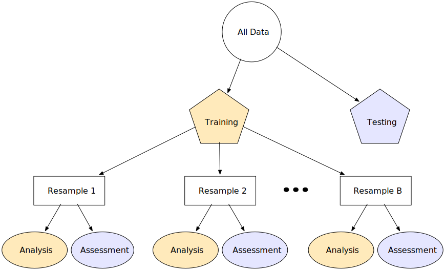
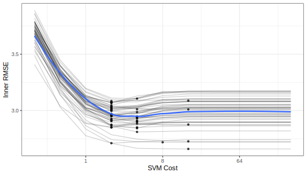
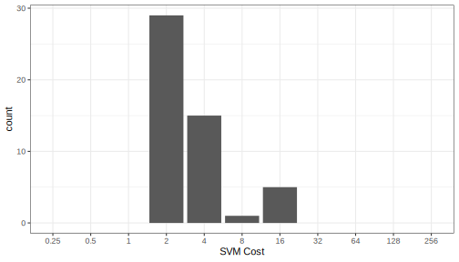

## Introduction

To use code in this article,  you will need to install the following packages: furrr, kernlab, mlbench, scales, and tidymodels.

In this article, we discuss an alternative method for evaluating and tuning models, called [nested resampling](https://scholar.google.com/scholar?hl=en&as_sdt=0%2C7&q=%22nested+resampling%22+inner+outer&btnG=). While it is more computationally taxing and challenging to implement than other resampling methods, it has the potential to produce better estimates of model performance.

## Resampling models

A typical scheme for splitting the data when developing a predictive model is to create an initial split of the data into a training and test set. If resampling is used, it is executed on the training set. A series of binary splits is created. In rsample, we use the term *analysis set* for the data that are used to fit the model and the term *assessment set* for the set used to compute performance:

::: {.cell layout-align="center"}
::: {.cell-output-display}
{fig-align='center' width=70%}
:::
:::

A common method for tuning models is [grid search](/learn/work/tune-svm/) where a candidate set of tuning parameters is created. The full set of models for every combination of the tuning parameter grid and the resamples is fitted. Each time, the assessment data are used to measure performance and the average value is determined for each tuning parameter.

The potential problem is that once we pick the tuning parameter associated with the best performance, this performance value is usually quoted as the performance of the model. There is serious potential for *optimization bias* since we use the same data to tune the model and to assess performance. This would result in an optimistic estimate of performance.

Nested resampling uses an additional layer of resampling that separates the tuning activities from the process used to estimate the efficacy of the model. An *outer* resampling scheme is used and, for every split in the outer resample, another full set of resampling splits are created on the original analysis set. For example, if 10-fold cross-validation is used on the outside and 5-fold cross-validation on the inside, a total of 500 models will be fit. The parameter tuning will be conducted 10 times and the best parameters are determined from the average of the 5 assessment sets. This process occurs 10 times.

Once the tuning results are complete, a model is fit to each of the outer resampling splits using the best parameter associated with that resample. The average of the outer method's assessment sets are a unbiased estimate of the model.

We will simulate some regression data to illustrate the methods. The mlbench package has a function `mlbench::mlbench.friedman1()` that can simulate a complex regression data structure from the [original MARS publication](https://scholar.google.com/scholar?hl=en&q=%22Multivariate+adaptive+regression+splines%22&btnG=&as_sdt=1%2C7&as_sdtp=). A training set size of 100 data points are generated as well as a large set that will be used to characterize how well the resampling procedure performed.

::: {.cell layout-align="center"}

```{.r .cell-code}
library(mlbench)
sim_data <- function(n) {
  tmp <- mlbench.friedman1(n, sd = 1)
  tmp <- cbind(tmp$x, tmp$y)
  tmp <- as.data.frame(tmp)
  names(tmp)[ncol(tmp)] <- "y"
  tmp
}

set.seed(9815)
train_dat <- sim_data(100)
large_dat <- sim_data(10^5)
```
:::

## Nested resampling

To get started, the types of resampling methods need to be specified. This isn't a large data set, so 5 repeats of 10-fold cross validation will be used as the *outer* resampling method for generating the estimate of overall performance. To tune the model, it would be good to have precise estimates for each of the values of the tuning parameter so let's use 25 iterations of the bootstrap. This means that there will eventually be `5 * 10 * 25 = 1250` models that are fit to the data *per tuning parameter*. These models will be discarded once the performance of the model has been quantified.

To create the tibble with the resampling specifications:

::: {.cell layout-align="center"}

```{.r .cell-code}
library(tidymodels)
results <- nested_cv(train_dat, 
                     outside = vfold_cv(repeats = 5), 
                     inside = bootstraps(times = 25))
results
#> # Nested resampling:
#> #  outer: 10-fold cross-validation repeated 5 times
#> #  inner: Bootstrap sampling
#> # A tibble: 50 × 4
#>    splits          id      id2    inner_resamples
#>    <list>          <chr>   <chr>  <list>         
#>  1 <split [90/10]> Repeat1 Fold01 <boot [25 × 2]>
#>  2 <split [90/10]> Repeat1 Fold02 <boot [25 × 2]>
#>  3 <split [90/10]> Repeat1 Fold03 <boot [25 × 2]>
#>  4 <split [90/10]> Repeat1 Fold04 <boot [25 × 2]>
#>  5 <split [90/10]> Repeat1 Fold05 <boot [25 × 2]>
#>  6 <split [90/10]> Repeat1 Fold06 <boot [25 × 2]>
#>  7 <split [90/10]> Repeat1 Fold07 <boot [25 × 2]>
#>  8 <split [90/10]> Repeat1 Fold08 <boot [25 × 2]>
#>  9 <split [90/10]> Repeat1 Fold09 <boot [25 × 2]>
#> 10 <split [90/10]> Repeat1 Fold10 <boot [25 × 2]>
#> # ℹ 40 more rows
```
:::

The splitting information for each resample is contained in the `split` objects. Focusing on the second fold of the first repeat:

::: {.cell layout-align="center"}

```{.r .cell-code}
results$splits[[2]]
#> <Analysis/Assess/Total>
#> <90/10/100>
```
:::

`<90/10/100>` indicates the number of observations in the analysis set, assessment set, and the original data.

Each element of `inner_resamples` has its own tibble with the bootstrapping splits.

::: {.cell layout-align="center"}

```{.r .cell-code}
results$inner_resamples[[5]]
#> # Bootstrap sampling 
#> # A tibble: 25 × 2
#>    splits          id         
#>    <list>          <chr>      
#>  1 <split [90/31]> Bootstrap01
#>  2 <split [90/33]> Bootstrap02
#>  3 <split [90/37]> Bootstrap03
#>  4 <split [90/31]> Bootstrap04
#>  5 <split [90/32]> Bootstrap05
#>  6 <split [90/32]> Bootstrap06
#>  7 <split [90/36]> Bootstrap07
#>  8 <split [90/34]> Bootstrap08
#>  9 <split [90/29]> Bootstrap09
#> 10 <split [90/31]> Bootstrap10
#> # ℹ 15 more rows
```
:::

These are self-contained, meaning that the bootstrap sample is aware that it is a sample of a specific 90% of the data:

::: {.cell layout-align="center"}

```{.r .cell-code}
results$inner_resamples[[5]]$splits[[1]]
#> <Analysis/Assess/Total>
#> <90/31/90>
```
:::

To start, we need to define how the model will be created and measured. Let's use a radial basis support vector machine model via the function `kernlab::ksvm`. This model is generally considered to have *two* tuning parameters: the SVM cost value and the kernel parameter `sigma`. For illustration purposes here, only the cost value will be tuned and the function `kernlab::sigest` will be used to estimate `sigma` during each model fit. This is automatically done by `ksvm`.

After the model is fit to the analysis set, the root-mean squared error (RMSE) is computed on the assessment set. **One important note:** for this model, it is critical to center and scale the predictors before computing dot products. We don't do this operation here because `mlbench.friedman1` simulates all of the predictors to be standardized uniform random variables.

Our function to fit the model and compute the RMSE is:

::: {.cell layout-align="center"}

```{.r .cell-code}
library(kernlab)

# `object` will be an `rsplit` object from our `results` tibble
# `cost` is the tuning parameter
svm_rmse <- function(object, cost = 1) {
  y_col <- ncol(object$data)
  mod <- 
    svm_rbf(mode = "regression", cost = cost) %>% 
    set_engine("kernlab") %>% 
    fit(y ~ ., data = analysis(object))
  
  holdout_pred <- 
    predict(mod, assessment(object) %>% dplyr::select(-y)) %>% 
    bind_cols(assessment(object) %>% dplyr::select(y))
  rmse(holdout_pred, truth = y, estimate = .pred)$.estimate
}

# In some case, we want to parameterize the function over the tuning parameter:
rmse_wrapper <- function(cost, object) svm_rmse(object, cost)
```
:::

For the nested resampling, a model needs to be fit for each tuning parameter and each bootstrap split. To do this, create a wrapper:

::: {.cell layout-align="center"}

```{.r .cell-code}
# `object` will be an `rsplit` object for the bootstrap samples
tune_over_cost <- function(object) {
  tibble(cost = 2 ^ seq(-2, 8, by = 1)) %>% 
    mutate(RMSE = map_dbl(cost, rmse_wrapper, object = object))
}
```
:::

Since this will be called across the set of outer cross-validation splits, another wrapper is required:

::: {.cell layout-align="center"}

```{.r .cell-code}
# `object` is an `rsplit` object in `results$inner_resamples` 
summarize_tune_results <- function(object) {
  # Return row-bound tibble that has the 25 bootstrap results
  map_df(object$splits, tune_over_cost) %>%
    # For each value of the tuning parameter, compute the 
    # average RMSE which is the inner bootstrap estimate. 
    group_by(cost) %>%
    summarize(mean_RMSE = mean(RMSE, na.rm = TRUE),
              n = length(RMSE),
              .groups = "drop")
}
```
:::

Now that those functions are defined, we can execute all the inner resampling loops:

::: {.cell layout-align="center"}

```{.r .cell-code}
tuning_results <- map(results$inner_resamples, summarize_tune_results) 
```
:::

Alternatively, since these computations can be run in parallel, we can use the furrr package. Instead of using `map()`, the function `future_map()` parallelizes the iterations using the [future package](https://cran.r-project.org/web/packages/future/vignettes/future-1-overview.html). The `multisession` plan uses the local cores to process the inner resampling loop. The end results are the same as the sequential computations.

::: {.cell layout-align="center"}

```{.r .cell-code}
library(furrr)
plan(multisession)

tuning_results <- future_map(results$inner_resamples, summarize_tune_results) 
```
:::

The object `tuning_results` is a list of data frames for each of the 50 outer resamples.

Let's make a plot of the averaged results to see what the relationship is between the RMSE and the tuning parameters for each of the inner bootstrapping operations:

::: {.cell layout-align="center"}

```{.r .cell-code}
library(scales)

pooled_inner <- tuning_results %>% bind_rows

best_cost <- function(dat) dat[which.min(dat$mean_RMSE),]

p <- 
  ggplot(pooled_inner, aes(x = cost, y = mean_RMSE)) + 
  scale_x_continuous(trans = 'log2') +
  xlab("SVM Cost") + ylab("Inner RMSE")

for (i in 1:length(tuning_results))
  p <- p  +
  geom_line(data = tuning_results[[i]], alpha = .2) +
  geom_point(data = best_cost(tuning_results[[i]]), pch = 16, alpha = 3/4)

p <- p + geom_smooth(data = pooled_inner, se = FALSE)
p
```

::: {.cell-output-display}
{fig-align='center' width=672}
:::
:::

Each gray line is a separate bootstrap resampling curve created from a different 90% of the data. The blue line is a LOESS smooth of all the results pooled together.

To determine the best parameter estimate for each of the outer resampling iterations:

::: {.cell layout-align="center"}

```{.r .cell-code}
cost_vals <- 
  tuning_results %>% 
  map_df(best_cost) %>% 
  select(cost)

results <- 
  bind_cols(results, cost_vals) %>% 
  mutate(cost = factor(cost, levels = paste(2 ^ seq(-2, 8, by = 1))))

ggplot(results, aes(x = cost)) + 
  geom_bar() + 
  xlab("SVM Cost") + 
  scale_x_discrete(drop = FALSE)
```

::: {.cell-output-display}
{fig-align='center' width=672}
:::
:::

Most of the resamples produced an optimal cost value of 2.0, but the distribution is right-skewed due to the flat trend in the resampling profile once the cost value becomes 10 or larger.

Now that we have these estimates, we can compute the outer resampling results for each of the 50 splits using the corresponding tuning parameter value:

::: {.cell layout-align="center"}

```{.r .cell-code}
results <- 
  results %>% 
  mutate(RMSE = map2_dbl(splits, cost, svm_rmse))

summary(results$RMSE)
#>    Min. 1st Qu.  Median    Mean 3rd Qu.    Max. 
#>   1.574   2.095   2.688   2.693   3.265   4.297
```
:::

The estimated RMSE for the model tuning process is 2.69.

What is the RMSE estimate for the non-nested procedure when only the outer resampling method is used? For each cost value in the tuning grid, 50 SVM models are fit and their RMSE values are averaged. The table of cost values and mean RMSE estimates is used to determine the best cost value. The associated RMSE is the biased estimate.

::: {.cell layout-align="center"}

```{.r .cell-code}
not_nested <- 
  map(results$splits, tune_over_cost) %>%
  bind_rows

outer_summary <- not_nested %>% 
  group_by(cost) %>% 
  summarize(outer_RMSE = mean(RMSE), n = length(RMSE))

outer_summary
#> # A tibble: 11 × 3
#>      cost outer_RMSE     n
#>     <dbl>      <dbl> <int>
#>  1   0.25       3.54    50
#>  2   0.5        3.11    50
#>  3   1          2.77    50
#>  4   2          2.62    50
#>  5   4          2.65    50
#>  6   8          2.75    50
#>  7  16          2.82    50
#>  8  32          2.82    50
#>  9  64          2.83    50
#> 10 128          2.83    50
#> 11 256          2.82    50

ggplot(outer_summary, aes(x = cost, y = outer_RMSE)) + 
  geom_point() + 
  geom_line() + 
  scale_x_continuous(trans = 'log2') +
  xlab("SVM Cost") + ylab("RMSE")
```

::: {.cell-output-display}
{fig-align='center' width=672}
:::
:::

The non-nested procedure estimates the RMSE to be 2.62. Both estimates are fairly close.

The approximately true RMSE for an SVM model with a cost value of 2.0 can be approximated with the large sample that was simulated at the beginning.

::: {.cell layout-align="center"}

```{.r .cell-code}
finalModel <- ksvm(y ~ ., data = train_dat, C = 2)
large_pred <- predict(finalModel, large_dat[, -ncol(large_dat)])
sqrt(mean((large_dat$y - large_pred) ^ 2, na.rm = TRUE))
#> [1] 2.712059
```
:::

The nested procedure produces a closer estimate to the approximate truth but the non-nested estimate is very similar.

## Session information {#session-info}

::: {.cell layout-align="center"}

```
#> ─ Session info ─────────────────────────────────────────────────────
#>  setting  value
#>  version  R version 4.4.2 (2024-10-31)
#>  os       macOS Sequoia 15.3.1
#>  system   aarch64, darwin20
#>  ui       X11
#>  language (EN)
#>  collate  en_US.UTF-8
#>  ctype    en_US.UTF-8
#>  tz       America/Los_Angeles
#>  date     2025-03-19
#>  pandoc   3.6.1 @ /usr/local/bin/ (via rmarkdown)
#>  quarto   1.6.42 @ /Applications/quarto/bin/quarto
#> 
#> ─ Packages ─────────────────────────────────────────────────────────
#>  package    * version date (UTC) lib source
#>  broom      * 1.0.7   2024-09-26 [1] CRAN (R 4.4.1)
#>  dials      * 1.4.0   2025-02-13 [1] CRAN (R 4.4.2)
#>  dplyr      * 1.1.4   2023-11-17 [1] CRAN (R 4.4.0)
#>  furrr      * 0.3.1   2022-08-15 [1] CRAN (R 4.4.0)
#>  ggplot2    * 3.5.1   2024-04-23 [1] CRAN (R 4.4.0)
#>  infer      * 1.0.7   2024-03-25 [1] CRAN (R 4.4.0)
#>  kernlab    * 0.9-33  2024-08-13 [1] CRAN (R 4.4.0)
#>  mlbench    * 2.1-6   2024-12-30 [1] CRAN (R 4.4.1)
#>  parsnip    * 1.3.1   2025-03-12 [1] CRAN (R 4.4.1)
#>  purrr      * 1.0.4   2025-02-05 [1] CRAN (R 4.4.1)
#>  recipes    * 1.2.0   2025-03-17 [1] CRAN (R 4.4.1)
#>  rlang        1.1.5   2025-01-17 [1] CRAN (R 4.4.2)
#>  rsample    * 1.2.1   2024-03-25 [1] CRAN (R 4.4.0)
#>  scales     * 1.3.0   2023-11-28 [1] CRAN (R 4.4.0)
#>  tibble     * 3.2.1   2023-03-20 [1] CRAN (R 4.4.0)
#>  tidymodels * 1.3.0   2025-02-21 [1] CRAN (R 4.4.1)
#>  tune       * 1.3.0   2025-02-21 [1] CRAN (R 4.4.1)
#>  workflows  * 1.2.0   2025-02-19 [1] CRAN (R 4.4.1)
#>  yardstick  * 1.3.2   2025-01-22 [1] CRAN (R 4.4.1)
#> 
#>  [1] /Users/emilhvitfeldt/Library/R/arm64/4.4/library
#>  [2] /Library/Frameworks/R.framework/Versions/4.4-arm64/Resources/library
#>  * ── Packages attached to the search path.
#> 
#> ────────────────────────────────────────────────────────────────────
```
:::
