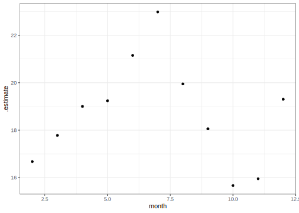

## Introduction

To use code in this article,  you will need to install the following packages: nycflights13 and tidymodels.

This article demonstrates how we can use a recipe to generate data sparsity in tidymodels.

We use the term **sparse data** to denote a data set that contains a lot of 0s. Such data is commonly seen as a result of dealing with categorical variables, text tokenization, or graph data sets. The word sparse describes how the information is packed. Namely, it represents the presence of a lot of zeroes. For some tasks, we can easily get above 99% percent of 0s in the predictors. 

The reason we use sparse data as a construct is that it is a lot more memory efficient to store the positions and values of the non-zero entries than to encode all the values. One could think of this as a compression, but one that is done such that data tasks are still fast. The following vector requires 25 values to store it normally (dense representation). This representation will be referred to as a **dense vector**.

```r
c(100, 0, 0, 0, 0, 0, 0, 0, 0, 0, 0, 0, 0, 0, 0, 0, 0, 0, 0, 0, 0, 1, 0, 0, 0)
```
The sparse representation of this vector only requires 5 values. 1 value for the length (25), 2 values for the locations of the non-zero values (1, 22), and 2 values for the non-zero values (100, 1). This idea can also be extended to matrices as is done in the Matrix package.

Not all modeling tasks can handle sparsity, we have a [list of compatible](../../../find/sparse/index.qmd) steps you can use to guide the recipe creation.

## The data

We will be using the [nycflights13](https://nycflights13.tidyverse.org/) data set for this demonstration. We are using this data specifically because it contains a number of categorical with a lot of levels, that when converted to binary indicator columns (a.k.a. "dummy variables") will create a lot of sparse columns.

::: {.cell layout-align="center"}

```{.r .cell-code}
library(tidymodels)
library(nycflights13)

glimpse(flights)
#> Rows: 336,776
#> Columns: 19
#> $ year           <int> 2013, 2013, 2013, 2013, 2013, 2013, 2013, 2013, 2013, 2…
#> $ month          <int> 1, 1, 1, 1, 1, 1, 1, 1, 1, 1, 1, 1, 1, 1, 1, 1, 1, 1, 1…
#> $ day            <int> 1, 1, 1, 1, 1, 1, 1, 1, 1, 1, 1, 1, 1, 1, 1, 1, 1, 1, 1…
#> $ dep_time       <int> 517, 533, 542, 544, 554, 554, 555, 557, 557, 558, 558, …
#> $ sched_dep_time <int> 515, 529, 540, 545, 600, 558, 600, 600, 600, 600, 600, …
#> $ dep_delay      <dbl> 2, 4, 2, -1, -6, -4, -5, -3, -3, -2, -2, -2, -2, -2, -1…
#> $ arr_time       <int> 830, 850, 923, 1004, 812, 740, 913, 709, 838, 753, 849,…
#> $ sched_arr_time <int> 819, 830, 850, 1022, 837, 728, 854, 723, 846, 745, 851,…
#> $ arr_delay      <dbl> 11, 20, 33, -18, -25, 12, 19, -14, -8, 8, -2, -3, 7, -1…
#> $ carrier        <chr> "UA", "UA", "AA", "B6", "DL", "UA", "B6", "EV", "B6", "…
#> $ flight         <int> 1545, 1714, 1141, 725, 461, 1696, 507, 5708, 79, 301, 4…
#> $ tailnum        <chr> "N14228", "N24211", "N619AA", "N804JB", "N668DN", "N394…
#> $ origin         <chr> "EWR", "LGA", "JFK", "JFK", "LGA", "EWR", "EWR", "LGA",…
#> $ dest           <chr> "IAH", "IAH", "MIA", "BQN", "ATL", "ORD", "FLL", "IAD",…
#> $ air_time       <dbl> 227, 227, 160, 183, 116, 150, 158, 53, 140, 138, 149, 1…
#> $ distance       <dbl> 1400, 1416, 1089, 1576, 762, 719, 1065, 229, 944, 733, …
#> $ hour           <dbl> 5, 5, 5, 5, 6, 5, 6, 6, 6, 6, 6, 6, 6, 6, 6, 5, 6, 6, 6…
#> $ minute         <dbl> 15, 29, 40, 45, 0, 58, 0, 0, 0, 0, 0, 0, 0, 0, 0, 59, 0…
#> $ time_hour      <dttm> 2013-01-01 05:00:00, 2013-01-01 05:00:00, 2013-01-01 0…
```
:::

Our modeling objective is to fit a model that predicts the arrival delay, using a regression model. We could just as well have done a classification model on "Will plane land on time?," but using the regression model we can hopefully be able to quantify how early or late the plane will be.

We are furthermore assuming that this prediction will take place at departure time. This means we have to exclude some variables as they contain information that is not yet available.

::: {.cell layout-align="center"}

```{.r .cell-code}
flights <- flights |>
  select(-arr_time, -air_time)
```
:::

This data set contains a number of redundant variables. We don't need to know the departure time `dep_time`, scheduled departure time `sched_dep_time`, and the departure delay `dep_delay` as they are a linear combination of each other `dep_delay = dep_time - sched_dep_time`. So we can remove one of them and choose to get rid of `sched_dep_time`.

Likewise, the `time_hour` variable is a datetime that contains data also located in `year`, `month`, `day`, `hour`, and `minute`. We will thus also remove that one.

::: {.cell layout-align="center"}

```{.r .cell-code}
flights <- flights |>
  select(-time_hour, -sched_dep_time)
```
:::

You may or may not have noticed that `dep_time` and `sched_arr_time` have a weird encoding. What is happening is that `517` is actually `5:17` e.i. 17 minutes past 5 AM. So we need to update that, which we will use a little helper function for.

::: {.cell layout-align="center"}

```{.r .cell-code}
get_minutes <- function(x) {
 minutes <- x %% 100
 hours <- x %/% 100

 hours * 60 + minutes
}

flights <- flights |>
  mutate(across(c(dep_time, sched_arr_time), get_minutes))
```
:::

We will fit a model using the first month of the year, and then try to assess how well it will generalize over the remaining years. We will also exclude any observations where `arr_delay` is `NA`.

::: {.cell layout-align="center"}

```{.r .cell-code}
flights <- drop_na(flights, arr_delay)
flights_train <- filter(flights, month == 1)
flights_test <- filter(flights, month != 1)
```
:::

## Creating a recipe

The data is quite simple in terms of types. We have numeric variables and categorical variables. We will do some simple imputation of the numeric variables and create dummy variables on the categorical predictors.

We'll use a recipe to preprocess the data. If you have never seen a recipe, see Chapter 8 of [_Tidy Models with R_](https://www.tmwr.org/recipes). 

::: {.cell layout-align="center"}

```{.r .cell-code}
rec_spec <- recipe(arr_delay ~ ., data = flights_train) |>
  step_impute_mean(all_numeric_predictors()) |>
  step_zv(all_predictors()) |>
  step_normalize(all_numeric_predictors()) |>
  step_novel(all_nominal_predictors()) |>
  step_unknown(all_nominal_predictors()) |>
  step_dummy(all_nominal_predictors())

rec_spec
#> 
#> ── Recipe ────────────────────────────────────────────────────────────
#> 
#> ── Inputs
#> Number of variables by role
#> outcome:    1
#> predictor: 14
#> 
#> ── Operations
#> • Mean imputation for: all_numeric_predictors()
#> • Zero variance filter on: all_predictors()
#> • Centering and scaling for: all_numeric_predictors()
#> • Novel factor level assignment for: all_nominal_predictors()
#> • Unknown factor level assignment for: all_nominal_predictors()
#> • Dummy variables from: all_nominal_predictors()
```
:::

You will notice we aren't doing anything special here to denote the recipe that will acknowledge or produce sparsity. Next, we will go into some details to explain how you, the user, should approach recipes when you suspect that sparsity will be produced.

## How is sparsity handled in recipes

There have been made two types of changes to recipes steps regarding sparsity. 

First, some steps can augment the data set with many columns that are naturally sparse. Creating binary indicators from a factor predictor, via `step_dummy()`, is a good example. Because of this, a number of steps have gained a `sparse` argument, which toggles the creation of sparse vectors. 

The second change is that a number of steps are now able to take sparse vectors as input and _preserve sparsity_. You can see a full [list of these steps](../../../find/sparse/index.qmd) at the link.

Most of the changes with regard to sparsity are done to minimize the changes the user needs to make to their code. This means that in many cases you don't need to change anything, the steps will know when to produce sparse data or not.

When a recipe is used in a workflow and it is being `fit()`, an internal check is being done to figure out whether or not to produce sparse features. This check looks at the sparsity of the data itself, what model is being used, and the recipe. Since [only some models](../../../find/sparse/index.qmd) support sparsity this is the first check. 

A rough estimate of the sparsity of the data that will come out of the recipe is calculated. This is done using the input data set, and the steps present in the recipe. But since this check has to happen before the recipe is prepped, it will be quite simple. What this means in practice is that it is fairly good at estimating the sparsity that is produced by sparsity-generating steps, but it isn't able to detect if those variables are passed to a different step that doesn't preserve it.

The following recipe would give an accurate estimate of how sparse the resulting data will be, as the dummy variables produced by `step_dummy()` aren't passed to any other steps. We want a good estimate of the resulting sparsity as it is key in determining whether the recipe should produce sparse data or not.

::: {.cell layout-align="center"}

```{.r .cell-code}
recipe(outcome ~ ., data = data_train) |>
  step_normalize(all_numeric_predictors()) |>
  step_dummy(all_nominal_predictors())
```
:::

But the next recipe would have the same sparsity estimate despite not being able to produce any sparsity since `step_normalize()` can't preserve the sparsity as it subtracts a constant value.

::: {.cell layout-align="center"}

```{.r .cell-code}
recipe(outcome ~ ., data = data_train) |>
  step_dummy(all_nominal_predictors()) |>
  step_normalize(all_numeric_predictors())
```
:::

If you were able to modify the above recipe to use `step_scale()` instead of `step_normalize()` then the estimate is still valid as `step_scale()` is a sparsity-preserving step.

::: {.cell layout-align="center"}

```{.r .cell-code}
recipe(outcome ~ ., data = data_train) |>
  step_dummy(all_nominal_predictors()) |>
  step_scale(all_numeric_predictors())
```
:::

Is it for this reason the steps that produce sparsity have the `sparse` argument. It defaults to `"auto"`, which means that the estimating process in workflows decides whether or not sparsity should be created. This argument can take two other values `"yes"` and `"no"`. If you know for certain that the recipe should or shouldn't produce sparsity you can overwrite with this argument.

This means the recipe below wouldn't try to initially produce sparse vectors since they will immediately be turned into dense vectors by the next step.

::: {.cell layout-align="center"}

```{.r .cell-code}
recipe(outcome ~ ., data = data_train) |>
  step_dummy(all_nominal_predictors(), sparse = "no") |>
  step_normalize(all_numeric_predictors())
```
:::

A lot of time went into trying to make `sparse = "auto"` work as well as possible, but since nothing is perfect you have the ability to overwrite. Setting `sparse = "yes"` or `sparse = "no"` is done as a overwrite, meaning that the above mentioned check in workflows doesn't run. The check is only done if `sparse = "auto"` is present in any of the steps.

The bad thing that happens if the check process is incorrect or you set the wrong value for `sparse` is that you get the speed and performance from previous versions before sparsity was enabled. Not worse speed and performance.

## Modeling

We will finish the workflow using a model/engine combination that supports sparse data.

::: {.cell layout-align="center"}

```{.r .cell-code}
mod_spec <- boost_tree() |>
  set_mode("regression") |>
  set_engine("xgboost")

mod_spec
#> Boosted Tree Model Specification (regression)
#> 
#> Computational engine: xgboost
```
:::

Then combine it in a workflow.

::: {.cell layout-align="center"}

```{.r .cell-code}
wf_spec <- workflow(rec_spec, mod_spec)
```
:::

And fit it like we usually do.

::: {.cell layout-align="center"}

```{.r .cell-code}
wf_fit <- fit(wf_spec, flights_train)
```
:::

::: {.callout-note}
The above code chunk was run locally and timed. With sparsity enabled `sparse = "yes"` it took around 0.45 seconds, wit sparsity disabled `sparse = "no"` it took around 30 seconds.
:::

Now that the model has been fit we can calculate the RMSE to see how well the model has performed.

::: {.cell layout-align="center"}

```{.r .cell-code}
train_preds <- augment(wf_fit, flights_train)

rmse(train_preds, arr_delay, .pred)
#> # A tibble: 1 × 3
#>   .metric .estimator .estimate
#>   <chr>   <chr>          <dbl>
#> 1 rmse    standard        13.9
```
:::

::: {.callout-note}
The above code chunk was run locally and timed. With sparsity enabled `sparse = "yes"` it took around 0.1 seconds, wit sparsity disabled `sparse = "no"` it took around 5 seconds.
:::

We can also take a visual look at the performance by plotting the predicted values against the real values.

::: {.cell layout-align="center"}

```{.r .cell-code}
train_preds |>
  ggplot(aes(arr_delay, .pred)) +
  geom_point(alpha = 0.2)
```

::: {.cell-output-display}
{fig-align='center' fig-alt='Scatter chart. Arrival delay along the x-axis and predictions along the 
y-axis. The majority of the points are along the diagonal, with a shift
down.' width=672}
:::
:::

The model appears to work fairly well on the training data set. We notice the shift down, which would suggest that the model has a bias towards underestimating the delay.

Now we will see how well the model performs in the remaining months.

::: {.cell layout-align="center"}

```{.r .cell-code}
test_preds <- augment(wf_fit, flights_test)

rmse(test_preds, arr_delay, .pred)
#> # A tibble: 1 × 3
#>   .metric .estimator .estimate
#>   <chr>   <chr>          <dbl>
#> 1 rmse    standard        18.9
```
:::

And they see that the performance is quite a bit worse. Let's see how the performance goes on a month-by-month basis.

::: {.cell layout-align="center"}

```{.r .cell-code}
test_preds |>
  group_by(month) |>
  rmse(arr_delay, .pred) |>
  ggplot(aes(month, .estimate)) +
  geom_point()
```

::: {.cell-output-display}
{fig-align='center' fig-alt='Scatter chart. Month along the x-axis, estimate of RSME along the y-axis.
Starting on the second month with a value around 17, it goes up for each
month to 23 in July, afterward it does back down to 16 in September, 
with November having the same value and December having a value of 20.' width=672}
:::
:::

We see the same result that the model doesn't generalize to the other months. This should not be that surprising as the model was only fit in January. Furthermore, it appears that there is a seasonal trend happening, further showing us that fitting this model in January alone was not the best idea.

## Session information {#session-info}

::: {.cell layout-align="center"}

```
#> ─ Session info ─────────────────────────────────────────────────────
#>  setting  value
#>  version  R version 4.4.2 (2024-10-31)
#>  os       macOS Sequoia 15.3.1
#>  system   aarch64, darwin20
#>  ui       X11
#>  language (EN)
#>  collate  en_US.UTF-8
#>  ctype    en_US.UTF-8
#>  tz       America/Los_Angeles
#>  date     2025-03-19
#>  pandoc   3.6.1 @ /usr/local/bin/ (via rmarkdown)
#>  quarto   1.6.42 @ /Applications/quarto/bin/quarto
#> 
#> ─ Packages ─────────────────────────────────────────────────────────
#>  package      * version date (UTC) lib source
#>  broom        * 1.0.7   2024-09-26 [1] CRAN (R 4.4.1)
#>  dials        * 1.4.0   2025-02-13 [1] CRAN (R 4.4.2)
#>  dplyr        * 1.1.4   2023-11-17 [1] CRAN (R 4.4.0)
#>  ggplot2      * 3.5.1   2024-04-23 [1] CRAN (R 4.4.0)
#>  infer        * 1.0.7   2024-03-25 [1] CRAN (R 4.4.0)
#>  nycflights13 * 1.0.2   2021-04-12 [1] CRAN (R 4.4.0)
#>  parsnip      * 1.3.1   2025-03-12 [1] CRAN (R 4.4.1)
#>  purrr        * 1.0.4   2025-02-05 [1] CRAN (R 4.4.1)
#>  recipes      * 1.2.0   2025-03-17 [1] CRAN (R 4.4.1)
#>  rlang          1.1.5   2025-01-17 [1] CRAN (R 4.4.2)
#>  rsample      * 1.2.1   2024-03-25 [1] CRAN (R 4.4.0)
#>  tibble       * 3.2.1   2023-03-20 [1] CRAN (R 4.4.0)
#>  tidymodels   * 1.3.0   2025-02-21 [1] CRAN (R 4.4.1)
#>  tune         * 1.3.0   2025-02-21 [1] CRAN (R 4.4.1)
#>  workflows    * 1.2.0   2025-02-19 [1] CRAN (R 4.4.1)
#>  yardstick    * 1.3.2   2025-01-22 [1] CRAN (R 4.4.1)
#> 
#>  [1] /Users/emilhvitfeldt/Library/R/arm64/4.4/library
#>  [2] /Library/Frameworks/R.framework/Versions/4.4-arm64/Resources/library
#>  * ── Packages attached to the search path.
#> 
#> ────────────────────────────────────────────────────────────────────
```
:::
