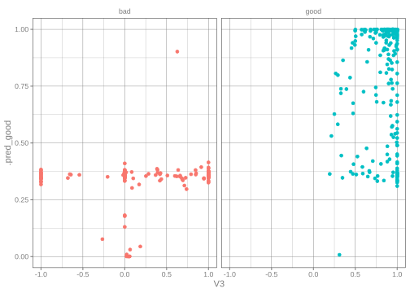

  

## Introduction

To use code in this article,  you will need to install the following packages: future, kernlab, mlbench, and tidymodels.

This article demonstrates how to tune a model using grid search. Many models have **hyperparameters** that can't be learned directly from a single data set when training the model. Instead, we can train many models in a grid of possible hyperparameter values and see which ones turn out best. 

## Example data

To demonstrate model tuning, we'll use the Ionosphere data in the mlbench package:

::: {.cell layout-align="center"}

```{.r .cell-code}
library(tidymodels)
library(mlbench)
data(Ionosphere)
```
:::

From `?Ionosphere`:

> This radar data was collected by a system in Goose Bay, Labrador. This system consists of a phased array of 16 high-frequency antennas with a total transmitted power on the order of 6.4 kilowatts. See the paper for more details. The targets were free electrons in the ionosphere. "good" radar returns are those showing evidence of some type of structure in the ionosphere. "bad" returns are those that do not; their signals pass through the ionosphere.

> Received signals were processed using an autocorrelation function whose arguments are the time of a pulse and the pulse number. There were 17 pulse numbers for the Goose Bay system. Instances in this databse are described by 2 attributes per pulse number, corresponding to the complex values returned by the function resulting from the complex electromagnetic signal. See cited below for more details.

There are 43 predictors and a factor outcome. Two of the predictors are factors (`V1` and `V2`) and the rest are numeric variables that have been scaled to a range of -1 to 1. Note that the two factor predictors have sparse distributions:

::: {.cell layout-align="center"}

```{.r .cell-code}
table(Ionosphere$V1)
#> 
#>   0   1 
#>  38 313
table(Ionosphere$V2)
#> 
#>   0 
#> 351
```
:::

There's no point of putting `V2` into any model since is is a zero-variance predictor. `V1` is not but it _could_ be if the resampling process ends up sampling all of the same value. Is this an issue? It might be since the standard R formula infrastructure fails when there is only a single observed value:

::: {.cell layout-align="center"}

```{.r .cell-code}
glm(Class ~ ., data = Ionosphere, family = binomial)

# Surprisingly, this doesn't help: 

glm(Class ~ . - V2, data = Ionosphere, family = binomial)
```
:::

Let's remove these two problematic variables:

::: {.cell layout-align="center"}

```{.r .cell-code}
Ionosphere <- Ionosphere |> select(-V1, -V2)
```
:::

## Inputs for the search

To demonstrate, we'll fit a radial basis function support vector machine to these data and tune the SVM cost parameter and the $\sigma$ parameter in the kernel function:

::: {.cell layout-align="center"}

```{.r .cell-code}
svm_mod <-
  svm_rbf(cost = tune(), rbf_sigma = tune()) |>
  set_mode("classification") |>
  set_engine("kernlab")
```
:::

In this article, tuning will be demonstrated in two ways, using:

- a standard R formula, and 
- a recipe.

Let's create a simple recipe here:

::: {.cell layout-align="center"}

```{.r .cell-code}
iono_rec <-
  recipe(Class ~ ., data = Ionosphere)  |>
  # remove any zero variance predictors
  step_zv(all_predictors()) |> 
  # remove any linear combinations
  step_lincomb(all_numeric())
```
:::

The only other required item for tuning is a resampling strategy as defined by an rsample object. Let's demonstrate using basic bootstrapping:

::: {.cell layout-align="center"}

```{.r .cell-code}
set.seed(4943)
iono_rs <- bootstraps(Ionosphere, times = 30)
```
:::

## Optional inputs

An _optional_ step for model tuning is to specify which metrics should be computed using the out-of-sample predictions. For classification, the default is to calculate the log-likelihood statistic and overall accuracy. Instead of the defaults, the area under the ROC curve will be used. To do this, a yardstick package function can be used to create a metric set:

::: {.cell layout-align="center"}

```{.r .cell-code}
roc_vals <- metric_set(roc_auc)
```
:::

If no grid or parameters are provided, a set of 10 hyperparameters are created using a space-filling design (via a Latin hypercube). A grid can be given in a data frame where the parameters are in columns and parameter combinations are in rows. Here, the default will be used.

Also, a control object can be passed that specifies different aspects of the search. Here, the verbose option is turned off and the option to save the out-of-sample predictions is turned on. 

::: {.cell layout-align="center"}

```{.r .cell-code}
ctrl <- control_grid(verbose = FALSE, save_pred = TRUE)
```
:::

## Executing with a formula

First, we can use the formula interface:

::: {.cell layout-align="center"}

```{.r .cell-code}
set.seed(35)
formula_res <-
  svm_mod |> 
  tune_grid(
    Class ~ .,
    resamples = iono_rs,
    metrics = roc_vals,
    control = ctrl
  )
#> maximum number of iterations reached 0.002729295 -0.002728731maximum number of iterations reached 1.50863e-05 -1.508629e-05maximum number of iterations reached 0.005115926 -0.005109575maximum number of iterations reached 0.003476184 -0.003475215maximum number of iterations reached 1.994375e-05 -1.994375e-05maximum number of iterations reached 0.006639331 -0.006628886maximum number of iterations reached 0.002515968 -0.002515484maximum number of iterations reached 1.339619e-05 -1.339619e-05maximum number of iterations reached 0.004555265 -0.0045506maximum number of iterations reached 0.002469115 -0.002468711maximum number of iterations reached 1.325281e-05 -1.32528e-05maximum number of iterations reached 0.004671476 -0.004667386maximum number of iterations reached 0.001989876 -0.001989645maximum number of iterations reached 1.300079e-05 -1.300079e-05maximum number of iterations reached 0.003632514 -0.003630454maximum number of iterations reached 0.002283848 -0.002283544maximum number of iterations reached 1.255582e-05 -1.255582e-05maximum number of iterations reached 0.00433605 -0.004332889maximum number of iterations reached 0.002963038 -0.002962428maximum number of iterations reached 1.49106e-05 -1.491059e-05maximum number of iterations reached 0.005486085 -0.005479957maximum number of iterations reached 0.002604825 -0.002604363maximum number of iterations reached 1.422199e-05 -1.422199e-05maximum number of iterations reached 0.004999209 -0.004993612maximum number of iterations reached 0.002666438 -0.002665922maximum number of iterations reached 1.381414e-05 -1.381413e-05maximum number of iterations reached 0.005095412 -0.005089573maximum number of iterations reached 0.001743169 -0.001743017maximum number of iterations reached 1.073459e-05 -1.073459e-05maximum number of iterations reached 0.003227301 -0.003225745maximum number of iterations reached 0.002568834 -0.002568403maximum number of iterations reached 1.320989e-05 -1.320988e-05maximum number of iterations reached 0.004901568 -0.004896206maximum number of iterations reached 0.002818794 -0.002818223maximum number of iterations reached 1.552727e-05 -1.552726e-05maximum number of iterations reached 0.005266062 -0.00525998maximum number of iterations reached 0.002860941 -0.002860314maximum number of iterations reached 1.485557e-05 -1.485557e-05maximum number of iterations reached 0.005386865 -0.005379899maximum number of iterations reached 0.003400418 -0.003399556maximum number of iterations reached 1.793298e-05 -1.793297e-05maximum number of iterations reached 0.006268617 -0.006260112maximum number of iterations reached 0.001877079 -0.001876912maximum number of iterations reached 1.114269e-05 -1.114269e-05maximum number of iterations reached 0.003666085 -0.003664364maximum number of iterations reached 0.002657858 -0.00265742maximum number of iterations reached 1.388468e-05 -1.388468e-05maximum number of iterations reached 0.005286564 -0.005281573maximum number of iterations reached 0.003063188 -0.003062394maximum number of iterations reached 1.563937e-05 -1.563937e-05maximum number of iterations reached 0.005724225 -0.005715284maximum number of iterations reached 0.00341126 -0.003410316maximum number of iterations reached 1.891049e-05 -1.891048e-05maximum number of iterations reached 0.00666898 -0.00665713maximum number of iterations reached 0.003056492 -0.003055746maximum number of iterations reached 1.548707e-05 -1.548707e-05maximum number of iterations reached 0.005722193 -0.005714579maximum number of iterations reached 0.002616596 -0.002616129maximum number of iterations reached 1.442384e-05 -1.442384e-05maximum number of iterations reached 0.004809294 -0.004804677maximum number of iterations reached 0.002710034 -0.002709487maximum number of iterations reached 1.447872e-05 -1.447872e-05maximum number of iterations reached 0.005024575 -0.005018762maximum number of iterations reached 0.002314831 -0.002314496maximum number of iterations reached 1.362379e-05 -1.362379e-05maximum number of iterations reached 0.004278912 -0.004275757maximum number of iterations reached 0.003593176 -0.003592102maximum number of iterations reached 1.870813e-05 -1.870813e-05maximum number of iterations reached 0.006554107 -0.006544116maximum number of iterations reached 0.002894065 -0.002893471maximum number of iterations reached 1.589564e-05 -1.589564e-05maximum number of iterations reached 0.005523027 -0.005516459maximum number of iterations reached 0.002421177 -0.002420827maximum number of iterations reached 1.417094e-05 -1.417093e-05maximum number of iterations reached 0.004411635 -0.004408064maximum number of iterations reached 0.002863577 -0.002863015maximum number of iterations reached 1.613814e-05 -1.613814e-05maximum number of iterations reached 0.005544825 -0.005538744maximum number of iterations reached 0.003103257 -0.003102474maximum number of iterations reached 1.60083e-05 -1.60083e-05maximum number of iterations reached 0.005591201 -0.005583486maximum number of iterations reached 0.003683707 -0.003682607maximum number of iterations reached 1.91376e-05 -1.913759e-05maximum number of iterations reached 0.006764671 -0.006755565maximum number of iterations reached 0.002493337 -0.002492961maximum number of iterations reached 1.451591e-05 -1.451591e-05maximum number of iterations reached 0.004870473 -0.004866072maximum number of iterations reached 0.002770911 -0.00277028maximum number of iterations reached 1.452525e-05 -1.452524e-05maximum number of iterations reached 0.005066938 -0.005060807
formula_res
#> # Tuning results
#> # Bootstrap sampling 
#> # A tibble: 30 × 5
#>    splits            id          .metrics          .notes           .predictions
#>    <list>            <chr>       <list>            <list>           <list>      
#>  1 <split [351/120]> Bootstrap01 <tibble [10 × 6]> <tibble [0 × 4]> <tibble>    
#>  2 <split [351/130]> Bootstrap02 <tibble [10 × 6]> <tibble [0 × 4]> <tibble>    
#>  3 <split [351/137]> Bootstrap03 <tibble [10 × 6]> <tibble [0 × 4]> <tibble>    
#>  4 <split [351/141]> Bootstrap04 <tibble [10 × 6]> <tibble [0 × 4]> <tibble>    
#>  5 <split [351/131]> Bootstrap05 <tibble [10 × 6]> <tibble [0 × 4]> <tibble>    
#>  6 <split [351/131]> Bootstrap06 <tibble [10 × 6]> <tibble [0 × 4]> <tibble>    
#>  7 <split [351/127]> Bootstrap07 <tibble [10 × 6]> <tibble [0 × 4]> <tibble>    
#>  8 <split [351/123]> Bootstrap08 <tibble [10 × 6]> <tibble [0 × 4]> <tibble>    
#>  9 <split [351/131]> Bootstrap09 <tibble [10 × 6]> <tibble [0 × 4]> <tibble>    
#> 10 <split [351/117]> Bootstrap10 <tibble [10 × 6]> <tibble [0 × 4]> <tibble>    
#> # ℹ 20 more rows
```
:::

The `.metrics` column contains tibbles of the performance metrics for each tuning parameter combination:

::: {.cell layout-align="center"}

```{.r .cell-code}
formula_res |> 
  select(.metrics) |> 
  slice(1) |> 
  pull(1)
#> [[1]]
#> # A tibble: 10 × 6
#>         cost     rbf_sigma .metric .estimator .estimate .config         
#>        <dbl>         <dbl> <chr>   <chr>          <dbl> <chr>           
#>  1  0.000977 0.000000215   roc_auc binary         0.838 pre0_mod01_post0
#>  2  0.00310  0.00599       roc_auc binary         0.942 pre0_mod02_post0
#>  3  0.00984  0.0000000001  roc_auc binary         0.815 pre0_mod03_post0
#>  4  0.0312   0.00000278    roc_auc binary         0.832 pre0_mod04_post0
#>  5  0.0992   0.0774        roc_auc binary         0.968 pre0_mod05_post0
#>  6  0.315    0.00000000129 roc_auc binary         0.839 pre0_mod06_post0
#>  7  1        0.0000359     roc_auc binary         0.837 pre0_mod07_post0
#>  8  3.17     1             roc_auc binary         0.974 pre0_mod08_post0
#>  9 10.1      0.0000000167  roc_auc binary         0.832 pre0_mod09_post0
#> 10 32        0.000464      roc_auc binary         0.861 pre0_mod10_post0
```
:::

To get the final resampling estimates, the `collect_metrics()` function can be used on the grid object:

::: {.cell layout-align="center"}

```{.r .cell-code}
estimates <- collect_metrics(formula_res)
estimates
#> # A tibble: 10 × 8
#>         cost     rbf_sigma .metric .estimator  mean     n std_err .config       
#>        <dbl>         <dbl> <chr>   <chr>      <dbl> <int>   <dbl> <chr>         
#>  1  0.000977 0.000000215   roc_auc binary     0.871    30 0.00516 pre0_mod01_po…
#>  2  0.00310  0.00599       roc_auc binary     0.959    30 0.00290 pre0_mod02_po…
#>  3  0.00984  0.0000000001  roc_auc binary     0.822    30 0.00718 pre0_mod03_po…
#>  4  0.0312   0.00000278    roc_auc binary     0.871    30 0.00531 pre0_mod04_po…
#>  5  0.0992   0.0774        roc_auc binary     0.970    30 0.00261 pre0_mod05_po…
#>  6  0.315    0.00000000129 roc_auc binary     0.858    30 0.00615 pre0_mod06_po…
#>  7  1        0.0000359     roc_auc binary     0.873    30 0.00533 pre0_mod07_po…
#>  8  3.17     1             roc_auc binary     0.971    30 0.00248 pre0_mod08_po…
#>  9 10.1      0.0000000167  roc_auc binary     0.871    30 0.00535 pre0_mod09_po…
#> 10 32        0.000464      roc_auc binary     0.927    30 0.00484 pre0_mod10_po…
```
:::

The top combinations are:

::: {.cell layout-align="center"}

```{.r .cell-code}
show_best(formula_res, metric = "roc_auc")
#> # A tibble: 5 × 8
#>       cost rbf_sigma .metric .estimator  mean     n std_err .config         
#>      <dbl>     <dbl> <chr>   <chr>      <dbl> <int>   <dbl> <chr>           
#> 1  3.17    1         roc_auc binary     0.971    30 0.00248 pre0_mod08_post0
#> 2  0.0992  0.0774    roc_auc binary     0.970    30 0.00261 pre0_mod05_post0
#> 3  0.00310 0.00599   roc_auc binary     0.959    30 0.00290 pre0_mod02_post0
#> 4 32       0.000464  roc_auc binary     0.927    30 0.00484 pre0_mod10_post0
#> 5  1       0.0000359 roc_auc binary     0.873    30 0.00533 pre0_mod07_post0
```
:::

##  Executing with a recipe

Next, we can use the same syntax but pass a *recipe* in as the pre-processor argument:

::: {.cell layout-align="center"}

```{.r .cell-code}
set.seed(325)
recipe_res <-
  svm_mod |> 
  tune_grid(
    iono_rec,
    resamples = iono_rs,
    metrics = roc_vals,
    control = ctrl
  )
#> maximum number of iterations reached 0.002742459 -0.0027419maximum number of iterations reached 1.39391e-05 -1.39391e-05maximum number of iterations reached 0.00506756 -0.005061649maximum number of iterations reached 0.003559933 -0.003558871maximum number of iterations reached 1.781499e-05 -1.781499e-05maximum number of iterations reached 0.006540349 -0.006530202maximum number of iterations reached 0.002514222 -0.002513769maximum number of iterations reached 1.344184e-05 -1.344184e-05maximum number of iterations reached 0.004686972 -0.004681975maximum number of iterations reached 0.002512296 -0.00251186maximum number of iterations reached 1.365289e-05 -1.365288e-05maximum number of iterations reached 0.004677361 -0.004673295maximum number of iterations reached 0.00201446 -0.002014239maximum number of iterations reached 1.19114e-05 -1.191139e-05maximum number of iterations reached 0.003818533 -0.003816201maximum number of iterations reached 0.002238874 -0.002238586maximum number of iterations reached 1.309016e-05 -1.309016e-05maximum number of iterations reached 0.00426358 -0.004260684maximum number of iterations reached 0.002887453 -0.002886869maximum number of iterations reached 1.491648e-05 -1.491647e-05maximum number of iterations reached 0.005518017 -0.005511962maximum number of iterations reached 0.002509744 -0.002509279maximum number of iterations reached 1.54972e-05 -1.54972e-05maximum number of iterations reached 0.004816907 -0.004812027maximum number of iterations reached 0.00271789 -0.002717372maximum number of iterations reached 1.356278e-05 -1.356278e-05maximum number of iterations reached 0.005071432 -0.005065751maximum number of iterations reached 0.001788083 -0.001787917maximum number of iterations reached 1.02839e-05 -1.02839e-05maximum number of iterations reached 0.003282253 -0.003280768maximum number of iterations reached 0.002565143 -0.002564693maximum number of iterations reached 1.345936e-05 -1.345936e-05maximum number of iterations reached 0.00481847 -0.00481337maximum number of iterations reached 0.002819414 -0.002818838maximum number of iterations reached 1.610718e-05 -1.610718e-05maximum number of iterations reached 0.005443837 -0.005437207maximum number of iterations reached 0.0027882 -0.002787594maximum number of iterations reached 1.557063e-05 -1.557063e-05maximum number of iterations reached 0.005162945 -0.005156614maximum number of iterations reached 0.003381619 -0.003380755maximum number of iterations reached 1.755436e-05 -1.755435e-05maximum number of iterations reached 0.006375782 -0.006367202maximum number of iterations reached 0.001945395 -0.001945211maximum number of iterations reached 1.084985e-05 -1.084985e-05maximum number of iterations reached 0.00345907 -0.003457422maximum number of iterations reached 0.002792796 -0.002792333maximum number of iterations reached 1.516527e-05 -1.516526e-05maximum number of iterations reached 0.005220034 -0.005215362maximum number of iterations reached 0.003050062 -0.00304923maximum number of iterations reached 1.51943e-05 -1.519429e-05maximum number of iterations reached 0.005644956 -0.005636827maximum number of iterations reached 0.003525424 -0.003524307maximum number of iterations reached 1.918726e-05 -1.918726e-05maximum number of iterations reached 0.006527715 -0.006515814maximum number of iterations reached 0.003044483 -0.003043757maximum number of iterations reached 1.532522e-05 -1.532521e-05maximum number of iterations reached 0.005663788 -0.005656141maximum number of iterations reached 0.002576566 -0.002576127maximum number of iterations reached 1.502229e-05 -1.502228e-05maximum number of iterations reached 0.005006463 -0.005001046maximum number of iterations reached 0.002763485 -0.002762901maximum number of iterations reached 1.445923e-05 -1.445922e-05maximum number of iterations reached 0.004979028 -0.004972974maximum number of iterations reached 0.002368979 -0.00236863maximum number of iterations reached 1.271737e-05 -1.271737e-05maximum number of iterations reached 0.00420433 -0.004201307maximum number of iterations reached 0.003641421 -0.003640323maximum number of iterations reached 1.964307e-05 -1.964306e-05maximum number of iterations reached 0.00654592 -0.006536164maximum number of iterations reached 0.002840029 -0.002839469maximum number of iterations reached 1.706974e-05 -1.706974e-05maximum number of iterations reached 0.005466201 -0.005459791maximum number of iterations reached 0.002396492 -0.002396135maximum number of iterations reached 1.347498e-05 -1.347497e-05maximum number of iterations reached 0.004676517 -0.004672335maximum number of iterations reached 0.002949473 -0.002948877maximum number of iterations reached 1.636964e-05 -1.636964e-05maximum number of iterations reached 0.005672044 -0.005665367maximum number of iterations reached 0.002911029 -0.002910376maximum number of iterations reached 1.607423e-05 -1.607423e-05maximum number of iterations reached 0.005619447 -0.005612103maximum number of iterations reached 0.003762223 -0.003761115maximum number of iterations reached 1.895717e-05 -1.895716e-05maximum number of iterations reached 0.006968609 -0.006958799maximum number of iterations reached 0.002524708 -0.002524315maximum number of iterations reached 1.499522e-05 -1.499522e-05maximum number of iterations reached 0.004746391 -0.00474244maximum number of iterations reached 0.002741921 -0.002741331maximum number of iterations reached 1.470158e-05 -1.470158e-05maximum number of iterations reached 0.005106492 -0.005100144
recipe_res
#> # Tuning results
#> # Bootstrap sampling 
#> # A tibble: 30 × 5
#>    splits            id          .metrics          .notes           .predictions
#>    <list>            <chr>       <list>            <list>           <list>      
#>  1 <split [351/120]> Bootstrap01 <tibble [10 × 6]> <tibble [0 × 4]> <tibble>    
#>  2 <split [351/130]> Bootstrap02 <tibble [10 × 6]> <tibble [0 × 4]> <tibble>    
#>  3 <split [351/137]> Bootstrap03 <tibble [10 × 6]> <tibble [0 × 4]> <tibble>    
#>  4 <split [351/141]> Bootstrap04 <tibble [10 × 6]> <tibble [0 × 4]> <tibble>    
#>  5 <split [351/131]> Bootstrap05 <tibble [10 × 6]> <tibble [0 × 4]> <tibble>    
#>  6 <split [351/131]> Bootstrap06 <tibble [10 × 6]> <tibble [0 × 4]> <tibble>    
#>  7 <split [351/127]> Bootstrap07 <tibble [10 × 6]> <tibble [0 × 4]> <tibble>    
#>  8 <split [351/123]> Bootstrap08 <tibble [10 × 6]> <tibble [0 × 4]> <tibble>    
#>  9 <split [351/131]> Bootstrap09 <tibble [10 × 6]> <tibble [0 × 4]> <tibble>    
#> 10 <split [351/117]> Bootstrap10 <tibble [10 × 6]> <tibble [0 × 4]> <tibble>    
#> # ℹ 20 more rows
```
:::

The best setting here is:

::: {.cell layout-align="center"}

```{.r .cell-code}
show_best(recipe_res, metric = "roc_auc")
#> # A tibble: 5 × 8
#>       cost rbf_sigma .metric .estimator  mean     n std_err .config         
#>      <dbl>     <dbl> <chr>   <chr>      <dbl> <int>   <dbl> <chr>           
#> 1  3.17    1         roc_auc binary     0.971    30 0.00248 pre0_mod08_post0
#> 2  0.0992  0.0774    roc_auc binary     0.970    30 0.00261 pre0_mod05_post0
#> 3  0.00310 0.00599   roc_auc binary     0.959    30 0.00290 pre0_mod02_post0
#> 4 32       0.000464  roc_auc binary     0.927    30 0.00484 pre0_mod10_post0
#> 5  1       0.0000359 roc_auc binary     0.873    30 0.00533 pre0_mod07_post0
```
:::

## Out-of-sample predictions

If we used `save_pred = TRUE` to keep the out-of-sample predictions for each resample during tuning, we can obtain those predictions, along with the tuning parameters and resample identifier, using `collect_predictions()`:

::: {.cell layout-align="center"}

```{.r .cell-code}
collect_predictions(recipe_res)
#> # A tibble: 38,740 × 8
#>    .pred_bad .pred_good id          Class  .row     cost   rbf_sigma .config    
#>        <dbl>      <dbl> <chr>       <fct> <int>    <dbl>       <dbl> <chr>      
#>  1     0.333      0.667 Bootstrap01 good      1 0.000977 0.000000215 pre0_mod01…
#>  2     0.333      0.667 Bootstrap01 good      9 0.000977 0.000000215 pre0_mod01…
#>  3     0.333      0.667 Bootstrap01 bad      10 0.000977 0.000000215 pre0_mod01…
#>  4     0.333      0.667 Bootstrap01 bad      12 0.000977 0.000000215 pre0_mod01…
#>  5     0.333      0.667 Bootstrap01 bad      14 0.000977 0.000000215 pre0_mod01…
#>  6     0.333      0.667 Bootstrap01 good     15 0.000977 0.000000215 pre0_mod01…
#>  7     0.333      0.667 Bootstrap01 bad      16 0.000977 0.000000215 pre0_mod01…
#>  8     0.333      0.667 Bootstrap01 bad      22 0.000977 0.000000215 pre0_mod01…
#>  9     0.333      0.667 Bootstrap01 good     23 0.000977 0.000000215 pre0_mod01…
#> 10     0.333      0.667 Bootstrap01 bad      24 0.000977 0.000000215 pre0_mod01…
#> # ℹ 38,730 more rows
```
:::

We can obtain the hold-out sets for all the resamples augmented with the predictions using `augment()`, which provides opportunities for flexible visualization of model results:

::: {.cell layout-align="center"}

```{.r .cell-code}
augment(recipe_res) |>
  ggplot(aes(V3, .pred_good, color = Class)) +
  geom_point(show.legend = FALSE) +
  facet_wrap(~Class)
```

::: {.cell-output-display}
{fig-align='center' width=672}
:::
:::

## Session information {#session-info}

::: {.cell layout-align="center"}

```
#> ─ Session info ─────────────────────────────────────────────────────
#>  version  R version 4.6.1 (2026-06-24)
#>  language (EN)
#>  pandoc   3.10
#>  quarto   1.9.35
#> 
#> ─ Packages ─────────────────────────────────────────────────────────
#>  package      version date (UTC)
#>  broom        1.0.13  2026-05-14
#>  dials        1.4.4   2026-06-22
#>  dplyr        1.2.1   2026-04-03
#>  future       1.75.0  2026-07-20
#>  ggplot2      4.0.3   2026-04-22
#>  infer        1.1.0   2025-12-18
#>  kernlab      0.9-33  2024-08-13
#>  mlbench      2.1-8   2026-03-26
#>  parsnip      1.6.0   2026-05-14
#>  purrr        1.2.2   2026-04-10
#>  recipes      1.4.0   2026-08-24
#>  rlang        1.3.0   2026-07-05
#>  rsample      1.3.2   2026-01-30
#>  tibble       3.3.1   2026-01-11
#>  tidymodels   1.5.0   2026-04-23
#>  tune         2.1.0   2026-04-17
#>  workflows    1.3.0   2025-08-27
#>  yardstick    1.4.0   2026-04-07
#> 
#> ────────────────────────────────────────────────────────────────────
```
:::

