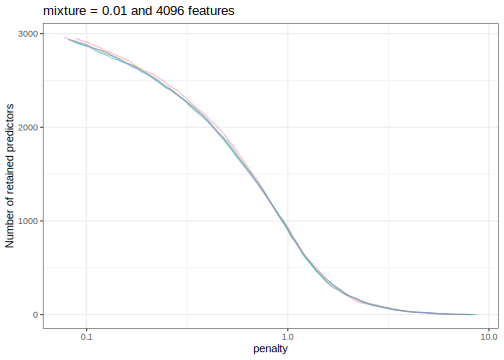

## Introduction

To use code in this article,  you will need to install the following packages: stopwords, textrecipes, and tidymodels.

This article demonstrates an advanced example for training and tuning models for text data. Text data must be processed and transformed to a numeric representation to be ready for computation in modeling; in tidymodels, we use a recipe for this preprocessing. This article also shows how to extract information from each model fit during tuning to use later on.

## Text as data

The text data we'll use in this article are from Amazon: 

> This dataset consists of reviews of fine foods from amazon. The data span a period of more than 10 years, including all ~500,000 reviews up to October 2012. Reviews include product and user information, ratings, and a plaintext review.

This article uses a small subset of the total reviews [available at the original source](https://snap.stanford.edu/data/web-FineFoods.html). We sampled a single review from 5,000 random products and allocated 80% of these data to the training set, with the remaining 1,000 reviews held out for the test set.   

There is a column for the product, a column for the text of the review, and a factor column for the outcome variable. The outcome is whether the reviewer gave the product a five-star rating or not.

::: {.cell layout-align="center"}

```{.r .cell-code}
library(tidymodels)

data("small_fine_foods")
training_data
#> # A tibble: 4,000 × 3
#>    product    review                                                       score
#>    <chr>      <chr>                                                        <fct>
#>  1 B000J0LSBG "this stuff is  not stuffing  its  not good at all  save yo… other
#>  2 B000EYLDYE "I absolutely LOVE this dried fruit.  LOVE IT.  Whenever I … great
#>  3 B0026LIO9A "GREAT DEAL, CONVENIENT TOO.  Much cheaper than WalMart and… great
#>  4 B00473P8SK "Great flavor, we go through a ton of this sauce! I discove… great
#>  5 B001SAWTNM "This is excellent salsa/hot sauce, but you can get it for … great
#>  6 B000FAG90U "Again, this is the best dogfood out there.  One suggestion… great
#>  7 B006BXTCEK "The box I received was filled with teas, hot chocolates, a… other
#>  8 B002GWH5OY "This is delicious coffee which compares favorably with muc… great
#>  9 B003R0MFYY "Don't let these little tiny cans fool you.  They pack a lo… great
#> 10 B001EO5ZXI "One of the nicest, smoothest cup of chai I've made. Nice m… great
#> # ℹ 3,990 more rows
```
:::

Our modeling goal is to create modeling features from the text of the reviews to predict whether the review was five-star or not.

## Inputs for the search

Text, perhaps more so than tabular data we often deal with, must be heavily processed to be used as predictor data for modeling. There are multiple ways to process and prepare text for modeling; let's add several steps together to create different kinds of features:

* Create an initial set of count-based features, such as the number of words, spaces, lower- or uppercase characters, URLs, and so on; we can use the [step_textfeatures()](https://textrecipes.tidymodels.org/reference/step_textfeature.html) fun for this.

* [Tokenize](https://smltar.com/tokenization.html) the text (i.e. break the text into smaller components such as words).

* Remove stop words such as "the", "an", "of", etc.

* [Stem](https://smltar.com/stemming.html) tokens to a common root where possible.

* Convert tokens to dummy variables via a [signed, binary hash function](https://bookdown.org/max/FES/encoding-predictors-with-many-categories.html).

* Optionally transform non-token features (the count-based features like number of lowercase characters) to a more symmetric state using a [Yeo-Johnson transformation](https://bookdown.org/max/FES/numeric-one-to-one.html).

* Remove predictors with a single distinct value.

* Center and scale all predictors. 

::: {.callout-note}
 We will end up with two kinds of features:

- dummy/indicator variables for the count-based features like number of digits or punctuation characters 
- hash features for the tokens like "salsa" or "delicious". 
:::

Some of these preprocessing steps (such as stemming) may or may not be good ideas but a full discussion of their effects is beyond the scope of this article. In this preprocessing approach, the main tuning parameter is the number of hashing features to use. 

Before we start building our preprocessing recipe, we need some helper objects. For example, for the Yeo-Johnson transformation, we need to know the set of count-based text features: 

::: {.cell layout-align="center"}

```{.r .cell-code}
basics <- names(textrecipes::count_functions)
head(basics)
#> [1] "n_words"    "n_uq_words" "n_charS"    "n_uq_charS" "n_digits"  
#> [6] "n_hashtags"
```
:::

Also, the implementation of feature hashes does not produce the binary values we need. This small function will help convert the scores to values of -1, 0, or 1:

::: {.cell layout-align="center"}

```{.r .cell-code}
binary_hash <- function(x) {
  x <- ifelse(x < 0, -1, x)
  x <- ifelse(x > 0,  1, x)
  x
}
```
:::

Now, let's put this all together in one recipe:

::: {.cell layout-align="center"}

```{.r .cell-code}
library(textrecipes)

pre_proc <-
  recipe(score ~ product + review, data = training_data) %>%
  # Do not use the product ID as a predictor
  update_role(product, new_role = "id") %>%
  # Make a copy of the raw text
  step_mutate(review_raw = review) %>%
  # Compute the initial features. This removes the `review_raw` column
  step_textfeature(review_raw) %>%
  # Make the feature names shorter
  step_rename_at(
    starts_with("textfeature_"),
    fn = ~ gsub("textfeature_review_raw_", "", .)
  ) %>%
  step_tokenize(review)  %>%
  step_stopwords(review) %>%
  step_stem(review) %>%
  # Here is where the tuning parameter is declared
  step_texthash(review, signed = TRUE, num_terms = tune()) %>%
  # Simplify these names
  step_rename_at(starts_with("review_hash"), fn = ~ gsub("review_", "", .)) %>%
  # Convert the features from counts to values of -1, 0, or 1
  step_mutate_at(starts_with("hash"), fn = binary_hash) %>%
  # Transform the initial feature set
  step_YeoJohnson(one_of(!!basics)) %>%
  step_zv(all_predictors()) %>%
  step_normalize(all_predictors())
```
:::

::: {.callout-warning}
 Note that, when objects from the global environment are used, they are injected into the step objects via `!!`. For some parallel processing technologies, these objects may not be found by the worker processes. 
:::

The preprocessing recipe is long and complex (often typical for working with text data) but the model we'll use is more straightforward. Let's stick with a regularized logistic regression model: 

::: {.cell layout-align="center"}

```{.r .cell-code}
lr_mod <-
  logistic_reg(penalty = tune(), mixture = tune()) %>%
  set_engine("glmnet")
```
:::

There are three tuning parameters for this data analysis:

- `num_terms`, the number of feature hash variables to create
- `penalty`, the amount of regularization for the model
- `mixture`, the proportion of L1 regularization

## Resampling

There is enough data here so that 5-fold resampling would hold out 800 reviews at a time to estimate performance. Performance estimates using this many observations have sufficiently low noise to measure and tune models.  

::: {.cell layout-align="center"}

```{.r .cell-code}
set.seed(8935)
folds <- vfold_cv(training_data, v = 5)
folds
#> #  5-fold cross-validation 
#> # A tibble: 5 × 2
#>   splits             id   
#>   <list>             <chr>
#> 1 <split [3200/800]> Fold1
#> 2 <split [3200/800]> Fold2
#> 3 <split [3200/800]> Fold3
#> 4 <split [3200/800]> Fold4
#> 5 <split [3200/800]> Fold5
```
:::

## Grid search

Let's begin our tuning with [grid search](https://www.tidymodels.org/learn/work/tune-svm/) and a regular grid. For glmnet models, evaluating penalty values is fairly cheap because of the use of the ["submodel-trick"](https://tune.tidymodels.org/articles/extras/optimizations.html#sub-model-speed-ups-1). The grid will use 20 penalty values, 5 mixture values, and 3 values for the number of hash features.  

::: {.cell layout-align="center"}

```{.r .cell-code}
five_star_grid <- 
  crossing(
    penalty = 10^seq(-3, 0, length = 20),
    mixture = c(0.01, 0.25, 0.50, 0.75, 1),
    num_terms = 2^c(8, 10, 12)
  )
five_star_grid
#> # A tibble: 300 × 3
#>    penalty mixture num_terms
#>      <dbl>   <dbl>     <dbl>
#>  1   0.001    0.01       256
#>  2   0.001    0.01      1024
#>  3   0.001    0.01      4096
#>  4   0.001    0.25       256
#>  5   0.001    0.25      1024
#>  6   0.001    0.25      4096
#>  7   0.001    0.5        256
#>  8   0.001    0.5       1024
#>  9   0.001    0.5       4096
#> 10   0.001    0.75       256
#> # ℹ 290 more rows
```
:::

Note that, for each resample, the (computationally expensive) text preprocessing recipe is only prepped 6 times. This increases the efficiency of the analysis by avoiding redundant work. 

Let's save information on the number of predictors by penalty value for each glmnet model. This can help us understand how many features were used across the penalty values. Use an extraction function to do this:

::: {.cell layout-align="center"}

```{.r .cell-code}
glmnet_vars <- function(x) {
  # `x` will be a workflow object
  mod <- extract_fit_engine(x)
  # `df` is the number of model terms for each penalty value
  tibble(penalty = mod$lambda, num_vars = mod$df)
}

ctrl <- control_grid(extract = glmnet_vars, verbose = TRUE)
```
:::

Finally, let's run the grid search:

::: {.cell layout-align="center"}

```{.r .cell-code}
roc_scores <- metric_set(roc_auc)

set.seed(1559)
five_star_glmnet <- 
  tune_grid(
    lr_mod, 
    pre_proc, 
    resamples = folds, 
    grid = five_star_grid, 
    metrics = roc_scores, 
    control = ctrl
  )

five_star_glmnet
#> # Tuning results
#> # 5-fold cross-validation 
#> # A tibble: 5 × 5
#>   splits             id    .metrics           .notes           .extracts
#>   <list>             <chr> <list>             <list>           <list>   
#> 1 <split [3200/800]> Fold1 <tibble [300 × 7]> <tibble [0 × 3]> <tibble> 
#> 2 <split [3200/800]> Fold2 <tibble [300 × 7]> <tibble [0 × 3]> <tibble> 
#> 3 <split [3200/800]> Fold3 <tibble [300 × 7]> <tibble [0 × 3]> <tibble> 
#> 4 <split [3200/800]> Fold4 <tibble [300 × 7]> <tibble [0 × 3]> <tibble> 
#> 5 <split [3200/800]> Fold5 <tibble [300 × 7]> <tibble [0 × 3]> <tibble>
```
:::

This took a while to complete! What do the results look like? Let's get the resampling estimates of the area under the ROC curve for each tuning parameter:

::: {.cell layout-align="center"}

```{.r .cell-code}
grid_roc <- 
  collect_metrics(five_star_glmnet) %>% 
  arrange(desc(mean))
grid_roc
#> # A tibble: 300 × 9
#>    penalty mixture num_terms .metric .estimator  mean     n std_err .config     
#>      <dbl>   <dbl>     <dbl> <chr>   <chr>      <dbl> <int>   <dbl> <chr>       
#>  1 0.0379     0.25      4096 roc_auc binary     0.808     5 0.00484 Preprocesso…
#>  2 0.695      0.01      4096 roc_auc binary     0.806     5 0.00683 Preprocesso…
#>  3 0.0183     0.5       4096 roc_auc binary     0.805     5 0.00499 Preprocesso…
#>  4 0.483      0.01      4096 roc_auc binary     0.804     5 0.00691 Preprocesso…
#>  5 0.0546     0.25      4096 roc_auc binary     0.804     5 0.00519 Preprocesso…
#>  6 0.0127     0.75      4096 roc_auc binary     0.804     5 0.00479 Preprocesso…
#>  7 1          0.01      4096 roc_auc binary     0.803     5 0.00639 Preprocesso…
#>  8 0.00886    1         4096 roc_auc binary     0.802     5 0.00518 Preprocesso…
#>  9 0.0264     0.25      4096 roc_auc binary     0.802     5 0.00541 Preprocesso…
#> 10 0.0264     0.5       4096 roc_auc binary     0.802     5 0.00476 Preprocesso…
#> # ℹ 290 more rows
```
:::

The best results have a fairly high penalty value and focus on the ridge penalty (i.e. no feature selection via the lasso's L1 penalty). The best solutions also use the largest number of hashing features. 

What is the relationship between performance and the tuning parameters? 

::: {.cell layout-align="center"}

```{.r .cell-code}
autoplot(five_star_glmnet, metric = "roc_auc")
```

::: {.cell-output-display}
{fig-align='center' width=960}
:::
:::

- We can definitely see that performance improves with the number of features included. In this article, we've used a small sample of the overall data set available. When more data are used, an even larger feature set is optimal. 

- The profiles with larger mixture values (greater than 0.01) have steep drop-offs in performance. What's that about? Those are cases where the lasso penalty is removing too many (and perhaps all) features from the model.  
- The panel with at least 4096 features shows that there are several parameter combinations that have about the same performance; there isn't much difference between the best performance for the different mixture values. A case could be made that we should choose a _larger_ mixture value and a _smaller_ penalty to select a simpler model that contains fewer predictors. 

- If more experimentation were conducted, a larger set of features (more than 4096) should also be considered.  

We'll come back to the extracted glmnet components at the end of this article. 

## Directed search

What if we had started with Bayesian optimization? Would a good set of conditions have been found more efficiently? 

Let's pretend that we haven't seen the grid search results. We'll initialize the Gaussian process model with five tuning parameter combinations chosen with a space-filling design. 

It might be good to use a custom `dials` object for the number of hash terms. The default object, `num_terms()`, uses a linear range and tries to set the upper bound of the parameter using the data. Instead, let's create a parameter set, change the scale to be `log2`, and define the same range as was used in grid search. 

::: {.cell layout-align="center"}

```{.r .cell-code}
hash_range <- num_terms(c(8, 12), trans = log2_trans())
hash_range
#> # Model Terms (quantitative)
#> Transformer: log-2 [1e-100, Inf]
#> Range (transformed scale): [8, 12]
```
:::

To use this, we have to merge the recipe and `parsnip` model object into a workflow:

::: {.cell layout-align="center"}

```{.r .cell-code}
five_star_wflow <-
  workflow() %>%
  add_recipe(pre_proc) %>%
  add_model(lr_mod)
```
:::

Then we can extract and manipulate the corresponding parameter set:

::: {.cell layout-align="center"}

```{.r .cell-code}
five_star_set <-
  five_star_wflow %>%
  parameters() %>%
  update(
    num_terms = hash_range, 
    penalty = penalty(c(-3, 0)),
    mixture = mixture(c(0.05, 1.00))
  )
#> Warning: `parameters.workflow()` was deprecated in tune 0.1.6.9003.
#> ℹ Please use `hardhat::extract_parameter_set_dials()` instead.
```
:::

This is passed to the search function via the `param_info` argument. 

The initial rounds of search can be biased more towards exploration of the parameter space (as opposed to staying near the current best results). If expected improvement is used as the acquisition function, the trade-off value can be slowly moved from exploration to exploitation over iterations (see the tune vignette on [acquisition functions](https://tune.tidymodels.org/articles/acquisition_functions.html) for more details). The tune package has a built-in function called `expo_decay()` that can help accomplish this:

::: {.cell layout-align="center"}

```{.r .cell-code}
trade_off_decay <- function(iter) {
  expo_decay(iter, start_val = .01, limit_val = 0, slope = 1/4)
}
```
:::

Using these values, let's run the search:

::: {.cell layout-align="center"}

```{.r .cell-code}
set.seed(12)
five_star_search <-
  tune_bayes(
    five_star_wflow, 
    resamples = folds,
    param_info = five_star_set,
    initial = 5,
    iter = 10,
    metrics = roc_scores,
    objective = exp_improve(trade_off_decay),
    control = control_bayes(verbose_iter = TRUE)
  )
#> Optimizing roc_auc using the expected improvement with variable trade-off
#> values.
#> 
#> ── Iteration 1 ───────────────────────────────────────────────────────
#> 
#> i Current best:		roc_auc=0.781 (@iter 0)
#> i Gaussian process model
#> ✓ Gaussian process model
#> i Generating 5000 candidates
#> i Predicted candidates
#> i Trade-off value: 0.01
#> i penalty=0.00371, mixture=0.0503, num_terms=516
#> i Estimating performance
#> ✓ Estimating performance
#> ⓧ Newest results:	roc_auc=0.731 (+/-0.00972)
#> 
#> ── Iteration 2 ───────────────────────────────────────────────────────
#> 
#> i Current best:		roc_auc=0.781 (@iter 0)
#> i Gaussian process model
#> ✓ Gaussian process model
#> i Generating 5000 candidates
#> i Predicted candidates
#> i Trade-off value: 0.007788
#> i penalty=0.001, mixture=0.411, num_terms=349
#> i Estimating performance
#> ✓ Estimating performance
#> ⓧ Newest results:	roc_auc=0.7291 (+/-0.00542)
#> 
#> ── Iteration 3 ───────────────────────────────────────────────────────
#> 
#> i Current best:		roc_auc=0.781 (@iter 0)
#> i Gaussian process model
#> ✓ Gaussian process model
#> i Generating 5000 candidates
#> i Predicted candidates
#> i Trade-off value: 0.006065
#> i penalty=0.0105, mixture=0.996, num_terms=543
#> i Estimating performance
#> ✓ Estimating performance
#> ⓧ Newest results:	roc_auc=0.7667 (+/-0.00755)
#> 
#> ── Iteration 4 ───────────────────────────────────────────────────────
#> 
#> i Current best:		roc_auc=0.781 (@iter 0)
#> i Gaussian process model
#> ✓ Gaussian process model
#> i Generating 5000 candidates
#> i Predicted candidates
#> i Trade-off value: 0.004724
#> i penalty=0.00415, mixture=0.999, num_terms=747
#> i Estimating performance
#> ✓ Estimating performance
#> ⓧ Newest results:	roc_auc=0.7493 (+/-0.00773)
#> 
#> ── Iteration 5 ───────────────────────────────────────────────────────
#> 
#> i Current best:		roc_auc=0.781 (@iter 0)
#> i Gaussian process model
#> ✓ Gaussian process model
#> i Generating 5000 candidates
#> i Predicted candidates
#> i Trade-off value: 0.003679
#> i penalty=0.00105, mixture=0.192, num_terms=4033
#> i Estimating performance
#> ✓ Estimating performance
#> ⓧ Newest results:	roc_auc=0.7551 (+/-0.00416)
#> 
#> ── Iteration 6 ───────────────────────────────────────────────────────
#> 
#> i Current best:		roc_auc=0.781 (@iter 0)
#> i Gaussian process model
#> ✓ Gaussian process model
#> i Generating 5000 candidates
#> i Predicted candidates
#> i Trade-off value: 0.002865
#> i penalty=0.0124, mixture=0.105, num_terms=4001
#> i Estimating performance
#> ✓ Estimating performance
#> ⓧ Newest results:	roc_auc=0.7702 (+/-0.00496)
#> 
#> ── Iteration 7 ───────────────────────────────────────────────────────
#> 
#> i Current best:		roc_auc=0.781 (@iter 0)
#> i Gaussian process model
#> ✓ Gaussian process model
#> i Generating 5000 candidates
#> i Predicted candidates
#> i Trade-off value: 0.002231
#> i penalty=0.00772, mixture=0.278, num_terms=2205
#> i Estimating performance
#> ✓ Estimating performance
#> ⓧ Newest results:	roc_auc=0.7716 (+/-0.00567)
#> 
#> ── Iteration 8 ───────────────────────────────────────────────────────
#> 
#> i Current best:		roc_auc=0.781 (@iter 0)
#> i Gaussian process model
#> ✓ Gaussian process model
#> i Generating 5000 candidates
#> i Predicted candidates
#> i Trade-off value: 0.001738
#> i penalty=0.00243, mixture=0.948, num_terms=4085
#> i Estimating performance
#> ✓ Estimating performance
#> ⓧ Newest results:	roc_auc=0.7728 (+/-0.00695)
#> 
#> ── Iteration 9 ───────────────────────────────────────────────────────
#> 
#> i Current best:		roc_auc=0.781 (@iter 0)
#> i Gaussian process model
#> ✓ Gaussian process model
#> i Generating 5000 candidates
#> i Predicted candidates
#> i Trade-off value: 0.001353
#> i penalty=0.0059, mixture=0.94, num_terms=3992
#> i Estimating performance
#> ✓ Estimating performance
#> ♥ Newest results:	roc_auc=0.8065 (+/-0.00399)
#> 
#> ── Iteration 10 ──────────────────────────────────────────────────────
#> 
#> i Current best:		roc_auc=0.8065 (@iter 9)
#> i Gaussian process model
#> ✓ Gaussian process model
#> i Generating 5000 candidates
#> i Predicted candidates
#> i Trade-off value: 0.001054
#> i penalty=0.0128, mixture=0.974, num_terms=3621
#> i Estimating performance
#> ✓ Estimating performance
#> ⓧ Newest results:	roc_auc=0.7983 (+/-0.00671)

five_star_search
#> # Tuning results
#> # 5-fold cross-validation 
#> # A tibble: 55 × 5
#>    splits             id    .metrics         .notes           .iter
#>    <list>             <chr> <list>           <list>           <int>
#>  1 <split [3200/800]> Fold1 <tibble [5 × 7]> <tibble [0 × 3]>     0
#>  2 <split [3200/800]> Fold2 <tibble [5 × 7]> <tibble [0 × 3]>     0
#>  3 <split [3200/800]> Fold3 <tibble [5 × 7]> <tibble [0 × 3]>     0
#>  4 <split [3200/800]> Fold4 <tibble [5 × 7]> <tibble [0 × 3]>     0
#>  5 <split [3200/800]> Fold5 <tibble [5 × 7]> <tibble [0 × 3]>     0
#>  6 <split [3200/800]> Fold1 <tibble [1 × 7]> <tibble [0 × 3]>     1
#>  7 <split [3200/800]> Fold2 <tibble [1 × 7]> <tibble [0 × 3]>     1
#>  8 <split [3200/800]> Fold3 <tibble [1 × 7]> <tibble [0 × 3]>     1
#>  9 <split [3200/800]> Fold4 <tibble [1 × 7]> <tibble [0 × 3]>     1
#> 10 <split [3200/800]> Fold5 <tibble [1 × 7]> <tibble [0 × 3]>     1
#> # ℹ 45 more rows
```
:::

These results show some improvement over the initial set. One issue is that so many settings are sub-optimal (as shown in the plot above for grid search) so there are poor results periodically. There are regions where the penalty parameter becomes too large and all of the predictors are removed from the model. These regions are also dependent on the number of terms. There is a fairly narrow ridge (sorry, pun intended!) where good performance can be achieved. Using more iterations would probably result in the search finding better results. 
Let's look at a plot of model performance versus the search iterations:

::: {.cell layout-align="center"}

```{.r .cell-code}
autoplot(five_star_search, type = "performance")
```

::: {.cell-output-display}
{fig-align='center' width=672}
:::
:::

::: {.callout-note}
What would we do if we knew about the grid search results and wanted to try directed, iterative search? We would restrict the range for the number of hash features to be larger (especially with more data). We might also restrict the penalty and mixture parameters to have a lower upper bound. 
:::

## Extracted results

Let's return to the grid search results and examine the results of our `extract` function. For each _fitted model_, a tibble was saved that contains the relationship between the number of predictors and the penalty value. Let's look at these results for the best model:

::: {.cell layout-align="center"}

```{.r .cell-code}
params <- select_best(five_star_glmnet, metric = "roc_auc")
params
#> # A tibble: 1 × 4
#>   penalty mixture num_terms .config               
#>     <dbl>   <dbl>     <dbl> <chr>                 
#> 1  0.0379    0.25      4096 Preprocessor3_Model031
```
:::

Recall that we saved the glmnet results in a tibble. The column `five_star_glmnet$.extracts` is a list of tibbles. As an example, the first element of the list is:

::: {.cell layout-align="center"}

```{.r .cell-code}
five_star_glmnet$.extracts[[1]]
#> # A tibble: 300 × 5
#>    num_terms penalty mixture .extracts          .config               
#>        <dbl>   <dbl>   <dbl> <list>             <chr>                 
#>  1       256       1    0.01 <tibble [100 × 2]> Preprocessor1_Model001
#>  2       256       1    0.01 <tibble [100 × 2]> Preprocessor1_Model002
#>  3       256       1    0.01 <tibble [100 × 2]> Preprocessor1_Model003
#>  4       256       1    0.01 <tibble [100 × 2]> Preprocessor1_Model004
#>  5       256       1    0.01 <tibble [100 × 2]> Preprocessor1_Model005
#>  6       256       1    0.01 <tibble [100 × 2]> Preprocessor1_Model006
#>  7       256       1    0.01 <tibble [100 × 2]> Preprocessor1_Model007
#>  8       256       1    0.01 <tibble [100 × 2]> Preprocessor1_Model008
#>  9       256       1    0.01 <tibble [100 × 2]> Preprocessor1_Model009
#> 10       256       1    0.01 <tibble [100 × 2]> Preprocessor1_Model010
#> # ℹ 290 more rows
```
:::

More nested tibbles! Let's `unnest()` the `five_star_glmnet$.extracts` column:

::: {.cell layout-align="center"}

```{.r .cell-code}
library(tidyr)
extracted <- 
  five_star_glmnet %>% 
  dplyr::select(id, .extracts) %>% 
  unnest(cols = .extracts)
extracted
#> # A tibble: 1,500 × 6
#>    id    num_terms penalty mixture .extracts          .config               
#>    <chr>     <dbl>   <dbl>   <dbl> <list>             <chr>                 
#>  1 Fold1       256       1    0.01 <tibble [100 × 2]> Preprocessor1_Model001
#>  2 Fold1       256       1    0.01 <tibble [100 × 2]> Preprocessor1_Model002
#>  3 Fold1       256       1    0.01 <tibble [100 × 2]> Preprocessor1_Model003
#>  4 Fold1       256       1    0.01 <tibble [100 × 2]> Preprocessor1_Model004
#>  5 Fold1       256       1    0.01 <tibble [100 × 2]> Preprocessor1_Model005
#>  6 Fold1       256       1    0.01 <tibble [100 × 2]> Preprocessor1_Model006
#>  7 Fold1       256       1    0.01 <tibble [100 × 2]> Preprocessor1_Model007
#>  8 Fold1       256       1    0.01 <tibble [100 × 2]> Preprocessor1_Model008
#>  9 Fold1       256       1    0.01 <tibble [100 × 2]> Preprocessor1_Model009
#> 10 Fold1       256       1    0.01 <tibble [100 × 2]> Preprocessor1_Model010
#> # ℹ 1,490 more rows
```
:::

One thing to realize here is that `tune_grid()` [may not fit all of the models](https://tune.tidymodels.org/articles/extras/optimizations.html) that are evaluated. In this case, for each value of `mixture` and `num_terms`, the model is fit over _all_ penalty values (this is a feature of this particular model and is not generally true for other engines). To select the best parameter set, we can exclude the `penalty` column in `extracted`:

::: {.cell layout-align="center"}

```{.r .cell-code}
extracted <- 
  extracted %>% 
  dplyr::select(-penalty) %>% 
  inner_join(params, by = c("num_terms", "mixture")) %>% 
  # Now remove it from the final results
  dplyr::select(-penalty)
extracted
#> # A tibble: 100 × 6
#>    id    num_terms mixture .extracts          .config.x              .config.y  
#>    <chr>     <dbl>   <dbl> <list>             <chr>                  <chr>      
#>  1 Fold1      4096    0.25 <tibble [100 × 2]> Preprocessor3_Model021 Preprocess…
#>  2 Fold1      4096    0.25 <tibble [100 × 2]> Preprocessor3_Model022 Preprocess…
#>  3 Fold1      4096    0.25 <tibble [100 × 2]> Preprocessor3_Model023 Preprocess…
#>  4 Fold1      4096    0.25 <tibble [100 × 2]> Preprocessor3_Model024 Preprocess…
#>  5 Fold1      4096    0.25 <tibble [100 × 2]> Preprocessor3_Model025 Preprocess…
#>  6 Fold1      4096    0.25 <tibble [100 × 2]> Preprocessor3_Model026 Preprocess…
#>  7 Fold1      4096    0.25 <tibble [100 × 2]> Preprocessor3_Model027 Preprocess…
#>  8 Fold1      4096    0.25 <tibble [100 × 2]> Preprocessor3_Model028 Preprocess…
#>  9 Fold1      4096    0.25 <tibble [100 × 2]> Preprocessor3_Model029 Preprocess…
#> 10 Fold1      4096    0.25 <tibble [100 × 2]> Preprocessor3_Model030 Preprocess…
#> # ℹ 90 more rows
```
:::

Now we can get at the results that we want using another `unnest()`:

::: {.cell layout-align="center"}

```{.r .cell-code}
extracted <- 
  extracted %>% 
  unnest(col = .extracts) # <- these contain a `penalty` column
extracted
#> # A tibble: 10,000 × 7
#>    id    num_terms mixture penalty num_vars .config.x              .config.y    
#>    <chr>     <dbl>   <dbl>   <dbl>    <int> <chr>                  <chr>        
#>  1 Fold1      4096    0.25   0.352        0 Preprocessor3_Model021 Preprocessor…
#>  2 Fold1      4096    0.25   0.336        2 Preprocessor3_Model021 Preprocessor…
#>  3 Fold1      4096    0.25   0.321        2 Preprocessor3_Model021 Preprocessor…
#>  4 Fold1      4096    0.25   0.306        2 Preprocessor3_Model021 Preprocessor…
#>  5 Fold1      4096    0.25   0.292        2 Preprocessor3_Model021 Preprocessor…
#>  6 Fold1      4096    0.25   0.279        2 Preprocessor3_Model021 Preprocessor…
#>  7 Fold1      4096    0.25   0.266        3 Preprocessor3_Model021 Preprocessor…
#>  8 Fold1      4096    0.25   0.254        5 Preprocessor3_Model021 Preprocessor…
#>  9 Fold1      4096    0.25   0.243        7 Preprocessor3_Model021 Preprocessor…
#> 10 Fold1      4096    0.25   0.232        7 Preprocessor3_Model021 Preprocessor…
#> # ℹ 9,990 more rows
```
:::

Let's look at a plot of these results (per resample):

::: {.cell layout-align="center"}

```{.r .cell-code}
ggplot(extracted, aes(x = penalty, y = num_vars)) + 
  geom_line(aes(group = id, col = id), alpha = .5) + 
  ylab("Number of retained predictors") + 
  scale_x_log10()  + 
  ggtitle(paste("mixture = ", params$mixture, "and", params$num_terms, "features")) + 
  theme(legend.position = "none")
```

::: {.cell-output-display}
{fig-align='center' width=672}
:::
:::

These results might help guide the choice of the `penalty` range if more optimization was conducted. 

## Session information {#session-info}

::: {.cell layout-align="center"}

```
#> ─ Session info ─────────────────────────────────────────────────────
#>  version  R version 4.4.2 (2024-10-31)
#>  language (EN)
#>  date     2025-03-24
#>  pandoc   3.6.1
#>  quarto   1.6.42
#> 
#> ─ Packages ─────────────────────────────────────────────────────────
#>  package       version date (UTC) lib source
#>  broom         1.0.7   2024-09-26 [1] CRAN (R 4.4.1)
#>  dials         1.4.0   2025-02-13 [1] CRAN (R 4.4.2)
#>  dplyr         1.1.4   2023-11-17 [1] CRAN (R 4.4.0)
#>  ggplot2       3.5.1   2024-04-23 [1] CRAN (R 4.4.0)
#>  infer         1.0.7   2024-03-25 [1] CRAN (R 4.4.0)
#>  parsnip       1.3.1   2025-03-12 [1] CRAN (R 4.4.1)
#>  purrr         1.0.4   2025-02-05 [1] CRAN (R 4.4.1)
#>  recipes       1.2.0   2025-03-17 [1] CRAN (R 4.4.1)
#>  rlang         1.1.5   2025-01-17 [1] CRAN (R 4.4.2)
#>  rsample       1.2.1   2024-03-25 [1] CRAN (R 4.4.0)
#>  stopwords     2.3     2021-10-28 [1] CRAN (R 4.4.0)
#>  textrecipes   1.1.0   2025-03-18 [1] CRAN (R 4.4.1)
#>  tibble        3.2.1   2023-03-20 [1] CRAN (R 4.4.0)
#>  tidymodels    1.3.0   2025-02-21 [1] CRAN (R 4.4.1)
#>  tune          1.3.0   2025-02-21 [1] CRAN (R 4.4.1)
#>  workflows     1.2.0   2025-02-19 [1] CRAN (R 4.4.1)
#>  yardstick     1.3.2   2025-01-22 [1] CRAN (R 4.4.1)
#> 
#> ────────────────────────────────────────────────────────────────────
```
:::
