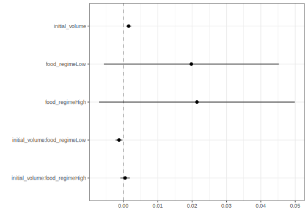
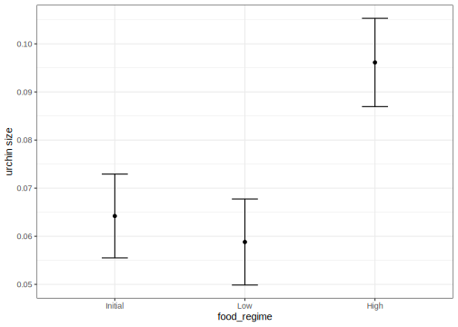

## Introduction {#intro}

How do you create a statistical model using tidymodels? In this article, we will walk you through the steps. We start with data for modeling, learn how to specify and train models with different engines using the [parsnip package](https://parsnip.tidymodels.org/), and understand why these functions are designed this way.

To use code in this article,  you will need to install the following packages: broom.mixed, dotwhisker, readr, rstanarm, and tidymodels.


::: {.cell layout-align="center" hash='cache/unnamed-chunk-3_85ae9ade00802be6b86e52368433af07'}

```{.r .cell-code}
library(tidymodels)  # for the parsnip package, along with the rest of tidymodels

# Helper packages
library(readr)       # for importing data
library(broom.mixed) # for converting bayesian models to tidy tibbles
library(dotwhisker)  # for visualizing regression results
```
:::





## The Sea Urchins Data {#data}

Let's use the data from [Constable (1993)](https://link.springer.com/article/10.1007/BF00349318) to explore how three different feeding regimes affect the size of sea urchins over time. The initial size of the sea urchins at the beginning of the experiment probably affects how big they grow as they are fed. 

To start, let's read our urchins data into R, which we'll do by providing [`readr::read_csv()`](https://readr.tidyverse.org/reference/read_delim.html) with a url where our CSV data is located ("<https://tidymodels.org/start/models/urchins.csv>"):


::: {.cell layout-align="center" hash='cache/data_39e92d22ba6540af904d9844fd3cad57'}

```{.r .cell-code}
urchins <-
  # Data were assembled for a tutorial 
  # at https://www.flutterbys.com.au/stats/tut/tut7.5a.html
  read_csv("https://tidymodels.org/start/models/urchins.csv") %>% 
  # Change the names to be a little more verbose
  setNames(c("food_regime", "initial_volume", "width")) %>% 
  # Factors are very helpful for modeling, so we convert one column
  mutate(food_regime = factor(food_regime, levels = c("Initial", "Low", "High")))
#> Rows: 72 Columns: 3
#> ── Column specification ──────────────────────────────────────────────
#> Delimiter: ","
#> chr (1): TREAT
#> dbl (2): IV, SUTW
#> 
#> ℹ Use `spec()` to retrieve the full column specification for this data.
#> ℹ Specify the column types or set `show_col_types = FALSE` to quiet this message.
```
:::


Let's take a quick look at the data:


::: {.cell layout-align="center" hash='cache/unnamed-chunk-5_1e4ae78769856ab4fcf4afd423a5a206'}

```{.r .cell-code}
urchins
#> # A tibble: 72 × 3
#>    food_regime initial_volume width
#>    <fct>                <dbl> <dbl>
#>  1 Initial                3.5 0.01 
#>  2 Initial                5   0.02 
#>  3 Initial                8   0.061
#>  4 Initial               10   0.051
#>  5 Initial               13   0.041
#>  6 Initial               13   0.061
#>  7 Initial               15   0.041
#>  8 Initial               15   0.071
#>  9 Initial               16   0.092
#> 10 Initial               17   0.051
#> # ℹ 62 more rows
```
:::


The urchins data is a [tibble](https://tibble.tidyverse.org/index.html). If you are new to tibbles, the best place to start is the [tibbles chapter](https://r4ds.had.co.nz/tibbles.html) in *R for Data Science*. For each of the 72 urchins, we know their:

+ experimental feeding regime group (`food_regime`: either `Initial`, `Low`, or `High`),
+ size in milliliters at the start of the experiment (`initial_volume`), and
+ suture width at the end of the experiment (`width`).

As a first step in modeling, it's always a good idea to plot the data: 


::: {.cell layout-align="center" hash='cache/urchin-plot_1603f2b800553a9fcdb01f08303e4c82'}

```{.r .cell-code}
ggplot(urchins,
       aes(x = initial_volume, 
           y = width, 
           group = food_regime, 
           col = food_regime)) + 
  geom_point() + 
  geom_smooth(method = lm, se = FALSE) +
  scale_color_viridis_d(option = "plasma", end = .7)
#> `geom_smooth()` using formula = 'y ~ x'
```

::: {.cell-output-display}
{fig-align='center' width=672}
:::
:::


We can see that urchins that were larger in volume at the start of the experiment tended to have wider sutures at the end, but the slopes of the lines look different so this effect may depend on the feeding regime condition.

## Build and fit a model {#build-model}

A standard two-way analysis of variance ([ANOVA](https://www.itl.nist.gov/div898/handbook/prc/section4/prc43.htm)) model makes sense for this dataset because we have both a continuous predictor and a categorical predictor. Since the slopes appear to be different for at least two of the feeding regimes, let's build a model that allows for two-way interactions. Specifying an R formula with our variables in this way: 


::: {.cell layout-align="center" hash='cache/two-way-int_a0f9010460df05a6b677180db1efa18e'}

```{.r .cell-code}
width ~ initial_volume * food_regime
```
:::


allows our regression model depending on initial volume to have separate slopes and intercepts for each food regime. 

For this kind of model, ordinary least squares is a good initial approach. With tidymodels, we start by specifying the _functional form_ of the model that we want using the [parsnip package](https://parsnip.tidymodels.org/). Since there is a numeric outcome and the model should be linear with slopes and intercepts, the model type is ["linear regression"](https://parsnip.tidymodels.org/reference/linear_reg.html). We can declare this with: 


::: {.cell layout-align="center" hash='cache/lm-tm_e2a755c4c6624fa5215375d5f0aef776'}

```{.r .cell-code}
linear_reg()
#> Linear Regression Model Specification (regression)
#> 
#> Computational engine: lm
```
:::


That is pretty underwhelming since, on its own, it doesn't really do much. However, now that the type of model has been specified, we can think about a method for _fitting_ or training the model, the model **engine**. The engine value is often a mash-up of the software that can be used to fit or train the model as well as the estimation method. The default for `linear_reg()` is `"lm"` for ordinary least squares, as you can see above. We could set a non-default option instead:


::: {.cell layout-align="center" hash='cache/lm-spec_cda99ca6749ca900647312148fe394e0'}

```{.r .cell-code}
linear_reg() %>% 
  set_engine("keras")
#> Linear Regression Model Specification (regression)
#> 
#> Computational engine: keras
```
:::


The [documentation page for `linear_reg()`](https://parsnip.tidymodels.org/reference/linear_reg.html) lists all the possible engines. We'll save our model object using the default engine as `lm_mod`.


::: {.cell layout-align="center" hash='cache/unnamed-chunk-10_c9235c54519f3ab630742819ff3ae69a'}

```{.r .cell-code}
lm_mod <- linear_reg()
```
:::


From here, the model can be estimated or trained using the [`fit()`](https://parsnip.tidymodels.org/reference/fit.html) function:


::: {.cell layout-align="center" hash='cache/lm-fit_ac90c3b9f0b2cea68ef81afa87f0593d'}

```{.r .cell-code}
lm_fit <- 
  lm_mod %>% 
  fit(width ~ initial_volume * food_regime, data = urchins)
lm_fit
#> parsnip model object
#> 
#> 
#> Call:
#> stats::lm(formula = width ~ initial_volume * food_regime, data = data)
#> 
#> Coefficients:
#>                    (Intercept)                  initial_volume  
#>                      0.0331216                       0.0015546  
#>                 food_regimeLow                 food_regimeHigh  
#>                      0.0197824                       0.0214111  
#>  initial_volume:food_regimeLow  initial_volume:food_regimeHigh  
#>                     -0.0012594                       0.0005254
```
:::


Perhaps our analysis requires a description of the model parameter estimates and their statistical properties. Although the `summary()` function for `lm` objects can provide that, it gives the results back in an unwieldy format. Many models have a `tidy()` method that provides the summary results in a more predictable and useful format (e.g. a data frame with standard column names): 


::: {.cell layout-align="center" hash='cache/lm-table_f31fd5d2fb97daf14365207c56f7d982'}

```{.r .cell-code}
tidy(lm_fit)
#> # A tibble: 6 × 5
#>   term                            estimate std.error statistic  p.value
#>   <chr>                              <dbl>     <dbl>     <dbl>    <dbl>
#> 1 (Intercept)                     0.0331    0.00962      3.44  0.00100 
#> 2 initial_volume                  0.00155   0.000398     3.91  0.000222
#> 3 food_regimeLow                  0.0198    0.0130       1.52  0.133   
#> 4 food_regimeHigh                 0.0214    0.0145       1.47  0.145   
#> 5 initial_volume:food_regimeLow  -0.00126   0.000510    -2.47  0.0162  
#> 6 initial_volume:food_regimeHigh  0.000525  0.000702     0.748 0.457
```
:::


This kind of output can be used to generate a dot-and-whisker plot of our regression results using the dotwhisker package:


::: {.cell layout-align="center" hash='cache/dwplot_39f0dcc3141b08785643d2da2b33dda8'}

```{.r .cell-code}
tidy(lm_fit) %>% 
  dwplot(dot_args = list(size = 2, color = "black"),
         whisker_args = list(color = "black"),
         vline = geom_vline(xintercept = 0, colour = "grey50", linetype = 2))
```

::: {.cell-output-display}
{fig-align='center' width=672}
:::
:::


## Use a model to predict {#predict-model}

This fitted object `lm_fit` has the `lm` model output built-in, which you can access with `lm_fit$fit`, but there are some benefits to using the fitted parsnip model object when it comes to predicting.

Suppose that, for a publication, it would be particularly interesting to make a plot of the mean body size for urchins that started the experiment with an initial volume of 20ml. To create such a graph, we start with some new example data that we will make predictions for, to show in our graph:


::: {.cell layout-align="center" hash='cache/new-points_ff1664824d31fadb2ca327ca199e357a'}

```{.r .cell-code}
new_points <- expand.grid(initial_volume = 20, 
                          food_regime = c("Initial", "Low", "High"))
new_points
#>   initial_volume food_regime
#> 1             20     Initial
#> 2             20         Low
#> 3             20        High
```
:::


To get our predicted results, we can use the `predict()` function to find the mean values at 20ml. 

It is also important to communicate the variability, so we also need to find the predicted confidence intervals. If we had used `lm()` to fit the model directly, a few minutes of reading the [documentation page](https://stat.ethz.ch/R-manual/R-devel/library/stats/html/predict.lm.html) for `predict.lm()` would explain how to do this. However, if we decide to use a different model to estimate urchin size (_spoiler:_ we will!), it is likely that a completely different syntax would be required. 

Instead, with tidymodels, the types of predicted values are standardized so that we can use the same syntax to get these values. 

First, let's generate the mean body width values: 


::: {.cell layout-align="center" hash='cache/lm-pred-mean_d903c9188834966ac82e0773cb20c03c'}

```{.r .cell-code}
mean_pred <- predict(lm_fit, new_data = new_points)
mean_pred
#> # A tibble: 3 × 1
#>    .pred
#>    <dbl>
#> 1 0.0642
#> 2 0.0588
#> 3 0.0961
```
:::


When making predictions, the tidymodels convention is to always produce a tibble of results with standardized column names. This makes it easy to combine the original data and the predictions in a usable format: 


::: {.cell layout-align="center" hash='cache/lm-all-pred_de80c71006396b25f96613de87596cbd'}

```{.r .cell-code}
conf_int_pred <- predict(lm_fit, 
                         new_data = new_points, 
                         type = "conf_int")
conf_int_pred
#> # A tibble: 3 × 2
#>   .pred_lower .pred_upper
#>         <dbl>       <dbl>
#> 1      0.0555      0.0729
#> 2      0.0499      0.0678
#> 3      0.0870      0.105

# Now combine: 
plot_data <- 
  new_points %>% 
  bind_cols(mean_pred) %>% 
  bind_cols(conf_int_pred)

# and plot:
ggplot(plot_data, aes(x = food_regime)) + 
  geom_point(aes(y = .pred)) + 
  geom_errorbar(aes(ymin = .pred_lower, 
                    ymax = .pred_upper),
                width = .2) + 
  labs(y = "urchin size")
```

::: {.cell-output-display}
{fig-align='center' width=672}
:::
:::


## Model with a different engine {#new-engine}

Every one on your team is happy with that plot _except_ that one person who just read their first book on [Bayesian analysis](https://bayesian.org/what-is-bayesian-analysis/). They are interested in knowing if the results would be different if the model were estimated using a Bayesian approach. In such an analysis, a [_prior distribution_](https://towardsdatascience.com/introduction-to-bayesian-linear-regression-e66e60791ea7) needs to be declared for each model parameter that represents the possible values of the parameters (before being exposed to the observed data). After some discussion, the group agrees that the priors should be bell-shaped but, since no one has any idea what the range of values should be, to take a conservative approach and make the priors _wide_ using a Cauchy distribution (which is the same as a t-distribution with a single degree of freedom).

The [documentation](https://mc-stan.org/rstanarm/articles/priors.html) on the rstanarm package shows us that the `stan_glm()` function can be used to estimate this model, and that the function arguments that need to be specified are called `prior` and `prior_intercept`. It turns out that `linear_reg()` has a [`stan` engine](https://parsnip.tidymodels.org/reference/linear_reg.html#details). Since these prior distribution arguments are specific to the Stan software, they are passed as arguments to [`parsnip::set_engine()`](https://parsnip.tidymodels.org/reference/set_engine.html). After that, the same exact `fit()` call is used:


::: {.cell layout-align="center" hash='cache/go-stan_eddd72fd40bea602d679d53647cfec4f'}

```{.r .cell-code}
# set the prior distribution
prior_dist <- rstanarm::student_t(df = 1)

set.seed(123)

# make the parsnip model
bayes_mod <-   
  linear_reg() %>% 
  set_engine("stan", 
             prior_intercept = prior_dist, 
             prior = prior_dist) 

# train the model
bayes_fit <- 
  bayes_mod %>% 
  fit(width ~ initial_volume * food_regime, data = urchins)

print(bayes_fit, digits = 5)
#> parsnip model object
#> 
#> stan_glm
#>  family:       gaussian [identity]
#>  formula:      width ~ initial_volume * food_regime
#>  observations: 72
#>  predictors:   6
#> ------
#>                                Median   MAD_SD  
#> (Intercept)                     0.03336  0.01003
#> initial_volume                  0.00156  0.00040
#> food_regimeLow                  0.01963  0.01308
#> food_regimeHigh                 0.02120  0.01421
#> initial_volume:food_regimeLow  -0.00126  0.00051
#> initial_volume:food_regimeHigh  0.00054  0.00070
#> 
#> Auxiliary parameter(s):
#>       Median  MAD_SD 
#> sigma 0.02129 0.00188
#> 
#> ------
#> * For help interpreting the printed output see ?print.stanreg
#> * For info on the priors used see ?prior_summary.stanreg
```
:::


This kind of Bayesian analysis (like many models) involves randomly generated numbers in its fitting procedure. We can use `set.seed()` to ensure that the same (pseudo-)random numbers are generated each time we run this code. The number `123` isn't special or related to our data; it is just a "seed" used to choose random numbers.

To update the parameter table, the `tidy()` method is once again used: 


::: {.cell layout-align="center" hash='cache/tidy-stan_bb45497a37b521633e968f3529225176'}

```{.r .cell-code}
tidy(bayes_fit, conf.int = TRUE)
#> # A tibble: 6 × 5
#>   term                            estimate std.error  conf.low conf.high
#>   <chr>                              <dbl>     <dbl>     <dbl>     <dbl>
#> 1 (Intercept)                     0.0334    0.0100    0.0179    0.0493  
#> 2 initial_volume                  0.00156   0.000404  0.000876  0.00219 
#> 3 food_regimeLow                  0.0196    0.0131   -0.00271   0.0414  
#> 4 food_regimeHigh                 0.0212    0.0142   -0.00289   0.0455  
#> 5 initial_volume:food_regimeLow  -0.00126   0.000515 -0.00213  -0.000364
#> 6 initial_volume:food_regimeHigh  0.000541  0.000696 -0.000669  0.00174
```
:::


A goal of the tidymodels packages is that the **interfaces to common tasks are standardized** (as seen in the `tidy()` results above). The same is true for getting predictions; we can use the same code even though the underlying packages use very different syntax:


::: {.cell layout-align="center" hash='cache/stan-pred_ceeac20323f8d65322224aef7a6bbd72'}

```{.r .cell-code}
bayes_plot_data <- 
  new_points %>% 
  bind_cols(predict(bayes_fit, new_data = new_points)) %>% 
  bind_cols(predict(bayes_fit, new_data = new_points, type = "conf_int"))

ggplot(bayes_plot_data, aes(x = food_regime)) + 
  geom_point(aes(y = .pred)) + 
  geom_errorbar(aes(ymin = .pred_lower, ymax = .pred_upper), width = .2) + 
  labs(y = "urchin size") + 
  ggtitle("Bayesian model with t(1) prior distribution")
```

::: {.cell-output-display}
{fig-align='center' width=672}
:::
:::


This isn't very different from the non-Bayesian results (except in interpretation). 

::: {.callout-note}
The [parsnip](https://parsnip.tidymodels.org/) package can work with many model types, engines, and arguments. Check out [tidymodels.org/find/parsnip](/find/parsnip/) to see what is available. 
:::

## Why does it work that way? {#why}

The extra step of defining the model using a function like `linear_reg()` might seem superfluous since a call to `lm()` is much more succinct. However, the problem with standard modeling functions is that they don't separate what you want to do from the execution. For example, the process of executing a formula has to happen repeatedly across model calls even when the formula does not change; we can't recycle those computations. 

Also, using the tidymodels framework, we can do some interesting things by incrementally creating a model (instead of using single function call). [Model tuning](/start/tuning/) with tidymodels uses the specification of the model to declare what parts of the model should be tuned. That would be very difficult to do if `linear_reg()` immediately fit the model. 

If you are familiar with the tidyverse, you may have noticed that our modeling code uses the magrittr pipe (`%>%`). With dplyr and other tidyverse packages, the pipe works well because all of the functions take the _data_ as the first argument. For example: 


::: {.cell layout-align="center" hash='cache/tidy-data_5fe8b739527b2f81ab4b0be04a791074'}

```{.r .cell-code}
urchins %>% 
  group_by(food_regime) %>% 
  summarize(med_vol = median(initial_volume))
#> # A tibble: 3 × 2
#>   food_regime med_vol
#>   <fct>         <dbl>
#> 1 Initial        20.5
#> 2 Low            19.2
#> 3 High           15
```
:::


whereas the modeling code uses the pipe to pass around the _model object_:


::: {.cell layout-align="center" hash='cache/tidy-model_1494c19f5cade983524eb65c04ab2513'}

```{.r .cell-code}
bayes_mod %>% 
  fit(width ~ initial_volume * food_regime, data = urchins)
```
:::


This may seem jarring if you have used dplyr a lot, but it is extremely similar to how ggplot2 operates:


::: {.cell layout-align="center" hash='cache/unnamed-chunk-22_7497a76ac6f0cccf90bc271055a00601'}

```{.r .cell-code}
ggplot(urchins,
       aes(initial_volume, width)) +      # returns a ggplot object 
  geom_jitter() +                         # same
  geom_smooth(method = lm, se = FALSE) +  # same                    
  labs(x = "Volume", y = "Width")         # etc
```
:::


## Session information {#session-info}


::: {.cell layout-align="center" hash='cache/si_43a75b68dcc94565ba13180d7ad26a69'}

```
#> ─ Session info ─────────────────────────────────────────────────────
#>  setting  value
#>  version  R version 4.3.0 (2023-04-21)
#>  os       macOS Ventura 13.4
#>  system   aarch64, darwin20
#>  ui       X11
#>  language (EN)
#>  collate  en_US.UTF-8
#>  ctype    en_US.UTF-8
#>  tz       America/Los_Angeles
#>  date     2023-07-02
#>  pandoc   3.1.1 @ /Applications/RStudio.app/Contents/Resources/app/quarto/bin/tools/ (via rmarkdown)
#> 
#> ─ Packages ─────────────────────────────────────────────────────────
#>  package     * version date (UTC) lib source
#>  broom       * 1.0.4   2023-03-11 [1] CRAN (R 4.3.0)
#>  broom.mixed * 0.2.9.4 2022-04-17 [1] CRAN (R 4.3.0)
#>  dials       * 1.2.0   2023-04-03 [1] CRAN (R 4.3.0)
#>  dotwhisker  * 0.7.4   2021-09-02 [1] CRAN (R 4.3.0)
#>  dplyr       * 1.1.2   2023-04-20 [1] CRAN (R 4.3.0)
#>  ggplot2     * 3.4.2   2023-04-03 [1] CRAN (R 4.3.0)
#>  infer       * 1.0.4   2022-12-02 [1] CRAN (R 4.3.0)
#>  parsnip     * 1.1.0   2023-04-12 [1] CRAN (R 4.3.0)
#>  purrr       * 1.0.1   2023-01-10 [1] CRAN (R 4.3.0)
#>  readr       * 2.1.4   2023-02-10 [1] CRAN (R 4.3.0)
#>  recipes     * 1.0.6   2023-04-25 [1] CRAN (R 4.3.0)
#>  rlang         1.1.1   2023-04-28 [1] CRAN (R 4.3.0)
#>  rsample     * 1.1.1   2022-12-07 [1] CRAN (R 4.3.0)
#>  rstanarm    * 2.21.4  2023-04-08 [1] CRAN (R 4.3.0)
#>  tibble      * 3.2.1   2023-03-20 [1] CRAN (R 4.3.0)
#>  tidymodels  * 1.1.0   2023-05-01 [1] CRAN (R 4.3.0)
#>  tune        * 1.1.1   2023-04-11 [1] CRAN (R 4.3.0)
#>  workflows   * 1.1.3   2023-02-22 [1] CRAN (R 4.3.0)
#>  yardstick   * 1.2.0   2023-04-21 [1] CRAN (R 4.3.0)
#> 
#>  [1] /Users/emilhvitfeldt/Library/R/arm64/4.3/library
#>  [2] /Library/Frameworks/R.framework/Versions/4.3-arm64/Resources/library
#> 
#> ────────────────────────────────────────────────────────────────────
```
:::
